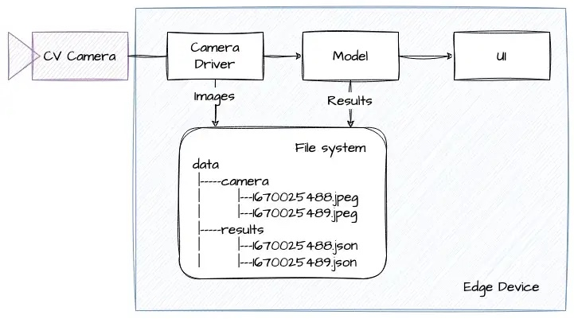
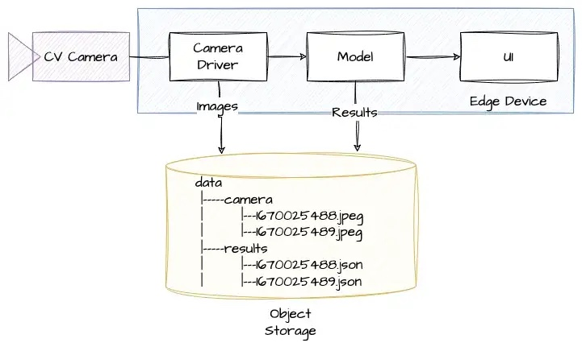

When it comes to computer vision, data storage is a critical component. You need to be able to store images for model
training, as well as the results of the processing for model validation. There are a few ways to go about this, each
with its own advantages and disadvantages. In this post, we’ll take a look at three different ways to store data in
computer vision applications: a file system, an S3-like object storage and [ReductStore](https://reduct.store).
We’ll also discuss some of the pros and cons of each option.

## A Simple Computer Vision Application

For demonstration purposes, we’ll use a simple computer vision application which is connected to a CV camera and runs on
an edge device:

The camera driver captures images from the CV camera every second and sends them to the model. The model detects
something and shows the results in the user interface.

So far it isn’t too complicated, let’s see how we can deal with the data here.

<!--truncate-->

## File System

If an application needs to save an image from a CV camera, it can simply save it on a hard drive. We can use a timestamp
as a unique identifier, and organize folders and files so that we can access it later via a time interval.

One advantage of this method is that it is very simple. You don’t need any additional components for your system.
However, it also has a few drawbacks.

* ** Data reduction**. Sooner or later, we run out of disk space. We have to delete old data manually, by using the _
  chron_ command, or by including this function in the application.
* **Data accessibility**. We have a naming convention to search for data, but we still need to walk through the file
  tree. The more files we have, the slower it works. We could create an index file, but it looks like we are starting
  tocreate our own database.
* **Replication**. It is possible to copy data to another node with _scp_ or _rsync_ utilities, however, this is still a
  manual approach, and you need direct access to your machine via SSH.
* **Security**. If someone wants to use the stored data, we have to provide either access to a device that in many cases
  is insecure, or provide a copy of the data which can be huge.

## S3-like Object Storage

A more advanced approach is to use an object storage system for images. This allows us to organize our data in the
storage engine just like folders and files, but access and manage it using an HTTP API.

This is a more flexible approach than a simple file system and has some advantages:

* **Remote storage**. We can store data somewhere in the cloud or on a remote server, where we have more disk space.
  Moreover, if your company or customer has its own data lake based on object storage, we may record data there
  directly.
* **Security**. We can assign different permissions to access the data. For example, our application could have only
  write access and users can only read it.
* **Replication**. Many object storage solutions allow automatic or manual mirroring of data to another node.

Unfortunately, this solution is also not perfect.

* **Data reduction**. We have more space for our data, but we still don’t have any solution to remove old data.
* **Data accessibility**. Since the data in the object storage has the same structure as a file system, there are the
  same accessibility issues. Moreover, it is even slower because we are using an HTTP layer.

## ReductStore

[ReductStore](https://reduct.store) is an open source time series database for keeping a history of blobs. It
is designed to solve the problem of data reduction and availability for AI/ML applications, where we have data of
various sizes and formats continuously coming from data sources.

As you can see, the structure of our application is similar to when using an S3-like storage system, but it works
differently. Instead of storing blobs individually, it preallocates blocks of fixed size and writes multiple blobs to
each block. This is a more efficient way to write and store data, especially when dealing with small blobs. This
approach has the following advantages:

* **Data Accessibility**. It uses timestamps of records as a unique identifier and provides an HTTP API for simple
  access to data via a timestamp or time interval.
* **Data reduction**. We can specify a quota for each bucket, so that the storage engine starts deleting old data when
  the bucket size reaches the quota.
* **Security**. Like with object storage, we can access data with different permissions.
* **Replication**. ReductStore provides a CLI client to mirror data manually.

##Conclusions

All the approaches to storing historical data for images that we have discussed in this post have their own strengths
and weaknesses, and can be useful in different situations. For example, using a file system can be a simple and
effective way to store data during the prototyping or proof of concept stage of a computer vision application. It is
easy to set up and use, and does not require any additional components or infrastructure. However, it may not be the
most efficient or scalable solution in the long term.

Using an S3-like object storage system can be a good option if you already have this type of infrastructure in place,
and if you need to store large amounts of data or access data from multiple locations. It provides many benefits and
advantages, such as scalability, durability, and security, which can make it a good choice for many different
applications. However, it may require additional setup and configuration, and may be more complex to use than a file
system.

ReductStore is a specialized time series database for blobs of data in AI/ML applications. It is designed to address
the challenges of data reduction and availability. It is a good option if you need to store data on an edge device, and
if you want to use advanced features such as a real-time disk quota and high performance.

