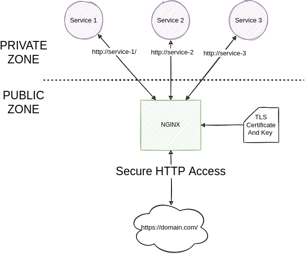

I think, [NGINX][1] doesn't need any introductions. It is one of the most widely used HTTP servers and reverse proxies.
You can route your microservices or monolith application through it and make it responsible for:

* TSL encryption
* Basic HTTP authorsization
* Map public URL to services or applications
* Load balancing

<!--truncate-->

This is a typical use case for NGINX:



Although, [ReductStore][2] supports TSL encryption and token authentication, there are a few cases where NGINX could
be useful:

* Integration of the database into an existing infrastructure;
* Usage of CertBot or other tools to obtain TSL certificates automatically;
* Several instances of ReductStore on one node;

The last case might be especially useful because ReductStore is an asynchronous single-threaded application. This makes
the storage engine very robust and efficient, but to scale it, you have to spin up new instances.

In this tutorial I'll show you how you can launch two ReductStore instances by using Docker Compose and split them by
using subpaths in NGINX.

### Docker Compose Configuration

First, we have to prepare our `docker-compose.yml` file:

```yaml
version: "3"
services:
  storage-1:
    image: reduct/store:latest
    environment:
      RS_API_BASE_PATH: "storage-1/"  # API available on http://storage-1/storage-1
    volumes:
      - ./storage-1:/data             # separated volume for data

  storage-2:
    image: reduct/store:latest
    environment:
      RS_API_BASE_PATH: "storage-2/"
    volumes:
      - ./storage-2:/data

  nginx:
    image: nginx:alpine
    volumes:
      - ./nginx/nginx.conf:/etc/nginx/nginx.conf    # pass customised configuration to NGINX
    depends_on:
      - storage-1
      - storage-2
    ports:
      - "80:80"                       # public port
```

Here you can see two completely independent databases. They use different volumes and have different API paths.
By default, the HTTP API and Web Console is accessible at `http(s)://hostname:port/`, but we can change it by using the
variable
`RS_API_BASE_PATH`. Actually, we could use NGINX to map paths _storage-1_ and _storage-2_ to different instances and
keep
the default API paths, but then web console would stop working.

Also, you should pay attention that we don't publish ports of the engines. The only public port is 80 which is used by
NGINX, we keep our engines in a private zone and access them through the reverse proxy.

### NGINX Configuration

Now we need to setup NGINX. For this, we create our own `nginx.conf` file and mount it to the container as a volume.
You can find the full configuration [**here**](https://github.com/reductstore/nginx-example/blob/main/nginx/nginx.conf).
Here are our changes:

```
http {
    /* default configuration */
    
    upstream storage-1 {
        server storage-1:8383;
    }

    upstream storage-2 {
        server storage-2:8383;
    }

    server {
        listen 80;
        server_name nginx;

        location /storage-1/ {
            proxy_pass http://storage-1/storage-1/;
            proxy_http_version 1.1;
            proxy_set_header Host $host;
        }

        location /storage-2/ {
            proxy_pass http://storage-2/storage-2/;
            proxy_http_version 1.1;
            proxy_set_header Host $host;
        }
    }
```

The idea is very simple. We specify our storage engines as upstream servers _storage-1_ and _storage-2_. Then
we map paths `/storage-1/` and `/storage-2/` to the upstream servers by using the _location_ directive.

If you run everything together with `docker-compose up` you can find the both engines available
on [**http://127.0.0.1/storage-1/**](http://127.0.0.1/storage-1/)
and [**http://127.0.0.1/storage-2/**](http://127.0.0.1/storage-2/)

### Conclusions

Because ReductStore has HTTP API to access its data, you can easily use it with other technologies like NGINX, Apache,
K8S etc., and integrate it into your infrastructure. I hope this tutorial was helpful.


[1]:https://www.f5.com/go/product/welcome-to-nginx

[2]:https://www.reduct.store/