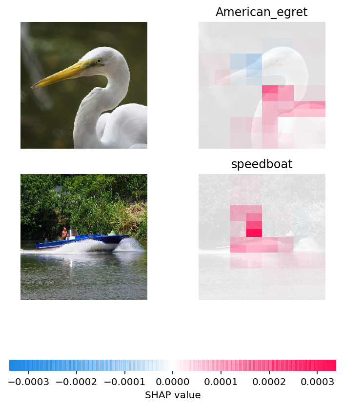

<small style={{ display: "block", marginTop: "-20px" }}>
  Photo by Luke Southern
</small>

In the thriving world of IoT, integrating MLOps for Edge AI is important for creating intelligent, autonomous devices that are not only efficient but also trustworthy and manageable.

MLOps—or Machine Learning Operations—is a multidisciplinary field that mixes machine learning, data engineering, and DevOps to streamline the lifecycle of AI models.

In this field, important factors to consider are:

- **explainability**, ensuring that decisions made by AI are interpretable by humans;
- **orchestration**, which involves managing the various components of machine learning in production–at scale; and
- **reproducibility**, guaranteeing consistent results across different environments or experiments.

{/* truncate */}

Naturally, the complexity of each of those key concepts increases when considering the entire stack encompassing cloud computing, local development, and inference on edge devices.

Bearing this in mind, we will initially explore the open-source landscape for MLOps, then we will dig into choosing the right stack, and have a closer look at [**ReductStore for on-premise data storage on edge devices**](/blog/computer-vision-applications).

Let's get started !

## Navigating the Open-Source Landscape

Navigating the open-source landscape for MLOps resources can be daunting, but fortunately, there are projects that significantly ease this task for us.

One trove of treasures is the [**awesome-production-machine-learning**](https://github.com/EthicalML/awesome-production-machine-learning) repository on GitHub. This curated list provides a multitude of frameworks, libraries, and software designed to facilitate various stages of the ML lifecycle.

For a visual exploration, I like [**Map of Github**](https://anvaka.github.io/map-of-github/#5.67/30.956/28.441) which offers an interactive experience to discover related projects through a network graph. For example, we can find all "Anomaly Detection" libraries and algorithms in Anomaland.

<small>Anomaland in the [**Map of Github**](<https://anvaka.github.io/map-of-github/#5.67/30.956/28.441>)</small>

### State-Of-The-Art Model Training

When looking at the possible open-source projects to train AI models as performant as Landing AI, we need to find SOTA models for:

- supervised learning for object detection; and
- semi-supervised learning for anomaly detection.

When browsing the state-of-the-art in object detection on [**Papers with Code**](https://paperswithcode.com/task/object-detection), I found the YOLO model to be one of the most popular, accurate, and fastest. That being said, I would recommend having a look at [**Ultralytics**](https://github.com/ultralytics/ultralytics), which provides the tools to evaluate, predict, and export the latest versions of YOLO models with only a few lines of code.

Then, when it comes to semi-supervised learning for anomaly detection, I had positive experiences with [**Anomalib**](https://github.com/openvinotoolkit/anomalib) which offers a robust library dedicated to deep learning anomaly detection algorithms. They implemented the latest models with PyTorch and offer tools to benchmark their performance.

### Labeling Tools for Computer Vision

As you can imagine, effective and accurate data annotation is a cornerstone for training computer vision models.

For instance, the [**COCO Annotator**](https://github.com/jsbroks/coco-annotator) is a web-based image annotation tool tailored for the COCO dataset format, allowing collaborative labeling with features like attribute tagging and automatic segmentation. Similarly, [**Label Studio**](https://github.com/HumanSignal/label-studio) offers an easy-to-use interface for bounding box object labeling in images.

Another powerful resource is [**CVAT**](https://github.com/opencv/cvat), the Computer Vision Annotation Tool which supports both image and video annotations with advanced capabilities such as interpolation of shapes between frames, making it highly suitable for computer vision.

These tools each come with their own set of pros and cons. Among the most prominent is Label Studio, with 15k stars on GitHub. This tool is worth considering as it includes all the essential features required for developing the labeling component as an alternative to [**Landing AI**](https://landing.ai/), including segmentation parts–for generating anomaly masks–and bounding boxes for object detection.

## Implementing an Open-Source MLOps Stack Effectively

### Reproducibility

Achieving reproducibility usually comes down to breaking down processes into fundamental units—each taking in data, applying computational steps, and producing outputs.

Platforms such as [**MLflow**](https://mlflow.org/) monitor the development stages of machine learning models. In parallel, [**Data Version Control (DVC)**](https://dvc.org/) brings version control system-like functions to the realm of data sets and models.

Keep an eye on [**ModelDB**](https://modeldb.science/) as well for its ability to meticulously log every input and output related to your experiments.

[**Pachyderm**](https://github.com/pachyderm/pachyderm) specializes in creating compliance-focused pipelines that integrate with enterprise-level storage solutions.

On another front, [**ClearML**](https://clear.ml/) excels at automating the monitoring and graphic representation of models while facilitating training tasks remotely.

Figuring out the best tool for what we need isn't easy, but I'd suggest looking more into [**MLflow**](https://mlflow.org/) and [**DVC**](https://dvc.org/) – they're pretty popular options.

### Explainability

Explainability in MLOps is central to demystifying machine learning models, particularly those that operate as black boxes, i.e. all deep-learning models...

It usually encompasses three main approaches: data analysis, model analysis, and production monitoring.

Each of these methods represents a distinct field with extensive details to discuss. However, if we were to distill them into some fundamental components:

**Data analysis** involves scrutinizing datasets for class imbalances or protected features and understanding their correlations and representations. A classical tool like [**pandas**](https://pandas.pydata.org/) would be my obvious choice for most of the analysis, and I would use [**OpenCV**](https://opencv.org/) or [**Scikit-Image**](https://scikit-image.org/) for image-related tasks.

**Model analysis** includes evaluating feature importance or understanding "domain knowledge" to interpret results accurately, validate predictions, and customize metrics.

In exploring open-source projects, I've come across several promising tools capable of managing deep-learning models for images. Significantly, tools such as [**NETRON**](https://netron.app/) provide visualization of neural networks, while [**SHAP**](https://shap.readthedocs.io/en/latest/) can be used for evaluating the significance of outputs.

<small>Multi-class ResNet50 on ImageNet example on [**SHAP**](<https://shap.readthedocs.io/en/latest/example_notebooks/image_examples/image_classification/Multi-class%20ResNet50%20on%20ImageNet%20%28TensorFlow%29.html>)</small>

**Production monitoring** means that we constantly evaluate the performance metrics of the inference outputs alongside human reviews to detect anomalies–like drift–and establish thresholds for acceptable divergence from expected outcomes.

Numerous tools exist for detecting anomalies in time series data, but [**Alibi Detect**](https://github.com/SeldonIO/alibi-detect) stood out to me, particularly for its capabilities and its compatibility with both TensorFlow and PyTorch backends.

### Orchestration

In MLOps, **Orchestration** refers to the systematic coordination of machine learning workflows, particularly focusing on computational resource allocation.

It's about efficiently managing the tasks such as data preprocessing, training models, evaluating results, and deploying solutions.

Here are some projects that I would recommend to watch:

- [**Kubeflow**](https://www.kubeflow.org/) for ML workflows on Kubernetes, making it easier to deploy and maintain ML systems on a complex infrastructure.
- For those seeking a lightweight solution for setting up deep learning REST APIs across platforms without the complexity of Kubernetes, [**Deepdetect**](https://www.deepdetect.com/) is worth considering.
- For the efficiency of "serverless" functions, I would consider [**Nuclio**](https://nuclio.io/) as a viable option to rely on.

## On-Premises Alternative to LandingEdge

When seeking an on-premise alternative to [**LandingEdge**](https://landing.ai/videos/landingedge-intro/) for sophisticated edge computing and computer vision tasks, [**ReductStore**](https://reduct.store/) emerges as a compelling solution. This Time-Series Database is tailored for Blob Data, emphasizing optimizations that cater to the unique demands of Edge Computing, IoT, and Computer Vision applications.

Some of the key features of ReductStore include:

- **Time Series Blob Storage:** Efficient handling of sequential data storage which is crucial for time-sensitive applications.
- **Real-Time FIFO Quota:** Preventing disk space shortage where storage capacity is limited.
- **Data Labeling:** Annotate, filter, and save AI labels or meta-data for each image.
- **Data Batching:** Grouping data to minimize network overhead in areas with high latency by fetching records in batched HTTP responses.

## Conclusion

In conclusion, the exploration of open-source alternatives to proprietary machine learning platforms reveals a rich ecosystem with specialized tools for each aspect of MLOps.

From data analysis with pandas and OpenCV, through intricate model analysis leveraging NETRON and SHAP, to production monitoring using Alibi Detect—each tool plays a crucial role in demystifying complex ML models.

Orchestration frameworks like Kubeflow facilitate seamless workflow management, while lightweight solutions such as Deepdetect offer agility in REST API deployment.

For edge computing needs similar to what LandingEdge provides, especially when done on-premise, ReductStore offers a specialized Time-Series Database for blob data.

These tools all bring something to the table, showing why it's key to choose a set that fits our operational needs and tech limits. It's all about making sure that the stack aligns with operational requirements and technological constraints.

Thanks for reading! If you're interested in learning more about how to use open-source AI models for real-time, unsupervised anomaly detection in images, don't miss our blog titled [**"Implementing AI for Real-Time Anomaly Detection in Images."**](/blog/computer-vision/edge-computing/ai/Implementing-open-source-ai-anomaly-detection)
