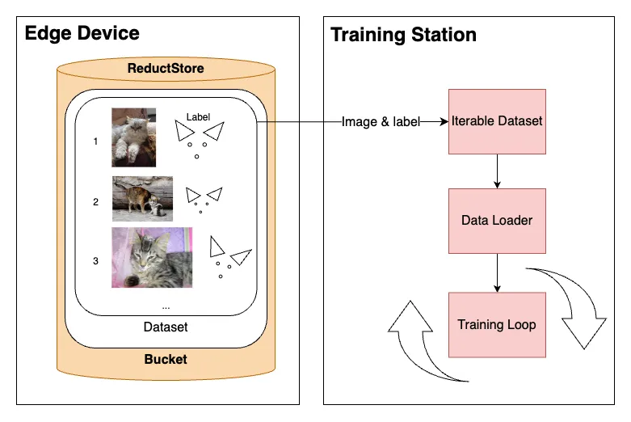

<small>PyTorch training loop with data streaming from remote device</small>

When training a model, we aim to process data in batches, shuffle data at each epoch to avoid over fitting, and leverage Python's `multiprocessing` for data fetching through multiple workers.

The reason that we want to use multiple workers is that GPUs are capable of handling large amounts of data concurrently; however, the bottleneck often lies in the time-consuming task of loading this data into the system.

Moreover, the challenge is even trickier when there is simply too much data to store the whole dataset on disk and we need to stream data from a remote database such as [**ReductStore**](https://www.reduct.store/).

In this blog post, we will go through a full example and setup a data stream to [**PyTorch**](https://pytorch.org/) from a playground dataset on a remote database.

Let's dig in!

<!--truncate-->

## Setting Up the Python Client for ReductStore Database

To use ReductStore's playground dataset, you will need to use the [**Python's client**](https://github.com/reductstore/reduct-py), that you can install with `pip install reduct-py`.

Then, you can instantiate a client with an API token and connect to the database with the following code:

```python
from reduct import Client

HOST = "https://play.reduct.store"
API_TOKEN = "dataset-read-eab13e4f5f2df1e64363806443eea7ba83406ce701d49378d2f54cfbf02850f5"
BUCKET = "datasets"
DATASET = "cats"

client = Client(HOST, api_token=API_TOKEN)
```

In this example, we are using the 'Cats' dataset, which contains 10,000 images of cats with labels for the eyes, mouth, and ears. The dataset is available on the [**play.reduct.store**](https://play.reduct.store/) and can be accessed with the following parameters:

    - **API\_TOKEN**: API token for authentication (`"dataset-read-eab13e4f5f2df1e64363806443eea7ba83406ce701d49378d2f54cfbf02850f5"`).

    - **BUCKET**: Name of the bucket containing the data (`"datasets"`).

    - **DATASET**: Specific dataset containing cats images and labels (`"cats"`).

### Getting data from playground server

To work with the 'Cats' dataset in Python using ReductStore, a time-series database for blob data, you'll need to consider a few specific aspects.
Firstly, ensure that you have necessary libraries like NumPy and OpenCV installed.

In addition, when accessing the dataset, remember that ReductStore uses timestamps to define the range of data.
These timestamps are expressed as the number of microseconds since January 1, 1970.
For example, to query records, you can use a command like `bucket.query(DATASET, tart=TimestampID1, stop=TimestampID2)`, where TimestampID1 and TimestampID2 are the specific timestamps identifying your range of interest.

In case of the 'Cats' dataset, the timestamps are the record IDs, which are integers ranging from 0 to 9999.
For instance, to query the first 5 records, you can use `bucket.query(DATASET, start=0, stop=5)`.

Each record fetched contains image annotations and binary image data that can be transformed into an array and then decoded into an image format suitable for display or processing in Python.

For more detailed instructions, check out the blog post [**How to Use 'Cats' dataset with Python ReductStore SDK**](https://www.reduct.store/blog/tutorials/computer-vision/sdks/cats-datasets).

## Bridging Async and Sync: Creating Custom Iterators for PyTorch

ReductStore's Python client is asynchronous, which means that it uses asynchronous programming to fetch data from the database.
On the other hand, [**PyTorch's IterableDataset**](https://pytorch.org/docs/stable/data.html#torch.utils.data.IterableDataset) is synchronous, which means that it uses synchronous programming to iterate over the data.

This is a problem because we can't use the asynchronous data fetching directly in PyTorch's training loop.
One way to bridge this gap is to create a custom iterator that can be used to iterate over the data fetched asynchronously.

```python
class AsyncIterator:
    """Custom iterator to bridge asynchronous data fetching with synchronous iteration."""

    def __init__(self, loop, async_generator):
        self.loop = loop
        self.async_generator = async_generator
        self.next_element = None

    def __iter__(self):
        return self

    def __next__(self):
        if self.next_element is None:
            self.next_element = self.loop.create_task(self.async_generator.__anext__())

        try:
            return self.loop.run_until_complete(self.next_element)
        except StopAsyncIteration:
            raise StopIteration
        finally:
            self.next_element = None
```

By extending the class with a custom `__next__` method, we can get synchronous iteration over asynchronously fetched data.

To use this iterator within a PyTorch workflow, you would typically incorporate it into an `IterableDataset`.

```python
from torch.utils.data import IterableDataset

class MyIterableDataset(IterableDataset):
    def __init__(self, async_iterator):
        self.async_iterator = async_iterator

    def __iter__(self):
        return iter(self.async_iterator)
```

This ensures that our main training loop can remain synchronous and operate as usual, while in the background, data is being fetched without blocking the computation.

## Case Study: RemoteCatsDataset as a PyTorch Dataset Example

Let's build a PyTorch Dataset called `RemoteCatsDataset` to show how to handle asynchronous data fetching in a PyTorch dataset.

```python
class RemoteCatsDataset(IterableDataset):
    """PyTorch IterableDataset for asynchronously fetching cat images from a remote source."""

    def __init__(self, client, bucket_name, dataset_name, start, stop):
        self.client = client
        self.bucket_name = bucket_name
        self.dataset_name = dataset_name
        self.start = start
        self.stop = stop

    def __iter__(self):
        loop = asyncio.get_event_loop()
        async_gen = self.iterate_over_records()
        return AsyncIterator(loop, async_gen)

    async def iterate_over_records(self):
        bucket = await self.client.get_bucket(self.bucket_name)
        async for record in bucket.query(
            self.dataset_name, start=self.start, stop=self.stop
        ):
            image_bytes = await record.read_all()
            yield self.process_record(image_bytes, record.labels)

    def process_record(self, image_bytes, annotation):
        """Process and annotate the cat image."""
        image_np = np.frombuffer(image_bytes, np.uint8)
        img = cv2.imdecode(image_np, cv2.IMREAD_COLOR)
        # Annotate the image with provided labels
        self.annotate_image(img, annotation)
        img = cv2.cvtColor(img, cv2.COLOR_BGR2RGB)
        # Resize the image to the desired size
        return cv2.resize(img, (IMG_SIZE, IMG_SIZE))

    def annotate_image(self, img, annotation):
        """Draw features on the image based on annotations."""
        # Drawing eyes and mouth
        cv2.circle(img, (int(annotation['right-eye-x']), int(annotation['right-eye-y'])), 10, (0, 0, 100), 1)
        cv2.circle(img, (int(annotation['left-eye-x']), int(annotation['left-eye-y'])), 10, (0, 0, 100), 1)
        cv2.circle(img, (int(annotation['mouth-x']), int(annotation['mouth-y'])), 12, (100, 0, 0), 1)

        # Drawing ears
        for ear_side in ['right', 'left']:
            pts = np.array([[annotation[f'{ear_side}-ear-{i}-x'], annotation[f'{ear_side}-ear-{i}-y']] for i in range(1, 4)], np.int32)
            pts = pts.reshape((-1, 1, 2))
            cv2.polylines(img, [pts], True, (0, 255, 255))

```

The `process_record` method prepares the images. It decodes the byte stream of each image and annotates imagegs (for the sake of the example) using metadata provided with each record, such as bounding box coordinates for features of interest like the eyes or mouth in the 'cats' dataset.

With this configuration, the `RemoteCatsDataset` is ready for integration with PyTorch's DataLoader, which can operate multiple processes in parallel using several workers. For example:

```python
from torch.utils.data import DataLoader

client = Client(HOST, api_token=API_TOKEN)

# Create an instance of your dataset
remote_dataset = BufferedShuffleIterableDataset(
    client, BUCKET, DATASET, start=1, stop=1000
)

# Create a DataLoader
data_loader = DataLoader(remote_dataset, batch_size=100, num_workers=8)

# Display each image
for images in data_loader:
    # You would oerform your training steps here
    # Example: train_step(model, images)
    for img in images:
        plt.imshow(img)
        plt.show()
```


Using the `DataLoader` with multiple workers allows for efficient data loading and preprocessing. This parallelism is especially beneficial when training deep-learning models on large datasets where I/O bound operations could become a bottleneck.

## Implementing a Buffered Shuffle Iterable Dataset

Normally, the entire training set is shuffled after each epoch to avoid over fitting. However, in our scenario, we don't have the full data available on disk, and we don't have all the indexes of the pictures in the database neither. We provide a start and stop index to the database, and it returns the data in that range. So, we can't shuffle the data in the database, and we can't shuffle the data in memory either.

Implementing a Buffered Shuffle Iterable Dataset in PyTorch is a trade-off to be able to shuffle the data we fetch from the remote server. This works, but we have to be careful not to get duplicates when using several workers, and we need to define a different data stream for each separate process.

One way to handle this, is to look at the worker information for each separate process and request different data ranges from the database.

```python
import random
import torch

class BufferedShuffleIterableDataset(RemoteCatsDataset):
    def __init__(self, client, bucket_name, dataset_name, start, stop, buffer_size=100):
        super().__init__(client, bucket_name, dataset_name, start, stop)
        self.buffer_size = buffer_size

    async def iterate_over_records(self):
        worker_info = torch.utils.data.get_worker_info()
        if worker_info is None:  # single-process data loading, return the full iterator
            num_workers = 1
            worker_id = 0
        else:  # in a worker process
            num_workers = worker_info.num_workers
            worker_id = worker_info.id

        # Calculate start and stop indices for this worker
        total_size = self.stop - self.start
        per_worker = int(total_size / num_workers)
        worker_start = self.start + worker_id * per_worker
        worker_stop = worker_start + per_worker if worker_id != num_workers - 1 else self.stop

        bucket = await self.client.get_bucket(self.bucket_name)
        buffer = []
        async for record in bucket.query(self.dataset_name, start=worker_start, stop=worker_stop):
            image_bytes = await record.read_all()
            buffer.append(self.process_record(image_bytes, record.labels))
            if len(buffer) >= self.buffer_size:
                yield buffer.pop(random.randint(0, len(buffer) - 1))

        # Yield remaining items in the buffer
        while buffer:
            yield buffer.pop(random.randint(0, len(buffer) - 1))
```

This implementation ensures that each epoch sees a different data order – the shuffle is limited to the buffer's length, so it's not perfect, but it can be sufficient if the buffer is large enough. Most importantly, we have to find a good balance between the buffer size, the batch size and the number of workers.

In other words, we would maximize the number of workers to match the number of CPU cores, and get the largest possible buffer that doesn't saturate the memory or get performance down, i.e. the GPUs get batches of data fast enough for training and don't wait until the next one is available.

## Conclusion

In conclusion, implementing async storage data streaming in PyTorch projects requires careful planning around data loading and processing.

By implementing the `BufferedShuffleIterableDataset`, we can manage remote datasets efficiently, ensuring that the shuffling of records mimics traditional in-memory operations as closely as possible.

The balance between buffer size, batch size, and worker count is critical to maximize hardware utilization without overloading system resources.

This blog shows a practical starting point to set up an `IterableDataset` that can be used with PyTorch's `DataLoader`. There are other points that should be taken into account, for example, we could not only shuffle the data in each buffer but also shuffle the order of each data range that was divided by the number of workers. We could also filter out some data based on its metadata, if we want to avoid some specific ones.

Thank you for taking the time to read this. I hope it provided valuable insights. Cheers!
