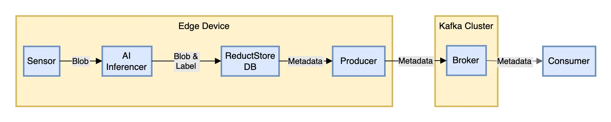

<small>Sensor data processed and labeled by AI, stored in ReductStore, with metadata relayed to Kafka</small>

In this tutorial, we will walk through a straightforward setup for integrating Kafka with ReductStore for handling unstructured data streams from edge devices. We'll cover the basics of setting up Kafka and ReductStore using Docker, creating Kafka topics in Python, and managing blob data and metadata.

If you are new to Kafka and ReductStore, here's a quick summary of the technology:

- [**Apache Kafka**](<https://kafka.apache.org/>) is a distributed streaming platform to share data between applications and services in real-time. 
- [**ReductStore**](<https://www.reduct.store/>) is a time-series database for blob data, optimized for edge computing and complements Kafka by providing a data storage solution for files larger than 1MB–Kafka's maximum message size.

In our example, we will deploy a simple architecture with a single instance of Kafka and ReductStore running on a local machine. We will demonstrate how to create Kafka topics, write data to ReductStore, and forward metadata to Kafka.

You can also follow along by cloning the [**GitHub repository**](<https://github.com/reductstore/reduct-kafka-example>) containing all the code snippets and Docker Compose files used in this tutorial within the `reduct_to_kafka` demo.

<!--truncate-->

**Table of Contents**

- [Setup Apache Kafka](#setup-apache-kafka)
    - [Setting Up Zookeeper and Kafka with Docker Compose](#setting-up-zookeeper-and-kafka-with-docker-compose)
    - [Creating a Kafka Topic Using Python](#creating-a-kafka-topic-using-python)
- [Setup ReductStore](#setup-reductstore)
    - [Deploying ReductStore via Docker Compose](#deploying-reductstore-via-docker-compose)
    - [Implementing a Data Writer with ReductStore's Python Client](#implementing-a-data-writer-with-reductstores-python-client)
- [Forward Data from ReductStore to Kafka](#forward-data-from-reductstore-to-kafka)
    - [Consuming Messages from Kafka in Python](#consuming-messages-from-kafka-in-python)
- [Conclusion](#conclusion)

## Setup Apache Kafka
To use Kafka, we also need to deploy a service that keeps configuration informations such as [**Zookeeper**](<https://zookeeper.apache.org/>).

Simply put, Zookeeper organizes and synchronizes configuration data for distributed systems, and Kafka efficiently processes and moves streams of data in real-time between different parts of an application.

### Setting Up Zookeeper and Kafka with Docker Compose
To set up Zookeeper and Kafka using Docker Compose, you will need to have [**Docker installed**](<https://docs.docker.com/engine/install/>) on your machine. Once that's ready, follow these steps:

1. Create a new file named `docker-compose.yml` in a directory of your choice.

2. Copy the following YAML configuration into your `docker-compose.yml` file:


<!-- -->

```yaml
version: '3'
services:
  zookeeper:
    image: confluentinc/cp-zookeeper:latest
    container_name: zookeeper
    environment:
      ZOOKEEPER_CLIENT_PORT: 2181
      ZOOKEEPER_TICK_TIME: 2000
    ports:
      - "2181:2181"

  kafka:
    image: confluentinc/cp-kafka:latest
    container_name: kafka
    depends_on:
      - zookeeper
    ports:
      - "9092:9092"
    environment:
      KAFKA_BROKER_ID: 1
      KAFKA_ZOOKEEPER_CONNECT: zookeeper:2181
      KAFKA_ADVERTISED_LISTENERS: PLAINTEXT://localhost:9092 
      KAFKA_OFFSETS_TOPIC_REPLICATION_FACTOR : 1
```

3. Open a terminal in the directory containing the `docker-compose.yml` file.

4. Run `docker-compose up -d` to start Zookeeper and Kafka in detached mode.

5. Verify that both services are running by using a command like `docker ps`.


<!-- -->

That's it! You now have a single-node Kafka cluster running alongside Zookeeper, which is accessible on localhost at port 9092 for Kafka and port 2181 for Zookeeper.

The Docker images are provided by Confluent, a company that offers a commercial distribution of Apache Kafka and was founded by the original creators of Kafka. 
You can find more information about these images and their configuration options in the [**Confluent documentation**](<https://docs.confluent.io/platform/current/installation/docker/config-reference.html>).

If you are just wondering about the environment variable we used for this tutorial, here is a short explanation:

- **Zookeeper:**

    - `ZOOKEEPER_CLIENT_PORT: 2181`: Specifies the port number (2181) that Zookeeper listens on for client connections.

    - `ZOOKEEPER_TICK_TIME: 2000`: Defines a tick as 2000 ms, used for heartbeats and timeouts in Zookeeper, where the minimum session timeout is twice the tickTime (Source: [**Zookeeper doc**](<https://zookeeper.apache.org/doc/r3.9.1/zookeeperStarted.html#getting-started-coordinating-distributed-applications-with-zooKeeper>)).

    <!-- -->

- **Kafka:**

    - `KAFKA_BROKER_ID: 1`: Assigns a unique identifier (1) to the Kafka broker. This ID would differentiates it from other brokers in the cluster if we had more than one.

    - `KAFKA_ZOOKEEPER_CONNECT: zookeeper:2181`: Tells Kafka how to connect to the Zookeeper service, specifying the hostname (`zookeeper`) and port number (2181).

    - `KAFKA_ADVERTISED_LISTENERS: PLAINTEXT://localhost:9092`: Defines how the Kafka broker communicates its connection details to producers and consumers. In this case, it's using plaintext communication (non-encrypted) and is accessible via `localhost` on port 9092.

    - `KAFKA_OFFSETS_TOPIC_REPLICATION_FACTOR: 1` means that Kafka will keep only one copy of the information about where each consumer is in reading messages, i.e. the "offset" of each consumer. This setting helps manage where to continue reading from, but with only one copy, if there's a problem, this information could be lost.

    <!-- -->


<!-- -->

This setup is suitable for development purposes where you need to work with streaming data or message queues without complexity. For production environments, remember that while this simple Docker Compose setup gets you started quickly, Apache Kafka can be scaled horizontally by adding more brokers to support higher loads or redundancy requirements.

### Creating a Kafka Topic Using Python
To create a Kafka topic using Python, you can use the `confluent_kafka` library, which provides the necessary tools to interact with Kafka clusters. The following example shows how to programmatically create a new topic:

```python
from confluent_kafka import KafkaError
from confluent_kafka.admin import AdminClient, NewTopic

def create_kafka_topic(
    topic_name, num_partitions, replication_factor, kafka_broker="localhost:9092"
):
    # Create an AdminClient object with the broker information
    admin_client = AdminClient({"bootstrap.servers": kafka_broker})

    # Define the new topic along with its partitions and replication factors
    topic = NewTopic(
        topic_name,
        num_partitions=num_partitions,
        replication_factor=replication_factor,
    )
    try:
        # Request the creation of the new topics on the server
        fs = admin_client.create_topics([topic])

        # Wait for each operation to finish.
        for topic, f in fs.items():
            f.result()

    except KafkaError as e:
        print(f"Failed to create Kafka topic: {e}")
```

This function encapsulates all necessary steps: it requires you to provide a `topic_name`, `num_partitions`, and `replication_factor`. Optionally, you can specify a Kafka broker; if not provided, it defaults to localhost:9092.

To execute this function in your environment:

1. Ensure you have installed `confluent_kafka` via pip (`pip install confluent-kafka`).

2. Call this function with appropriate arguments for your use case. For instance, the `metadata_topic` topic can be created with: `create_kafka_topic("metadata_topic", num_partitions=1, replication_factor=1)`

Regarding the arguments, here's a quick explanation:

- `num_partitions`: The number of partitions for the topic. Partitions are used to distribute messages across multiple brokers in a Kafka cluster. This setting is useful for parallelizing data processing and increasing throughput.
- `replication_factor`: The number of copies of each partition that should be kept in the cluster. This setting is useful for redundancy and fault tolerance.

<!-- -->

## Setup ReductStore
[**ReductStore**](<https://reduct.store/>) is a specialized time-series database designed for blob data, optimized for edge computing, computer vision, and IoT applications.

This database offers a robust solution for storing blobs with real-time FIFO (First-In-First-Out) quota management. This guarantees that edge devices always have sufficient space and maintain a continuous data flow.

Furthermore, it provides functionalities for saving labels, like AI-generated outcomes, for each record.

### Deploying ReductStore via Docker Compose
Deploying ReductStore via Docker Compose is straightforward:

```yaml
reduct-store:
    image: reduct/store:latest
    container_name: reduct-store
    ports:
      - "8383:8383"
    volumes:
      - ./data:/data
```

- In this configuration, the container named `reduct-store` will use the latest ReductStore image and map port 8383 of your host to port 8383 inside the container, which is used by ReductStore.

- The volume mapping `./data:/data` creates a persistent storage by mapping a local directory (`./data`) to the `/data` directory inside the container.


<!-- -->

To deploy, navigate to your compose file's location in terminal and execute `docker-compose up -d`. This command starts ReductStore as a background service. You can then interact with it using its [**API**](<https://www.reduct.store/docs/http-api>) or through any [**client libraries available in the documentation**](<https://www.reduct.store/docs/getting-started>).

### Implementing a Data Writer with ReductStore's Python Client
In this example, we store binary data every second in a 'bucket' within ReductStore. Each piece of data is tagged alternately as 'good' or 'bad', and timestamped to log when it was added.

Below is a code snippet demonstrating how to write data with toggling flags using [**ReductStore's Python Client**](<https://py.reduct.store/en/latest/>):

```python
import asyncio
from time import time_ns
from reduct import Client, Bucket

client = Client("http://127.0.0.1:8383")

async def writer():
    """Write data with toggling good flag."""
    bucket: Bucket = await client.create_bucket("bucket", exist_ok=True)
    good = True
    for _ in range(21):
        data = b"Some blob of data"
        ts = int(time_ns() / 10000)
        await bucket.write("entry-1", data, ts, labels=dict(good=good))
        print(f"Writer: Record written: ts={ts}, good={good}")
        good = not good
        await asyncio.sleep(1)

# Run the asynchronous writer function using an event 
loop = asyncio.get_event_loop()
loop.run_until_complete(writer())
```

This example shows how to use the `Client` class from the `reduct` library to connect to a local instance of ReductStore and create or access a bucket named "bucket". The `writer()` async function writes blobs of binary data labeled alternately with true/false "good" flags, along with timestamps into this bucket every second.

To implement this in your environment:

1. Install the `reduct` Python package via pip (`pip install reduct-py`).

2. Use the script by running it within an environment where Python's asyncio library can operate (e.g., any modern Python 3.x interpreter).

3. Check that your local instance of ReductStore receives and stores these entries by accessing its API or UI at **localhost:8383**.


<!-- -->

## Forward Data from ReductStore to Kafka
Integrating ReductStore with Apache Kafka for metadata forwarding involves subscribing to new records in ReductStore and publishing their metadata to a Kafka topic.

The provided Python code demonstrates an asynchronous function `subscriber()` that connects to both systems: it subscribes to records labeled as "good" in a ReductStore bucket and forwards the associated metadata, including timestamps and labels, to a Kafka topic.

```python
from confluent_kafka import Producer
import asyncio
from time import time_ns
from reduct import Client, Bucket

client = Client("http://127.0.0.1:8383")

kafka_conf = {
    "bootstrap.servers": "localhost:9092",
}

async def subscriber():
    """Subscribe to good records and publish them to Kafka."""
    producer = Producer(kafka_conf)
    bucket: Bucket = await client.create_bucket("bucket", exist_ok=True)
    counter = 0
    await asyncio.sleep(1)
    async for record in bucket.subscribe(
        "entry-1",
        start=int(time_ns() / 10000),
        poll_interval=0.2,
        include=dict(good=True),
    ):
        metadata = {"timestamp": record.timestamp, "good": record.labels.get("good")}
        print(f"Subscriber: Publishing to Kafka: {metadata}")
        producer.produce("metadata_topic", str(metadata).encode())
        counter += 1
        if counter == 10:
            break
    producer.flush()
```

Here's how the integration works step-by-step:

1. **Initialize the Kafka Producer**: A `Producer` object from a Kafka library is instantiated with configuration parameters (`kafka_conf`).

2. **Create or Access a Bucket**: The `create_bucket` method of the ReductStore client is used to create or access an existing bucket where blob data is stored.

3. **Subscribe to Records**: Using the `subscribe` method on the bucket object, we listen for new records matching certain criteria (in this case, having a label `"good": True`). The subscription starts from a specific timestamp and polls at regular intervals.

4. **Extract Metadata & Publish**: For each received record, we extract its timestamp and labels into a dictionary named `metadata`. This metadata is then published as JSON-like string bytes to a specified Kafka topic (`"metadata_topic"`).

5. **Flush Producer Queue**: Once all desired messages are sent (after 10 iterations in this example), we call `producer.flush()` which ensures that all messages are delivered before ending the program.


<!-- -->

### Consuming Messages from Kafka in Python
In Python, consuming messages from Kafka involves setting up a message consumer that connects to the Kafka cluster and listens for new data on specified topics.

```python
from confluent_kafka import Consumer, KafkaException


def consume_messages(topic_name, kafka_broker="localhost:9092"):
    conf = {
        "bootstrap.servers": kafka_broker,
        "group.id": "mygroup",
        "auto.offset.reset": "earliest",
    }
    consumer = Consumer(conf)

    try:
        consumer.subscribe([topic_name])

        while True:
            msg = consumer.poll(1.0)
            if msg is None:
                continue
            if msg.error():
                if msg.error().code() == KafkaException._PARTITION_EOF:
                    # End of partition event
                    continue
                else:
                    print(msg.error())
                    break
            print(f"Received message: {msg.value().decode('utf-8')}")
    finally:
        consumer.close()


consume_messages("metadata_topic")
```

The example provided illustrates how to implement this using the `confluent_kafka` library. Here's a step-by-step explanation of how it works:

1. **Configure Consumer**: Define configuration settings such as `bootstrap.servers` (Kafka broker address), `group.id` (consumer group identity), and `auto.offset.reset` (where to start reading messages).

2. **Initialize Consumer**: Create an instance of the `Consumer` class with the defined configuration.

3. **Subscribe to Topic**: Call the `subscribe()` method on the consumer instance with a list containing topic names you wish to listen for.

4. **Poll Messages**: Initiate an infinite loop that continuously polls for new messages using the consumer's `poll()` method, which is given a timeout value in seconds.

5. **Handle Messages and Errors**: Check each polled message; if it is not None, verify whether it contains an error or valid data.

    1. If there’s an error related to partition end (`_PARTITION_EOF`), ignore and continue. In our case, it means we read all available messages in the partition, i.e. we are up-to-date.

    2. For other errors, print them out and exit.

    3. If no errors are present, decode and process or print out the message value.

    <!-- -->

6. **Clean Up**: Shutdown by enclosing the polling logic in a `try-finally` block where we close the consumer connection in `finally`.


<!-- -->

## Conclusion
In conclusion, integrating Kafka with ReductStore for real-time data streaming and processing is a robust solution that can be implemented relatively easily.

In this guide, we demonstrated the setup for producing and consuming messages using Python, which included initializing a Kafka producer to publish metadata from ReductStore records and setting up a consumer to listen for those messages on a specified topic.

This example serves as a groundwork that can be adapted to various use cases requiring scalable stream-processing architectures.

Remember that fine-tuning and customization will be necessary as per the specific requirements of your project to ensure optimal performance and reliability. As always, best practices include thorough testing, monitoring, and setting up proper error handling mechanisms to maintain a stable production environment.

If you have questions about this post or want to learn more about ReductStore, please feel free to join our [**Discord**](<https://discord.com/channels/939475547065561088/1154679443407785984>) community and reach out for assistance.

## Further Reading

As a continuation of this tutorial, we recommend reading our next guide on [**How To Use Reductstore As A Data Sink For Kafka**](</blog/tutorial/datastreaming/kafka/data-sink-guide>).