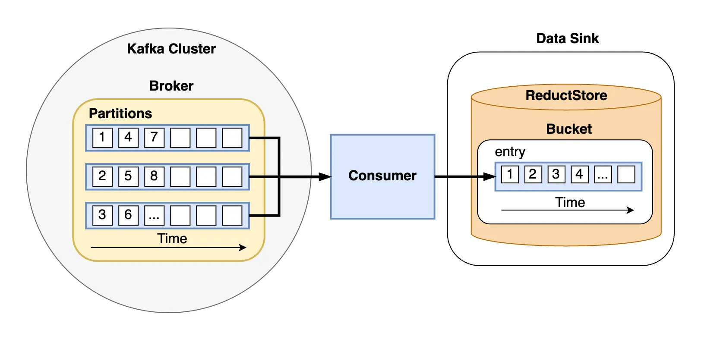
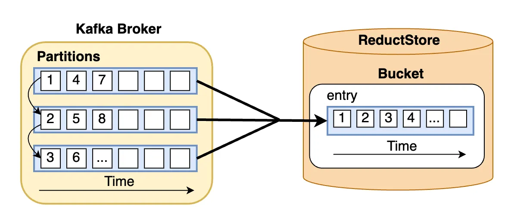

<small>Kafka stream saved in ReductStore database</small>

In this guide, we will explore the process of storing Kafka messages that contain unstructured data into a time series database.

[**Apache Kafka**](<https://kafka.apache.org/>) is a distributed streaming platform capable of handling high throughput of data, while  [**ReductStore**](</>) is a databases for unstructured data optimized for storing and querying along time.

ReductStore allows to easily setup a data sink to store blob data for applications that need precise time-based querying or a robust system optimized for edge computing that can handle quotas and retention policies.

This guide builds upon an existing tutorial which provides detailed steps for integrating a simple architecture with these systems. To get started, revisit "[**Easy Guide to Integrating Kafka: Practical Solutions for Managing Blob Data**](/blog/tutorial/datastreaming/kafka/easy-kafka-reductstore-integration-guide)" if you need help setting up the initial infrastructure.

You can also find the code for this tutorial in the [**kafka_to_reduct demo**](<https://github.com/reductstore/reduct-kafka-example/>) on GitHub.

<!--truncate-->

**Table of Contents**

- [Python Clients for Kafka and ReductStore](#python-clients-for-kafka-and-reductstore)
    - [Kafka Producer and Admin Clients](#kafka-producer-and-admin-clients)
    - [Kafka Consumer and ReductStore Clients](#kafka-consumer-and-reductstore-clients)
- [Streaming Blob Data to Kafka and Storing in ReductStore](#streaming-blob-data-to-kafka-and-storing-in-reductstore)
    - [Understanding the Data Flow](#understanding-the-data-flow)
    - [Publishing Binary Data with Kafka Producer Class](#publishing-binary-data-with-kafka-producer-class)
    - [Consuming Messages from Kafka and Persisting to ReductStore](#consuming-messages-from-kafka-and-persisting-to-reductstore)
- [Conclusion](#conclusion)


## Python Clients for Kafka and ReductStore

### Kafka Producer and Admin Clients
To get started, we must first initialize and configure our Kafka producer and admin clients in Python.
As in the [**previous tutorial**](/blog/tutorial/datastreaming/kafka/easy-kafka-reductstore-integration-guide), we will use the [**confluent_kafka**](<https://docs.confluent.io/platform/current/clients/confluent-kafka-python/html/index.html>) Python package to interact with Kafka.

Below is an example of the simplest possible configuration to setup both: the Producer and AdminClient objects:

```python
from confluent_kafka import Producer
from confluent_kafka.admin import AdminClient

kafka_conf = {
    "bootstrap.servers": "localhost:9092",
}

kafka_producer = Producer(kafka_conf)
kafka_admin_client = AdminClient(kafka_conf)
```

These lines instantiate a Producer and an AdminClient with the minimal required setting: the address of the Kafka bootstrap servers.
This setting is crucial as it allows the clients to connect to the Kafka cluster.

### Kafka Consumer and ReductStore Clients
We can also use `confluent_kafka` Python package to setup Kafka Consumer client, but we need to install `reduct-py` Package to use [**ReductStore's Python Client**](https://github.com/reductstore/reduct-py).

Here's how to configure both clients on the consumer side:

```python
from confluent_kafka import Consumer
from reduct import Client

kafka_conf = {
    "bootstrap.servers": "localhost:9092",
    "group.id": "datasink_demo",
    "auto.offset.reset": "earliest",
}

reduct_client = Client("http://127.0.0.1:8383")
kafka_consumer = Consumer(kafka_conf)
```

This configuration prepares the Kafka Consumer to connect to the cluster and start consuming messages from the earliest offset. 
In other words, the consumer will start reading messages from the oldest available message in the partition. 
The contrary would be to set "latest", which would indicate that the consumer should start from the most recent message.

The configuration also specifies a group ID that identifies the so called "consumer group" which is used for coordination. 
The group ID is mandatory for consumers and allows to have multiple consumers working together to consume a topic.

For ReductStore, the Client establishes a connection to the database through the specified URL, preparing it to start writing data into a bucket (more on this later).

## Streaming Blob Data to Kafka and Storing in ReductStore

### Understanding the Data Flow

Kafka topics are divided into partitions, which are the basic units of parallelism in Kafka. 
Thanks to this, Kafka can handle an arbitrary number of consumers and scale horizontally.

For instance, you could have multiple consumers reading from the same topic, and each of these consumers could read from a different partition.


<small>Data flow from Kafka to ReductStore</small>

Moreover, partitions in a Kafka cluster can be spread across different brokers, and for fault tolerance, each partition can also be replicated on several brokers.
But to understand how messages are distributed, let's narrow our scope to just one broker as shown in the diagram above. 

It's important to understand that the specific partition a message is assigned to depends on the topic's partitioning strategy. 
The default strategy is round-robin, which distributes messages evenly across all partitions as shown in the diagram.

At the same time, if you define a specific key for a message, Kafka will use that key to determine the partition to which the message is appended.
This is useful for ensuring that messages with the same key are always appended to the same partition.

Transitioning from the topic of message distribution in Kafka, let's delve into the second part of the diagram: the sink.
ReductStore is a time series database that stores data in buckets. A bucket is a collection of entries, and each entry contains records.

A record consists of a binary payload and labels. The payload is the actual data, while the labels are metadata associated with the payload. Most importantly, each entry is identified by time and can be efficiently queried using a time range. 

This goes hand in hand with Kafka's time series nature, as Kafka topics are also ordered by time.

### Publishing Binary Data with Kafka Producer Class
To send unstructured data with Kafka we can use the producer client that we configured earlier. Here's an example of how to do so:

```python
import asyncio
import os
import random
from confluent_kafka import Producer

def generate_random_data(size_in_kb=1):
    return os.urandom(size_in_kb * 1024)


def callback(err, msg):
    if err is not None:
        print(f"Failed to deliver message to {msg.topic()}")
    else:
        print(f"Message {msg.topic()} sent to partition {msg.partition()}")


async def produce_binary_data(topic_name, num_messages=10):
    for _ in range(num_messages):
        data = generate_random_data(size_in_kb=random.randint(1, 900))
        metadata = {"size": str(len(data)), "type": "binary"}
        headers = [(key, value.encode("utf-8")) for key, value in metadata.items()]
        kafka_producer.produce(
            topic_name, value=data, headers=headers, callback=callback
        )
        kafka_producer.poll(0)
        await asyncio.sleep(1)
    kafka_producer.flush()
```

The above code sets up an asynchronous function that generates and publishes binary data to a Kafka topic.
In out case, the `generate_random_data` function creates a byte string with random bytes, simulating binary data such as files, images or sensor outputs.

Once the data is generated, it is published using the `kafka_producer.produce` method which takes the following arguments:
- `topic_name`: The name of the topic to which the message is published
- `value`: The binary data to be published
- `headers`: A list of tuples containing the metadata to be published along with the binary data
- `callback`: A callback function that is executed when the message is delivered to the Kafka broker

The `kafka_producer.poll(0)` is a non-blocking call (when used with 0 second timeouts) and can trigger the callback execution which acknowledges a message delivery to a Kafka broker.
From this callback, we can retrieve information, such as the specific partition to which a message has been sent.

### Consuming Messages from Kafka and Persisting to ReductStore

The process of consuming messages from Kafka and persisting them to ReductStore is straightforward.
The following code snippet demonstrates how to do exactly that in an asynchronous manner:

```python
async def consume_and_store(topic_name, bucket_name):
    try:
        bucket: Bucket = await reduct_client.create_bucket(bucket_name, exist_ok=True)

        kafka_consumer.subscribe([topic_name])
        while True:
            # Polling for messages from Kafka with async support
            msg = kafka_consumer.poll(0)
            if msg is None:
                await asyncio.sleep(1)
                continue
            if msg.error():
                if msg.error().code() == KafkaException._PARTITION_EOF:
                    continue
                else:
                    print(msg.error())
                    break

            # Extracting the metadata and data from the message
            headers = (
                {k: v.decode("utf-8") for k, v in msg.headers()}
                if msg.headers()
                else {}
            )
            data = msg.value()

            # Writing data to ReductStore asynchronously
            await bucket.write(topic_name, data, labels=headers)
            print(
                f"Stored binary data of size {len(data)} bytes with headers: {headers}"
            )
    finally:
        kafka_consumer.close()
```

The consumer subscribes to the specified Kafka topic, entering an endless loop that awaits new messages. 
As for the producer, using the `poll` function without timeout allows for non-blocking message retrieval from Kafka.

When a message is fetched successfully without errors, its headers can be decoded and paired with its binary payload.

Subsequently, this composite data structure is written into ReductStore using the bucket's `write` method:

- The kafka headers information can be stored in `labels`

- The binary data can be written in a bucket under a certain entry. In our case, we used the `topic_name` as the entry name for the bucket


<!-- -->

## Conclusion

This simple guide has demonstrated how to use ReductStore as a data sink for Kafka.
We have covered the basics of establishing a sink for storing and managing data from Kafka streams. 
This approach offers a simple method for efficiently saving unstructured data and its associated metadata, such as labels, in a time series database.

This integration is beneficial for applications that necessitate real-time processing and storage, such as those in edge computing environments.

If you have any questions or comments, please feel free to reach out to us on [**Discord**](<https://discord.com/invite/BWrCncF5EP>) or [**Linkedin**](<https://www.linkedin.com/company/reductstore>).