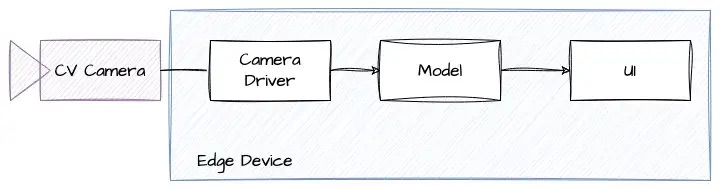
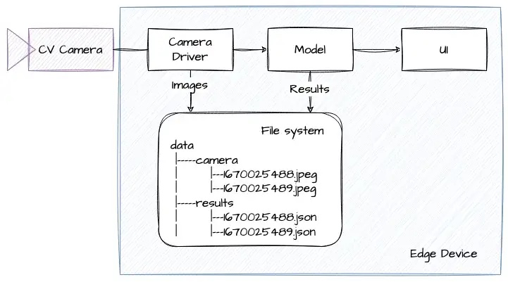
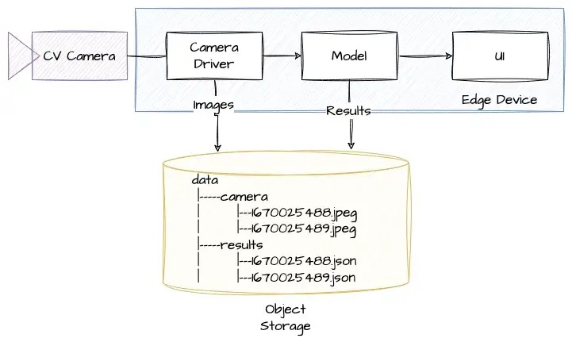
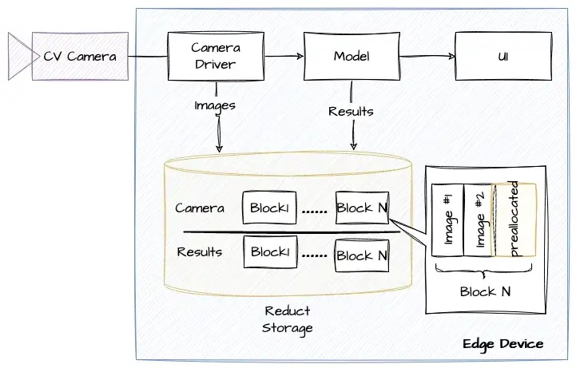

When it comes to computer vision, data storage is a critical component. You need to be able to store images for model training, as well as the results of the processing for model validation. There are a few ways to go about this, each with its own advantages and disadvantages. In this post, we’ll take a look at three different ways to store data in computer vision applications: a file system, an S3-like object storage and **[ReductStore](https://reduct.store/)**. We’ll also discuss some of the pros and cons of each option.

## A Simple Computer Vision Application

For demonstration purposes, we’ll use a simple computer vision application which is connected to a CV camera and runs on an edge device:

The camera driver captures images from the CV camera every second and forwards them to the model, which then detects objects and displays the results in the user interface.

Your images and results need to be stored for training and validation purposes. The customer may also wish to view images featuring anomalous objects. These requirements present the challenge of maintaining a history of blob or unstructured data.

{/* truncate */}

## File System

If an application needs to save an image from a CV camera, it can simply save it on a hard drive. We can use a timestamp as a unique identifier, and organize folders and files so that we can access it later via a time interval.

One advantage of this method is that it is very simple. You don’t need any additional components for your system. However, it also has a few drawbacks.

- **Data reduction**. Sooner or later, we run out of disk space. We have to delete old data manually, by using the *chron* command, or by including this function in the application.
- **Data accessibility**. We have a naming convention to search for data, but we still need to walk through the file tree. The more files we have, the slower it works. We could create an index file, but it looks like we are starting to create our own database.
- **Labeling and Searching.** You may need to label your data and use it as a criteria for searching or replicating your data. This is not something that comes out of the box with a file system.
- **Replication**. It is possible to copy data to another node with *scp* or *rsync* utilities, however, this is still a manual approach, and you need direct access to your machine via SSH.
- **Security**. If someone wants to use the stored data, we have to provide either access to a device that in many cases is insecure, or provide a copy of the data which can be huge.

As evident, the file system is a straightforward solution. However, with new requirements, you might find yourself needing to develop your own storage solution. This could be a lengthy and challenging process that might seem daunting. 

## S3-like Object Storage

A more advanced approach is to use an object storage system for images. This allows us to organize our data in the storage engine just like folders and files, but access and manage it using an HTTP API.

This is a more flexible approach than a simple file system and has some advantages:

- **Remote storage**. We can store data somewhere in the cloud or on a remote server, where we have more disk space. Moreover, if your company or customer has its own data lake based on object storage, we may record data there directly.
- **Security**. We can assign different permissions to access the data. For example, our application could have only write access and users can only read it.
- **Data Replication**. Many object storage solutions allow automatic or manual mirroring of data to another node.

Unfortunately, this solution is also not perfect.

- **Data Reduction**. We have more space for our data, but we still don’t have any solution to remove old data.
- **Data Accessibility**. The data in the object storage mirrors the structure of a file system, which can lead to similar accessibility issues. Furthermore, it can be slower due to the use of an HTTP layer. Each read and write operation to S3-storage requires a dedicated HTTP request, which may be inefficient for small objects.

An S3-like storage system may initially appear more promising than a simple file system. However, its tree-like data organization can lead to issues. Eventually, it may fail to meet your needs, necessitating the development of complex software to overcome these limitations. For example, you might need to integrate an additional time-series database to improve search capabilities. We have previously discussed this **[alternative](https://www.reduct.store/blog/comparison/iot/reductstore-benchmark)**, and it's clear that it has its own drawbacks.

## ReductStore

**[ReductStore](https://www.reduct.store/)** is a time series database for keeping a history of unstructured data. It is designed to solve the problem of data reduction and availability for AI/ML applications, where we have data of various sizes and formats continuously coming from data sources.

As you can see, the structure of our application is similar to when using an S3-like storage system, but it works differently. Instead of storing blobs individually, it preallocates blocks of fixed size and writes multiple blobs to each block. This is a more efficient way to write and store data, especially when dealing with small blobs. This approach has the following advantages:

- **Data Accessibility**. ReductStore utilizes record timestamps as unique identifiers and provides an HTTP API for convenient data access based on timestamp or time interval. It also batches smaller objects into a larger HTTP request, which is crucial for networks with high latency.
- **Data Reduction**. We can specify a quota for each bucket, so that the storage engine starts deleting old data when the bucket size reaches the quota.
- **Labeling.**  We can label data and use these labels as annotations and search criteria.
- **Security**. Like with object storage, we can access data with different permissions.
- **Data Replication**. Since **[version 1.8](https://www.reduct.store/blog/news/reductstore-8-released)**, it supports append-only data replication, allowing you to automatically stream data from one instance to another. Furthermore, you can conditionally replicate data using labels.

## Conclusions

All the approaches to storing historical data for images that we have discussed in this post have their own strengths and weaknesses, and can be useful in different situations. For example, using a file system can be a simple and effective way to store data during the prototyping or proof of concept stage of a computer vision application. It is easy to set up and use, and does not require any additional components or infrastructure. However, it may not be the most efficient or scalable solution in the long term.

Using an S3-like object storage system can be a good option if you already have this type of infrastructure in place, and if you need to store large amounts of data or access data from multiple locations. It provides many benefits and advantages, such as scalability, durability, and security, which can make it a good choice for many different applications. However, it may require additional setup and configuration, and may be more complex to use than a file system.

ReductStore is a specialized time series database for blobs of data in AI/ML applications and edge computing. It is designed to address the challenges of data reduction and availability. It is a good option if you need to store data on an edge device, and if you want to use advanced features such as a real-time disk quota and high performance.

---

I hope you find this article interesting and useful.If you have any questions or feedback, don’t hesitate to reach out in **[Discord](https://discord.com/invite/8wPtPGJYsn)** or by opening a discussion on **[GitHub](https://github.com/reductstore/reductstore/discussions)**.