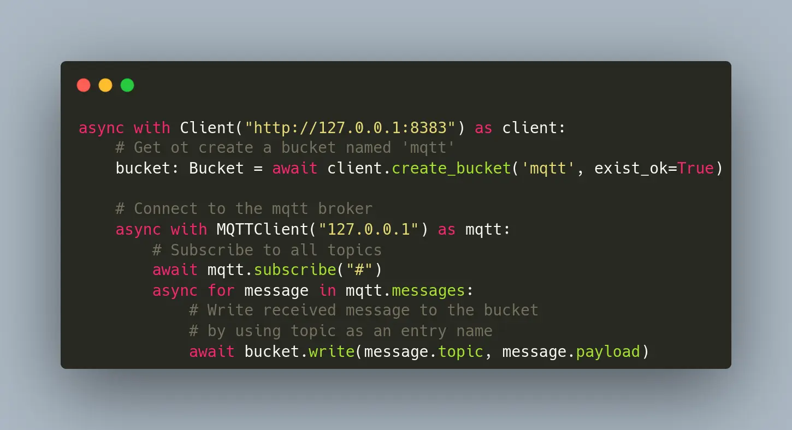

The **[MQTT protocol](https://mqtt.org/)** is a simple way to connect different sources of data to applications, which makes it very popular for IoT (Internet of Things) applications. Some MQTT brokers can save messages for a while, even when the MQTT client is offline. However, sometimes, you need to keep this data for a longer time. In those cases, it's a good idea to use a time series database.

There are many time series databases available, but if you need to store a history of images, sensor data, or Protobuf messages, you might want to use ReductStore. This database is designed to store a lot of blob data and works well with IoT and edge computing.

**[ReductStore](https://www.reduct.store)** has client SDKs (Software Development Kits) for many programming languages. This means you can easily use it in your existing system. In this example, we'll be using the **[Python SDK](https://github.com/reductstore/reduct-py)** from ReductStore.

Now, let's make a simple MQTT application to see how this all works.

{/* truncate */}


## Prerequisites

For this usage example, we have the following requirements:

- Linux AMD64
- Docker and Docker Compose
- Python >= 3.8

If you're using Ubuntu, you can set up the required dependencies by executing the command below in your terminal:

```bash
$ sudo apt-get update
$ sudo apt-get install docker-compose python3-pip
```

If you are using a different operating system, you can find the installation instructions for Docker Compose on **[the official website](https://docs.docker.com/compose/install/)**. 

## Execute MQTT Broker and ReductStore using Docker Compose

The easiest way to set up the broker and database is to use Docker Compose with the following `docker-compose.yml` file:

```yaml
version: "3"
services:
  reduct-storage:
    image: reduct/store:latest
    volumes:
      - ./data:/data
    ports:
      - "8383:8383"

  mqtt-broker:
    image: eclipse-mosquitto:1.6
    ports:
      - "1883:1883"
```

Then execute the configuration:

```
docker-compose up
```

Docker Compose downloads the images if not available on your device and starts the containers. Pay attention that we published ports 1883 for MQTT protocol and 8383 for **[ReductStore HTTP API](https://www.reduct.store/docs/http-api)**.

## Writing Python Script

Now, let's start coding and delve into the details. To begin, install the necessary dependencies. We'll need the **[https://pypi.org/project/aiomqtt/](https://www.npmjs.com/package/async-mqtt)** and the **[Python Client SDK](https://pypi.org/project/reduct-py/)**.

```bash
pip3 install reduct-py aiomqtt
```

After installing the required dependencies, we can start scripting.

```python
import asyncio

from reduct import Client, Bucket
from aiomqtt import Client as MQTTClient

async def main():
    # Connect to ReductStore instance at 8383 port
    async with Client("http://127.0.0.1:8383") as client:
        # Get ot create a bucket named 'mqtt'
        bucket: Bucket = await client.create_bucket('mqtt', exist_ok=True)

        # Connect to the mqtt broker
        async with MQTTClient("127.0.0.1") as mqtt:
            # Subscribe to all topics
            await mqtt.subscribe("#")
            async for message in mqtt.messages:
                # Write received message to the bucket
                # by using topic as an entry name
                await bucket.write(message.topic, message.payload)
                print(f"Received message {message.payload} from {message.topic} is written to the bucket")

if __name__ == "__main__":
    asyncio.run(main())
```

Let’s check the code in details. First of all, we create a client to communicate with the ReductStore instance and create a bucket for the MQTT data:

```python
# Connect to ReductStore instance at 8383 port
async with Client("http://127.0.0.1:8383") as client:
    # Get ot create a bucket named 'mqtt'
    bucket: Bucket = await client.create_bucket('mqtt', exist_ok=True)
```

We use an asynchronous context manager to create the client in order to maintain HTTP sessions between requests. This speeds up communication with the database.

The bucket, named "mqtt", is a storage unit in ReductStore. It contains rules for data storage and access. We'll need this name when reading data.

Note the `exit_ok` flag; it lets us create a bucket at the script's first launch, which can then be used for subsequent runs.

Now we need to feed the bucket with the MQTT data:

```python
# Connect to the mqtt broker
async with MQTTClient("127.0.0.1") as mqtt:
    # Subscribe to all topics
    await mqtt.subscribe("#")
    async for message in mqtt.messages:
```

This code snipped connects the MQTT broker by using an asynchronous context manager and how to subscribe to all topics with the "#" wildcard. MQTT topics are a method for organizing your data streams. A publisher must specify a topic name to send data, and a subscriber must specify either a specific name or a wildcard to receive the data. Later, you'll see that the ReductStore has entries in the bucket, which is also used for data organization.

Let’s see how we store the data in the database:

```python
# Write received message to the bucket
# by using topic as an entry name
await bucket.write(message.topic, message.payload)
```

This was quite straightforward. We used the topic name as the entry name and wrote the MQTT payload there.

## Publishing Data to MQTT Topic

Upon launching the script, it remains idle since there's no data incoming from MQTT. To get it running, you need to publish some data. My preferred tool for this is **mosquitto_pub**. For those using Ubuntu, this tool comes with the `mosquitto-clients` package.

```bash
$ sudo apt-get install mosquitto-clients
$ mosuitto_pub -t topic-1 -m "Hello, topic-1!"
$ mosuitto_pub -t topic-2 -m "Hello, topic-2!"
```

## Getting Data From ReductStore

You've learned to pull data from MQTT and save it to ReductStore. Now, we need a basic Python script to read this data from storage:

```python
import asyncio
from reduct import Client, Bucket

async def read_data():
    async with Client("http://127.0.0.1:8383") as client:
        bucket: Bucket = await client.get_bucket('mqtt')
        for entry in await bucket.get_entry_list():
            async for record in bucket.query(entry.name):
                data = await record.read_all()
                print(f"Received message {data} with ts={record.timestamp} from {entry.name} is read from the bucket")

if __name__ == "__main__":
    asyncio.run(read_data())
```

We have already covered how to create a client and acquire a bucket. Now, let's move on to data reading:

```python
for entry in await bucket.get_entry_list():
    async for record in bucket.query(entry.name):
        data = await record.read_all()
        print(f"Received message {data} with ts={record.timestamp} from {entry.name} is read from the bucket")
```

As you can see, it is also very easy. We browse all entries in the `mqtt` bucket, query all records from each entry, and then print their timestamp and content. That's it.

## Best Practices

The provided example is basic and might not cover all the complexities you may face in a real-world application. Here are some tips to help you construct a strong and efficient IoT application using ReductStore and MQTT:

- Create a ReductStore bucket with a **[FIFO](https://www.reduct.store/docs/how-does-it-work#bucket)** quota to prevent disk overwriting in the future.
- Use token authentication to protect your data. You can generate an access token using either the **[Web Console](https://github.com/reductstore/web-console)** or the **[CLI client](https://cli.reduct.store/)**.
- Map **[MQTT5]( ttps://mqtt.org/)** properties to ReductStore labels. This will facilitate data filtering during querying or **[replication](https://www.reduct.store/blog/news/reductstore-8-released)**.
- Use **[ReductCLI](http://cli.reduct.store/)** for data replication or backup purposes.

## Conclusion

The MQTT protocol and ReductStore are easy-to-use tools that work well together in Python. They provide a strong solution for many applications. No matter the size of your project, these tools handle data communication and storage effectively.

To help you understand how to use these tools, we've made an example that shows how they work together. You can see the source code of this example **[here](https://github.com/reductstore/reduct-mqtt-example-py)**. This example shows how easy and useful it is to use MQTT and ReductStore together.

---

I hope this tutorial has been helpful. If you have any questions or feedback, don’t hesitate to reach out in **[Discord](https://discord.com/invite/8wPtPGJYsn)** or by opening a discussion on **[GitHub](https://github.com/reductstore/reductstore/discussions)**.