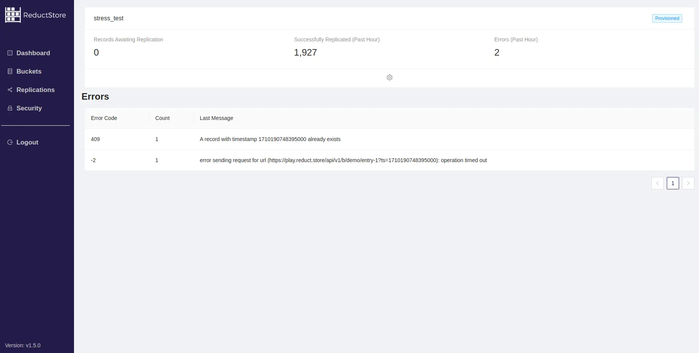

We are pleased to announce the release of the latest minor version of [**ReductStore**](https://www.reduct.store/), [**1.9.0**](https://github.com/reductstore/reductstore/releases/tag/v1.9.0). ReductStore is a time series database designed for storing and managing large amounts of blob data.

To download the latest released version, please visit our [**Download Page**](https://www.reduct.store/download).

## What’s New in 1.9.0?

This release, version 1.9.0, introduces several key improvements and features to enhance the overall performance and user experience. These updates include optimizations for disk space management, the inclusion of replication support in the Web Console, and the provision of license information in the HTTP API.

<!--more-->
{/* truncate */}

### Disk Space Management and Optimization in ReductStore

ReductStore ensures that you don't exceed your disk space with the FIFO bucket quota. It removes old data when the quota is reached. If it's not possible to free up enough disk space for incoming data, the system rejects the write request. To keep the quota efficiently, it calculates disk usage at startup. This calculation can be slow for large amounts of data, like hundreds of terabytes. However, it has now been significantly optimized and parallelized.

### Web Console with Replication Support

We introduced data replication in **[the previous release](https://www.reduct.store/blog/news/reductstore-8-released)**. Now, you can manage this feature in the Web Console:

Diagnostics will be particularly useful, as they can help identify hard-to-spot errors in your settings.

### HTTP API 1.9 with License Information

ReductStore is available under the **[BUSL-1.1](https://github.com/reductstore/reductstore/blob/main/LICENSE)** license, and we freely distribute the source code. However, companies with capital exceeding 2M USD must purchase a **[commercial license](https://www.reduct.store/pricing)** for production use.

Customers receive a license key in a text file to be specified in the database **[configuration](https://www.reduct.store/docs/next/configuration#settings)**. After this, the ReductStore instance provides license information in logs and via its HTTP API. This information can be used when requesting commercial support.

---

I hope you find this release useful. If you have any questions or feedback, don’t hesitate to use the [ReductStore Community](https://community.reduct.store) forum.
Thanks for using **[ReductStore](https://www.reduct.store/)**!