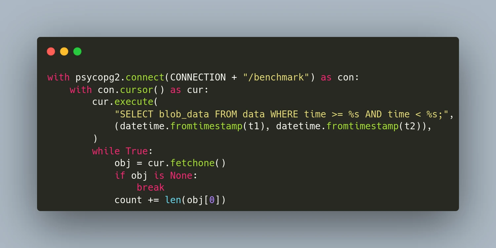

[**TimescaleDB**](https://www.timescale.com/) is an open-source time-series database optimized for fast ingest and complex queries. It is engineered up from [**PostgreSQL**](https://www.postgresql.org/) and offers the power, reliability, and ease-of-use of a relational database, combined with the scalability typically seen in NoSQL systems. It is particularly suited for storing and analyzing things that happen over time, such as metrics, events, and real-time analytics. 

Since TimescaleDB is based on PostgreSQL, it supports blob data and can be used to store a history of unstructured data such as images, binary sensor data, or large text documents. In this article, we will use the database as a time-series blob storage and compare its performance with [**ReductStore**](https://www.reduct.store), which is designed specifically for this use case. 

TimescaleDB and ReductStore both have Python Client SDKs. We'll create simple Python functions to read and write data, then compare performance with different blob sizes. To repeat these benchmarks on your own machine, use **[this repository](https://github.com/reductstore/reduct-vs-timescaledb)**.

<!--truncate-->


## Read/Write Blob Data With TimescaleDB

Since TimescaleDB is a part of PostgreSQL, you can use the **[psycopg](https://pypi.org/project/psycopg2/)** adapter for Python to manage the database and stream the data. In this section, we initialize the TimescaleDB extension, recreate the benchmark database, and create a table for our blob data. Once the table is prepared, we write a chunk of binary data with the current time `BLOB_COUNT` times.

```python
import psycopg2
from psycopg2.extensions import ISOLATION_LEVEL_AUTOCOMMIT

BLOB_SIZE = 100_000
CHUNK = random.randbytes(BLOB_SIZE)

HOST = "localhost"
CONNECTION = f"postgresql://postgres:postgres@{HOST}:5432"

def setup_database():
    con = psycopg2.connect(CONNECTION)
    con.set_isolation_level(ISOLATION_LEVEL_AUTOCOMMIT)
    cur = con.cursor()
    cur.execute("CREATE EXTENSION IF NOT EXISTS timescaledb CASCADE;")
    cur.execute(f"DROP DATABASE IF EXISTS benchmark")
    cur.execute(f"CREATE DATABASE benchmark")
    con.commit()
    con.close()

def write_to_timescale():
    setup_database()

    with psycopg2.connect(CONNECTION + "/benchmark") as con:
        with con.cursor() as cur:
            cur.execute(
                f"""CREATE TABLE data (
                       time TIMESTAMPTZ NOT NULL,
                       blob_data BYTEA NOT NULL);
                """
            )
            cur.execute("SELECT create_hypertable('data', by_range('time'))")
            con.commit()

            count = 0
            for i in range(1, BLOB_COUNT):
                cur.execute(
                    "INSERT INTO data (time, blob_data) VALUES (%s, %s);",
                    (
                        datetime.now(),
                        psycopg2.Binary(CHUNK),
                    ),
                )
                count += BLOB_SIZE

    return count
```

Now we need to create a function to read all the blobs from the table, it is quite easy and we need only one `SELECT` request:

```python
def read_from_timescale(t1, t2):
    count = 0
    with psycopg2.connect(CONNECTION + "/benchmark") as con:
        with con.cursor() as cur:
            cur.execute(
                "SELECT blob_data FROM data WHERE time >= %s AND time < %s;",
                (datetime.fromtimestamp(t1), datetime.fromtimestamp(t2)),
            )
            while True:
                obj = cur.fetchone()
                if obj is None:
                    break
                count += len(obj[0])

    return count
```

As you can see, working with Timescale is quite easy if you are familiar with any SQL database. However, you may notice that we should put the whole blob into the `INSERT`  request. This could cause a performance problem for large blobs because we have to allocate the memory for the request string instead of sending it in chunks.  

Let’s see how you can write and read data with ReductStore. 

## Read/Write Blob Data With ReductStore

With **[ReductStore](https://www.reduct.store/)**, you can write and read data without using SQL requests, simply by utilizing the asynchronous API. Additionally, if you need to handle large blobs, you can stream them in chunks without loading them into memory.

```python
from reduct import Client as ReductClient

async def write_to_reduct():
    async with ReductClient(
        f"http://{HOST}:8383", api_token="reductstore"
    ) as reduct_client:
        count = 0
        bucket = await reduct_client.get_bucket("benchmark")
        for i in range(1, BLOB_COUNT):
            await bucket.write("data", CHUNK)
            count += BLOB_SIZE
        return count

async def read_from_reduct(t1, t2):
    async with ReductClient(
        f"http://{HOST}:8383", api_token="reductstore"
    ) as reduct_client:
        count = 0
        bucket = await reduct_client.get_bucket("benchmark")
        async for rec in bucket.query("data", t1, t2):
            count += len(await rec.read_all())
        return count
```

## Benchmarks

After establishing our read/write functions, we can start writing our benchmarks.

```python
if __name__ == "__main__":
    print(f"Chunk size={BLOB_SIZE / 1000_000} Mb, count={BLOB_COUNT}")
    ts = time.time()
    size = write_to_timescale()
    print(f"Write {size / 1000_000} Mb to TimescaleDB: {time.time() - ts} s")

    ts_read = time.time()
    size = read_from_timescale(ts, time.time())
    print(f"Read {size / 1000_000} Mb from TimescaleDB: {time.time() - ts_read} s")

    loop = asyncio.new_event_loop()
    ts = time.time()
    size = loop.run_until_complete(write_to_reduct())
    print(f"Write {size / 1000_000} Mb to ReductStore: {time.time() - ts} s")

    ts_read = time.time()
    size = loop.run_until_complete(read_from_reduct(ts, time.time()))
    print(f"Read {size / 1000_000} Mb from ReductStore: {time.time() - ts_read} s")
```

For testing purposes, we need to run the databases. This can easily be done using docker-compose:

```yaml
version: "3"
services:
  timescale:
    image: timescale/timescaledb:latest-pg14
    ports:
      - "5432:5432"
    environment:
      POSTGRES_USER: postgres
      POSTGRES_PASSWORD: postgres
    volumes:
      - ${PWD}/data/timescale:/var/lib/postgresql/data

  reductstore:
    image: reduct/store:latest
    ports:
      - "8383:8383"
    environment:
      RS_API_TOKEN: reductstore
      RS_BUCKET_1_NAME: benchmark
      RS_BUCKET_1_QUTA_TYPE: FIFO
      RS_BUCKET_1_QUOTA_SIZE: 50TB

    volumes:
      - ${PWD}/data/reductstore:/data
```

Take note, ReductStore enables the provisioning of any resources with environment variables. In this case, we create a bucket called `benchmark` with a 50TB quota. Your DevOps team will appreciate it.

Let's set up and run benchmarks:

```yaml
docker-compose up -d
python3 main.py
```

## Results

The script displays results for the specified `BLOB_SIZE` and `SIZE_COUNT`. On my device, which has an NVMe drive, here are the results I obtained:

| Chunk Size | Operation | TimescaleDB, blob/s | ReductStore, blob/s | ReductStore, % |
|------------|-----------|---------------------|---------------------|----------------|
| 1 KB       | Write     | 2475                | 1463                | -41%           |
|            | Read      | 2361                | 1260                | -47%           |
| 10 KB      | Write     | 1557                | 1500                | -4%            |
|            | Read      | 1333                | 1280                | -4%            |
| 100 KB     | Write     | 447                 | 1366                | +205%          |
|            | Read      | 353                 | 1120                | +217%          |
| 1 MB       | Write     | 53                  | 571                 | +1075%         |
|            | Read      | 40                  | 382                 | +855%          |
| 10 Mb      | Write     | 5                   | 70                  | +1300%         |
|            | Read      | 4                   | 38                  | +850%          |

Based on the benchmark results, TimescaleDB demonstrates better performance for blobs less 10KB. However, for larger blobs, ReductStore significantly outperforms TimescaleDB in both write and read operations.

## Other Considerations

When we choose a database for storing blob data, we should consider not only performance but also the following factors:

* **Retention Policy**: ReductStore provides a retention policy based on disk usage, which is crucial when the amount of data stored over time is unpredictable.
* **Data Size**: ReductStore is more efficient for storing large blobs, while TimescaleDB is better for small blobs.
* **Querying**: TimescaleDB is better for structured data and complex queries, while ReductStore is more suitable for storing and retrieving blobs with minimal overhead and latency.
* **Replication**: TimescaleDB replicates data across multiple nodes as exact copies, while ReductStore provides append-only replication, with the ability to filter data based on labels. This could be a part of your data reduction strategy.

## Conclusions

TimescaleDB excels as a time series database and can be used to store small blobs. It's a good choice if you need to store structured data and want to avoid additional storage for blob data. However, if you have blobs larger than 10KB, ReductStore might be a better option. It offers better performance and provides a retention policy based on disk usage and conditional append-only replication for your data reduction strategy.

## References

- **[ReductStore](https://www.reduct.store/)**
- **[ReductStore Client SDK for Python](https://github.com/reductstore/reduct-py)**
- **[Full Example on GitHub](https://github.com/reductstore/reduct-vs-timescaledb)**

---

I hope this article has been helpful. If you have any questions or feedback, don’t hesitate to reach out in **[Discord](https://discord.com/invite/8wPtPGJYsn)** or by opening a discussion on **[GitHub](https://github.com/reductstore/reductstore/discussions)**.