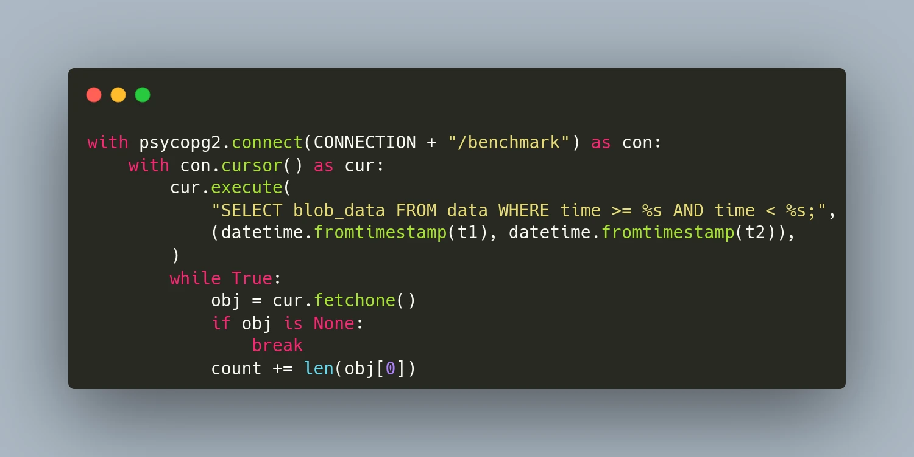

**TimescaleDB** is an open-source time-series database optimized for fast ingest and complex queries. It is engineered up from **PostgreSQL** and offers the power, reliability, and ease-of-use of a relational database, combined with the scalability typically seen in NoSQL systems. It is particularly suited for storing and analyzing things that happen over time, such as metrics, events, and real-time analytics.

Since TimescaleDB is based on PostgreSQL, it supports blob data and can be used to store a history of unstructured data such as images, binary sensor data, or large text documents. In this article, we will use the database as a time-series blob storage and compare its performance with [**ReductStore**](https://www.reduct.store), which is designed specifically for this use case.

TimescaleDB and ReductStore both have Python Client SDKs. We'll create simple Python functions to read and write data, then compare performance with different blob sizes. To repeat these benchmarks on your own machine, use **[this repository](https://github.com/reductstore/reduct-vs-timescaledb)**.

<!--truncate-->

## Read/Write Blob Data With TimescaleDB

Since TimescaleDB is a part of PostgreSQL, you can use the **psycopg** adapter for Python to manage the database and stream the data. In this section, we initialize the TimescaleDB extension, recreate the benchmark database, and create a table for our blob data. Once the table is prepared, we write a chunk of binary data with the current time `BLOB_COUNT` times.
To speed up the writing process, we use the `execute_values` function from the `psycopg2.extras` module and write data in batches of `BATCH_MAX_RECORDS=80` records or `BATCH_MAX_SIZE=8M` bytes.

```python
import psycopg2
from psycopg2.extensions import ISOLATION_LEVEL_AUTOCOMMIT

BLOB_SIZE = 1000_000
BATCH_MAX_SIZE = 8_000_000
BATCH_MAX_RECORDS = 80

BLOB_COUNT = min(1000, 1_000_000_000 // BLOB_SIZE)

CHUNK = random.randbytes(BLOB_SIZE)

HOST = "localhost"
CONNECTION = f"postgresql://postgres:postgres@{HOST}:5432"

def setup_database():
    con = psycopg2.connect(CONNECTION)
    con.set_isolation_level(ISOLATION_LEVEL_AUTOCOMMIT)
    cur = con.cursor()
    cur.execute("CREATE EXTENSION IF NOT EXISTS timescaledb CASCADE;")
    cur.execute(f"DROP DATABASE IF EXISTS benchmark")
    cur.execute(f"CREATE DATABASE benchmark")
    con.commit()
    con.close()

def write_to_timescale():
    setup_database()

    with psycopg2.connect(CONNECTION + "/benchmark") as con:
        with con.cursor() as cur:
            cur.execute(
                f"""CREATE TABLE data (
                       time TIMESTAMPTZ NOT NULL,
                       blob_data BYTEA NOT NULL);
                """
            )
            cur.execute("SELECT create_hypertable('data', by_range('time'))")
            con.commit()

            count = 0
            values = []
            for i in range(0, BLOB_COUNT):
                values.append((datetime.now(), psycopg2.Binary(CHUNK)))
                sleep(0.000001)  # To avoid time collisions
                count += BLOB_SIZE

                if len(values) >= BATCH_MAX_RECORDS or len(values) * BLOB_SIZE >= BATCH_MAX_SIZE:
                    psycopg2.extras.execute_values(
                        cur,
                        "INSERT INTO data (time, blob_data) VALUES %s;",
                        values,
                    )
                    values = []


            if len(values) > 0:
                psycopg2.extras.execute_values(
                    cur,
                    "INSERT INTO data (time, blob_data) VALUES %s;",
                    values,
                )
```

Now we need to create a function to read all the blobs from the table, it is quite easy, and we need only one `SELECT` request:

```python
def read_from_timescale(t1, t2):
    count = 0
    with psycopg2.connect(CONNECTION + "/benchmark") as con:
        with con.cursor() as cur:
            cur.execute(
                "SELECT blob_data FROM data WHERE time >= %s AND time < %s;",
                (datetime.fromtimestamp(t1), datetime.fromtimestamp(t2)),
            )
            while True:
                obj = cur.fetchone()
                if obj is None:
                    break
                count += len(obj[0])

    return count
```

As you can see, working with Timescale is quite easy if you are familiar with any SQL database. However, you may notice that we should put the whole blob into the `INSERT` request. This could cause a performance problem for large blobs because we have to allocate the memory for the request string instead of sending it in chunks.

Let’s see how you can write and read data with ReductStore.

## Read/Write Blob Data With ReductStore

With **[ReductStore](https://www.reduct.store/)**, you can write and read data without using SQL requests, simply by utilizing the asynchronous API. Additionally, if you need to handle large blobs, you can stream them in chunks without loading them into memory. In this example, we also write data in batches to speed up the process for relatively small blobs.

```python
from reduct import Client as ReductClient

async def write_to_reduct():async def write_to_reduct():
    async with ReductClient(
        f"http://{HOST}:8383", api_token="reductstore"
    ) as reduct_client:
        count = 0
        bucket = await reduct_client.get_bucket("benchmark")
        batch = Batch()
        for i in range(0, BLOB_COUNT):
            batch.add(timestamp=datetime.now().timestamp(), data=CHUNK)
            await asyncio.sleep(0.000001)  # To avoid time collisions
            count += BLOB_SIZE

            if  batch.size >= BATCH_MAX_SIZE or len(batch) >= BATCH_MAX_RECORDS:
                await bucket.write_batch("data", batch)
                batch.clear()

        if len(batch) > 0:
            await bucket.write_batch("data", batch)

        return count

async def read_from_reduct(t1, t2):
    async with ReductClient(
        f"http://{HOST}:8383", api_token="reductstore"
    ) as reduct_client:
        count = 0
        bucket = await reduct_client.get_bucket("benchmark")
        async for rec in bucket.query("data", t1, t2):
            count += len(await rec.read_all())
        return count
```

## Benchmarks

After establishing our read/write functions, we can start writing our benchmarks.

```python
if __name__ == "__main__":
    print(f"Chunk size={BLOB_SIZE / 1000_000} Mb, count={BLOB_COUNT}")
    ts = time.time()
    size = write_to_timescale()
    print(f"Write {size / 1000_000} Mb to TimescaleDB: {BLOB_COUNT / (time.time() - ts)} req/s")

    ts_read = time.time()
    size = read_from_timescale(ts, time.time())
    print(f"Read {size / 1000_000} Mb from TimescaleDB: {BLOB_COUNT / (time.time() - ts_read)} req/s")

    loop = asyncio.new_event_loop()
    ts = time.time()
    size = loop.run_until_complete(write_to_reduct())
    print(f"Write {size / 1000_000} Mb to ReductStore: {BLOB_COUNT / (time.time() - ts)} req/s")

    ts_read = time.time()
    size = loop.run_until_complete(read_from_reduct(ts, time.time()))
    print(f"Read {size / 1000_000} Mb from ReductStore: {BLOB_COUNT / (time.time() - ts_read)} req/s")
```

For testing purposes, we need to run the databases. This can easily be done using docker-compose:

```yaml
version: "3"
services:
  timescale:
    image: timescale/timescaledb:latest-pg14
    ports:
      - "5432:5432"
    environment:
      POSTGRES_USER: postgres
      POSTGRES_PASSWORD: postgres
    volumes:
      - ${PWD}/data/timescale:/var/lib/postgresql/data

  reductstore:
    image: reduct/store:latest
    ports:
      - "8383:8383"
    environment:
      RS_API_TOKEN: reductstore
      RS_BUCKET_1_NAME: benchmark
      RS_BUCKET_1_QUTA_TYPE: FIFO
      RS_BUCKET_1_QUOTA_SIZE: 50TB

    volumes:
      - ${PWD}/data/reductstore:/data
```

Take note, ReductStore enables the provisioning of any resources with environment variables. In this case, we create a bucket called `benchmark` with a 50TB quota. Your DevOps team will appreciate it.

Let's set up and run benchmarks:

```yaml
docker-compose up -d
python3 main.py
```

## Results

The script displays results for the specified `BLOB_SIZE` and `SIZE_COUNT`. On my device, which has an NVMe drive, here are the results I obtained:

| Chunk Size | Operation | TimescaleDB, blob/s | ReductStore, blob/s | ReductStore, % |
| ---------- | --------- | ------------------- | ------------------- | -------------- |
| 1 KB       | Write     | 3124                | 9322                | +198%          |
|            | Read      | 40300               | 51505               | +28%           |
| 10 KB      | Write     | 2114                | 8395                | +297%          |
|            | Read      | 10241               | 42322               | +313%          |
| 100 KB     | Write     | 491                 | 5026                | +924%          |
|            | Read      | 1602                | 11244               | +603%          |
| 1 MB       | Write     | 56                  | 898                 | +1604%         |
|            | Read      | 173                 | 1336                | +671%          |

Based on the benchmark results, ReductStore outperforms TimescaleDB in both write and read operations. The performance difference increases with the blob size, reaching up to 1604% for writing and 671% for reading 1MB blobs. This is due to the fact that ReductStore is optimized for storing and retrieving blobs, while TimescaleDB is designed for structured data and complex queries.

## Other Considerations

When we choose a database for storing blob data, we should consider not only performance but also the following factors:

- **Retention Policy**: ReductStore provides a retention policy based on disk usage, which is crucial when the amount of data stored over time is unpredictable.
- **Data Size**: ReductStore is more efficient for storing large blobs, while TimescaleDB is better for small blobs.
- **Querying**: TimescaleDB is better for structured data and complex queries, while ReductStore is more suitable for storing and retrieving blobs with minimal overhead and latency.
- **Replication**: TimescaleDB replicates data across multiple nodes as exact copies, while ReductStore provides append-only replication, with the ability to filter data based on labels. This could be a part of your data reduction strategy.

## Conclusions

TimescaleDB excels as a time series database and can be used to store small blobs. It's a good choice if you need to store structured data and want to avoid additional storage for blob data. However, if you have blobs larger than 10KB, ReductStore might be a better option. It offers better performance and provides a retention policy based on disk usage and conditional append-only replication for your data reduction strategy.

## When TimescaleDB Is Still the Right Choice

The numbers above are for large opaque payloads. They say nothing about the workload TimescaleDB was built for, and that workload is the common one.

Keep TimescaleDB when your records are structured rows and you ask for them by aggregate. Continuous aggregates, hypertable partitioning and columnar compression are real advantages, and an object store has no equivalent for any of them. If you join sensor readings against an asset table, a work order or a shift schedule, you need SQL and you need it in the same database as the readings. That is not a job to hand to a blob store.

Keep it when your payloads are small. Under about 2 KB a `BYTEA` value sits inline in the row and the overhead measured above never appears. One `INSERT` writes it, one `SELECT` reads it back, and there is no second system to keep consistent.

The problem starts above that threshold, and the mechanism is worth naming.

### Why Large Values Get Slow

PostgreSQL moves any field larger than roughly 2 KB out of the main table and into a TOAST table, split into chunks and compressed on the way. That is a good design for text. For a JPEG or a packed sensor frame the compression attempt returns almost nothing, so what is left is the chunking: every write splits the value across rows in a side table, and every read reassembles it.

The client pays a second time. `execute_values` builds the entire `INSERT` statement in memory before any of it goes on the wire, so a 1 MB record is a 1 MB string in the client process before it is a 1 MB value in the server. The SQL path has no chunked upload. That is most of the gap in the 1 MB row of the table above.

TimescaleDB's columnar compression does not recover it either. Columnar compression works on columns of similar values, and random binary data has no similarity to exploit.

## Three Kinds of TimescaleDB Alternative

"Alternatives to TimescaleDB" covers three different problems. Picking the wrong category costs more than staying where you are.

**Your problem is analytical scale on structured data.** You have billions of numeric rows and the aggregate queries have stopped finishing in time. You want a different SQL engine, not an object store. ClickHouse, QuestDB and InfluxDB sit in this group. A migration keeps the shape of your data and swaps the engine underneath it.

**Your problem is size.** The rows are fine, but each one carries an image, a waveform or a serialized message, and the database is now mostly payload. You want the payload out of the database. The standard answer is an object store with a metadata table pointing into it. It works, and you own the consistency between the two systems and the retention on both of them. We measured the same workload against S3 style storage in **[the MinIO comparison](/blog/comparisons/computer-vision/iot/performance-comparison-reductstore-vs-minio)**.

**Your problem is time and modality together.** The payloads have to leave the database and you still have to ask for them by time range, by device, by label. This is the physical AI case: several streams of different types and sizes recorded against one clock, each too large for a row and not much use without the others. That is what this post benchmarks.

Most teams arrive at the second problem and reach for a bucket and a table. The third framing is worth checking first, because the metadata table you were about to write is usually the part that breaks. The same split shows up against **[MongoDB](/blog/comparisons/iot/reductstore-vs-mongodb)** and against **[InfluxDB and MinIO together](/blog/comparison/iot/reductstore-benchmark)**.

### Time-Indexed Storage Is Not a Time Series Database

A physical AI workload records several modalities against one clock. A camera frame, a lidar sweep, an audio window, an IMU burst and a row of structured telemetry all belong to the same moment, and they run from a hundred byte row to a multi megabyte frame. The question is not where to put the biggest one. It is what indexes all of them.

Three storage shapes get called on here, and they differ in what the primary index is.

A time series database indexes by timestamp. That is what makes a range query cheap, and it is why TimescaleDB is a reasonable first thing to try. The cost is that the payload has to stay small, because the row is the unit of storage and a large value gets pushed out of it. The table above is what that push out costs.

An object store indexes by key. The payload can be any size and any type, which solves the problem the time series database has, and it gives up the index to do it. Time is not a dimension S3 knows about, so you encode it in the key and list a prefix, or you keep a metadata table beside the bucket and join on it. With one modality that is tolerable. With five it is a schema you now own and have to keep correct.

Time-indexed storage keeps the timestamp as the primary index and leaves the payload opaque and unbounded. A record is a timestamp, a blob of any size, and a set of labels. Each modality is its own entry in the same bucket, written against the same clock. Pulling a moment back is a time range across entries rather than a join you wrote yourself.

|                      | Primary index | Payload            | Several modalities           |
| -------------------- | ------------- | ------------------ | ---------------------------- |
| Time series database | timestamp     | small, structured  | one table, one schema        |
| Object store         | key string    | any size, any type | your naming scheme           |
| Time-indexed storage | timestamp     | any size, any type | one entry each, shared clock |

ReductStore is the third row. It is not a time series database that accepts binary payloads, and calling it one sets the wrong expectation. There is no continuous aggregate, no hypertable partitioning, no join against an asset table. What it does is keep the timestamp as the index across every modality, at payload sizes a row based database cannot hold.

## Retention, SQL and Schema

Moving the payload out is the first decision. What you can do with it once it is out is the second, and it is where a time-indexed store and a plain bucket diverge again.

- **Lifecycle policies** run as background tasks on a bucket. They delete old records or compress persisted blocks with zstd, and they have a `dry_run` mode, so a retention rule can be checked against real data before it removes any of it.
- **SQL over records**, through the ReductSelect extension. Each queried record is exposed through an `ENTRY()` table function, which supports filtering, aggregation and computed output columns over structured payloads, and results can be exported as Parquet. Keeping the payload out of a relational database does not mean giving up SQL over it.
- **Hierarchical entry names and entry attachments** give an entry a place to carry a schema next to the data it describes, so a consumer reading the bucket does not need an out of band definition to interpret what is in it.
- **ReductStore Core is Apache 2.0**, which matters if licensing was the reason TimescaleDB was on the shortlist.

Lifecycle policies and ReductSelect need 1.20, entry attachments 1.19.

If the payloads are arriving over MQTT rather than out of an existing database, **[how to choose the right MQTT database](/blog/advice/database/mqtt-data-storage)** covers the same decision at ingest time instead of after the fact. **[How to store vibration sensor data](/blog/how-to-store-vibration-sensor-data)** runs the same split on high frequency waveforms, including the FIFO quota that holds on a fixed disk. The **[benchmark repository](https://github.com/reductstore/reduct-vs-timescaledb)** holds the runner and the compose file if you want these numbers on your own hardware. **[Download ReductStore](/download)** to get started, or see **[what teams use it for](/use-cases)**.

## References

- **[ReductStore](https://www.reduct.store/)**
- **[ReductStore Client SDK for Python](https://github.com/reductstore/reduct-py)**
- **[Full Example on GitHub](https://github.com/reductstore/reduct-vs-timescaledb)**

---

I hope this article has been helpful. If you have any questions or feedback, don’t hesitate to use the [**ReductStore Community**](https://community.reduct.store) forum.
