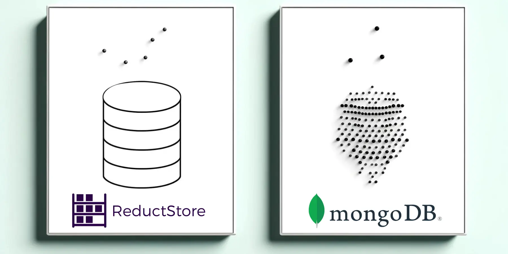

In edge computing, managing time series blob data efficiently is critical for performance-sensitive applications. This blog post will compare [**ReductStore**](<https://www.reduct.store/>), a specialized time series database for unstructured data, and [**MongoDB**](<https://www.mongodb.com/>), a widely-used NoSQL database.

Using Docker containers for straightforward setup, we'll examine the speed of each system. We'll go through setting up ReductStore buckets and preparing MongoDB collections, focusing on how to effectively store and access blob data for time series scenarios.

By conducting performance tests on binary data insertion and retrieval, we aim to provide insights into which system might best serve your application's needs.

For those interested in replicating our benchmarks or conducting their own evaluations, we've made our methods easily accessible through [**this repository**](<https://github.com/reductstore/reduct-vs-mongodb>).

<!--truncate-->

## Launching ReductStore and MongoDB Using Docker
To launch ReductStore and MongoDB using Docker, create a `docker-compose.yml` file with the necessary configurations.

This setup initializes a MongoDB container with exposed ports for local access, sets up user credentials, and mounts a local volume for data persistence. Similarly, it configures ReductStore with an API token and bucket details while also mounting a volume to persist its data.

The process is straightforward:

- Define service configurations for both `mongodb` and `reductstore`.

- Specify Docker images: `mongo:latest` for MongoDB and `reduct/store:latest` for ReductStore.

- Configure environment variables such as credentials and bucket properties.

- Assign volumes to ensure data persists across container restarts.


<!-- -->

Here's the Docker Compose snippet:

```yaml
version: "3"
services:
  mongodb:
    image: mongo:latest
    ports:
      - "27017:27017"
    volumes:
      - ${PWD}/data/mongodb/db:/data/db
    environment:
      MONGO_INITDB_ROOT_USERNAME: admin
      MONGO_INITDB_ROOT_PASSWORD: password

  reductstore:
    image: reduct/store:latest
    ports:
      - "8383:8383"
    environment:
      RS_API_TOKEN: reductstore
      RS_BUCKET_1_NAME: benchmark
      RS_BUCKET_1_QUTA_TYPE: FIFO
      RS_BUCKET_1_QUOTA_SIZE: 50TB

    volumes:
      - ${PWD}/data/reductstore:/data
```

Running this configuration will start both databases in their respective containers, enabling you to work with time series blob data in your applications.

## Preparing ReductStore Buckets and MongoDB Collections for Time Series Data
When preparing storage solutions for time series data, it’s necessary to configure each system to handle the specific nature of the information being processed.

For MongoDB, creating a time series collection is straightforward—simply use a script that connects to the database and sets up a collection with the appropriate configuration.

Here's an example in Python:

```python
def setup_database():
    with MongoClient(CONNECTION_MONGODB) as client:
        db = client["benchmark"]
        if "data" not in db.list_collection_names():
            db.create_collection("data", timeseries={"timeField": "time"})
```

In this snippet, we connect to MongoDB, check whether a collection named `data` exists within our `benchmark` database, and create one configured as a time series with `time` as our designated time field.

For ReductStore bucket creation, you can either utilize Python code or apply infrastructure as code practices by setting environment variables. As in the previous section, by using environment variables that specify API tokens and bucket configurations such as name, quota type (e.g., FIFO), and size:

```
RS_API_TOKEN: reductstore
RS_BUCKET_1_NAME: benchmark
RS_BUCKET_1_QUTA_TYPE: FIFO
RS_BUCKET_1_QUOTA_SIZE: 50TB
```

By defining these settings in your environment or through your deployment scripts, you instruct ReductStore on how to initialize your buckets when it starts up.

## Writing Time Series Blob Data: Comparing MongoDB Insertions to ReductStore
When writing time series blob data, MongoDB and ReductStore offer different approaches. MongoDB, a flexible NoSQL database, handles unstructured data via GridFS when dealing with large blobs. ReductStore is designed specifically for time series data storage, offering streamlined methods for handling binary data.

Here's how each system operates:

### Write to MongoDB

It is possible to write binary data directly to MongoDB collections. However, for large binary objects, GridFS is recommended.
GridFS is a specification for storing and retrieving large files in MongoDB, breaking them into smaller chunks for efficient storage and retrieval.

The following Python script demonstrates how to write time series blob data to MongoDB using GridFS:

- Establish a connection using `MongoClient`.

- Access the database and GridFS.

- Insert blob data into GridFS and reference it in the collection with a timestamp.


<!-- -->

```python
def write_to_mongodb():
    setup_database()

    with MongoClient(CONNECTION_MONGODB) as client:
        db = client["benchmark"]
        fs = GridFS(db)
        data = db["data"]
        count = 0
        for _ in range(BLOB_COUNT):
            blob_id = fs.put(CHUNK, filename=f"blob_{datetime.now().timestamp()}")
            data.insert_one({"time": datetime.now(), "blob_id": blob_id})
            count += BLOB_SIZE

    return count
```

### Write to ReductStore
- Create an asynchronous session using `ReductClient`.

- Access the desired bucket within ReductStore.

- Use bucket's `write` method directly to store binary chunks of time series data.


<!-- -->

```python
async def write_to_reduct():
    async with ReductClient(
        CONNECTION_REDUCT, api_token="reductstore"
    ) as reduct_client:
        count = 0
        bucket = await reduct_client.get_bucket("benchmark")
        for _ in range(BLOB_COUNT):
            await bucket.write("data", CHUNK)
            count += BLOB_SIZE

        return count
```

Comparing these two methods shows that MongoDB requires setting up GridFS explicitly while also maintaining references between filesystem objects and collection documents.

Conversely, ReductStore simplifies this process by providing direct binary writes into buckets without additional setup. These distinctions are key when choosing a platform based on ease of implementation and alignment with your application's needs regarding unstructured time series data management.

## Reading Back the Time: Retrieval of Blob Data from MongoDB vs. ReductStore
Retrieving time series blob data from MongoDB and ReductStore involves querying their respective storage structures with time constraints.

### Read from MongoDB
In MongoDB, this requires utilizing GridFS alongside collections to locate and read the binary content based on a time range. The Python script for MongoDB connects to the database, queries the collection within a specified time frame, and reads each corresponding blob from GridFS.

```python
def read_from_mongodb(t1, t2):
    count = 0
    with MongoClient(CONNECTION_MONGODB) as client:
        db = client["benchmark"]
        fs = GridFS(db)
        data = db["data"]
        for rec in data.find(
            {
                "time": {
                    "$gt": datetime.fromtimestamp(t1),
                    "$lt": datetime.fromtimestamp(t2),
                }
            }
        ):
            blob = fs.get(rec["blob_id"]).read()
            count += len(blob)

    return count
```

### Read from ReductStore
Conversely, ReductStore offers an asynchronous interface designed for efficient retrieval of time series data. The given example demonstrates initiating an async connection to ReductStore, accessing a bucket, and using its query method to fetch records in the desired time interval directly.

```python
async def read_from_reduct(t1, t2):
    async with ReductClient(
        CONNECTION_REDUCT, api_token="reductstore"
    ) as reduct_client:
        count = 0
        bucket = await reduct_client.get_bucket("benchmark")
        async for rec in bucket.query("data", t1, t2, ttl=90):
            count += len(await rec.read_all())

        return count
```

The `read_all` method in ReductStore retrieves the entire binary content of a record. The `read` method, on the other hand, allows for reading chunks of data in a streaming fashion, providing flexibility in handling large binary payloads.

## Performance Analysis: Insertion and Retrieval Speeds for Binary Data in MongoDB and ReductStore
To evaluate the performance of MongoDB and ReductStore, we conducted a test using varying blob sizes ranging from 10 KB to 10 MB. The test measured the speed of writing and reading binary data on an NVMe drive.

For 10 KB chunks, MongoDB writes at a rate of 529 blobs per second, while ReductStore records a significantly higher rate at 1531 blobs per second—a 190% increase. Moreover, when reading the same chunk size, ReductStore shows a substantial speed advantage with an increase of 244%.

As chunk sizes increase to 100 KB and up to 10 MB, ReductStore's performance advantage over MongoDB remains significant. Write speeds maintain a robust advantage, ranging from +155% at 100 KB to +158% at 10 MB. Read operations, however, show a more varied improvement, starting at +198% for 100 KB chunks and moderating to +65% for 10 MB chunks, underscoring ReductStore's adaptability and efficiency in handling larger binary payloads.

| Chunk Size | Operation | MongoDB, blob/s | ReductStore, blob/s | ReductStore, % |
|------------|-----------|-----------------|---------------------|----------------|
| 10 KB      | Write     | 529             | 1531                | +190%          |
|            | Read      | 379             | 1303                | +244%          |
| 100 KB     | Write     | 542             | 1384                | +155%          |
|            | Read      | 380             | 1131                | +198%          |
| 1 MB       | Write     | 224             | 531                 | +137%          |
|            | Read      | 169             | 358                 | +112%          |
| 10 MB      | Write     | 31              | 80                  | +158%          |
|            | Read      | 23              | 38                  | +65%           |

The observed performance trends underscore that while both systems are capable of managing binary data effectively, their throughput varies depending on blob sizes—with ReductStore having a significant edge for unstructured data.

## Additional Criteria

When selecting a database for blob storage, other criteria than performance must be taken into account:

- **Retention policy**: both ReductStore and MongoDB offer distinct retention strategies. ReductStore uses disk utilization-based policies, essential for edge computing and IoT. MongoDB's time-series collections, on the other hand, can automatically purge documents after a set period of time, useful for managing data lifecycle when dealing with non-blob data such as numerical values or logs in time series scenarios.

- **Replication features**: Replication in ReductStore is append-only, with label-based filtering options. This feature can contribute to an effective data reduction strategy by selectively replicating relevant blobs. MongoDB, on the other hand, offers replication sets for high availability and redundancy, ensuring data integrity and fault tolerance in distributed environments.

- **License Consideration**: MongoDB is governed by the Server Side Public License (SSPL), asking service providers using MongoDB to open source their modifications. ReductStore, under the Business Source License 1.1 (BSL), allows production use, subject to payment for larger companies, and transitions to the Mozilla Public License Version 2.0 (MPL-2.0) after three years.

- **Cost considerations**: ReductStore's pricing model is based on storage which aligns well with retention policies based on data volume for a predictable cost structure. MongoDB's pricing is based on instance size and usage, which can be more complex to estimate.

## Conclusion
In conclusion, ReductStore and MongoDB each bring their unique strengths to the table for handling unstructured time series blob data. While MongoDB might be better suited for structured numerical data, it requires an explicit setup with GridFS for blob storage, whereas ReductStore simplifies the process by directly storing binary data into buckets. According to our performance analysis, MongoDB is less competitive for unstructured data, with ReductStore significantly outperforming it across various blob sizes. This makes ReductStore an attractive option for applications dealing with extensive time series blob data.

In choosing a database for time series blob data, it's important to weigh your application's specific needs against factors like data retention policies, replication capabilities, and the licensing models—MongoDB's Server Side Public License (SSPL) and ReductStore's Business Source License 1.1 (BSL). These considerations, along with cost implications and the performance benchmarks provided, will help you make a well-informed decision on the optimal system for your requirements.

## References

- [**ReductStore**](<https://www.reduct.store/>)
- [**ReductStore Client SDK for Python**](<https://github.com/reductstore/reduct-py>)
- [**Full Example on GitHub**](<https://github.com/reductstore/reduct-vs-mongodb>)

---

For further guidance or queries on the matter, feel free to join our community on [**Discord**](<https://discord.gg/8wPtPGJYsn>) or initiate a discussion on [**GitHub**](<https://github.com/reductstore/reductstore/discussions>).
