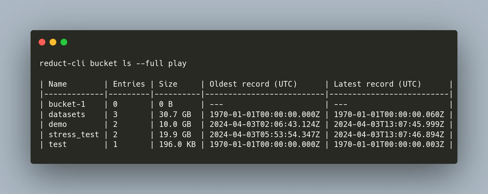

A year ago, we migrated **[ReductStore](https://github.com/reductstore/reductstore)**, time series database for unstructured data,  from C++ to Rust. Now, reflecting on that decision after a year, it's clear that it was the right move, yielding the following benefits:

- Fewer bugs related to memory management, move semantics, and threading
- Easier codebase porting to MacOS and Windows
- Better dependency management with Cargo compared to what we had with C++

Today, I'm pleased to announce that we've rewritten [**the CLI client**](https://github.com/reductstore/reduct-cli) from Python to Rust. Our primary motivation was distribution. Although Python is one of the most widely used programming languages, we don't want to require users to install an interpreter to use our tools, and standalone installers are too bulky for us. With Rust, we can build compact and blazingly fast executable binaries for most popular platforms.

```bash
wget https://github.com/reductstore/reduct-cli/releases/latest/download/reduct-cli.linux-amd64.tar.gz
tar -xvf reduct-cli.linux-amd64.tar.gz
chmod +x reduct-cli
sudo mv reduct-cli /usr/local/bin
```

<!--truncate-->


The second advantage is performance. The Rust implementation is based on [**reduct-rs**](https://github.com/reductstore/reduct-rs), which is the fastest among all our official SDKs. It outperforms the Python SDK by more than ten times. While this may not be an issue for a CLI tool, it supports manual data replication between two ReductStore instances where the CLI can be a bottleneck.

The API of the Rust implementation is very similar to the Python one, so migration should pose no issues. Here's a small example of how you can create an alias to a ReductStore instance, check its status, view the contents of a bucket, and export data to a folder:

```
reduct-cli alias add play -L https://play.reduct.store -t reductstore
reduct-cli server status play
Status: 	Ok
Version:	1.9.2
Uptime: 	2 weeks
License:	BUSL-1.1 (Limited commercial use)

reduct-cli bucket ls --full play
| Name        | Entries | Size     | Oldest record (UTC)      | Latest record (UTC)      |
|-------------|---------|----------|--------------------------|--------------------------|
| bucket-1    | 0       | 0 B      | ---                      | ---                      |
| datasets    | 3       | 30.7 GB  | 1970-01-01T00:00:00.000Z | 1970-01-01T00:00:00.060Z |
| demo        | 2       | 10.0 GB  | 2024-04-03T02:06:43.124Z | 2024-04-03T13:07:45.999Z |
| stress_test | 2       | 19.9 GB  | 2024-04-03T05:53:54.347Z | 2024-04-03T13:07:46.894Z |
| test        | 1       | 196.0 KB | 1970-01-01T00:00:00.000Z | 1970-01-01T00:00:00.003Z |

reduct-cli cp play/datasets .
[00:00:02] #-------------------- 0.101 % Copying cats (6.0 MB, 3 MB/s)
[00:00:01] #-------------------- 0.039 % Copying imdb (5.3 MB, 4 MB/s)
[00:00:02] #-------------------- 0.082 % Copying mnist_training (12.4 KB, 8 KB/s) 
```

---

I hope you find our tool helpful. If you have any questions or feedback, don’t hesitate to use the [ReductStore Community](https://community.reduct.store) forum.
