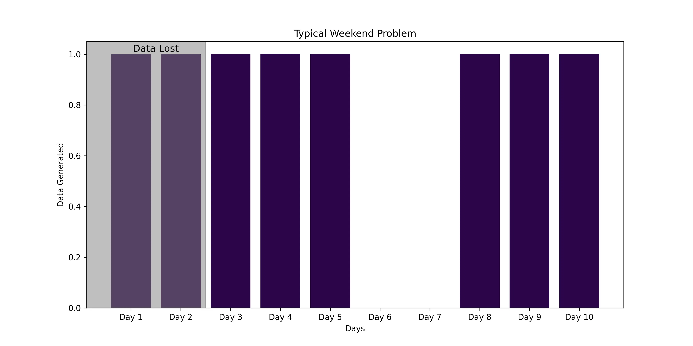

Efficient and effective storage of vibration data is important to a wide range of industries, particularly where accurate and complex predictive maintenance or optimization is required.

This blog post looks at best practices for managing vibration data, starting with storing both raw and pre-processed metrics to take advantage of their unique benefits. We'll explore the differences between time series object stores and traditional time series databases, and highlight optimal data flow processes.

We'll also cover strategies for eliminating data loss through volume-based retention policies, guide you through setting up an effective data retention frameworks.

{/* truncate */}

- [**Store Both Raw and Pre-Processed Metrics**](#store-both-raw-and-pre-processed-metrics)
  - [**Benefits of Pre-Processing Before Storage**](#benefits-of-pre-processing-before-storage)
  - [**Advantages of Storing Raw Data**](#advantages-of-storing-raw-data)
- [**Use Time Series Databases**](#use-time-series-databases)
  - [**Time Series Object Store vs. Traditional Time Series Database**](#time-series-object-store-vs-traditional-time-series-database)
  - [**Vibration Data in Time Series Object Store**](#vibration-data-in-time-series-object-store)
- [**Adopt Efficient Data Retention and Replication Strategies**](#adopt-efficient-data-retention-and-replication-strategies)
  - [**Volume-Based Retention Policy**](#volume-based-retention-policy)
  - [**Data Replication Based on Pre-processed Metrics**](#data-replication-based-on-pre-processed-metrics)
- [**Conclusion**](#conclusion)

## Store Both Raw and Pre-Processed Metrics

Maintaining both raw data and pre-processed metrics such as RMS (Root Mean Square), peak-to-peak and crest factor can be beneficial for several reasons.

- Raw data provides the detailed granularity required for in-depth diagnostics and future algorithm development.

- Pre-processed metrics provide immediate insight into equipment condition without the need for heavy computation.

### Benefits of Pre-Processing Before Storage

The main advantage of pre-processing metrics is that it significantly reduces storage requirements by summarizing raw data into key metrics.

For example, a signal can be divided into 1 second chunks. The result is then a new signal sampled at 1Hz that aggregates the content of each chunk.
As seen in the image below, the signal is divided into 1-second chunks, and the RMS value would be calculated for each chunk.
For an original signal sampled at 10kHz, this would reduce the data size by a factor of 10,000.
This approach is particularly useful for vibration data but some information is ultimately lost in the process.

The typical metrics include:

- **RMS (Root Mean Square)**: Represents the power content of the signal by calculating the root of the mean square:

  - $$\text{RMS} = \sqrt{ \frac{1}{n} \sum_{i=1}^{n} x_i^2 }$$, where $x_i$ is a sample of the signal and $n$ is the number of samples in a given time window (e.g., 10,000 samples for a 1 second chunk sampled at 10kHz).

- **Peak-to-Peak**: Measures the difference between the maximum and minimum values, indicating the signal's amplitude range:

  - $$\text{Peak-to-Peak} = \max(x) - \min(x)$$, where $\max(x)$ and $\min(x)$ are the maximum and minimum values of the signal in a given time window (e.g., 1 second chunk).

- **Crest Factor**: The ratio of the peak value of the signal to its RMS value, indicating how sharp or sudden the peaks in the signal are:

  - $$\text{Crest Factor} = \frac{\max(|x|)}{\text{RMS}}$$, where $\max(|x|)$ is the maximum absolute value of the signal in a given time window.

Many other metrics can be calculated depending on the application, and more advanced signal processing or machine learning techniques can be applied to extract more information from the signal.
At the same time, access to raw data is critical, as it enables the calculation of these various metrics and the application of various analytical methods. This is especially important as new techniques and algorithms are developed, allowing for continuous improvement and more accurate diagnosis.

### Advantages of Storing Raw Data

Storing raw data in the context of vibration monitoring offers significant advantages. Raw sensor output stored as a blob captures the full fidelity of the original signal, allowing extensive post-processing and re-analysis using different algorithms or filters.

This flexibility is essential for developing new diagnostic tools or improving existing ones without the need for repeated data acquisition. For example, raw data can be used to perform detailed frequency analysis using FFT (see example below), detect spikes using time domain analysis, identify signal variations using wavelet transform, find faults in rotating equipment using envelope analysis, and understand structural vibrations using modal analysis.

In this example, the Fast Fourier Transform (FFT) is calculated to identify the frequency content of the signal.
This information can be used to identify the dominant frequencies in the signal, which in turn can be an indication of rotating equipment faults such as unbalance, misalignment or bearing failure.

## Use Time Series Databases

Time Series Databases (TSDBs) are specialised data storage systems optimised for handling time-indexed data. They excel at managing large volumes of sequentially generated data points, such as vibration measurements, by providing efficient write and read operations.

### Time Series Object Store vs. Traditional Time Series Database

A time series object store and a traditional time series database can serve similar purposes, but have distinct architectural differences. While a traditional TSDB is optimised for high-speed ingestion and retrieval of scalar data points, an object store is designed to handle complex, high-dimensional data objects and their metadata. This makes the object store more versatile for applications that require rich contextual information, such as vibration analysis that includes waveform data and diagnostic logs.

### Vibration Data in Time Series Object Store

With a time series object store, each chunk of vibration data is stored as a binary object with a timestamp along with metadata such as preprocess metrics that can be useful for filtering and replication (more on that later).

This method allows efficient management of large vibration datasets by providing fast access to specific time periods. In fact, [**ReductStore outperforms TimescaleDB for blobs ranging from 100KB and larger**](https://www.reduct.store/blog/comparisons/iot/reductstore-vs-timescaledb) using this method, with improvements ranging from 205% to 1300%.

## Adopt Efficient Data Retention and Replication Strategies

By storing raw sensor data locally, we minimize latency and retain critical information for immediate diagnosis.

However, local storage can quickly fill up at the edge, leading to potential disk bottlenecks. To prevent this, we need to periodically eliminate data. However, this data may be critical for further analysis or diagnosis.

Automated replication of important data chunks is therefore essential to ensure that critical information is retained.

### Volume-Based Retention Policy

A real-time FIFO (first-in, first-out) quota prevents disk space shortages in real time. Typically, databases implement retention policies based on time periods; in the case of [**ReductStore**](/), retention can be set based on data volume. This is particularly useful when storing vibration sensor data on edge devices with limited storage capacity.

Time-based retention can lead to data loss during downtime. For example, if a system retains data for eight days and goes offline over the weekend, it might only capture six days of data before starting to overwrite.
Additionally, if the device is offline for a long time, it could delete all existing data once restarted, losing important information for diagnostics.

In the above diagram, the system retains data for eight days, but due to a weekend shutdown, it will only capture six days of data before starting to overwrite (assuming a retention policy of eight days).

With [**ReductStore**](/)'s volume-based retention policy, the system retains data based on the amount of data stored, ensuring that critical information is preserved even after downtime or long periods of inactivity.

### Data Replication Based on Pre-processed Metrics

By preprocessing vibration data to extract key metrics such as peak amplitude, frequency content, and RMS values, the system can prioritize these summarized metrics for replication.

In this example, the system stores raw data locally and pre-processed metrics in a time series object store.
Both the pre-processed metrics and the raw data are then automatically replicated to a central database.
The replication strategy in this scenario focuses on reducing data transfer by replicating raw data only when necessary, based on the insights derived from the pre-processed metrics.

This approach ensures that important diagnostic information is preserved even if the raw data must be dropped due to storage constraints.
For more details on data replication, check out this [**data replication guide**](https://www.reduct.store/docs/guides/data-replication).

## Conclusion

Implementing a robust vibration data storage strategy is critical for effective monitoring and diagnostics in industrial applications.

Time series object stores such as [**ReductStore**](/) offer significant advantages over traditional TSDBs by efficiently managing vibration data in chunks.
Volume-based retention policies and automated data replication ensure critical information is retained while minimizing storage constraints at the edge.
By pre-processing and prioritizing metadata for replication, critical diagnostic data remains accessible even if raw data is overwritten.

This approach improves the efficiency of vibration data storage, enabling more accurate predictive maintenance and optimization in a wide range of industries.

---

Thanks for reading, I hope this article will help you choose the right storage strategy for your vibration data.
If you have any questions or comments, feel free to use the [**ReductStore Community**](https://community.reduct.store) forum.
