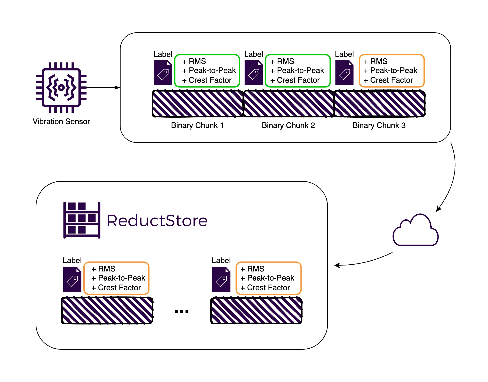

import FilterExampleImg from "./img/filter-example.webp";
import SettingsExampleImg from "./img/settings-example.webp";
import DashboardExampleImg from "./img/dashboard-example.webp";



**[ReductStore](/)** is designed to efficiently handle time series unstructured data, making it an excellent choice for storing high frequency vibration sensor measurements.
This article is the second part of **[How to Store Vibration Sensor Data | Part 1](/blog/how-to-store-vibration-sensor-data)**,
where we discussed the benefits of storing both raw measures and pre-processed metrics, the advantages of time series databases, and efficient storage and replication strategies.

In this post, we'll dive into a practical example of storing and querying vibration sensor readings using ReductStore and Python.
To follow along, you can find the full source code for this example at **[GitHub's reduct-vibration-example repository](https://github.com/reductstore/reduct-vibration-example)**.

Our example will show you how to:

1. Store simulated sensor values in 1-second chunks
2. Compute and store associated labels for each chunk
3. Query and retrieve stored measurements within a specified time range
4. Set up replication using the ReductStore web console

{/* truncate */}

## Setting Up the Environment

Before we dive into the code, let's set up our environment.
We'll be using Docker to run ReductStore and Python for our client application.

### ReductStore Setup

Create a `docker-compose.yml` file with the following content:

```yaml
version: "3.8"

services:
  reductstore:
    image: reduct/store:latest
    ports:
      - "8383:8383"
    volumes:
      - data:/data
    environment:
      - RS_API_TOKEN=my-token

volumes:
  data:
    driver: local
```

Then we ca run ReductStore with:

```bash
docker compose up -d
```

This will start ReductStore on port 8383 with a simple API token for authentication.

### Python Setup

Make sure you have Python 3.8+ installed in your environment.
Then simply install the necessary libraries for our example using pip:

```bash
pip install reduct-py numpy
```

Now that we have our environment set up, let's dive into the code.

## Code Structure and Functionality

Let's break down the main components of our Python script:

### Connecting to ReductStore

```python
async def setup_reductstore() -> Bucket:
    client = Client("http://localhost:8383", api_token="my-token")
    return await client.create_bucket("sensor_data", exist_ok=True)
```

This function establishes a connection to ReductStore and creates (or gets) a bucket named `sensor_data`.
A bucket is a logical container for storing time series data, and each bucket can contain multiple entries (e.g., `vibration_sensor_1`, `vibration_sensor_2`).

### Generating Simulated Sensor Data

```python
def generate_sensor_data(frequency: int = 1000, duration: int = 1) -> np.ndarray:
    t = np.linspace(0, duration, frequency * duration)
    signal = np.sin(2 * np.pi * 10 * t) + 0.5 * np.random.randn(len(t))
    return signal.astype(np.float32)

```

This function generates a simulated sensor signal: a simple sine wave with added noise.
In a real-world scenario, you would replace this with actual sensor readings.

As we saw in **[How to Store Vibration Sensor Data | Part 1](/blog/how-to-store-vibration-sensor-data)**, it's beneficial to divide the data into chunks for more efficient storage and querying.
In this example, we generate 1 second of data at a time (1,000 samples at 1 kHz), that we'll store as a single entry in ReductStore.

### Calculating Metrics

```python
def calculate_metrics(signal: np.ndarray) -> tuple:
    rms = np.sqrt(np.mean(signal**2))
    peak_to_peak = np.max(signal) - np.min(signal)
    crest_factor = np.max(np.abs(signal)) / rms
    return rms, peak_to_peak, crest_factor
```

We calculate three common metrics for our signal: RMS (Root Mean Square), Peak-to-Peak, and Crest Factor.

### Packing Binary Data

```python
def pack_data(signal: np.ndarray) -> bytes:
    fmt = f">{len(signal)}f"
    return struct.pack(fmt, *signal)
```

This function uses the `struct` module to pack our numpy array into a binary format, specifically with the format string `">1000f"` (more details on this below).
You may be wondering why we don't use numpy's `tobytes()` method. While `tobytes()` is convenient, it offers limited control over the byte format,
which can lead to compatibility problems when reading the data on different devices.

The `struct` module, on the other hand, allows us to specify byte order and data type, preserving consistent data representation and avoiding compatibility problems.
The format string `">1000f"` is explained as follows, based on the **[struct module documentation](https://docs.python.org/3/library/struct.html#struct-format-strings)**:

- `>` indicates big-endian byte order, with the most significant byte (leftmost byte) stored first, which is common in network communications.
- `1000` is the number of elements in the array (1000 samples).
- `f` is the data type (float) for each element, with a default size of 4 bytes.

The choice of binary data depends on your specific requirements, if you are using specific hardware or software that requires a different format, you can adjust the format string accordingly.

Some restricted embedded systems may require a specific byte order or data type, so it's important to understand the format requirements of your architecture.

### Storing Data in ReductStore

```python
HIGH_RMS = 1.0
HIGH_CREST_FACTOR = 3.0
HIGH_PEAK_TO_PEAK = 5.0

async def store_data(
    bucket: Bucket,
    timestamp: int,
    packed_data: bytes,
    rms: float,
    peak_to_peak: float,
    crest_factor: float,
):
    labels = {
        "rms": "high" if rms > HIGH_RMS else "low",
        "peak_to_peak": "high" if peak_to_peak > HIGH_PEAK_TO_PEAK else "low",
        "crest_factor": "high" if crest_factor > HIGH_CREST_FACTOR else "low",
    }
    await bucket.write("sensor_readings", packed_data, timestamp, labels=labels)
```

This is where we store our packed chunk of data, along with labels that indicate whether each metric is high or low.
This allows us to later replicate and filter data based on these metrics.

The hard-coded thresholds for high RMS, peak-to-peak, and crest factor values are for demonstration purposes.
These values should be determined based on your specific sensor and application requirements and can be adjusted using environmental variables or configuration files.

### Querying and Retrieving Data

```python
async def query_data(bucket: Bucket, start_time: int, end_time: int):
    async for record in bucket.query(
        "sensor_readings", start=start_time, stop=end_time
    ):
        print(f"Timestamp: {record.timestamp}")
        print(f"Labels: {record.labels}")

        data = await record.read_all()
        num_points = len(data) // 4
        fmt = f">{num_points}f"
        signal = struct.unpack(fmt, data)
        signal = np.array(signal, dtype=np.float32)

        print(f"Number of data points: {num_points}")
        print(f"First few values: {signal[:5]}")
        print("---")
```

This function shows how to query data within a given time range and unpack the binary data back into the original Numpy array.

1. The `read_all()` method reads the whole chunk of data at a given timestamp.
2. The length of the data is divided by 4 to get the number of float values, since each float is 4 bytes long.
3. The same format string used to pack the data is used to unpack the data to ensure that the data is interpreted correctly.
4. The unpacked data is then converted back to a Numpy array, which is more convenient for further processing.

### Main Execution

```python
async def main():
    bucket = await setup_reductstore()

    # Store 5 seconds of data
    for _ in range(5):
        timestamp = int(time.time() * 1_000_000)
        signal = generate_sensor_data()
        rms, peak_to_peak, crest_factor = calculate_metrics(signal)
        packed_data = pack_data(signal)
        await store_data(
            bucket, timestamp, packed_data, rms, peak_to_peak, crest_factor
        )
        await asyncio.sleep(1)

    # Query the stored data for the last 5 seconds
    end_time = int(time.time() * 1_000_000)
    start_time = end_time - 5_000_000
    await query_data(bucket, start_time, end_time)
```

This is the main execution flow of our script, which demonstrates the complete data flow:

1. We connect to ReductStore and create a bucket.
2. We store 5 seconds in chunks of 1 second data. Each timestamp is generated using the current time in microseconds.
3. We query the stored data for the last 5 seconds and print the results.

Now that we are able to store and query vibration sensor data, let's explore how to duplicate important data using ReductStore's replication feature.

## Replication with ReductStore Web Console

In addition to storing and querying data, we can also set up replication to duplicate our sensor data across multiple ReductStore instances.

Replication tasks can be configured in a variety of ways, such as

- Replicate all data from a source bucket to a target bucket (e.g. `sensor_data` to `backup_data`)
- Replicate only specific entries, e.g. `sensor_readings`.
- Replicate data based on labels, e.g. replicate only data with `high` RMS values to `high_peak_to_peak` bucket (as we'll do in this example).

The replication task can be set using client libraries, HTTP API, CLI, provisioning, or the ReductStore web console.
In this example, we'll use the web console for simplicity, but you can also refer to the **[Replication Guide](/docs/next/guides/data-replication)** for more details.

So the bucket structure that we'll set up is as follows:

- `sensor_data` bucket contains all sensor readings under the entry `sensor_readings`.
- `high_peak_to_peak` bucket will contain only the sensor readings with high peak-to-peak values under the same entry name `sensor_readings`.

Here's how to set it up:

1. Access the ReductStore web console (typically at `http://localhost:8383` if running locally).

   

2. Navigate to the "Replications" section to create a new replication with the "+" button.
3. Enter a name for your replication task and add the following details:

   - Choose your source bucket (in this case, `sensor_data`).
   - Enter the destination bucket name (e.g., `high_peak_to_peak`)
   - Enter the details for your destination ReductStore instance (in this case, the same instance for demonstration purposes `http://localhost:8383`)
   - Enter the destination token (in this case, the same token `my-token` for demonstration purposes)

     {" "}

     

   - Then, set up filters based on labels to replicate only data with `high` RMS.

     {" "}

     

4. Click "Create" to start the replication process.

With this new replication task, all new data from the `sensor_data` bucket with the label `peak_to_peak = high` will be replicated to the `high_peak_to_peak` bucket.

:::info
Only new data will be replicated, so you can set up replication tasks at any time without worrying about duplicating existing data.
:::

## Conclusion

We explored a practical implementation of storing and querying vibration sensor data using ReductStore and Python. Here's a summary of what we covered:

1. We set up a ReductStore instance using Docker and installed the necessary Python libraries.
2. We simulated vibration sensor data, calculated key metrics (RMS, peak-to-peak, and crest factor), and packaged the data into a binary format that we can configure to ensure the data can be read by other devices.
3. We stored the data in ReductStore, along with labels indicating whether each metric was high or low.
4. We demonstrated how to query the stored data and unpack it back into a usable format.
5. Finally, we explored how to set up replication using the web console so that we could copy high peak-to-peak metrics into a separate bucket.

While we used simulated data here, the same approach works for real sensor readings.
This setup can serve as a starting point for building your own vibration data management system, which you'll likely need to tailor to your specific needs and hardware.

---

Thanks for reading! We'd be happy to hear your feedback or answer any questions you may have.
Feel free to join us on the [**ReductStore Community**](https://community.reduct.store) forum.
