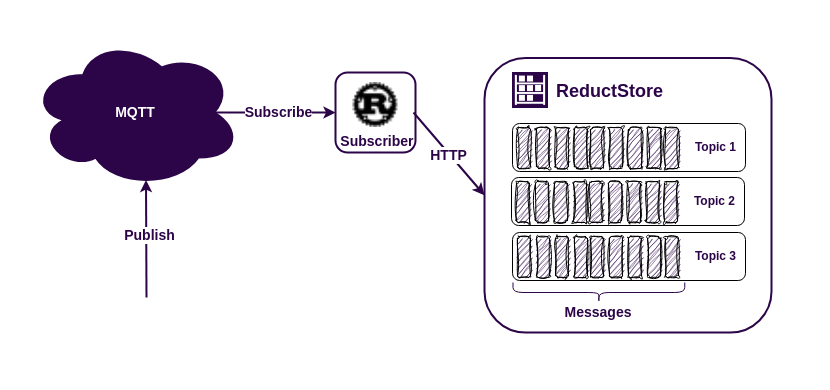

The MQTT protocol is an easy way to connect different data sources to applications. This makes it very popular for IoT (Internet of Things) applications. Some MQTT brokers can store messages for a while, even when the MQTT client is offline. However, sometimes you need to keep this data for a longer period of time. In these cases it's a good idea to use a time series database.

There are [**many time series databases available**](/blog/advice/database/mqtt-data-storage), but if you need to store a history of images, **[vibration sensor data](/use-cases/vibration-sensors)** or protobuf messages, you might want to use ReductStore. This database is designed to store a lot of blob data and works well with IoT and edge computing.

**[ReductStore](/)** has client SDKs (software development kits) for many programming languages. This means you can easily use it in your existing system. For this example, we'll use the **[Rust SDK](https://github.com/reductstore/reduct-rs)** from ReductStore.

Let's build a simple MQTT application to see how it all works.

{/* truncate */}

## Prerequisites

For this usage example, we have the following requirements:

- Linux AMD64
- Docker and Docker Compose
- Rust >= 1.75

If you're using Ubuntu, you can set up the required dependencies by executing the command below in your terminal:

```bash
$ sudo apt-get update
$ sudo apt-get install docker-compose
$ curl --proto '=https' --tlsv1.2 -sSf https://sh.rustup.rs | sh
```

If you are using a different operating system, you can find the installation instructions for Docker Compose on **[the official website](https://docs.docker.com/compose/install/)**.

## Running the MQTT broker and ReductStore using Docker Compose

The easiest way to set up the broker and database is to use Docker Compose with the following `docker-compose.yml' file:

```yaml
services:
  reduct-storage:
    image: reduct/store:latest
    volumes:
      - ./data:/data
    ports:
      - "8383:8383"

  mqtt-broker:
    image: eclipse-mosquitto:1.6
    ports:
      - "1883:1883"
```

Then run the configuration:

```
docker-compose up
```

Docker Compose will download the images if they are not available on your device and start the containers. Note that we have released ports 1883 for the MQTT protocol and 8383 for **[ReductStore HTTP API](https://www.reduct.store/docs/http-api)**.

## Writing Rust Program

Now let's start coding and get into the details. First, install the necessary dependencies. We'll need a Cargo.toml file with the following dependencies:

```toml
[dependencies]
reduct-rs = "1.10"
rumqttc="0.24"
tokio = { version = "1", features = ["rt-multi-thread"] }
futures-util = "0.3"
```

After installing the required dependencies, we can start programming.

```rust
use reduct_rs::ReductClient;
use rumqttc::Event::Incoming;
use rumqttc::Packet::Publish;
use rumqttc::{AsyncClient, MqttOptions, QoS};

#[tokio::main]
async fn main() {
    // Connect to ReductStore instance at 8383 port
    let client = ReductClient::builder().url("http://127.0.0.1:8383").build();

    // Get ot create a bucket named 'mqtt'
    let bucket = client
        .create_bucket("mqtt")
        .exist_ok(true)
        .send()
        .await
        .unwrap();

    // Connect to the mqtt broker
    let mqtt_options = MqttOptions::new("reduct", "127.0.0.1", 1883);
    let (mqtt, mut mqtt_loop) = AsyncClient::new(mqtt_options, 10);
    // Subscribe to all topics
    mqtt.subscribe("#", QoS::AtMostOnce).await.unwrap();

    // Write received message to the bucket
    // by using topic as an entry name
    while let Ok(notification) = mqtt_loop.poll().await {
        if let Incoming(Publish(packet)) = notification {
            let topic = packet.topic;
            let payload = packet.payload;

            bucket
                .write_record(&topic)
                .data(payload.clone())
                .send()
                .await
                .unwrap();
            println!(
                "Received message {} from {} is written to the bucket",
                String::from_utf8_lossy(&payload),
                topic,
            );
        }
    }
}
```

Let's look at the code in detail. First, we create a client to communicate with the ReductStore instance and create a bucket for the MQTT data:

```rust
    // Connect to ReductStore instance at 8383 port
    let client = ReductClient::builder().url("http://127.0.0.1:8383").build();

    // Get ot create a bucket named 'mqtt'
    let bucket = client
        .create_bucket("mqtt")
        .exist_ok(true)
        .send()
        .await
        .unwrap();
```

The bucket, called "mqtt", is a storage unit in ReductStore. It contains rules for storing and accessing data. We'll need this name when reading data.

Note the `exit_ok` flag; this allows us to create a bucket the first time the script is run, which can then be used for subsequent runs.

Now we need to fill the bucket with the MQTT data:

```rust
    // Connect to the mqtt broker
    let mqtt_options = MqttOptions::new("reduct", "127.0.0.1", 1883);
    let (mqtt, mut mqtt_loop) = AsyncClient::new(mqtt_options, 10);
    // Subscribe to all topics
    mqtt.subscribe("#", QoS::AtMostOnce).await.unwrap();

    // Write received message to the bucket
    // by using topic as an entry name
    while let Ok(notification) = mqtt_loop.poll().await {
        if let Incoming(Publish(packet)) = notification {
            ...
        }
    }
```

This code snippet connects to the MQTT broker and subscribes to all topics using the "#" wildcard. MQTT topics are a way of organising your data streams. A publisher needs to specify a topic name to send data, and a subscriber needs to specify either a specific name or a wildcard to receive the data. Later you'll see that the ReductStore has entries in the bucket, which is also used to organise the data.

Let's see how we store the data in the database:

```rust
    let topic = packet.topic;
    let payload = packet.payload;

    bucket
        .write_record(&topic)
        .data(payload.clone())
        .send()
        .await
        .unwrap();
```

This was quite straightforward. We used the topic name as the entry name and wrote the MQTT payload there.

## Publishing Data to MQTT Topic

When the script is started, it remains idle because there's no data coming in from MQTT. To make it work, you need to publish some data. My favourite tool for this is **mosquitto_pub**. For those using Ubuntu, this tool comes with the `mosquitto-clients` package.

```bash
$ sudo apt-get install mosquitto-clients
$ mosuitto_pub -t topic-1 -m "Hello, topic-1!"
$ mosuitto_pub -t topic-2 -m "Hello, topic-2!"
```

## Getting Data From ReductStore

You've learned how to retrieve data from MQTT and store it in ReductStore. Now we need a simple Rust script to read this data from the store:

```rust
use futures_util::StreamExt;
use reduct_rs::ReductClient;
use std::pin::pin;
#[tokio::main]
async fn main() {
    // Connect to ReductStore instance at 8383 port
    let client = ReductClient::builder().url("http://127.0.0.1:8383").build();

    // Get bucket named 'mqtt'
    let bucket = client.get_bucket("mqtt").await.unwrap();

    // Read all entries from the bucket
    let entries = bucket.entries().await.unwrap();

    for entry in entries {
        // Query all records from the entry
        let mut record_stream = bucket.query(&entry.name).send().await.unwrap();

        // Retrieve records as a stream
        let mut record_stream = pin!(record_stream);
        while let Some(record) = record_stream.next().await {
            let record = record.unwrap();
            println!(
                "MQTT topic: {}, Record: ts={}, data={}",
                entry.name,
                record.timestamp_us(),
                String::from_utf8_lossy(&record.bytes().await.unwrap()),
            );
        }
    }
}
```

We have already covered how to create a client and acquire a bucket. Now let's move on to reading the data:

```rust
    let entries = bucket.entries().await.unwrap();

    for entry in entries {
        // Query all records from the entry
        let mut record_stream = bucket.query(&entry.name).send().await.unwrap();

        // Retrieve records as a stream
        let mut record_stream = pin!(record_stream);
        while let Some(record) = record_stream.next().await {
            let record = record.unwrap();
            println!(
                "MQTT topic: {}, Record: ts={}, data={}",
                entry.name,
                record.timestamp_us(),
                String::from_utf8_lossy(&record.bytes().await.unwrap()),
            );
        }
    }
```

As you can see, this is also very simple. We browse all the entries in the `mqtt` bucket, retrieve all the records from each entry, and then print their timestamps and contents. That's it.

## Best Practices

The example is a simple one and may not cover all of the complexities that you may be faced with in a real-world application. Here are some tips to help you build a strong and efficient IoT application using ReductStore and MQTT:

- Create a ReductStore bucket with a **[FIFO quota](/docs/guides/buckets#quota-type)** to prevent disk overwrites.
- Use token authentication to protect your data. You can generate an access token using either the **[Web Console](https://github.com/reductstore/web-console)** or the **[CLI Client](https://github.com/reductstore/reduct-cli)**.
- Map **MQTT5** properties to ReductStore labels. This will make it easier to filter data when **[querying](/docs/guides/data-querying#using-labels-to-filter-data)** or **[replicating](/docs/guides/data-replication)**.
- Use **[Reduct CLI](https://github.com/reductstore/reduct-cli)** for data replication or backup purposes.

## Conclusion

The MQTT protocol and ReductStore are easy to use tools that work well together in Rust. They provide a powerful solution for many applications. Regardless of the size of your project, these tools handle data communication and storage effectively.

To help you understand how to use these tools, we've created an example that shows how they work together. You can see **[the source code of this example](https://github.com/reductstore/reduct-mqtt-example-rs)** on GitHub. This example shows how easy and useful it is to use MQTT and ReductStore together.

---

I hope this tutorial was helpful. If you have any questions or feedback, don't hesitate to use the [**ReductStore Community**](https://community.reduct.store/signup) forum.
