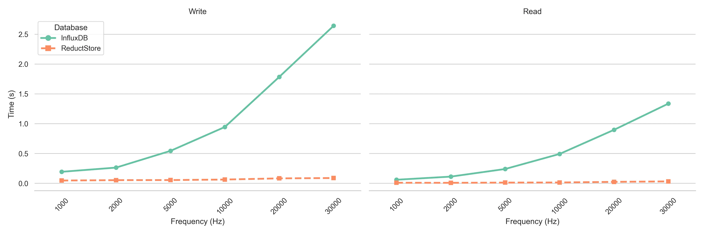
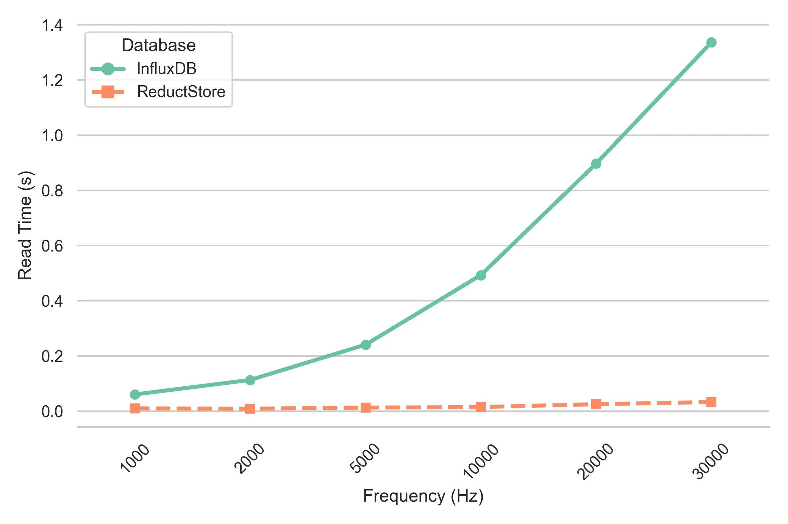

In [**How to Store Vibration Sensor Data | Part 1**](/blog/how-to-store-vibration-sensor-data), we discussed the importance of efficiently storing both **raw vibration data** and **pre-processed metrics**, and the benefits of using time-series databases such as ReductStore. We explored best practices for setting up a time-series database and implementing data retention policies to effectively manage high-frequency sensor data.

In [**How to Store Vibration Sensor Data | Part 2**](/blog/how-to-store-vibration-sensor-data/part-2), we provided a practical example of how to use ReductStore to store and query vibration sensor readings. We also showed how to store vibration sensor values in **1-second chunks**, each packaged as **binary data**, to optimize the storage process when dealing with very high frequency data such as vibration or acoustic measurements.

In this post, we compare [**ReductStore**](/) and [**InfluxDB**](https://www.influxdata.com/) in a real-world benchmark scenario, focusing on their **write** and **read** performance for high-frequency sensor data. We show how ReductStore's chunk-based binary storage provides superior efficiency and scalability over InfluxDB when handling large volumes of unstructured time-series data.

The benchmark was run on an **SSD drive**, but results may vary depending on hardware configuration and database settings; to explore how it performs on your setup, you can run the benchmark yourself using the **[Reduct Vibration Example repository](https://github.com/reductstore/reduct-vibration-example)** on GitHub.

{/* truncate */}

## Write Performance: ReductStore vs InfluxDB

When comparing **write performance** between ReductStore and InfluxDB, there are significant differences as data frequency increases.

### InfluxDB Write Performance

InfluxDB struggles to maintain performance as the frequency of sensor data increases. The benchmark results show that as the frequency increases to **30,000 Hz**, the time it takes to write data increases significantly. This is due to InfluxDB processing and storing the increasing number of time series data points one at a time, resulting in slower write times. In high frequency environments, this can be a challenge for applications that require real-time data storage and need to minimize write latency.

### ReductStore Write Performance

On the other hand, ReductStore demonstrates **minimal impact** on its write performance even as the frequency scales up. It maintains a **consistent and stable** write time at all frequencies tested, including the highest of **30,000 Hz**. This is largely due to ReductStore's design, which stores time series data in **binary format**, allowing it to efficiently handle large volumes of high frequency sensor data without compromising write speed. This makes ReductStore more scalable and able to handle the massive influx of sensor data without performance degradation.

## Read Performance: ReductStore vs InfluxDB

The **read performance** benchmark results reveal another key difference between ReductStore and InfluxDB when handling high-frequency vibration sensor data.

### InfluxDB Read Performance

Similar to write performance, **InfluxDB**'s read performance also degrades as the frequency increases. This is because the higher the frequency, the larger the dataset that InfluxDB must query. As more data points accumulate in the database, querying each point becomes more time-consuming, resulting in slower read times. This can be a bottleneck for applications that require frequent and fast access to large amounts of historical vibration data, especially in time-sensitive environments such as real-time monitoring systems or predictive maintenance applications.

### ReductStore Read Performance

In contrast, **ReductStore** maintains **consistent read performance** across all frequencies, demonstrating its ability to scale without compromising retrieval speed. Whether handling low-frequency or high-frequency data, ReductStore's read times remain relatively stable thanks to its optimized storage format and efficient indexing. This ensures that even as data volumes increase, ReductStore queries and retrievals remain fast and reliable, making it ideal for applications where fast access to high-frequency sensor data is critical.

## Key Factors Affecting Performance

The performance differences between ReductStore and InfluxDB can be attributed to a variety of factors, each related to how these databases handle data storage in this benchmark scenario. Below are some key factors that influence the performance of each database when managing high-frequency sensor data.

### Database Architecture

**InfluxDB** was designed as a general-purpose time-series database for a variety of time-series applications, including logging, monitoring, and tracking changes over time. However, when tasked with storing and querying high-frequency vibration sensor readings, it struggles to maintain performance. InfluxDB's architecture is not inherently optimized for the massive amounts of data generated in high-frequency environments, resulting in slower write and read times.

**ReductStore** is specifically designed to handle unstructured time series data. This includes high-frequency sensor data, such as vibration measurements, which must be stored in chunks in binary format for efficient processing. Its lightweight architecture is designed to efficiently process and store these large data sets without suffering from the same scalability issues as InfluxDB. This specialization allows ReductStore to consistently deliver low-latency performance, even at higher frequencies.

### Data Storage Mechanism

**InfluxDB** uses a traditional time-series format for storing data, which works well in many cases, but becomes inefficient with large amounts of high-frequency sensor data. The more data points it stores, the harder it is for the system to manage, resulting in slower read and write performance as seen in the benchmark results.

In contrast, **ReductStore**'s storage approach allows it to handle high-frequency data with greater efficiency. By chunking data and storing it in binary format, ReductStore minimizes storage overhead and ensures fast access to data when needed. This approach optimizes both write and read operations, reducing the impact of data volume on performance.

## Practical Implications for Real-World Applications

The performance results from this benchmark offer valuable insight into how **ReductStore** and **InfluxDB** perform in real-world scenarios. Each database has its strengths, depending on the nature of the data and the application requirements. 

### InfluxDB for Traditional Time-Series Applications

For applications dealing with **low to medium frequency time series data**, **InfluxDB** remains a strong choice. It excels at managing structured time-series data for a wide range of use cases, including

- **System Monitoring**: InfluxDB is widely used to store and analyze IT infrastructure metrics, enabling effective tracking of server performance, network health, and more.
- **Logging and Event Tracking**: With its efficient handling of time-stamped logs and event data, InfluxDB is ideal for tracking changes over time in applications such as web services, databases, and user activity.
- **IoT Data**: In environments where data is generated less frequently, such as temperature or environmental monitoring, InfluxDB provides excellent query and visualization capabilities, making it a popular choice for many IoT systems.
However, as data frequency and volume increase, especially in applications that generate large amounts of real-time, time-series data, InfluxDB may reach performance limits and require additional resources or tuning to maintain effectiveness.

### ReductStore for High-Frequency Unstructured Data

When it comes to handling high-frequency unstructured data, ReductStore is the superior choice. Its consistent read and write performance, even at high frequencies, makes it ideal for use cases that involve massive data loads and require real-time processing. Examples of applications where ReductStore excels include

- **High frequency sensor data**: For industries that rely on real-time monitoring, such as **Predictive Maintenance**, **Machine Diagnostics**, and **Industrial IoT**, ReductStore's ability to efficiently store and retrieve data from high-frequency sensors makes it the ideal solution. The benchmark results show that ReductStore can handle intense data loads without significant performance degradation, ensuring reliable, scalable data storage.

- **Computer vision**: ReductStore's design also excels at managing **unstructured data**, such as video frames in **computer vision** applications. Whether it's managing streams from surveillance cameras or processing video frames for object detection and classification tasks, ReductStore can efficiently store large amounts of time-series image data without the performance bottlenecks typically found in general-purpose databases.

- **Unstructured logs and events**: In scenarios where data is generated at high frequency and lacks a predefined structure, such as **audio recordings**, **geospatial data**, or **log files**, ReductStore's optimized storage mechanism ensures fast access to binary data, making it an ideal choice for applications that require real-time analysis and processing of unstructured time-series data.

### Best Practices

To optimize the performance of your IoT applications using ReductStore, here are some best practices to consider:

- **Set quotas to prevent storage overflows**: Create a ReducStore bucket with a **[FIFO quota](/docs/guides/buckets#quota-type)** (First In, First Out) on edge devices to prevent space from running out. This ensures that older, less important data is automatically deleted as new data arrives, making disk space management more efficient.
  
- **Enable token authentication for data security**: Protect your data with **token-based authentication**. You can generate access tokens using the ReductStore **[Web Console](https://github.com/reductstore/web-console)** or **[CLI Client](https://github.com/reductstore/reduct-cli)**. This feature ensures secure access to your stored sensor data and prevents unauthorized users from accessing sensitive information.

- **Use metadata labels to filter data**: Use ReductStore's **labeling system** to map sensor properties to metadata. This allows you to filter data based on key metrics (e.g., high RMS or peak-to-peak values) during queries or replication processes for more targeted data management.

- **Use Reducer CLI for replication and backup**: Use the **[CLI Client](https://github.com/reductstore/reduct-cli)** to automate data replication across multiple ReductStore instances or to backup critical sensor data. This ensures that high-priority data is securely duplicated or stored for future analysis, reducing the risk of data loss.

## Conclusion

The benchmark results show a clear difference between **ReductStore** and **InfluxDB** when handling high-frequency sensor data, especially in environments that generate massive amounts of time-series data such as vibration measurements. 

**ReductStore** consistently outperforms InfluxDB in both read and write performance, maintaining stable and efficient data management across all frequencies tested. 
Its ability to handle unstructured time series data without significant performance degradation makes it an ideal choice for applications that require **real-time data processing**, such as predictive maintenance and industrial IoT systems.

On the other hand, while **InfluxDB** remains a solid choice for many time-series use cases, its performance suffers as data frequency increases. 
For applications involving high-frequency sensor data, **InfluxDB** can introduce bottlenecks that can limit its effectiveness in such demanding environments.

## Frequently Asked Questions (FAQs)

### Can ReductStore handle other types of sensor data besides vibration data?
Yes, ReductStore is designed to efficiently manage any unstructured time series data, making it suitable for a wide range of applications. Whether you're storing audio samples, video frames, geospatial data, or log files in a time-series format, ReductStore's optimized storage mechanism ensures fast access to data without compromising performance.

### Can InfluxDB be tuned for better performance on high-frequency data?  
While InfluxDB can be optimized through configuration changes and additional hardware resources, its performance may still lag behind ReductStore when handling extremely high frequency data such as vibration measurements.

### How does ReductStore handle data replication?  
ReductStore provides built-in replication capabilities that allow you to **replicate data across multiple instances** or set up automated backups. You can configure replication tasks using the ReductStore CLI or Web Console, ensuring that critical data is securely duplicated.

### What are the system requirements for running ReductStore?
ReductStore is designed to be lightweight and efficient, making it suitable for a wide range of hardware configurations. It can run on **low-power edge devices** as well as **high-performance servers**, depending on your application requirements. For optimal performance, we recommend running ReductStore on a system with an SSD drive or NVMe storage to ensure fast read and write speeds.

---

I hope this tutorial has been helpful. If you have any questions or feedback, don't hesitate to use the [**ReductStore Community**](https://community.reduct.store) forum.