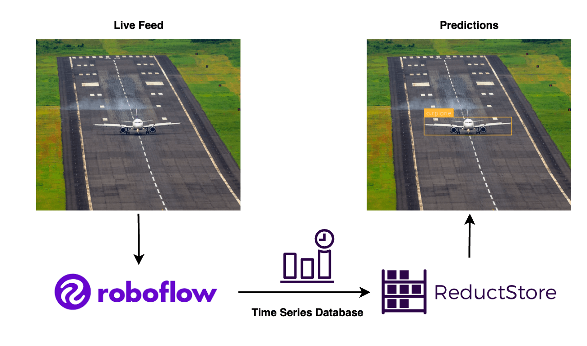
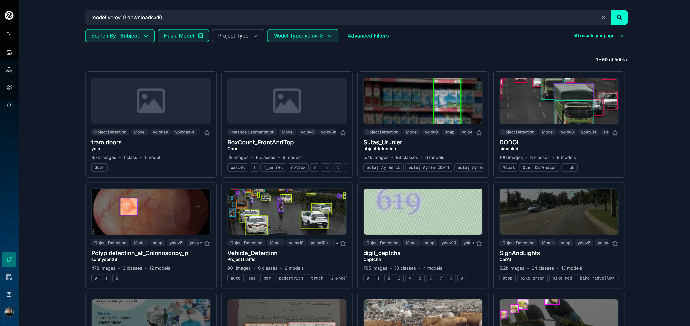

<small style={{ display: "block", marginTop: "-20px" }}>
  Roboflow and ReductStore. Airplane image by Vivek Doshi on Unsplash and
  annotated using Roboflow Inference.
</small>

Computer vision is transforming industries by automating decision making based on visual data.
From facial recognition to autonomous driving, the need for efficient computer vision solutions is growing rapidly.
This article explores how [**Roboflow**](https://roboflow.com/) combined with [**ReductStore**](/), a time-series object store optimized for managing continuous data streams, can improve computer vision applications. ReductStore is designed to efficiently handle high-frequency time-series data, such as video streams, making it a perfect fit for storing and retrieving large datasets generated by computer vision tasks.

{/* truncate */}

In this article, we will cover:

- [**Challenges of Traditional Computer Vision Model Deployment**](#challenges-of-traditional-computer-vision-model-deployment)
- [**What is Roboflow?**](#what-is-roboflow)
- [**Benefits of Using Roboflow Inference**](#benefits-of-using-roboflow-inference)
- [**Choosing the Right Computer Vision Model**](#choosing-the-right-computer-vision-model)
- [**Deployment Methods**](#deployment-methods)
- [**Cloud vs. Edge Deployment**](#cloud-vs-edge-deployment)
- [**ReductStore for Efficient Data Management**](#reductstore-for-efficient-data-management)

By the end of this article, you will have a clear understanding of how to leverage Roboflow and ReductStore to build and deploy computer vision models for real-time applications on edge devices. You can find the complete code example for this article on GitHub under the [**reductstore/reduct-roboflow-example**](https://github.com/reductstore/reduct-roboflow-example) repository.

## Challenges of Traditional Computer Vision Model Deployment

There are several challenges to deploying computer vision models that can affect the efficiency and scalability of projects. Some of the key issues are

1.  **Complex infrastructure requirements**: Traditional computer vision models often require a powerful computing infrastructure. This includes high-end GPUs, specialized hardware, and optimized software configurations. For many organizations, setting up this infrastructure can be time consuming and costly.
2.  **High computational cost and latency**: Running models, especially for real-time applications, requires significant computing power. As a result, inference on high-resolution images or video streams can result in high latency, which is problematic for time-sensitive applications such as autonomous vehicles or real-time surveillance.
3.  **Difficulty managing large datasets**: Computer vision models often require large amounts of labeled data for training. Managing these datasets, especially in real-time environments or over extended periods of time, creates additional hurdles for data storage, retrieval, and processing.

## What is Roboflow?

Roboflow is a comprehensive platform designed to simplify the process of building, training, and deploying state-of-the-art computer vision models.
It provides tools that help developers and data scientists streamline the entire workflow, from dataset creation to model inference.


<small style={{ display: "block", marginTop: "-20px" }}>
  Roboflow Dashboard. Image source: [Roboflow](https://roboflow.com/)
</small>

Some of Roboflow's key features include

1.  **Dataset management**: Roboflow allows users to easily upload, organize, and pre-process large datasets. It supports multiple image formats and provides tools for data augmentation, labeling, and image transformation, making it easy to prepare data for training.
2.  **Model Training and Optimization**: With Roboflow, users can choose from a wide range of pre-trained models or train their own from scratch. The platform provides tools to optimize models for different hardware environments, whether in the cloud or at the edge.
3.  **Model Deployment**: Roboflow makes it easy to deploy models in multiple environments, such as on-device, edge, or cloud-based systems. Its intuitive interface allows users to integrate computer vision models into applications without extensive coding or setup.

Roboflow's easy-to-use environment lowers the barrier to entry for computer vision projects, but it doesn't address the management of the large, continuous data streams generated by these models.

That would be where ReductStore fits in, providing a specialized time-series object store for handling high-frequency, unstructured data such as video feeds and image sequences. We'll talk more about how ReductStore complements this process later in this blog.

## Benefits of Using Roboflow Inference

Roboflow Inference provides a robust and efficient way to deploy computer vision models.
It is designed to simplify the deployment process while maintaining flexibility and performance. Below are some of the key benefits of using Roboflow Inference.

### Cost-effectiveness

Roboflow Inference eliminates the need for expensive infrastructure by providing optimized, scalable deployment solutions. It allows developers to efficiently run models on low-cost hardware or in the cloud, minimizing the cost of scaling and maintaining custom environments.

### Minimal setup requirements

One of the great things about Roboflow Inference is its ease of deployment. The platform supports a wide range of devices, from cloud GPUs to lightweight edge devices, with minimal configuration requirements. This allows for rapid deployment without complex configuration.

### Offline capabilities

For edge computing applications where Internet connectivity is limited or unreliable, Roboflow Inference supports offline deployments. This feature is especially valuable in areas such as autonomous vehicles, industrial IoT, or remote monitoring, where reliable, low-latency processing is critical.

## Choosing the Right Computer Vision Model

Selecting the right model for your computer vision application is critical to achieving the best performance. Roboflow simplifies this process by offering a wide range of models, each suitable for different tasks and environments.

### Understanding the Roboflow Universe

Roboflow provides access to an extensive library of pre-trained models, commonly referred to as the Roboflow Universe.
This library covers various tasks such as object detection, image classification, and segmentation.
Users can either use these models directly or fine-tune them based on their specific dataset.



<small style={{ display: "block", marginTop: "-20px" }}>
  Roboflow Universe. Image source: [Roboflow
  Universe](https://universe.roboflow.com/)
</small>

### Criteria for model selection

When choosing a model, consider the following factors

1.  **Task Type**: Determine whether your project involves object detection, image classification, or image segmentation. This will significantly influence the type of model you choose.
2.  **Model Accuracy**: Select a model that meets the accuracy requirements of your application. Depending on the task, there are different metrics, such as mAP (mean Average Precision) for object detection or mIoU (mean Intersection over Union) for segmentation, that can help evaluate model performance.
3.  **Hardware limitations**: Make sure the model you select is compatible with your hardware. For example, smaller models are suitable for edge devices with limited resources, while larger models may require more powerful GPUs.
4.  **Latency requirements**: Low-latency models are essential for real-time applications such as video surveillance or autonomous systems. In computer vision, GFLOPs (Giga Floating Point Operations) help measure the computational complexity of a model. Lower GFLOPs often mean faster processing times, but may come at the expense of accuracy.

An helpful approach is to browse the state of the art models in [**paperswithcode**](https://paperswithcode.com/). This will give you an idea of the performance of different models on various tasks.


<small style={{ display: "block", marginTop: "-20px" }}>
  Object Detection on COCO. Image source: [Papers with
  Code](https://paperswithcode.com/sota/object-detection-on-coco)
</small>

The Pareto frontier represents the best tradeoff between two competing objectives, such as accuracy and computational cost (e.g., GFLOPs). Models on the Pareto frontier are the most efficient, meaning that if you want to improve one objective (such as accuracy), you'll have to accept a higher cost in the other (such as more computation).

With all the models available, you can choose the one that best suits your needs. Sometimes it's better to choose a model that has been around longer and has been tested by the community for ease of use and reliability.

Roboflow's model library is organized to help you easily browse and select models based on these tradeoffs.


<small style={{ display: "block", marginTop: "-20px" }}>
  Hard Hat Sample Model. Image source: [Roboflow
  Universe](https://universe.roboflow.com/sujitsa/hard-hat-sample-hicg4)
</small>

### Roboflow Workflows to Divide and Conquer

Especially in computer vision, breaking down complex tasks into smaller steps can significantly improves accuracy and efficiency.

For instance, recognizing digits on license plates can be split into two tasks: one model detects and localizes the plates, while another focuses on digit recognition. This pipeline approach allows each model to specialize, resulting in better performance. In contrast, using a single model to handle both tasks simultaneously introduces challenges, such as dealing with varied lighting, camera angles, and different plate designs, leading to reduced accuracy and a more complex development process.

Benefits of the pipeline approach include:

- Improved accuracy as each model handles fewer variables.
- Faster development by working on models in parallel.
- Easier debugging with isolated components.
- Scalability since individual models can be updated independently.
- Reusability of the workflow for other tasks or projects.


<small style={{ display: "block", marginTop: "-20px" }}>
  Roboflow Workflows. Image source: [Roboflow](https://roboflow.com/)
</small>

In Roboflow workflows, you can define a series of models or steps to process images, such as resizing, zooming, or splitting them into smaller pieces. This allows you to create complex pipelines that can efficiently perform a variety of tasks.

For example, you can split images into smaller pieces and stitch the results back together for a more accurate prediction:

| With split workflow                                              | Without split workflow                                                 |
| ---------------------------------------------------------------- | ---------------------------------------------------------------------- |
|  |  |

<small style={{ display: "block", marginTop: "-10px" }}>
  Image Example and Annotated Image. Image from Viktor Forgacs on Unsplash and
  annotated using Roboflow Inference.
</small>

## Deployment Methods

Roboflow Inference offers multiple deployment methods, making it flexible for different types of applications.
Whether you're working with single image analysis, real-time video streams, or offline scenarios, Roboflow can handle these use cases efficiently.

### Deploying on a Single Image

For basic applications such as object recognition or classification of a single image, Roboflow allows you to upload an image and instantly perform inference using a selected model. The process includes

1.  Loading the image.
2.  Applying the pre-trained model for detection or classification.
3.  Obtain real-time results, including labels and bounding boxes for detected objects.

Here is an example of how you can perform inference on a single image using Roboflow Inference:

```python
import cv2
from inference_sdk import InferenceHTTPClient
import supervision as sv

# Load the example image
image = cv2.imread("img/image_example.png")

# Perform inference using Roboflow Inference
CLIENT = InferenceHTTPClient(
    api_url="https://detect.roboflow.com",
    api_key="0V9NRqITldFn0MFxy9jb",  # Public API key for demonstration purposes
)
predictions = CLIENT.infer(image, model_id="hard-hat-sample-hicg4/3")

# Annotate the image with the detected objects
labels = [item["class"] for item in predictions["predictions"]]
detections = sv.Detections.from_inference(predictions)

label_annotator = sv.LabelAnnotator()
box_annotator = sv.BoxAnnotator()

annotated_image = box_annotator.annotate(scene=image.copy(), detections=detections)
annotated_image = label_annotator.annotate(scene=annotated_image, detections=detections)
```

| Image Example                             | Image Annotated                               |
| ----------------------------------------- | --------------------------------------------- |
|  |  |

<small style={{ display: "block", marginTop: "-10px" }}>
  Image Example and Annotated Image. Image from Jsbco on Unsplash and annotated
  using Roboflow Inference.
</small>

This method is fast, straightforward, and ideal for tasks where high-speed processing isn't critical. More information on how to perform inference on a single image can be found in [**Roboflow's inference documentation**](https://docs.roboflow.com/deploy/self-hosted-deployments/what-is-inference).

### Streaming Video Deployment

For real-time applications, Roboflow supports the deployment of models on video streams. This is particularly useful for use cases such as surveillance, traffic monitoring, and live event detection. Roboflow processes each video frame through the model, ensuring real-time analysis. Steps involved:

1.  Connect your video stream (e.g. from a camera feed).
2.  Apply the selected model to each frame in real time.
3.  Output object detections or classifications frame-by-frame.

Here is an example of how you can perform inference on a video stream using Roboflow InferencePipeline:

```python
from inference import InferencePipeline

# Define a custom sink function to process the model predictions
def my_sink(result, video_frame):
    ...

# Initialize the InferencePipeline with the desired workflow
pipeline = InferencePipeline.init_with_workflow(
    api_key="API_KEY",
    workspace_name="workspace-name",
    workflow_id="workflow-id",
    video_reference=0,
    on_prediction=my_sink
)
pipeline.start()
pipeline.join()
```

For more information on how to deploy models on video streams, refer to the [**Roboflow deployment documentation**](https://docs.roboflow.com/workflows/deploy-a-workflow).

## Cloud vs. Edge Deployment

The choice between cloud and edge depends on the nature of your application. Each has distinct advantages that may influence your decision.

### Advantages of Cloud Deployment

- **Scalability**: Cloud-based deployments can handle large-scale processing, making them ideal for applications that require heavy computation.
- **Ease of access**: You can deploy and access models from anywhere, and roll out updates easily.

### Advantages of Edge Deployment

- **Reduced latency**: Running models on edge devices minimizes latency, which is critical for real-time applications.
- **Offline operation**: Edge deployments allow models to run in environments where Internet connectivity is unavailable or intermittent.

## ReductStore for Efficient Data Management

ReductStore plays a critical role in managing the massive amounts of data generated by computer vision models, especially in real-time applications.
It is a time-series object store designed for continuous data streams, making it highly efficient for storing and managing image data along with AI-generated labels.


<small style={{ display: "block", marginTop: "-20px" }}>
  ReductStore for Efficient Data Management. Image by author.
</small>

### ReductStore Setup

Create a `docker-compose.yml` file with the following configuration:

```yaml
services:
  reductstore:
    image: reduct/store:latest
    ports:
      - "8383:8383"
    volumes:
      - data:/data
    environment:
      - RS_API_TOKEN=my-token
      - RS_BUCKET_1_NAME=my-bucket-1
      - RS_BUCKET_2_NAME=my-bucket-2

volumes:
  data:
    driver: local
```

Then run the following command to start ReductStore:

```bash
docker compose up -d
```

This will start ReductStore on port 8383 with the specified API token and bucket names.


<small style={{ display: "block", marginTop: "-20px" }}>
  ReductStore Web Console. Image source: [ReductStore](/)
</small>

### Storing Images with AI Labels at the Edge

One of the key challenges in edge computing is managing large data sets generated by cameras or other imaging devices. ReductStore addresses this by

1.  **Storing high-frequency image data**: Efficiently manages the storage of continuous streams of images captured at the edge. ReductStore is significantly faster than other time series databases for records with large binary payloads.
2.  **AI-generated labels**: ReductStore supports the storage of metadata, such as object labels, directly with the image records, simplifying future analysis and retrieval of information.
3.  **Efficient storage management**: Edge devices often have limited storage capacity. ReductStore provides the ability to set a FIFO (First In, First Out) policy based on volume to efficiently manage storage.

```python
import time
from reduct import Client, Bucket

async with Client("http://127.0.0.1:8383", api_token="my-token") as client:
    bucket: Bucket = await client.create_bucket("my-bucket-1", exist_ok=True)
    ts = time.time()
    await bucket.write(
        "roboflow",
        image_bytes,
        ts,
        labels=flat_predictions,
        content_type="text/plain",
    )
```

For more information on storing images with AI labels at the edge, refer to the [**ReductStore data ingestion guide**](https://www.reduct.store/docs/guides/data-ingestion).

### Selective Data Replication to the Cloud

While edge storage is critical for low-latency processing, cloud storage provides scalability and backup for long-term data retention. ReductStore provides selective data replication capabilities that allow users to

1.  **Replicate only critical data**: Rather than sending all data to the cloud, developers can label specific records as critical and replicate only those, significantly reducing cloud storage costs by focusing on the information that matters.
2.  **Down-sample high-frequency data**: ReductStore supports down-sampling of high-frequency data streams, allowing users to replicate data based on specific criteria, such as
    - every nth record (e.g., every 10th record)
    - at specific intervals, such as every s-th second (e.g., every 5 seconds).

To set up replication, we can use the ReductStore web console to define the replication source and destination as well as rules such as the replication interval and filtering criteria.


<small style={{ display: "block", marginTop: "-20px" }}>
  ReductStore Data Replication. Image source: [ReductStore](/)
</small>

For more information on selective data replication to the cloud, refer to the [**ReductStore replication guide**](https://www.reduct.store/docs/guides/data-replication).

### Querying Data from ReductStore

Once your data is stored in ReductStore, retrieving it for analysis or further processing is easy. You can query and retrieve data based on the timestamp used during storage or for a specific time range.

The easiest way to retrieve data is to use the command line tool `reduct-cli`. Here's an example of how to copy data from a start time and export it to a local directory along with metadata:

```bash
reduct-cli alias add local -L http://localhost:8383 -t "my-token"
# Query data for a specific time range and export it to a local directory
reduct-cli cp local/my-bucket-1 ./export --start "2024-09-01T00:00:00Z" --with-meta --limit 100
```

This command fetches the data for all records in the `my-bucket-1` bucket from the specified start time and exports it to a local directory. The `--with-meta` flag includes the metadata (labels) associated with the records, and the `--limit` flag specifies the maximum number of records to fetch.

For programmatic access, here is an example of how you would query data from ReductStore using the Python client for a specific timestamp:

```python
async with Client("http://127.0.0.1:8383", api_token="my-token") as client:
    bucket: Bucket = await client.get_bucket("my-bucket-1")

    async with bucket.read("roboflow", ts) as record:
        content = await record.read_all()
        image_reconstructed = bytes_to_image(content)
        label_reconstructed = unflatten_predictions(record.labels)

        assert np.array_equal(image, image_reconstructed)
```

In this example, the `bucket.read` method retrieves the data using the same entry name (`"roboflow"`) and timestamp that was used during the storage process. The stored image can be reconstructed from the bytes, and the corresponding AI-generated labels can be recovered from the metadata.

As mentioned above, ReductStore supports querying data over a time range, so you can retrieve data between specific timestamps as needed. For more details on query options, please refer to the [**ReductStore documentation**](https://www.reduct.store/docs/guides/data-querying).

## Conclusion

The combination of Roboflow and ReductStore provides a comprehensive solution for efficiently deploying and managing computer vision models. Roboflow simplifies the model development and deployment process and makes it accessible to developers and data scientists, while ReductStore ensures that the massive amounts of data generated by these models are effectively managed, especially in real-time environments such as video streams.

Whether deployed in the cloud or at the edge, these tools reduce operational complexity, lower costs, and provide the flexibility to scale computer vision applications. As computer vision continues to evolve, leveraging these platforms will be essential to building efficient and scalable solutions.

## Frequently Asked Questions (FAQs)

### Does ReductStore offer a cloud solution?

Yes, ReductStore currently offers a cloud solution available on Azure. You can easily deploy ReductStore on an Azure VM to manage your data streams with scalability and flexibility. Please refer to the [**Azure VM Setup Guide**](/docs/guides/integration/azure-vm) for step-by-step instructions.

### What are the benefits of using ReductStore with Roboflow for computer vision tasks?

ReductStore complements Roboflow by providing efficient storage and management of large, high-frequency data streams, such as video or image sequences, making it easier to handle data generated by computer vision models.

### How does ReductStore help reduce cloud storage costs for high-frequency data?

ReductStore enables selective replication and downsampling, meaning you can choose to replicate only critical data or reduce the frequency of data sent to the cloud, minimizing storage and transfer costs.

### How does down-sampling work in ReductStore and when should it be used?

Downsampling reduces the amount of data replicated to the cloud or another storage location by selecting specific records based on criteria such as every nth record or at specific intervals. It should be used to reduce cloud storage costs and focus on critical data.

### What are the deployment options for computer vision models in Roboflow?

Roboflow offers flexible deployment options, allowing models to run in the cloud, on edge devices, or even offline, depending on the application requirements (e.g., scalability vs. low latency processing).
