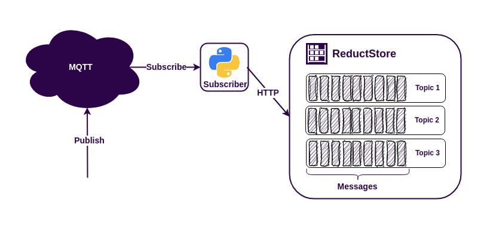

The MQTT protocol is an easy way to connect disparate data sources to applications, making it very popular for IoT (Internet of Things) applications. Some MQTT brokers can store messages for a while, even when the MQTT client is offline. However, sometimes you need to keep this data for a longer period of time. In these cases it's a good idea to use a time series database.

There are many time series databases available, but if you need to store a history of images, sensor data or protobuf messages, you might want to use ReductStore. This database is designed to store a lot of blob data and works well with IoT and edge computing.

**[ReductStore](/)** has client SDKs (software development kits) for many programming languages. This means you can easily use it in your existing system. For this example, we'll use the **[Python SDK](https://github.com/reductstore/reduct-py)** from ReductStore.

Let's create a simple MQTT application to see how it all works.

{/* truncate */}

## Prerequisites

For this example we have the following requirements

- Linux AMD64
- Docker and Docker Compose
- Python >= 3.8

If you're using Ubuntu, you can set up the required dependencies by running the following command in your terminal:

```bash
$ sudo apt-get update
$ sudo apt-get install docker-compose python3-pip
```

If you are using a different operating system, you can find the installation instructions for Docker Compose on **[the official website](https://docs.docker.com/compose/install/)**.

## Run MQTT Broker and ReductStore using Docker Compose

The easiest way to set up the broker and database is to use Docker Compose with the following `docker-compose.yml` file:

```yaml
services:
  reduct-storage:
    image: reduct/store:latest
    volumes:
      - ./data:/data
    ports:
      - "8383:8383"

  mqtt-broker:
    image: eclipse-mosquitto:latest
    ports:
      - "1883:1883"
```

Then execute the configuration:

```
docker-compose up
```

Docker Compose will download the images if they are not available on your device and launch the containers.

:::note
Now we have published ports 1883 for the MQTT protocol and 8383 for the ReductStore HTTP API.
:::

## Writing Python MQTT Subscriber

Now let's start coding and get into the details. First, install the necessary dependencies. We'll need the **aiomqtt** and **reduct-py** packages:

```bash
pip3 install reduct-py aiomqtt
```

After installing the required dependencies, we can start scripting.

```python
import asyncio

from reduct import Client, Bucket
from aiomqtt import Client as MQTTClient

async def main():
    # Connect to ReductStore instance at 8383 port
    async with Client("http://127.0.0.1:8383") as client:
        # Get ot create a bucket named 'mqtt'
        bucket: Bucket = await client.create_bucket('mqtt', exist_ok=True)

        # Connect to the mqtt broker
        async with MQTTClient("127.0.0.1") as mqtt:
            # Subscribe to all topics
            await mqtt.subscribe("#")
            async for message in mqtt.messages:
                # Write received message to the bucket
                # by using topic as an entry name
                await bucket.write(message.topic, message.payload)
                print(f"Received message {message.payload} from {message.topic} is written to the bucket")

if __name__ == "__main__":
    asyncio.run(main())
```

Let's look at the code in detail. First, we create a client to communicate with the ReductStore instance and create a bucket for the MQTT data:

```python
# Connect to ReductStore instance at 8383 port
async with Client("http://127.0.0.1:8383") as client:
    # Get ot create a bucket named 'mqtt'
    bucket: Bucket = await client.create_bucket('mqtt', exist_ok=True)
```

We use an asynchronous context manager to build the client to maintain HTTP sessions between requests. This speeds up the communication with the database.

The bucket, called "mqtt", is a storage unit in ReductStore. It contains rules for storing and accessing data. We'll need this name when reading data. Note the `exit_ok` flag; this allows us to create a bucket the first time the script is run, which can then be used for subsequent runs.

Now we need to feed the bucket with the MQTT data:

```python
# Connect to the mqtt broker
async with MQTTClient("127.0.0.1") as mqtt:
    # Subscribe to all topics
    await mqtt.subscribe("#")
    async for message in mqtt.messages:
```

This code snippet connects the MQTT broker using an asynchronous context manager and how to subscribe to all topics using the "#" wildcard. MQTT topics are a way of organising your data streams. A publisher needs to specify a topic name to send data, and a subscriber needs to specify either a specific name or a wildcard to receive the data. Later you'll see that the ReductStore has entries in the bucket, which is also used to organise the data.

Let's see how we store the data in the database:

```python
# Write received message to the bucket
# by using topic as an entry name
await bucket.write(message.topic, message.payload)
```

This was quite straightforward. We used the topic name as the entry name and wrote the MQTT payload there.

## Publishing Data to MQTT Topics

When the script is started, it remains idle because there's no data coming in from MQTT. To make it work, you need to publish some data. My favourite tool for this is **mosquitto_pub**. For those using Ubuntu, this tool comes with the `mosquitto-clients` package.

```bash
$ sudo apt-get install mosquitto-clients
$ mosquitto_pub -t topic-1 -m "Hello, topic-1!"
$ mosquitto_pub -t topic-2 -m "Hello, topic-2!"
```

## Getting MQTT Data From ReductStore

You've learned how to retrieve data from MQTT and store it in ReductStore. Now we need a simple Python script to read this data from the store:

```python
import asyncio
from reduct import Client, Bucket

async def read_data():
    async with Client("http://127.0.0.1:8383") as client:
        bucket: Bucket = await client.get_bucket('mqtt')
        for entry in await bucket.get_entry_list():
            async for record in bucket.query(entry.name):
                data = await record.read_all()
                print(f"Received message {data} with ts={record.timestamp} from {entry.name} is read from the bucket")

if __name__ == "__main__":
    asyncio.run(read_data())
```

We have already covered how to create a client and acquire a bucket. Now let's move on to reading the data:

```python
for entry in await bucket.get_entry_list():
    async for record in bucket.query(entry.name):
        data = await record.read_all()
        print(f"Received message {data} with ts={record.timestamp} from {entry.name} is read from the bucket")
```

As you can see, this is also very simple. We browse all the entries in the `mqtt` bucket, retrieve all the records from each entry, and then print their timestamps and contents. That's it.

## Best Practices

The example provided is basic and may not cover all the complexities you may face in a real-world application. Here are some tips to help you build a strong and efficient IoT application using ReductStore and MQTT:

- Create a ReductStore bucket with a **[FIFO](/docs/guides/buckets#quota-type)** quota to prevent disk overwrite.
- Use token authentication to protect your data. You can generate an access token using either the **[Web Console](https://github.com/reductstore/web-console)** or the **[CLI Client](https://github.com/reductstore/reduct-cli)**.
- Map **MQTT5** properties to ReductStore labels. This will make it easier to filter data when **[querying](/docs/guides/data-querying)** or **[replicating](/docs/guides/data-replication)**.

## Conclusion

**The MQTT protocol and ReductStore are easy to use tools that work well together in Python.** They provide a powerful solution for many applications. Whatever the size of your project, these tools handle data communication and storage effectively.

To help you understand how to use these tools, we've created an example that shows how they work together. You can see the source code of this example **[on Github](https://github.com/reductstore/reduct-mqtt-example-py)**. This example shows how easy and useful it is to use MQTT and ReductStore together.

---

I hope this tutorial has been helpful. If you have any questions or feedback, don’t hesitate to use the [**ReductStore Community**](https://community.reduct.store) forum.
