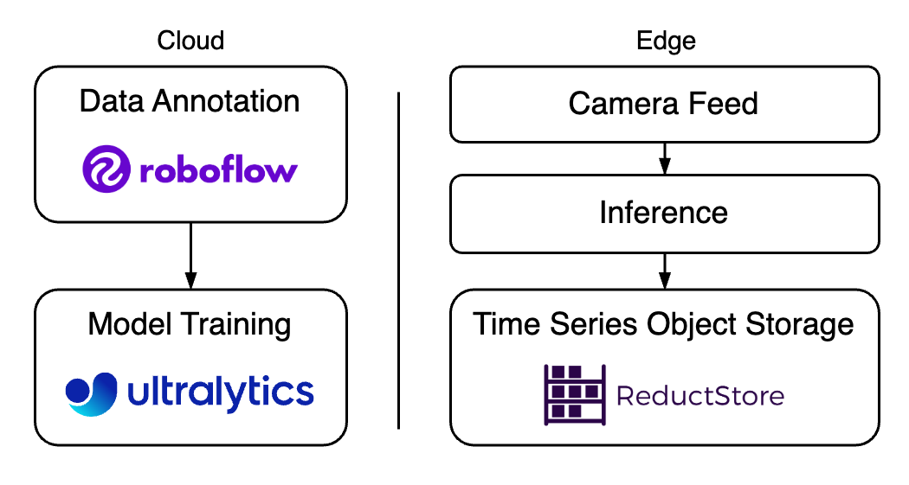

Deploying a vision model like YOLOv10 at the edge has become a game-changer for real-time object detection. Developed by researchers at Tsinghua University, YOLOv10 introduces architectural innovations that optimizes speed and accuracy, making it ideal for vision tasks that require low inference latency.

This article provides resources for training a YOLOv10 model and managing data storage for real-time performance on edge devices. We will look at a combination of tools, including [**Roboflow**](https://roboflow.com/) for dataset preparation, [**Ultralytics**](https://www.ultralytics.com/) for model training, and [**ReductStore for efficient data storage**](/blog/roboflow-reductstore).

{/* truncate */}

Specifically, we will cover:

*  [**What's New in YOLOv10**](#whats-new-in-yolov10)
*  [**Using Roboflow for Data Annotation**](#using-roboflow-for-data-annotation)
*  [**Training Your YOLOv10**](#training-your-yolov10)
*  [**Edge Data Management Techniques**](#edge-data-management-techniques)
*  [**Best Practices**](#best-practices)

Let's dive in!

What's New in YOLOv10
---------------------

YOLOv10 introduces an updated architecture that optimizes the trade-off between speed and accuracy, making it an ideal real-time object detection model. A key change is the removal of Non-Maximum Suppression (NMS) for post-processing, which simplifies the detection pipeline while maintaining accuracy.

In the [**original YOLOv10 paper**](https://arxiv.org/pdf/2405.14458), researchers introduced a new approach called _consistent_ _dual assignment__s_ to enable NMS-free training. Traditionally, YOLO models used NMS to remove overlapping boxes, which often slowed the model's inference time due to the extra post-processing step.

With consistent dual mapping, YOLOv10 eliminates the need for NMS by using an improved training strategy that helps the model better distinguish between objects directly. This results in lower inference latency, making the model faster and more efficient without the added computational overhead.

### Comparison With State-Of-The-Arts

Compared to previous versions, YOLOv10 delivers better latency and accuracy thanks to its NMS-free training and key innovations. From the original Tsinghua University paper, we can observe the following latency-accuracy graph for different model sizes:

\[Graph on hardware such as the T4 GPU with TensorRT FP16\]

As shown in the graph, YOLOv10's new model design is faster and more accurate with fewer parameters, making it lighter and more efficient. It also supports the use of pre-trained model weights, such as a [**pre-trained COCO model**](https://github.com/THU-MIG/yolov10/releases), which means you can easily customize and adapt to your specific needs without having to start from scratch.

This combination of speed, accuracy, and easy customization makes YOLOv10 a great choice for edge computing. It is especially useful for real-time applications, such as drones, cameras, or other edge AI applications.

Using Roboflow for Data Annotation
----------------------------------

[**Roboflow is a powerful tool**](/blog/roboflow-reductstore#benefits-of-using-roboflow-inference) for creating, annotating and managing datasets, which is essential for training a custom YOLOv10 model.

1.  **Start with a public dataset**: Roboflow Universe provides a large collection of publicly available, pre-labelled datasets for various use cases. It's ideal for quickly accessing and downloading datasets for common object recognition tasks, saving time on manual annotation.
2.  **Upload images**: If you have your own data, create a project in Roboflow and upload images. The platform supports bulk uploads, making it possible to manage large datasets.
3.  **Annotate objects**: Use Roboflow Annotate to draw bounding boxes around objects. Accurate annotations are essential for improving the recognition capabilities and achieving optimal performance.
4.  **Data augmentation**: Apply built-in augmentations such as flipping, rotating, and adjusting brightness to diversify your dataset and help to generalize better.
    

Note that Roboflow Universe counts 350 million+ images, 500,000+ datasets, and 100,000+ fine-tuned models, which can definitely help to use model weights from specialized models and get a head start on creating a custom dataset.

Training Your YOLOv10
---------------------

Training a custom YOLOv10 is now simpler than ever, thanks to well-documented resources and straightforward code. Here's what you need to get started:

*   **Source Code**: The [**YOLOv10 GitHub repository**](https://github.com/THU-MIG/yolov10) provides the official implementations, example scripts, and updates.
*   **Documentation**: For detailed guidance on fine-tuning and optimizing, you can refer to the [**Ultralytics YOLOv10 Documentation**](https://docs.ultralytics.com/models/yolov10/).
*   **Colab Notebook**: [**Roboflow's Colab notebook**](https://colab.research.google.com/github/roboflow/notebooks/blob/main/notebooks/train-yolov10-object-detection-on-custom-dataset.ipynb) is ideal for quickly starting a training session with minimal setup. It includes all dependencies, so you can upload your dataset, adjust training settings, and run the training directly in your browser.

Training YOLOv10 has become as simple as downloading a dataset from Roboflow and running a single command:

```bash
yolo task=detect mode=train epochs=500 batch=256 \\model=path/to/weights/yolov10n.pt \\data=path/to/data.yaml
```

Or, you can use Python for more control over the training process:

```python
from ultralytics import YOLOv10

# Load YOLOv10 with pre-trained weights
model = YOLOv10('path/to/weights/yolov10n.pt')

# Train the model on your custom dataset
model.train(data='path/to/data.yaml', epochs=500, batch=256, imgsz=640)
```

As you can see, Ultralytics and Roboflow have made it very easy to train a custom model on real-world images.

Edge Data Management Techniques
-------------------------------

The ability to effectively store data at the edge is important to the successful deployment of computer vision applications, especially when dealing with real-time inputs such as video feeds. ReductStore provides a practical solution for efficient data storage to ensure that images and predictions from real-time detection can be processed.

\[Block diagram with ReductStore and multiple feeds\]

### Introduction to ReductStore

ReductStore makes edge data management simpler and more effective through a number of key features:

*   **Time-based access**: ReductStore indexes each piece of data with a timestamp, making it easy to retrieve data based on specific time frames. This is particularly useful for time-sensitive data such as video feeds, where capturing the right moment for analysis is critical.
*   **Flat storage structure**: Data is stored in a flat format using buckets and entries. This keeps data organized and speeds up retrieval, which is critical when working with large datasets or multiple data sources on edge devices.
    

### Strategies for Handling Multiple Feeds

When dealing with multiple data streams, such as from multiple camera feeds, ReductStore provides effective and robust methods to keep everything organized:

*   **Handling of multiple camera feeds**: Store each camera feed as a separate entry in ReductStore. This keeps the data from different feeds properly organized, making it easier to access and process each stream as needed.
*   **Selective Data Replication**: Save bandwidth and optimize storage by [**replicating only critical data to the cloud**](/blog/roboflow-reductstore#selective-data-replication-to-the-cloud). This helps to maintain backups and filter images that require more attention, such as annotation work.
*   **Quota Policy Based on Volume (FIFO)**: ReducStore supports a quota policy based on data volume using FIFO (First In, First Out) to automatically delete older data while keeping the most recent data available. This ensures efficient storage management, ideal for devices with limited space.
    

Best Practices
--------------

Here are some best practices to maintain model performance over time:

*   **Update regularly with new data**: Continually update the model with new training data to ensure it remains accurate as the environment changes. This helps the model adapt to new settings and object variations.
*   **Monitor** **model performance**: Real-time monitoring of accuracy, latency, and confidence scores is important to see if the model's predictions are degrading or if certain classes are showing lower confidence levels.
*   **Collect images with low confidence predictions**: Replicate images where the model has low confidence in its detections. Use them to retrain the model and help it improve its accuracy, especially in difficult cases. This makes your model more reliable for edge cases.
    

Conclusion
----------

YOLOv10's architectural changes with NMS-free training reduce computational costs and achieve superior performance compared to other vision models. Combined with tools like Roboflow for dataset preparation and Ultralytics for model training, deploying a custom object recognition model has never been more accessible. Additionally, by using a time series storage solution like ReductStore, it's possible to meet the challenges of edge environments, maintain real-time performance, and optimize data flow.