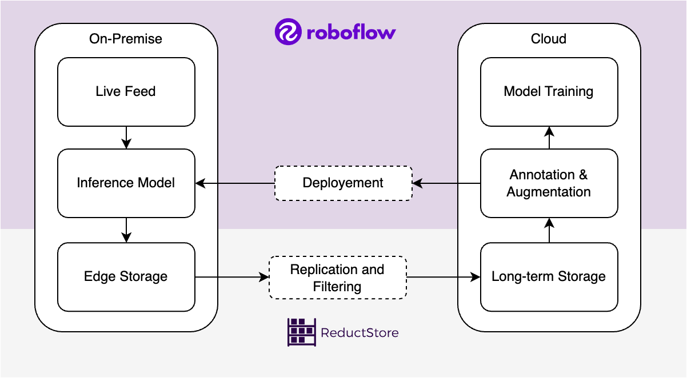
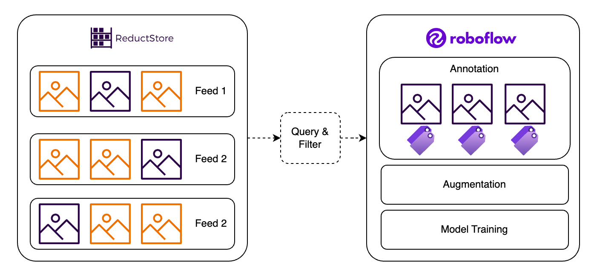

High speed performance is increasingly required in computer vision. By high-speed, I mean applications that can handle high FPS (frames per second) and require fast algorithms and efficient data storage. 

Traditional annotation methods are often time-consuming and labor-intensive for training machine learning models. They create bottlenecks that slow down project progress. [**Roboflow was developed to address the challenges**](/blog/roboflow-reductstore) associated with data annotation, but annotating all images is often tedious and unrealistic. Here ReductStore can provide the tools to query and replicate specific images for further annotation and training.

In this article, we'll explore how Roboflow reduces the annotation workload and how to use ReductStore to store images and filter out important images.

{/* truncate */}

## High-FPS Computer Vision Applications

High FPS applications are essential in areas requiring real-time analysis, such as autonomous vehicles, surveillance, or even sports analytics. These applications rapidly process and analyze thousands of images to make real-time decisions. The large amount of data generated at high frame rates requires a practical storage and retrieval system.

The requirements for storage and querying images are the following:
- High-performance database that can read and write images quickly.
- Efficient indexing and filtering mechanisms for fast image retrieval.
- Scalable solutions to support storage growth over time.

At the same time, managing the data pipeline for high FPS computer vision applications is complex. Solutions must prioritize speed without sacrificing accuracy. They must also ensure that the volume of data is a benefit, not a bottleneck, to system performance.

Here are some strategies:

| **Strategy** | **Description** |
|--------------|-----------------|
| Real-time data streaming  | Instantly process and analyze incoming image data to avoid delays. |
| Data Compression | Reduce the size of image files to save storage space and speed up retrieval. |
| Edge computing | Process data on local devices to minimize latency and network impact. |

## Efficient Annotation Process

A platform like [**Roboflow Annotate**](https://roboflow.com/annotate) makes annotation faster and more accurate. One tool I particularly like is Label Assist, which speeds up the process by using models such as Meta's Segment Anything Model (SAM) to automatically annotate images. In this case, the manual effort is more about making sure the annotation is accurate. 

Here are some of the features that I find especially relevant:

| **Feature**   | **Benefit**  |
| ------------- | ------------ |
| Smart Polygon | Create polygon annotations with Meta's Segment Anything model. |
| Label Assist  | Use custom models to assist with annotation. |
| Auto Label    | Automatically label images with [**Autodistill**](https://github.com/autodistill/autodistill). |
| Workflow      | [**Use multiple models to break a complex vision task**](/blog/roboflow-reductstore#roboflow-workflows-to-divide-and-conquer) into several easier steps. |

## Overview of ReductStore

Designed to store large volumes of time-series unstructured data on edge devices, ReductStore's architecture and feature set are optimized for storing and processing the continuous flow of images:

| **Feature**   | **Benefit**  |
| ------------- | -------------|
| Time-Series Object Storage | Accommodates continuous data input without lag                                                        |
| Large Data Handling        | Store billions of time-stamped images with AI labels and access them with low latency.                |
| FIFO quotas               | Prevent edge devices from running out of disk space in real time.                                     |
| Filter data                | This feature allows users to eliminate irrelevant data for faster processing.                         |
| Data replication           | Improves disaster recovery, accessibility, and reliability by replicating critical data in the cloud. |
| Efficient Data Batching    | Minimize network overhead in high latency environments. |

## Annotating Data in High-FPS Environments

Due to the large amount of data, manually annotating each image is virtually impossible in high FPS environments. We need to filter important images based on time and labels to focus annotation effort on important images.

By important, I mean images that have already been inferred by a deep learning model and the result is of interest to us:

- Based on model certainty. For example, if the model is uncertain about its prediction. A low certainty score from the model indicates that it probably needs to be annotated and retrained.
- Based on labels. For example, we know that our model performs poorly on red cars, and we want to query all red cars in the last three months.

As shown in the diagram, ReductStore provides the ability to filter and query images based on time information and AI labels. Roboflow then provides the tools that can significantly speed up the annotation process.

## Conclusion

In summary, combining Roboflow's annotation tools with ReductStore's data storage and filtering capabilities simplifies the workflow for high FPS vision applications.

Instead of manually annotating every frame, ReductStore allows you to filter and query only the most relevant images, significantly reducing annotation time. Roboflow then further accelerates the process with features such as Label Assist and Auto Label, making high-speed, high-volume computer vision tasks more manageable and scalable for real-time applications.

Together, these tools enable you to build better models, faster.
