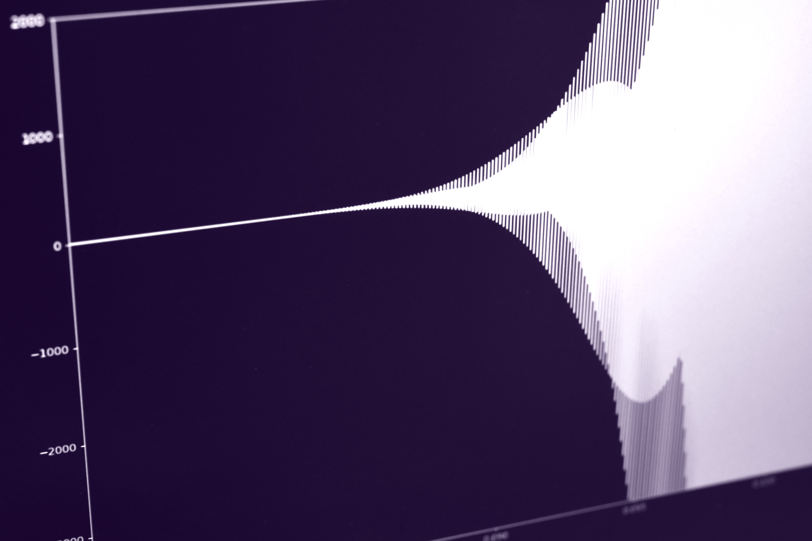
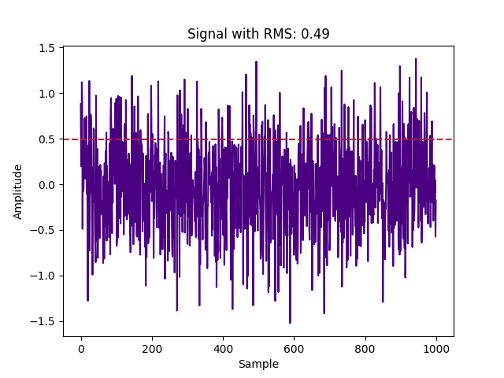
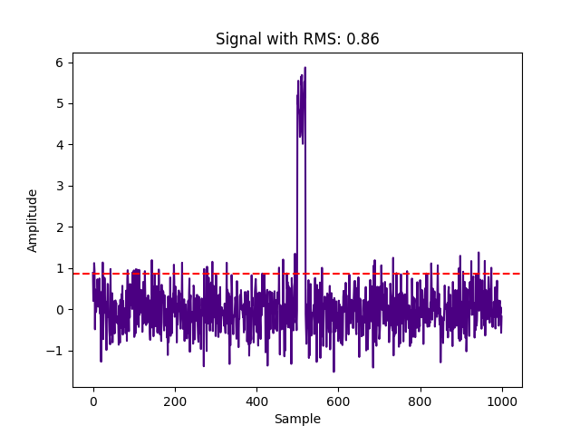
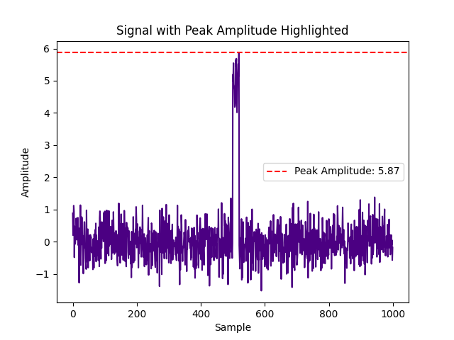
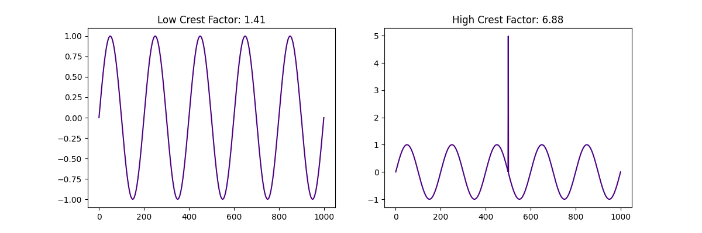
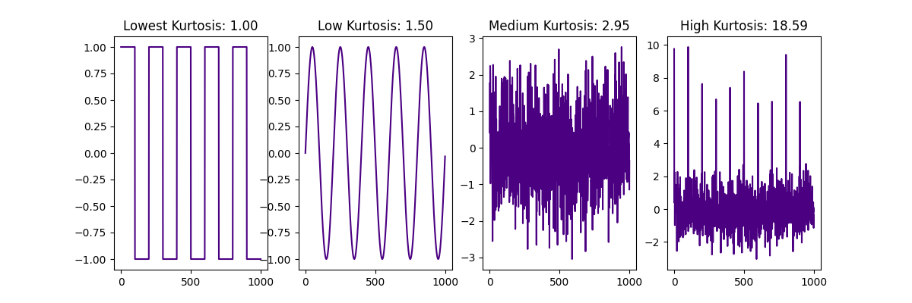
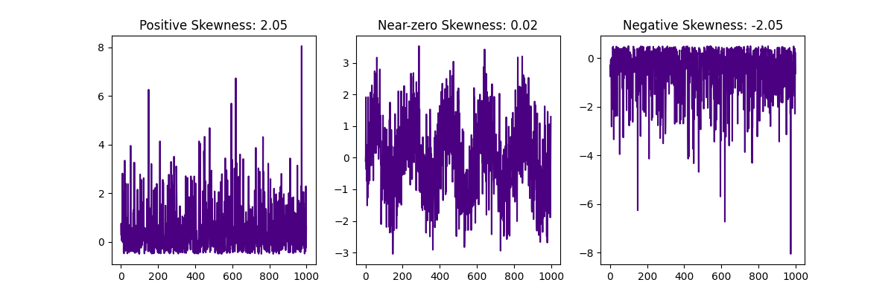
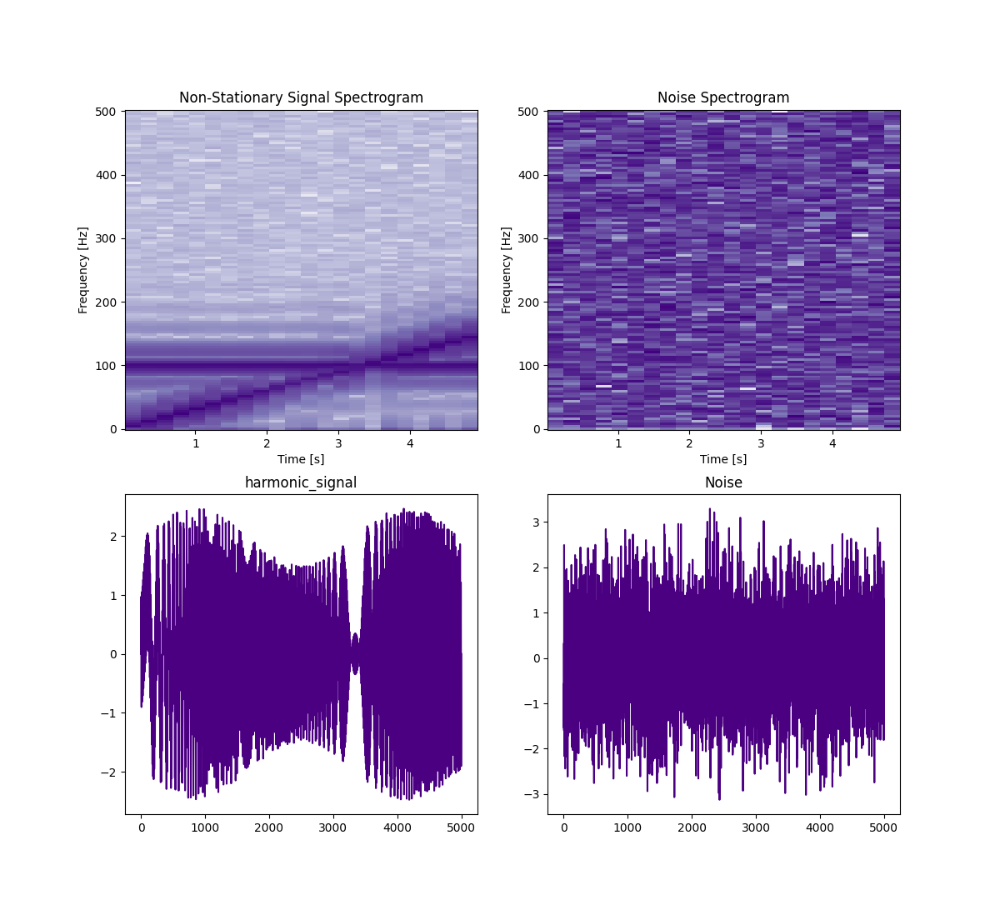
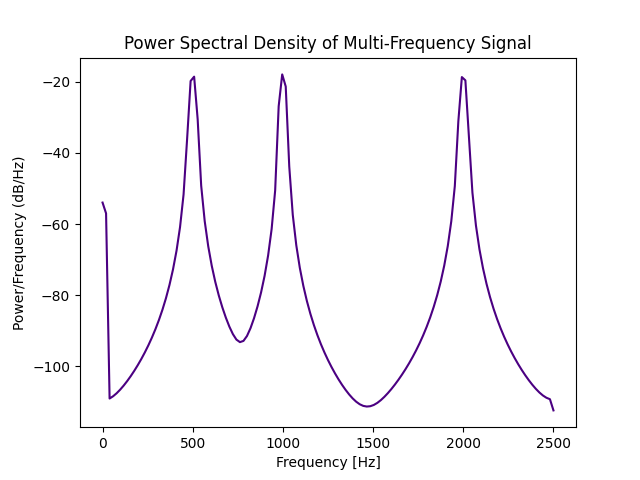

Recorded vibrations carry extensive information about the dynamic state of a mechanical system, describing the processes within it in both direct and detailed ways. Vibration signal naturally reflects the mechanical process, often including its very subtle aspects, so its proper analysis may help to monitor not only the system’s dynamic state and operating conditions but also the physical properties and changes in its components, such as wear or faults in bearings or transmission gears, physical defects or breakage of parts, deformations and imbalance, lack of lubrication, etc.

> When conducted comprehensively and involves modern ML techniques, vibration analysis approaches the skill of an experienced mechanic’s trained ear, capable of sensing a mechanism's condition through subtle, often indescribable changes in its sound.

However, let’s start with basic vibration analysis methods, specifically by calculating statistics or features that reflect certain well-interpreted properties of the process, each with clear physical meaning. This type of analysis addresses the most common questions about the process, while more subtle features - or those harder to formalize, or just specific for a particular case - may remain unqueried, despite their value for diagnostic and prognostic purposes.

{/* truncate */}

## Input variables

Sensors of different types provide data on displacement, speed (the first derivative of displacement), and acceleration (the 2nd derivative). Acceleration is typically most sensitive to changes in the dynamic state, so, in most cases, it is the primary input for vibration analysis, which we'll focus on below.

However, interpreting acceleration data in terms of actual machine part movement can be challenging. Reconstructing displacement by double integration of (potentially noisy) acceleration data is often impractical and unreliable. Therefore, in tasks where it is essential to monitor speed or the explicit trajectory of vibration, speed or displacement sensors (typically aligned along orthogonal axes) may be required.

## Common features

### Root Mean Square

The simplest thing we might want to know about vibration signal is its "overall intensity", which can be formalized via the concept of energy: we may just consider its average energy within some time window. Energy, by its physical meaning, is a product of two primary (atomic, directly measurable) values: in mechanics, it's a product of force (or, better, acceleration or added velocity) and initial velocity, which leads to well-known expression of energy $$E = \frac{mv^2}{2}$$. To make our measure of intensity proportional to the amplitude of the signal, we can take the square root of average energy, i.e. get the amplitude of a square or constant signal that would have the same energy as the original signal within a time window. This measure is known as the **Root Mean Square (RMS)** of the signal $$x$$ of length $$n$$:

$$\text{RMS} = \sqrt{\frac{1}{n} \sum_{i=1}^{n} x_i^2}$$

The underlying concept of energy is the reason why the formula includes an inner square (inner product of the vector of itself) and square root: since averaging the raw amplitude is meaningless (and leads to near zero values for balanced signal), we use the equivalent constant amplitude that matches the original signal's average energy. For instance, in an electric signal, RMS is just the value of direct current that would dissipate the same amount of heat (have the same power, which is a sum of per-point energies divided by the window length) as the original signal over the time window.

As we’ll see later, RMS can also be derived from the frequency domain by taking the square root of the area under the curve of spectral power density.

In Python, we can calculate RMS as follows:

```python
import numpy as np
import numpy as np
import matplotlib.pyplot as plt

np.random.seed(0)

signal = 0.5 * np.random.randn(1000)  # standard deviation 0.5

rms = np.sqrt(np.mean(signal**2))

plt.plot(signal, c="indigo")
plt.axhline(y=rms, color='red', linestyle='--', label=f"RMS: {rms:.2f}")
plt.title(f"Signal with RMS: {rms:.2f}")
plt.xlabel("Sample")
plt.ylabel("Amplitude")
plt.show()
```



As we could expect for the normally distributed zero-centered noise with a standard deviation of 0.5, we get an RMS value also about 0.5.

If we add to the signal any summand, we'll see in RMS its additional energy:

```python
import numpy as np
import matplotlib.pyplot as plt

np.random.seed(0)

noise = 0.5 * np.random.randn(1000)  # the same as above, sigma = 0.5
spike = np.zeros(1000)
spike[500:520] = 5  # add DC offset 5 for 20 points
signal = noise + spike

rms = np.sqrt(np.mean(signal**2))

plt.plot(signal, c="indigo")
plt.axhline(y=rms, color='red', linestyle='--', label=f"RMS: {rms:.2f}")
plt.title(f"Signal with RMS: {rms:.2f}")
plt.xlabel("Sample")
plt.ylabel("Amplitude")
plt.show()
```



### Peak amplitude and crest factor

Windowed **peak amplitude** is simply the highest absolute amplitude in the window, and it tells nothing about all other points of the signal than the highest peak. A more informative feature is the ratio of the peak amplitude to RMS, known as the **crest factor**:

$$CF = \frac{max_i|x_i|}{RMS(x)}$$

However, it relies on only peak values, which may appear by chance and may not reflect the signal’s essential characteristics. Kurtosis, discussed below, also captures the relationship between "central" and "marginal" amplitude values, but it considers all values, not just the peaks.

Here's a Python code for peak amplitude computed for the same signal:

```python
import numpy as np
import matplotlib.pyplot as plt

np.random.seed(0)

noise = 0.5 * np.random.randn(1000)
spike = np.zeros(1000)
spike[500:520] = 5  # High-amplitude transient event
signal = noise + spike

peak_amplitude = np.max(np.abs(signal))

plt.plot(signal, c="indigo")
plt.axhline(y=peak_amplitude, color='r', linestyle='--', label=f"Peak Amplitude: {peak_amplitude:.2f}")
plt.title("Signal with Peak Amplitude Highlighted")
plt.xlabel("Sample")
plt.ylabel("Amplitude")
plt.legend()
plt.show()
```



The crest factor for several signals can be computed as follows:

```python
import numpy as np
import matplotlib.pyplot as plt

np.random.seed(0)

low_crest_signal = np.sin(2 * np.pi * 5 * np.linspace(0, 1, 1000))

high_crest_signal = low_crest_signal.copy()
high_crest_signal[500] += 5  # add single peak value

low_crest_factor = np.max(np.abs(low_crest_signal)) / np.sqrt(np.mean(low_crest_signal**2))
high_crest_factor = np.max(np.abs(high_crest_signal)) / np.sqrt(np.mean(high_crest_signal**2))

plt.figure(figsize=(12, 4))

plt.subplot(1, 2, 1)
plt.plot(low_crest_signal, c="indigo")
plt.title(f"Low Crest Factor: {low_crest_factor:.2f}")
plt.subplot(1, 2, 2)
plt.plot(high_crest_signal, c="indigo")
plt.title(f"High Crest Factor: {high_crest_factor:.2f}")

plt.show()
```



As we can see, adding a single peak strongly affects the crest factor of the window.

### Moments

While **variance** (2nd central moment, square of standard deviation, which is the same as RMS but centered on the mean) is of less use than pure RMS (except when undesired constant bias is present in the signal), kurtosis and skewness, computed on raw (typically acceleration) signal, can provide valuable information about changes in machinery under monitoring. However, their utility strongly depends on the type of the signal.

**Kurtosis**, the 4th standardized moment, is the dimensionless (and invariant of amplitude scaling) measure of "peakedness at the center" of the signal's amplitude distribution histogram, defined as $$\frac{\mu_4}{\sigma^4}$$, where $$\mu_4$$ is the 4th central moment and $$\sigma$$ is the standard deviation. Informally speaking, the more often the amplitude hovers near zero (i.e. is relatively small in comparison to higher amplitudes that are present in the signal), and the less often the value is high, the greater the kurtosis, so that it is greatest for zero-centered silence signal interrupted by rare and isolated spikes, and lowest for a square wave that never passes zero. In practice, kurtosis helps to distinguish the pure (Brownian) noise (which has Gaussian bell-shaped amplitude distribution), where it equals 3, from both more "wobbling" or "zero avoiding" signals (that have a dominant frequency or multiple peaks in the frequency domain) on one side and signals with high amplitude contrast (e.g. silence, sometimes interrupted with high amplitude spikes) on the other side. For the pure sine wave, kurtosis is 1.5 and it is even less for a square wave. Oppositely, for silence with strong impulses, kurtosis is greater than 3.

So, kurtosis can be used to detect frequency components or tones, that may mean resonance or imbalance of rotating parts, as well as irregular spikes of acceleration that may reflect shocks caused by damage to moving parts like broken gear teeth, failure of bearing, or even by foreign objects in the mechanism.

In Python, we can find kurtosis as follows:

```python
import numpy as np
import matplotlib.pyplot as plt
import scipy  # not reauired for kurtosis computation, used only for square signal example generation

np.random.seed(0)

lowest_kurtosis_signal = scipy.signal.square( 2 * np.pi * 5 * np.linspace(0, 1, 1000, endpoint=False), 0.5)
low_kurtosis_signal = np.sin(2 * np.pi * 5 * np.linspace(0, 1, 1000, endpoint=False))
medium_kurtosis_signal = np.random.randn(1000)
high_kurtosis_signal = medium_kurtosis_signal.copy()
high_kurtosis_signal[::100] += 8 # add high peaks

def kurtosis(window):
    return np.mean((window - np.mean(window)) ** 4) / (np.std(window) ** 4)

high_kurtosis = kurtosis(high_kurtosis_signal)
medium_kurtosis = kurtosis(medium_kurtosis_signal)
low_kurtosis = kurtosis(low_kurtosis_signal)
lowest_kurtosis = kurtosis(lowest_kurtosis_signal)

plt.figure(figsize=(12, 4))

plt.subplot(1, 4, 1)
plt.plot(lowest_kurtosis_signal, c="indigo")
plt.title(f"Lowest Kurtosis: {lowest_kurtosis:.2f}")

plt.subplot(1, 4, 2)
plt.plot(low_kurtosis_signal, c="indigo")
plt.title(f"Low Kurtosis: {low_kurtosis:.2f}")

plt.subplot(1, 4, 3)
plt.plot(medium_kurtosis_signal, c="indigo")
plt.title(f"Medium Kurtosis: {medium_kurtosis:.2f}")

plt.subplot(1, 4, 4)
plt.plot(high_kurtosis_signal, c="indigo")
plt.title(f"High Kurtosis: {high_kurtosis:.2f}")

plt.show()
```



Here we see kurtosis values for square, sine, zero-centered normally distributed noise with unit standard deviation (which results in a value near 3), and the same noise with added high peaks, that affect a tail of the distribution and increase kurtosis.

Alternatively, the Scipy implementation `scipy.stats.kurtosis`, can be used, but by default it returns the so-called Kurtosis Excess, which differs from kurtosis by -3, so that outputs 0 instead of 3 for normally distributed signal. To switch to the defunition described above, use `scipy.stats.kurtosis(window, fisher=False)`.

**Skewness**, the 3rd standardized moment, defined as $$\frac{\mu_3}{\sigma^3}$$, where $$\mu_3$$ is the 3rd central moment and $$\sigma$$ is the standard deviation, reflects asymmetry in amplitudes, which in turn may be caused by any mechanical asymmetry like rubbing of rotating parts, specific wear, etc. As said above, it may be hard to interpret skewness in acceleration in terms of mechanics, and for some mechanical systems skewness may be nonzero by design, so in most cases it should be analyzed in comparison to the proven reference normal state of the machine. Also, skewness as a measure of directed acceleration impulses, may strongly depend on the orientation of the sensor. With this directional selectivity, it may be useful for discovering subtle, but meaningful changes in operation.

in Python, skewness can be found as follows:

```python
import numpy as np
import matplotlib.pyplot as plt

np.random.seed(0)
positive_skew_signal = np.random.exponential(1, 1000) - 0.5
near_centered_signal = np.random.randn(1000) + np.sin(2 * np.pi * 5 * np.linspace(0, 1, 1000))
negative_skew_signal = -positive_skew_signal

def skewness(window):
    return np.mean((window - np.mean(window)) ** 3) / (np.std(window) ** 3)

positive_skewness = skewness(positive_skew_signal)
near_zero_skewbess = skewness(near_centered_signal)
negative_skewness = skewness(negative_skew_signal)

plt.figure(figsize=(12, 4))

plt.subplot(1, 3, 1)
plt.plot(positive_skew_signal, c="indigo")
plt.title(f"Positive Skewness: {positive_skewness:.2f}")

plt.subplot(1, 3, 2)
plt.plot(near_centered_signal, c="indigo")
plt.title(f"Near-zero Skewness: {near_zero_skewbess:.2f}")

plt.subplot(1, 3, 3)
plt.plot(negative_skew_signal, c="indigo")
plt.title(f"Negative Skewness: {negative_skewness:.2f}")

plt.show()
```



As expected, for the signal with the zero-symmetric distribution of the amplitude (5 full periods of noisy sine wave), skewness is about 0.

### Amplitude spectrum, spectrogram, power spectral density

One of the ways to get a detailed view of the vibration signal is spectral analysis. Roughly speaking, the spectrum is a decomposition of the signal by elementary sine components of different frequencies, so that the signal, originally represented as a function of time (in the time domain), gets represented as a function of frequency - in the frequency domain.

The procedure of conversion, well known as the Fourier transform, possesses numerous fascinatingly powerful mathematical properties, including

- linearity: the transform decomposes the signal into linear combinations of its components,
- duality: the symmetry of time and frequency representations enables, in particular, full reversibility, i.e. allows lossless reconstruction (synthesis) of the waveform from its spectrum,
- possibility to replace convolution in the time domain with simple multiplication in the frequency domain, as well as differentiation with multiplication by a complex number,
- unitarity, or energy equivalence (guaranteed by Parseval's theorem): energy can be calculated in the same way (as inner square, as discussed above regarding RMS) in both domains, which makes energy remain a central notion of analysis.

Roughly speaking, the Fourier transform converts time series (e.g. a time window of the input vibration signal) to an equal-sized vector of frequency components represented by complex numbers, that is sufficient for finding amplitude (absolute value, magnitude) and phase (angle) of each frequency component. In many analysis applications, if synthesis of an original or modified waveform is not needed, we can ignore the phase information and build the amplitude spectrum, that maps amplitudes to respective frequencies. This way we immediately get an observation of the overall landscape of the signal, including its dominating frequencies and the pattern they form (e.g. tone(s) of rotating or oscillating parts, possible resonance tones (natural frequencies), possible harmonic series pattern(s)). Moreover, by computing spectra in a sliding window, we can track changes in both their amplitudes and frequencies over time.

But since amplitude itself is neither as convenient nor as meaningful for the analysis as energy, there is a common practice to convert amplitudes to energies. For this purpose, we can simply square amplitudes and then divide the results by frequency step to perform the correction for frequency resolution and thus make the result invariant of the input time window length: as said above, Fourier transform preserves the number of points being processed, so that the frequency array has the same number of elements as the input time window (or half as many, in common practical applications). While amplitudes are independent of sampling rate and hence of the number of frequency components, the amount of energy in the time window should remain constant regardless of resolution, so the squared amplitude values should be divided by frequency step. This provides us with shares of energy by each frequency pixel, which forms the discrete representation of the **Energy Density Function (EDF)** for the given time window. For stationary signals or those with slow changes relative to the sliding window size, the per-window EDF can be interpreted as a random realization of the overall **Power Density Function (PDF)** of the stationary signal. Such estimations of PDF (that can be calculated for different positions of time window), sometimes also called PDF or Power Spectra, are extremely useful in practice. There are methods of estimating a true PDF by using multiple per-window estimations. Welch's method uses overlapping windows for point estimations followed by averaging. It can be applied to a record of a stationary signal, as shown in the example below.

Because of the energy equivalence property of the Fourier Transform, the area under the estimated PDF curve equals to squared RMS of the time window. Value at each frequency pixel shows us the share of energy that falls into the respective frequency range, so we can see how the overall energy is distributed across frequency bands. In particular, its minimal value shows us the level of noise in the signal, which can be used to estimate the **Signal to Noise Ratio (SNR)**.

Amplitude (and sometimes power) spectra obtained from sliding windows form the history if changes in frequency domain called spectrogram. In most cases, it is a spectacular representation of signal history, that can lead to meaningful interpretation even while observed by eyes. It also provides a strong starting point for feature engineering and subsequent statistical or time series analysis, as well as for artificial intelligence (ML or DL) approaches.

The commonly used algorithm that implements the Fourier transform is called Fast Fourier Transform (FFT). It gets the benefits of cascaded processing of the signal but poses such an additional requirement, that the length of the signal must equal to integer degree of 2 (e.g. 32, 64, 128 etc.) In Python, there are different implementations of FFT and general Fourier Transform: native Numpy one, Scipy's, and PyFFTW, based on the FFTW free C library, which is considered to be fastest but requires additional setup (for details of efficiency benchmarking and comparison, as well as PyFFTW tweaking, refer to this article [**MATLAB vs Python: Speed Test for Vibration Analysis**](https://blog.endaq.com/matlab-vs-python-speed-for-vibration-analysis-free-download).

To build an (amplitude) spectrogram in Python, one often does not need to run FFT directly, as there are put-of-the-box implementations of Short-Time Fourier Transform (STFT), that apply the transform to small windows of the signal. The following example shows Scipy's spectrogram function with 5 seconds of synthetic signal, built of constant frequency sine, increasing frequency sine and weak noise. Note that, unlike in previous examples that process only individual windows cut from the signal, the input sample here is assumed to be the entire signal record, which may span a long period and be non-stationary, i.e. exhibit changes over time.

```python
import numpy as np
import matplotlib.pyplot as plt
import scipy

np.random.seed(0)

fs = 1000  # sampling frequency in Hz
t = np.linspace(0, 5, fs * 5)  # 5 seconds of data
f0 = 1
f1 = 75
chirp = np.sin(2 * np.pi * (f0 + (f1 - f0) * t / max(t)) * t)
tone = np.sin(2 * np.pi * 100 * t)
modulation = 1 + 0.5 * np.sin(2 * np.pi * 0.3 * t)
non_stationary_signal = modulation * chirp + tone + 0.001 * np.random.randn(len(t)) # add Gaussian noise

noise = np.random.normal(0, 1, 5000)


plt.figure(figsize=(12, 4))

plt.subplot(2, 2, 1)
frequencies, times, Sxx = scipy.signal.spectrogram(non_stationary_signal, fs=1000)
plt.pcolormesh(times, frequencies, 10 * np.log10(Sxx), cmap=plt.cm.Purples)
plt.title("Non-Stationary Signal Spectrogram")
plt.xlabel("Time [s]")
plt.ylabel("Frequency [Hz]")

plt.subplot(2, 2, 2)
frequencies, times, Sxx = scipy.signal.spectrogram(noise, fs=1000)
plt.pcolormesh(times, frequencies, 10 * np.log10(Sxx), cmap=plt.cm.Purples)
plt.title("Noise Spectrogram")
plt.xlabel("Time [s]")
plt.ylabel("Frequency [Hz]")

plt.subplot(2, 2, 3)
plt.plot(non_stationary_signal, c="indigo")
plt.title("harmonic_signal")

plt.subplot(2, 2, 4)
plt.plot(noise, c="indigo")
plt.title("Noise")

plt.show()
```



In this example, we can observe the full picture of the signal at once and see the tone of constant frequency, the chirp tone that increases its frequency over time and the noise in the background. In the waveform (especially if we magnify it along the time axis), we also can see that components interfering, so it's much harder to interpret, hence the use of spectrograms.

The following example also shows the computation of PDF estimation with Scypy implementation of Welch's method, for 5 seconds of stationary signal. Note that the input is assumed to be the whole record, not a window.

```python
import numpy as np
import matplotlib.pyplot as plt
import scipy

np.random.seed(0)

t = np.linspace(0, 1, 5000)
multi_freq_signal = np.sin(2 * np.pi * 500 * t) + np.sin(2 * np.pi * 1000 * t) + np.sin(2 * np.pi * 2000 * t)
# 3 sine components, each 1 octave higher than previous

frequencies, psd = scipy.signal.welch(multi_freq_signal, fs=5000)
plt.plot(frequencies, 10 * np.log10(psd), c="indigo")
plt.title("Power Spectral Density of Multi-Frequency Signal")
plt.xlabel("Frequency [Hz]")
plt.ylabel("Power/Frequency (dB/Hz)")
plt.show()
```



We can see here 3 frequency peaks of equal power that correspond to 3 sine components in the signal generation code.

## A few words about artificial intelligence in vibration analysis

As said, vibration signals are extremely rich in detailed information about the internal processes of a mechanical system. The traditional approach to analysis queries only apriori known features of the signal, however, they are not guaranteed to be most informative for any particular machinery and specific analysis goals. A good way to make the processing more holistic and capture non-obvious information a vibration signal may contain is artificial intelligence, including machine learning and deep learning.

It implements the concept of learning, accustomization or adaptation, which is familiar to everybody as a fundamental attribute of any living entity: with time, every new experience becomes familiar, i.e. gets represented by the observer in terms of potential outcomes. Both natural and artificial learning systems act as trainable models that convert experience into predictive power. This is what we can feel as habitation. An experienced car driver, accustomed to their old car, can often detect and understand subtle, but meaningful aspects of its sound - especially if they are curious about it. If they get a new car, its sound may initially be much less informative, but over time the driver gradually (and often unconsciously) learns to understand it, that is, to extract useful information, finding connections between sounds and states of car mechanisms. Understanding of the sound reconstructs or predicts the car condition, and continuously gets validated by actual car state and performance learned by other channels.

An interesting consequence of an ability to habituate is sensitivity to novelty: whenever a prediction cannot be made confidently or appears to be wrong, we immediately recognize the ongoing experience as new. This criterion of novelty can be used for both further learning and identifying unusual states of the system - detecting anomalies. The more complex connections and patterns of system behavior we - or an artificial model - have learned, the more subtle and non-obvious changes in the system can be noticed. Thus, AI-driven anomaly detection may be sensible to changes even before they are formalized and described, including changes we might neither expect nor be able to interpret well.

However, the field of ML/DL applied to signal processing is so wide, that it barely can be covered in a single post.

## Using ReductStore for selective data replication based on vibration analysis

Even a preliminary vibration analysis, feasible as an edge-computing task, can be used as a basis for selective data replication and storage. With ReductStore, the basic scenario of selective data replication is described in [**How to Store Vibration Sensor Data**](/blog/how-to-store-vibration-sensor-data). The basic scenario of selective replication, described there, is based on (editable) labels of records, offered by ReductStore: each record can be labeled with custom key-value pairs, both during creation or later (as labels of existing records remain editable). In a most simple case, one can compute vibration features for each record being created, label the records dependent on those features, and later use specific labels to select records, i.e. copy them to a longer-life storage for retention.

Let's review such a use case in more detail. For simplicity, let's consider a machine under vibration monitoring that has a single well-known stationary regime of operation, represented by a reference record. If we are interested in machine health diagnostics, we may be interested in saving only records that significantly differ from this state. We can formulate criteria of difference as a metric, measure that difference by computing the related metric of each recent record against the reference one, and label records by difference when saving to ReductStore short-term storage bucket, configured to serve as a ring buffer, limited by size quota, and finally create a conditional replication task by means of ReductStore (as described in [**the data replication guide**](/docs/guides/data-replication)), that selects records by labels and regularly copies them to long-term storage bucket (see also [**the reduct-vibration-example repository**](https://github.com/reductstore/reduct-vibration-example) for more details).

Depending on the nature of the signal and knowledge of potential problems of the machine, there may be different criteria for differentiation. For instance, if we are interested in changes in the overall spectrum profile or timber (new or missing tones, changes in frequencies or powers of spectral peaks) we can just compare power spectra. We also can just compare levels of pre-defined features like RMS, Kurtosis, etc. to these levels in reference signal, or simply to pre-defined thresholds, based on the reference sample.

In more advanced scenarios, we can define the metric in more complicated space formed by multiple features, spectra and/or amplitude distributions, or employ full-scale anomaly detection procedure based on ML or DL model.

## Conclusion

Vibration analysis is widely used in industries like manufacturing, transportation, and energy to monitor the condition of machinery and proactively detect mechanical issues before they lead to failures, costly downtimes and urgent repair works. It is essential for predictive maintenance, identifying wear, imbalances, misalignments, bearing issues, and other mechanical faults.

Python is a great tool for performing both basic and advanced signal analysis, including ML/DL approaches. The use of Python is shown in the post above, applied to most simple vibration analysis features. Also, the following topics are covered in this post:

- meaning and use of basic features used in vibration analysis is explained and accompanied by Python examples,
- a use case that leverages elementary vibration analysis to utilize ReductStore's selective replication features is discussed,
- notion and benefits of machine learning and perspectives of its applications to signal analysis and anomaly detection are briefly observed.

---

Thanks for reading.
If you have any questions or comments, feel free to use the [**ReductStore Community Forum**](https://community.reduct.store).
