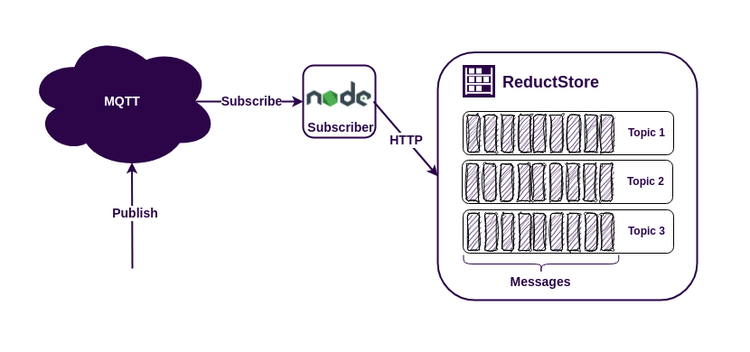

The MQTT protocol is widely used in IoT applications because of its simplicity and ability to connect disparate data sources to applications using a publish/subscribe model. While many MQTT brokers support persistent sessions and can store message history while an MQTT client is unavailable, there may be cases where data needs to be stored for a longer period of time. In such cases it is recommended to use a time series database. There are many options available, but if you need to store unstructured data such as images, sensor data or Protobuf messages, you should consider using [**ReductStore**](/). It is a time series database specifically designed to store large amounts of unstructured data, optimised for IoT and edge computing.

ReductStore provides client SDKs for many programming languages to integrate it into your infrastructure. For this example, we will use the [**JavaScript client SDK**](https://github.com/reductstore/reduct-js).

Let's build a simple application to understand how to keep a history of MQTT messages using ReductStore and Node.js.

{/* truncate */}

## Prerequisites

For this example we have the following requirements:

- Linux AMD64/ARM64/ARMv7
- Docker and Docker Compose
- NodeJS >= 18

If you are an Ubuntu user, you can install the dependencies by running the following command in your terminal:

```bash
$ sudo apt-get update
$ sudo apt-get install docker-compose nodejs
```

## Run MQTT Broker and ReductStore with Docker Compose

The easiest way to run the broker and database is to use Docker Compose with the following `docker-compose.yml` file:

```yaml
services:
  reduct-storage:
    image: reduct/store:latest
    volumes:
      - ./data:/data
    ports:
      - "8383:8383"

  mqtt-broker:
    image: eclipse-mosquitto:1.6
    ports:
      - "1883:1883"
```

Then run the configuration:

```
docker-compose up
```

Docker Compose will download the images if they are not available on your device and launch the containers.

:::note
Now we have published ports 1883 for the MQTT protocol and 8383 for the ReductStore HTTP API.
:::

## Writing Node.js MQTT Subscriber

Now it's time to dive into the code and start working. First, let's initialize the NPM package and install the necessary dependencies. We'll need the **async-mqtt** and the [**JavaScript Client SDK**](https://www.npmjs.com/package/reduct-js).

```
$ npm init
$ npm install --save reduct-js async-mqtt
```

Once we have all the dependencies installed, we can write the script:

```jsx
const MQTT = require("async-mqtt");
const { Client } = require("reduct-js");

MQTT.connectAsync("tcp://localhost:1883")
  .then(async (mqttClient) => {
    await mqttClient.subscribe("#");

    const reductClient = new Client("http://localhost:8383");
    const bucket = await reductClient.getOrCreateBucket("mqtt");

    mqttClient.on("message", async (topic, msg) => {
      const record = await bucket.beginWrite(topic);
      await record.write(msg);
      console.log(
        'Received message "%s" from topic "%s" is written',
        msg,
        topic,
      );
    });
  })
  .catch((error) => console.error(error));
```

Let's examine the code in detail. First we need to connect to the MQTT broker and subscribe to all topics using the `#` wildcard.

```jsx
MQTT.connectAsync("tcp://localhost:1883")
  .then(async (mqttClient) => {
    await mqttClient.subscribe("#");

    // rest of code
  })
  .catch((error) => console.error(error));
```

If the MQTT connection is successful, we can start working with ReductStore. To start writing data to it, we need a bucket. We create a bucket named `mqtt` or get an existing one:

```jsx
const reductClient = new Client("http://localhost:8383");
const bucket = await reductClient.getOrCreateBucket("mqtt");
```

The last step is to write the received message to the database. To do this, we need to use a callback on the `message' event to capture the message. Then we can write the message to the record corresponding to the topic name.

```jsx
mqttClient.on("message", async (topic, msg) => {
  const record = await bucket.beginWrite(topic);
  await record.write(msg);
  console.log('Received message "%s" from topic "%s" is written', msg, topic);
});
```

When we call `bucket.beginWrite`, we create an entry in the bucket if it doesn't already exist. Then we write data to the entry with the current timestamp. Now our MQTT data is safe and sound in the storage and we can access it using the same [**SDK**](https://github.com/reductstore/reduct-js).

## Publishing Data to MQTT Topics

When you run the script, it does nothing because there is no data from MQTT. You need to publish something. I prefer to use \*mosquitto_pub\*\*. For Ubuntu users it is part of the `mosquitto-clients` package:

```
$ sudo apt-get install mosquitto-clients
$ mosuitto_pub -t topic-1 -m "Hello, topic-1!"
$ mosuitto_pub -t topic-2 -m "Hello, topic-2!"
```

## Getting MQTT Data From ReductStore

Now you know how to get data from MQTT and write it to ReductStore, but we need a little NodejS script to read the data from the storage:

```jsx
const { Client } = require("reduct-js");

const client = new Client("http://localhost:8383");

client
  .getBucket("mqtt")
  .then(async (bucket) => {
    for (const entry of await bucket.getEntryList()) {
      for await (const record of bucket.query(entry.name)) {
        data = await record.read();
        console.log('Found record "%s" with timestamp "%d"', data, record.time);
      }
    }
  })
  .catch((error) => console.error(error));
```

Here we browse all the entries in the `mqtt` bucket and query all the records in each entry. Reading the most recent record in the entry is very simple.

```jsx
const record = await bucket.beginRead(entry.name);
const data = await record.readAsString();
```

To retrieve all records or records within a given time interval, we can use the `query` method. This method returns an asynchronous iterator, so we can use a `for await` loop to iterate over the records.

```jsx
for await (const record of bucket.query(entry.name)) {
  data = await record.read();
  console.log('Found record "%s" with timestamp "%d"', data, record.time);
}
```

## Best Practices

The example we've given you is pretty simple and it might not cover all the complexities you'll face in a real-world application. Here are some tips to help you build a strong and efficient IoT application using ReductStore and MQTT:

- Create a ReductStore bucket with a **[FIFO](/docs/guides/buckets#quota-type)** quota to prevent disk overwrite.
- Use token authentication to protect your data. You can generate an access token using either the **[Web Console](https://github.com/reductstore/web-console)** or the **[CLI Client](https://github.com/reductstore/reduct-cli)**.
- Map **MQTT5** properties to ReductStore labels. This will make it easier to filter data when **[querying](/docs/guides/data-querying)** or **[replicating](/docs/guides/data-replication)**.

## Conclusion

As you can see, the MQTT protocol and ReductStore are both incredibly user-friendly technologies that can be easily integrated with each other in NodeJS. This combination provides a powerful solution for various applications. Whether you're working on a small project or a large-scale system, the MQTT protocol and ReductStore provide a reliable and efficient way to handle data communication and storage.

To help you better understand how to use these technologies, we've prepared an example that demonstrates their seamless integration. You can access **[the source code](https://github.com/reductstore/reduct-mqtt-example)** of the example on GitHub. This example shows how easy and effective it is to use MQTT and ReductStore together.

---

I hope this tutorial has been helpful. If you have any questions or feedback, don’t hesitate to use the [**ReductStore Community**](https://community.reduct.store) forum.
