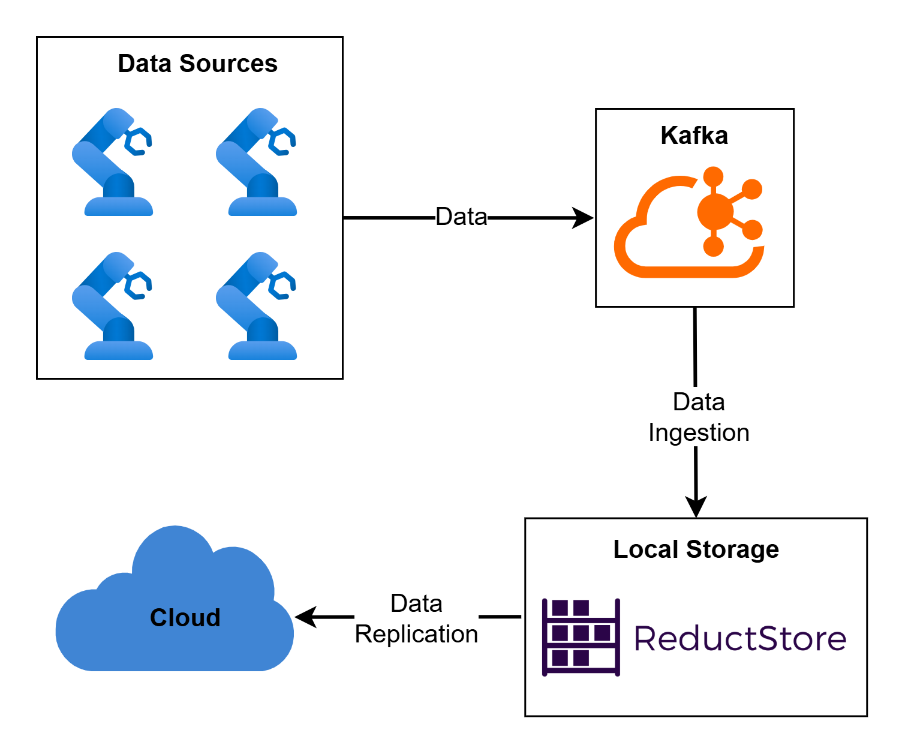
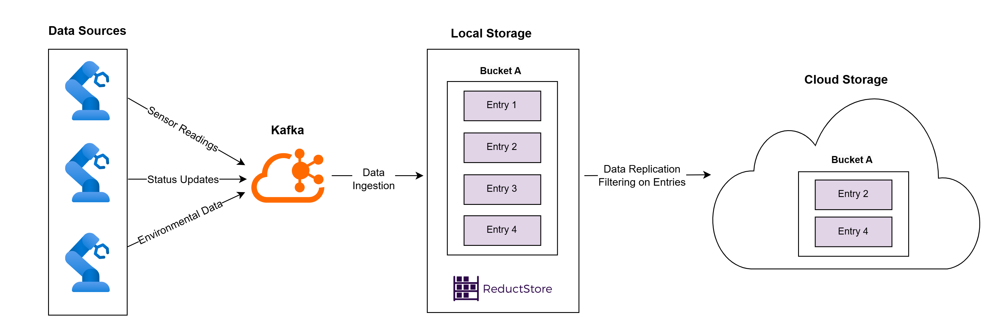

Robotics applications generate and process a wide variety of data, such as sensor readings, video streams, logs, and AI model outputs. Managing this data efficiently is crucial because it affects the performance, scalability, and reliability of the entire system.

In this article, we'll compare [**ReductStore**](/) and **MongoDB**, two databases designed to handle different aspects of data management. ReductStore is a time-series blob storage solution optimized for managing large amounts of data coming from continuous streams. MongoDB, on the other hand, is a popular NoSQL database known for its flexibility, scalability, and support for unstructured and semi-structured data.

By understanding the strengths and limitations of each, you can make an informed decision to meet your project's specific data needs.

**TL;DR;**

| **Feature**                    | **ReductStore**                                                                           | **MongoDB**                                                                        |
| ------------------------------ | ----------------------------------------------------------------------------------------- | ---------------------------------------------------------------------------------- |
| **Architecture**               | Buckets, entries, records, and blocks                                                     | Collections of JSON-like documents                                                 |
| **Query Language**             | Query data via CLI, SDKs, or HTTP API                                                     | MongoDB Query Language (MQL)                                                       |
| **Communication Protocol**     | Uses HTTP/HTTPS                                                                           | MongoDB Wire Protocol (binary, BSON-based)                                         |
| **Data Batching Capabilities** | Supports data batching                                                                    | Supports data batching, but it’s not optimized for time-series data                |
| **Replication**                | Granular data filtering support                                                           | Replicates the entire dataset; no native support for filtering during replication. |
| **Retention**                  | Retention policy based on data volume with ‘First-in, First-out’ (FIFO) deletions         | Uses TTL (Time to Live) indexes for time-based data deletion                       |
| **Performance**                | Optimized for unstructured data; up to 900% faster for writes and 2300% faster for reads. | General-purpose; slower with large blobs.                                          |

## Understanding the General Architectural Differences

First, let's look at MongoDB and ReductStore's differences in terms of their general architectural principles.

**ReductStore** has a specialized approach to managing unstructured, “blob” data organized by time. Its architecture revolves around buckets, entries, and records—concepts comparable to databases, tables, and rows in SQL systems. This structure, combined with fixed-size blocks for chronological data storage, makes ReductStore highly efficient for real-time processing and retrieval of data coming from continuous streams. It's also important to be mentioned that ReductStore has no limits to the size or the type of the data you can store.

**MongoDB**, in contrast, uses a document-oriented model based on collections of JSON-like documents. This flexible structure supports complex hierarchies and adapts well to applications with dynamic or loosely structured data, such as e-commerce platforms or content management systems. While MongoDB has a 16MB document size limit, it can handle larger files using GridFS, a feature designed to store and retrieve large binary files by splitting them into smaller chunks. However, storing data with GridFS is slower compared to working with standard JSON documents, which can affect performance in applications requiring frequent or rapid access to large files.

## Development Experience

In this section, we will compare the development experience of MongoDB and ReductStore, focusing on their query languages, communication protocols, and integration capabilities.

### Query languages and SDK support

[**ReductStore supports querying data in several different ways**](/docs/guides/data-querying) – either by using its _CLI, SDKs_, or _HTTP API_. This database solution improves data retrieval by batching records within a time range, minimizing requests and delays. Apart from querying by a time range, there is a possibility to retrieve a record by its timestamp, but you have to keep in mind that such querying is less efficient due to the lack of batching. ReductStore provides client SDKs for Python, JavaScript, C++, and Rust.

**MongoDB** uses its own query language, _MongoDB Query Language (MQL),_ which allows for flexible and powerful data querying. MQL supports complex filtering, aggregation, and indexing, making it a great choice for applications that need to work with semi-structured data. MongoDB also provides official SDKs for various languages, such as Java, Python, and C#, making it easy to integrate with various development environments.

### Communication protocols

**ReductStore** uses _HTTP/HTTPS protocols_ to handle data, focusing on reducing network load in environments with high latency. It processes large datasets by batching requests and delivering data in segments, making it efficient for both real-time and historical data access.

On the other hand, **MongoDB** uses its native _MongoDB Wire Protocol_, a lightweight, binary protocol optimized for fast communication between clients and servers. This protocol encodes data in BSON (Binary JSON), which supports efficient transmission and storage of JSON-like documents. These design choices make MongoDB a great choice for web-based applications, offering both flexibility and scalability.

## Data Management Features

### Data batching capabilities\*

**ReductStore** enables efficient _data batching_ by grouping multiple records into a single HTTP request, minimizing delays and reducing the number of queries needed. It uses parameters like each_s (records per second) or each_n (specific record counts) to customize data retrieval, allowing applications to process only the required subsets efficiently. This batching mechanism supports use cases like real-time monitoring and historical data analysis with minimal network overhead.

**MongoDB**, provides _bulk_ _write operations_ that enable inserting, updating, or deleting multiple documents in a single transaction. This is particularly useful for applications that need to modify large datasets without compromising performance. MongoDB's aggregation pipelines also support batch data processing, but this batching is more general and not a good option for time-series data.

### Edge-to-Cloud Replication

**MongoDB's** replication system mainly focuses on maintaining data consistency and fault tolerance across multiple replica sets. While it is very reliable and flexible for general-purpose applications, it is not specifically suited for edge-to-cloud workflows since it does not natively allow data filtering during the replication process.

[**ReductStore offers more granular control over data filtering during replication**](/docs/guides/data-replication), making it easier to move specific subsets of data between edge devices and the cloud. This feature allows efficient syncing, ensuring only necessary data is transferred to reduce bandwidth usage. This makes ReductStore particularly well-suited for applications like robotics where data is processed in real-time at the edge, and only relevant or high-priority data needs to be replicated to the cloud for analysis or storage.

### Retention policies

**ReductStore's** retention policies are based on _volume thresholds_, meaning that older entries are automatically removed as new ones are added. The platform follows a _FIFO (first-in, first-out)_ rule, making it a perfect solution for applications where only recent data needs to be kept, such as sensor readings or telemetry logs. These retention policies can be customized for each data bucket, which ensures efficient data management.

**MongoDB** uses _TTL (Time to Live)_ indexes to delete documents once they reach a certain age. This feature isn't automatic and requires setup, but it lets developers manage expiration policies for individual collections. TTL indexes are especially useful for applications like session storage, temporary logs, or data with defined lifespans.

## Performance Analysis

**MongoDB** is often better suited for structured numerical data but requires a more complex setup with GridFS for handling blob storage. On the other hand, **ReductStore** simplifies the process by storing binary data directly into buckets, which makes it easier to manage time-series data.

In terms of performance, our analysis shows that [**ReductStore greatly outperforms MongoDB**](/blog/comparisons/iot/reductstore-vs-mongodb) when handling large blobs of unstructured data. In write tests, ReductStore is up to **900% faster** than MongoDB, while for read operations, it delivers up to **2300% faster** results. In the table below, you can find the results of the tests conducted by measuring the speed of writing and reading of binary data of varying sizes on an NVMe drive.

| Chunk Size | Operation | MongoDB, blob/s | ReductStore, blob/s | ReductStore, % |
| ---------- | --------- | --------------- | ------------------- | -------------- |
| 1 KB       | Write     | 799             | 7994                | +900%          |
|            | Read      | 2008            | 47979               | +2300%         |
| 10 KB      | Write     | 783             | 7431                | +850%          |
|            | Read      | 1918            | 32888               | +1600%         |
| 100 KB     | Write     | 694             | 3612                | +420%          |
|            | Read      | 1730            | 6250                | +260%          |
| 1 MB       | Write     | 246             | 663                 | +170%          |
|            | Read      | 776             | 540                 | -30%           |

## Real-World Example

For a real-world robotics system, consider a scenario where numerous robots are operating on a manufacturing shop floor. These robots are continuously generating data, such as sensor readings, status updates, and environmental information. Kafka is used for ingesting this data in real-time and directing it into a local storage system for temporary retention and processing.

As the amount of data accumulates, it is very important to efficiently replicate this data to the cloud for further analysis and long-term storage. This is where ReductStore comes into play. The data replication strategy involves decreasing the volume of data by filtering out less important information automatically. By using ReductStore's edge-to-cloud replication and data filtering capabilities, only the most relevant time-series data is transmitted to the cloud, making sure that resources are used efficiently and bandwidth is optimized. This reduction strategy can be applied by using predefined rules or dynamic triggers, such as certain events or changes in sensor readings, helping improve performance and save on cloud costs.

## Conclusion

**ReductStore** and **MongoDB** each have their own strengths, making them a good fit for different needs and use cases. MongoDB is great for flexible, general-purpose storage, especially with structured data, but when it comes to handling large-scale, time-sensitive data—like the kind found in robotics—ReductStore really shines. With optimized performance, fast read/write speeds, and features like edge-to-cloud replication, ReductStore is better suited for managing large, unstructured data sets. So, while MongoDB is a solid choice for many use cases, ReductStore stands out for robotics applications that need efficient, real-time data management.

---

I hope this tutorial has been helpful. If you have any questions or feedback, don't hesitate to use the [**ReductStore Community**](https://community.reduct.store) forum.
