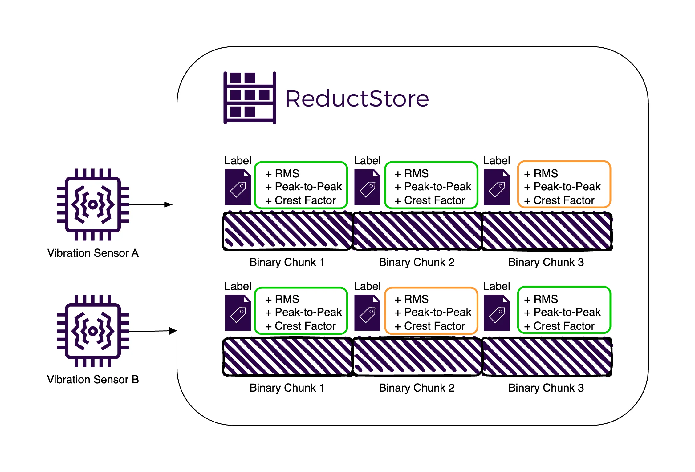
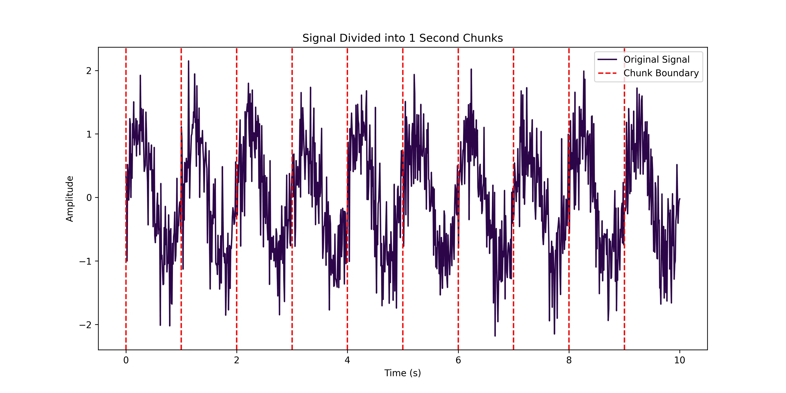
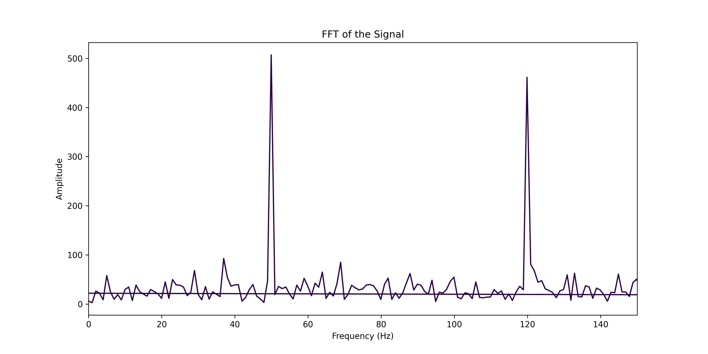
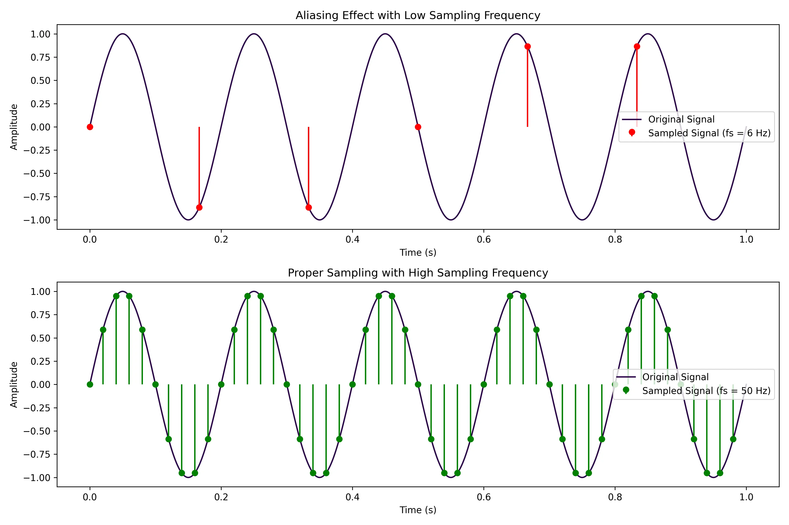
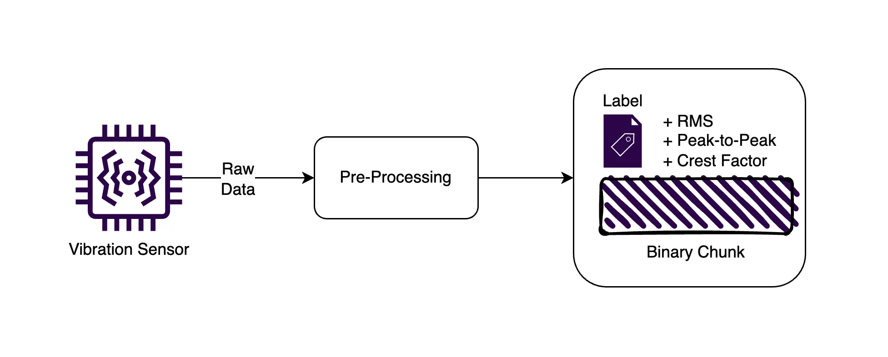
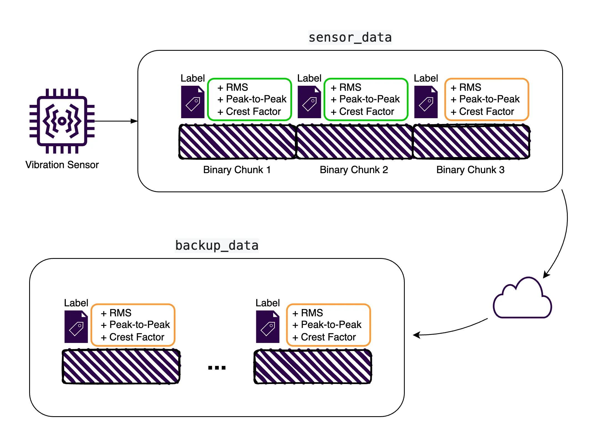

import FilterExampleImg from "./img/filter-example.webp";
import SettingsExampleImg from "./img/settings-example.webp";
import DashboardExampleImg from "./img/dashboard-example.webp";



This is a complete guide to storing vibration sensor data efficiently and effectively. We'll cover everything from the basics of vibration data to best practices for managing it as well as setting up a robust and scalable environment to store, query, and replicate vibration sensor data.

Vibration data is typically collected from sensors attached to machinery or equipment to monitor its health and performance. This data can be used to detect anomalies, predict failures, and optimize maintenance schedules.

However, effectively managing vibration data can be challenging due to its high frequency, large volume, and complex nature. To address these challenges, we must implement efficient storage strategies that balance data retention with storage constraints.

After covering the basics of vibration data, we'll explore the best practices for managing this data, including storing both raw and pre-processed metrics to take advantage of their benefits. We'll also look at the differences between traditional time series databases and a time series object store such as [**ReductStore**](/), which is designed to efficiently handle time series unstructured data, making it an excellent choice for storing high-frequency vibration sensor measurements.

We'll then cover a real-world example of storing vibration sensor data using Python and ReductStore. This example will show you step-by-step how to store raw sensor data, calculate key metrics, and query and retrieve this data for analysis.

Finally, we'll discuss strategies for preventing data loss through volume-based retention policies and automated replication to ensure that valuable information is always available for diagnosis and analysis.

{/* truncate */}

Here is a summary of the topics we'll cover:

- [**An Overview of Vibration Data**](#an-overview-of-vibration-data)
- [**The Need for Time Series Databases**](#the-need-for-time-series-databases)
- [**Data Retention and Replication Strategies**](#data-retention-and-replication-strategies)
- [**Setting Up the Environment to Store Vibration Sensor Data**](#setting-up-the-environment-to-store-vibration-sensor-data)
- [**Full Example to Store, Query, and Replicate Vibration Sensor Data**](#full-example-to-store-query-and-replicate-vibration-sensor-data)
- [**A Note on Using Labels to Filter Data**](#a-note-on-using-labels-to-filter-data)
- [**Replication with ReductStore Web Console**](#replication-with-reductstore-web-console)
- [**Conclusion**](#conclusion)

## An Overview of Vibration Data

### Comon Pre-Processing Metrics

The main advantage of pre-processing metrics is that it significantly reduces storage requirements by summarizing raw data into key metrics.

For example, a signal can be divided into 1 second chunks. The result is then a new signal sampled at 1Hz that aggregates the content of each chunk.
As seen in the image below, the signal is divided into 1-second chunks, and the RMS value would be calculated for each chunk.
For an original signal sampled at 10kHz, this would reduce the data size by a factor of 10,000.
This approach is particularly useful for vibration data but some information is ultimately lost in the process.



The typical metrics include:

- **RMS (Root Mean Square)**: Represents the power content of the signal by calculating the root of the mean square:
  - $$\text{RMS} = \sqrt{ \frac{1}{n} \sum_{i=1}^{n} x_i^2 }$$, where $x_i$ is a sample of the signal and $n$ is the number of samples in a given time window (e.g., 10,000 samples for a 1 second chunk sampled at 10kHz).
- **Peak-to-Peak**: Measures the difference between the maximum and minimum values, indicating the signal's amplitude range:
  - $$\text{Peak-to-Peak} = \max(x) - \min(x)$$, where $\max(x)$ and $\min(x)$ are the maximum and minimum values of the signal in a given time window (e.g., 1 second chunk).
- **Crest Factor**: The ratio of the peak value of the signal to its RMS value, indicating how sharp or sudden the peaks in the signal are:
  - $$\text{Crest Factor} = \frac{\max(|x|)}{\text{RMS}}$$, where $\max(|x|)$ is the maximum absolute value of the signal in a given time window.

Many other metrics can be calculated depending on the application, and more advanced signal processing or machine learning techniques can be applied to extract more information from the signal.
At the same time, access to raw data is critical, as it enables the calculation of these various metrics and the application of various analytical methods. This is especially important as new techniques and algorithms are developed, allowing for continuous improvement and more accurate diagnosis.

### Raw Signal (Time Waveform) and Frequency Domain Analysis

Storing raw data in the context of vibration monitoring offers significant advantages. In other words, the time waveform allows for extensive post-processing and re-analysis using multiple algorithms or filters.

This flexibility is essential for developing new diagnostic tools or improving existing ones without the need for repeated data acquisition. For example, raw data can be used with the Fast Fourier Transform (FFT) to identify frequency components (see example below). This type of spectral analysis can reveal hidden patterns or anomalies that may not be apparent from pre-processed metrics alone.



By converting time-domain data to the frequency domain, we can generate a frequency spectrum that shows the amplitude of different frequency components within the signal. This helps to identify specific frequencies that may indicate mechanical problems or resonances.

When dealing with vibration data, it's common to consider both time and frequency domain analysis. Time domain waveforms provide insight into the behavior of the signal over time, allowing the detection of transient events and irregularities.

In contrast, the frequency domain focuses on the frequency content of the signal, revealing underlying patterns such as natural frequencies and harmonic components.

### Importance of Sampling Rate

Sampling rate is a critical factor in the accurate acquisition of vibration data. A higher sampling rate ensures that all relevant frequency components are captured, especially those close to the equipment's natural frequencies.

According to the Nyquist theorem, the sampling rate should be at least twice the highest frequency present in the signal to avoid aliasing. For example, if the highest frequency of interest is 5 kHz, a sampling rate of at least 10 kHz is required.



As you can see from the diagram above, selecting the right vibration sensor that can handle the sampling rate we need is a must for spectrum analysis and accurate representation of the vibration signal in both the time and frequency domains.

### Integrating sensor data for improved diagnostics

The capacity to acquire and store multiple sensor data is inevitable for most industrial applications, which typically provide multiple sensors for a single piece of equipment (e.g., temperature, vibration, pressure, etc.).

For example, temperature data can reveal problems such as overheating or lubrication issues that vibration analysis alone may not reveal. When analyzed together, these data sources can help pinpoint the root cause of potential problems more effectively.

This sounds great in theory, but in practice it can be challenging to manage and analyze data from multiple sensors that may have different sampling rates, data formats and storage requirements.

This is where a time series object store can be particularly useful, as it can handle multiple data sources with different formats and requirements, providing a unified storage solution for all sensor data.

## The Need for Time Series Databases

Time Series Databases (TSDBs) are specialised data storage systems optimised for handling time-indexed data. They excel at managing large volumes of sequentially generated data points, such as vibration measurements, by providing efficient write and read operations.

### Time Series Object Store vs. Traditional Time Series Database

A time series object store and a traditional time series database can serve similar purposes, but have distinct architectural differences. While a traditional TSDB is optimised for high-speed ingestion and retrieval of scalar data points, an object store is designed to handle complex, high-dimensional data objects and their metadata. This makes the object store more versatile for applications that require rich contextual information, such as vibration analysis that includes waveform data and diagnostic logs.

### Vibration Data in Time Series Object Store

With a time series object store, each chunk of vibration data is stored as a binary object with a timestamp along with metadata such as preprocess metrics that can be useful for filtering and replication (more on that later).



This method allows efficient management of large vibration datasets by providing fast access to specific time periods. In fact, [**ReductStore outperforms TimescaleDB for blobs ranging from 1KB and larger**](https://www.reduct.store/blog/comparisons/iot/reductstore-vs-timescaledb) using this method, with improvements ranging from 205% to 1300%.

## Data Retention and Replication Strategies

By storing raw sensor data locally, we minimize latency and retain critical information for immediate diagnosis.

However, local storage can quickly fill up at the edge, leading to potential disk bottlenecks. To prevent this, we need to periodically eliminate data. However, this data may be critical for further analysis or diagnosis.

Automated replication of important data chunks is therefore essential to ensure that critical information is retained.

### Volume-Based Retention Policy

A real-time FIFO (first-in, first-out) quota prevents disk space shortages in real time. Typically, databases implement retention policies based on time periods; in the case of [**ReductStore**](/), retention can be set based on data volume. This is particularly useful when storing vibration sensor data on edge devices with limited storage capacity.

Time-based retention can lead to data loss during downtime. For example, if a system retains data for eight days and goes offline over the weekend, it might only capture six days of data before starting to overwrite.
Additionally, if the device is offline for a long time, it could delete all existing data once restarted, losing important information for diagnostics.


In the above diagram, the system retains data for eight days, but due to a weekend shutdown, it will only capture six days of data before starting to overwrite (assuming a retention policy of eight days).

With [**ReductStore's volume-based retention policy**](/docs/guides/buckets#quota-type), the system retains data based on the amount of data stored, ensuring that critical information is preserved even after downtime or long periods of inactivity.

### Data Replication Based on Pre-processed Metrics

By preprocessing vibration data to extract key metrics such as peak amplitude, frequency content, and RMS values, the system can prioritize these summarized metrics for replication.


In this example, the system stores raw data locally and pre-processed metrics in a time series object store.
Both the pre-processed metrics and the raw data are then automatically replicated to a central database.
The replication strategy in this scenario focuses on reducing data transfer by replicating raw data only when necessary, based on the insights derived from the pre-processed metrics.

This approach ensures that important diagnostic information is preserved even if the raw data must be dropped due to storage constraints.
For more details on data replication, check out this [**data replication guide**](/docs/guides/data-replication).

## Setting Up the Environment to Store Vibration Sensor Data

Before we dive into the code, let's set up our environment.
We'll be using Docker to run ReductStore and Python for our client application.

### ReductStore Setup

Create a `docker-compose.yml` file with the following content:

```yaml
version: "3.8"

services:
  reductstore:
    image: reduct/store:latest
    ports:
      - "8383:8383"
    volumes:
      - data:/data
    environment:
      - RS_API_TOKEN=my-token

volumes:
  data:
    driver: local
```

Then we ca run ReductStore with:

```bash
docker compose up -d
```

This will start ReductStore on port 8383 with a simple API token for authentication.

### Python Setup

Make sure you have Python 3.8+ installed in your environment.
Then simply install the necessary libraries for our example using pip:

```bash
pip install reduct-py numpy
```

Now that we have our environment set up, let's dive into the code.

## Full Example to Store, Query, and Replicate Vibration Sensor Data

### Connecting to ReductStore

```python
async def setup_reductstore() -> Bucket:
    client = Client("http://localhost:8383", api_token="my-token")
    return await client.create_bucket("sensor_data", exist_ok=True)
```

This function establishes a connection to ReductStore and creates (or gets) a bucket named `sensor_data`.
A bucket is a logical container for storing time series data, and each bucket can contain multiple entries (e.g., `vibration_sensor_1`, `vibration_sensor_2`).

### Generating Simulated Sensor Data

```python
def generate_sensor_data(frequency: int = 1000, duration: int = 1) -> np.ndarray:
    t = np.linspace(0, duration, frequency * duration)
    signal = np.sin(2 * np.pi * 10 * t) + 0.5 * np.random.randn(len(t))
    return signal.astype(np.float32)
```

This function generates a simulated sensor signal: a simple sine wave with added noise.
In a real-world scenario, you would replace this with actual sensor readings.

As we saw earlier, it's beneficial to divide the data into chunks for more efficient storage and querying.
In this example, we generate 1 second of data at a time (1,000 samples at 1 kHz), that we'll store as a single entry in ReductStore.

### Calculating Metrics

```python
def calculate_metrics(signal: np.ndarray) -> tuple:
    rms = np.sqrt(np.mean(signal**2))
    peak_to_peak = np.max(signal) - np.min(signal)
    crest_factor = np.max(np.abs(signal)) / rms
    return rms, peak_to_peak, crest_factor
```

We calculate three common metrics for our signal: RMS (Root Mean Square), Peak-to-Peak, and Crest Factor.

### Packing Binary Data

```python
def pack_data(signal: np.ndarray) -> bytes:
    fmt = f">{len(signal)}f"
    return struct.pack(fmt, *signal)
```

This function uses the `struct` module to pack our numpy array into a binary format, specifically with the format string `">1000f"` (more details on this below).
You may be wondering why we don't use numpy's `tobytes()` method. While `tobytes()` is convenient, it offers limited control over the byte format,
which can lead to compatibility problems when reading the data on different devices.

The `struct` module, on the other hand, allows us to specify byte order and data type, preserving consistent data representation and avoiding compatibility problems.
The format string `">1000f"` is explained as follows, based on the **[struct module documentation](https://docs.python.org/3/library/struct.html#struct-format-strings)**:

- `>` indicates big-endian byte order, with the most significant byte (leftmost byte) stored first, which is common in network communications.
- `1000` is the number of elements in the array (1000 samples).
- `f` is the data type (float) for each element, with a default size of 4 bytes.

The choice of binary data depends on your specific requirements, if you are using specific hardware or software that requires a different format, you can adjust the format string accordingly.

Some restricted embedded systems may require a specific byte order or data type, so it's important to understand the format requirements of your architecture.

### Storing Data in ReductStore

```python
HIGH_RMS = 1.0
HIGH_CREST_FACTOR = 3.0
HIGH_PEAK_TO_PEAK = 5.0

async def store_data(
    bucket: Bucket,
    timestamp: int,
    packed_data: bytes,
    rms: float = 0.0,
    peak_to_peak: float = 0.0,
    crest_factor: float = 0.0,
):
    """Store the sensor data in the ReductStore."""
    labels = {
        "rms": rms,
        "peak_to_peak": peak_to_peak,
        "crest_factor": crest_factor,
    }
    await bucket.write("sensor_readings", packed_data, timestamp, labels=labels)
```

This is where we store our packed chunk of data, along with labels that indicate whether each metric is high or low.
This allows us to later replicate and filter data based on these metrics.

The hard-coded thresholds for high RMS, peak-to-peak, and crest factor values are for demonstration purposes.
These values should be determined based on your specific sensor and application requirements and can be adjusted using environmental variables or configuration files.

### Querying and Retrieving Data

```python
async def query_data(bucket: Bucket, start_time: int, end_time: int):
    async for record in bucket.query(
        "sensor_readings", start=start_time, stop=end_time
    ):
        print(f"Timestamp: {record.timestamp}")
        print(f"Labels: {record.labels}")

        data = await record.read_all()
        num_points = len(data) // 4
        fmt = f">{num_points}f"
        signal = struct.unpack(fmt, data)
        signal = np.array(signal, dtype=np.float32)

        print(f"Number of data points: {num_points}")
        print(f"First few values: {signal[:5]}")
        print("---")
```

This function shows how to query data within a given time range and unpack the binary data back into the original Numpy array.

1. The `read_all()` method reads the whole chunk of data at a given timestamp.
2. The length of the data is divided by 4 to get the number of float values, since each float is 4 bytes long.
3. The same format string used to pack the data is used to unpack the data to ensure that the data is interpreted correctly.
4. The unpacked data is then converted back to a Numpy array, which is more convenient for further processing.

### Main Execution

```python
async def main():
    bucket = await setup_reductstore()

    # Store 5 seconds of data
    for _ in range(5):
        timestamp = int(time.time() * 1_000_000)
        signal = generate_sensor_data()
        rms, peak_to_peak, crest_factor = calculate_metrics(signal)
        packed_data = pack_data(signal)
        await store_data(
            bucket, timestamp, packed_data, rms, peak_to_peak, crest_factor
        )
        await asyncio.sleep(1)

    # Query the stored data for the last 5 seconds
    end_time = int(time.time() * 1_000_000)
    start_time = end_time - 5_000_000
    await query_data(bucket, start_time, end_time)
```

This is the main execution flow of our script, which demonstrates the complete data flow:

1. We connect to ReductStore and create a bucket.
2. We store 5 seconds in chunks of 1 second data. Each timestamp is generated using the current time in microseconds.
3. We query the stored data for the last 5 seconds and print the results.

Now that we are able to store and query vibration sensor data, let's explore how to duplicate important data using ReductStore's replication feature.

## A Note on Using Labels to Filter Data

In ReductStore, **labels** are key-value pairs attached to data entries, allowing you to filter data during queries. This is particularly useful when working with vibration sensor data, as it enables retrieving specific entries based on metrics like RMS, peak-to-peak, or crest factor.

For instance, to retrieve data where `rms` exceeds `1.0`, you can use the following query:

```python
async for record in bucket.query(
    "sensor_readings",
    start=start_time,
    stop=end_time,
    when={"&rms": {"$gt": 1.0}},
):
    # Process the record
    print(f"RMS: {record.labels['rms']}")
    data = await record.read_all()
```

If you need to combine conditions, such as retrieving data where `rms` > 1.0 **and** `crest_factor` > 3.0, you can write:

```python
async for record in bucket.query(
    "sensor_readings",
    start=start_time,
    stop=end_time,
    when={
      "&rms": {"$gt": 1.0},
      "&crest_factor": {"$gt": 3.0}
    },
):
    # Process the record
    print(f"RMS: {record.labels['rms']}")
    print(f"Crest Factor: {record.labels['crest_factor']}")
    data = await record.read_all()
```

These examples show how labels and the `when` parameter can be used to efficiently filter data. The flexibility of ReductStore's query system allows simple or complex filtering conditions to be created to support different applications.

For a the full list of supported operators and query options, refer to the [**Data Querying Guide**](/docs/guides/data-querying#using-labels-to-filter-data).

## Replication with ReductStore Web Console

In addition to storing and querying data, we can also set up replication to duplicate our sensor data across multiple ReductStore instances.

Replication tasks can be configured in a variety of ways, such as:

- Replicate all data from a source bucket to a target bucket (e.g. `sensor_data` to `backup_data`)
- Replicate only specific entries, e.g. `sensor_readings`.
- Replicate data based on labels, e.g. replicate only data with `high` peak-to-peak values to `high_peak_to_peak` bucket.



The replication task can be set using client libraries, HTTP API, CLI, provisioning, or the ReductStore web console.

In this example, we'll use the web console for simplicity, but you can also refer to the **[Replication Guide](/docs/guides/data-replication)** for more details.

For simplicity and demonstration purposes, let's assume we have sensor data with a label indicating whether the peak-to-peak is high or low. We'll set up a replication task to copy data with high peak-to-peak values to a separate bucket.

At the end of this process, we'll have two buckets:

- `sensor_data` bucket contains all sensor readings under the entry `sensor_readings`.
- `high_peak_to_peak` bucket will contain only the sensor readings with `high` peak-to-peak values under the same entry name `sensor_readings`.

Here's how to set it up:

1. Access the ReductStore web console (typically at `http://localhost:8383` if running locally).
   
2. Navigate to the "Replications" section to create a new replication with the "+" button.
3. Enter a name for your replication task and add the following details:
   - Choose your source bucket (in this case, `sensor_data`).
   - Enter the destination bucket name (e.g., `high_peak_to_peak`)
   - Enter the details for your destination ReductStore instance (in this case, the same instance for demonstration purposes `http://localhost:8383`)
   - Enter the destination token (in this case, the same token `my-token`)
     {" "}
     
   - Then, set up filters based on labels to replicate only data with `high` RMS.
     {" "}
     
4. Click "Create" to start the replication process.

With this new replication task, all new data from the `sensor_data` bucket with the label `peak_to_peak = high` will be replicated to the `high_peak_to_peak` bucket.

:::info
Only new data will be replicated, so you can set up replication tasks at any time without worrying about duplicating existing data.
:::

## Conclusion

We explored a practical implementation of storing and querying vibration sensor data using [**ReductStore**](/) and Python. Here's a summary of what we covered:

1. We set up a ReductStore instance using Docker and installed the necessary Python libraries.
2. We simulated vibration sensor data, calculated key metrics (RMS, peak-to-peak, and crest factor), and packaged the data into a binary format that we can configure to ensure the data can be read by other devices.
3. We stored the data in ReductStore, along with labels indicating whether each metric was high or low.
4. We demonstrated how to query the stored data and unpack it back into a usable format.
5. We discussed how to use labels to filter data based on specific metrics.
6. Finally, we explored how to set up replication using the web console so that we could copy high peak-to-peak metrics into a separate bucket.

This setup can serve as a starting point for building your own vibration data management system, which you'll likely need to tailor to your specific needs and hardware.

Here are some key takeaways:

- Time series object storage can offer significant advantages over traditional TSDBs by efficiently managing vibration data in chunks.
- Volume-based retention policies and automated data replication ensure critical information is retained while minimizing storage constraints at the edge.
- By pre-processing and prioritizing metadata for replication, critical diagnostic data remains accessible even if raw data is overwritten.

---

Thanks for reading, I hope this article will help you choose the right storage strategy for your vibration data.
If you have any questions or comments, feel free to use the [**ReductStore Community Forum**](https://community.reduct.store/signup).
