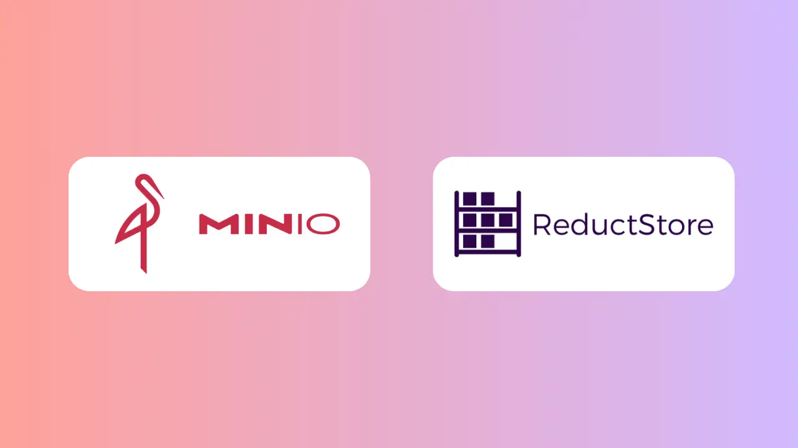
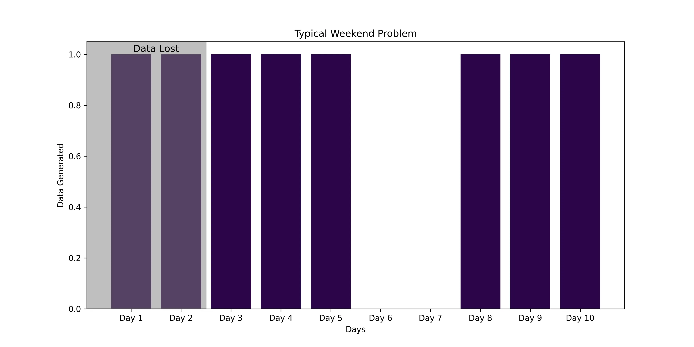

The amount of data generated world-wide is expanding exponentially, and will only increase further in coming years. In fact, over [**90% of the data worldwide has been generated in the last two years**](https://explodingtopics.com/blog/data-generated-per-day), and [**40% of data in 2020**](https://spacelift.io/blog/how-much-data-is-generated-every-day) was generated by machines. Not to mention that [**80 to 90 percent of data is unstructured**](https://www.cio.com/article/220347/ai-unleashes-the-power-of-unstructured-data.html). Not only is timely processing of said data ever more important, the data itself is often time-stamped and must be handled in a time-based structure. Due to the rise of AI/ML, Robotics, IoT, and edge-computing, solutions that can efficiently leverage much cheaper and plentiful unstructured object/blob storage while maintaining the ability to organize, read, and transmit time-series based data from multiple sources and in multiple formats are in great demand. ReductStore and MinIO are two solutions designed to meet this demand.

{/* truncate */}

Both solutions are designed to efficiently handle unstructured data at scale, and are lightweight, performant, and scalable data storage solutions which support both on-premise and cloud deployments. However, while MinIO is performant, and scalable, with features such as erasure coding, bit-rot protection, and high throughput, it is not designed for complex data relationships or transactions. It is also not optimized for handling unstructured time-series data at scale. ReductStore, on the other hand, is purpose built for unstructured time-series data. Let's take a closer look at how ReductStore's handling of such data differs:

## Handling Time-Series Data at Scale

Traditionally, specialized databases designed to quickly ingest and process structured, time-stamped data in a well-defined format and structure for efficient query and analysis have handled time-series based data. Object storage, on the other hand, typically eschews structured format in favor of scalability and redundancy, and lacks the specialized querying capabilities for time series analysis.

This is a problem, because machine sourced data is often delivered with time-based metadata that cannot be fully leveraged in a typical data lake scenario, and often at a scale that can no longer be handled by a traditional time-series database solution. This often leads to complex hybrid solutions requiring ELT-ETL pipelines, or carefully optimized batch processing. MinIO offers a number of integrations and APIs designed to create such hybrid solutions. In this way, MinIO may be able to provide similar functionality to ReductStore, but cannot deliver it in a simple configuration - and likely not to the performance levels delivered by us. More on this later.

ReductStore is purpose-built for unstructured time series data, effectively handling and storing large scale unstructured and time-stamped data. Composed of buckets, entries, blocks, and records, our system leverages configurable attributes, such as maximum block size, maximum record count per block, and quota types to govern storage restrictions. This adaptability is key to ensuring we can leverage vast amounts of `blob` data efficiently.

### Trust Rust

Our solution, originally built in C++, was converted fully to Rust approximately 2 years ago, as Rust offered numerous benefits, not only in the development of our project, but in the handling of time series data. From the development perspective, Rust significantly reduced bugs related to memory management, move semantics, and threading. It also improved compatibility, allowing our solution to be more easily ported to Windows and MacOS. Rust also had better dependency management via Cargo.

We recently doubled-down on our Rust investment by [**converting our CLI for similar reasons**](/blog/news/reduct-cli-in-rust). Rust allowed us to build compact and highly efficient executable binaries for popular platforms.

### How We Do It

In ReductStore, data ingestion can be based on either ReductStore SDKs, or the HTTP API. Records are sent as binary objects in the body of the POST request, and contain the following information:

- Bucket name
- Entry name
- Timestamp

In addition to the above, optional values can be added, including:

- Labels as key-value pairs which can be used for annotating and querying data
- Content type which can be used for data interpretation

You can choose to stream data for large records, or batch them for smaller. If streaming is selected, they are continuously fed into a file system in chunks, ensuring efficient ingestion, and reducing the memory footprint of the server. Small records can optionally be ingested using a batch ingestion mode, further reducing HTTP overhead. Such an ingestion solution can be tailored to any time series data - computer vision data (LLTV cameras, robotics), real time shipping gps information, vibration data, and more.

Data can be queried via the ReductStore CLI, SDKs, or HTTP API. Queries are divided into [**filter and control parameters**](/docs/guides/data-querying). Multiple filter and control parameters can be configured for more complex queries, to tailor queries for your specific needs. Your queries can be configured to retrieve records with specific filters and controls, or from a specified time range, rather than pulling the entire data set. ReductStore also allows you to batch data before reading (and before writing), which is more efficient than reading each object/record individually (especially for small records).

Another way our MinIO alternative differs is data retention policy. This is often an important distinction for edge computing scenarios. Database retention policies are typically based on time periods.This can be problematic, particularly on IoT edge devices with limited storage capacity. For example, if a system that retains data for 7 or eight days, goes offline, it might only store data for a portion of that time frame before overwriting. If offline for a significant period of time, entire datasets could be erased upon restart, losing valuable diagnostic information. To prevent this type of issue, ReductStore simplifies historical data management with a volume-based retention policy, ensuring critical historical data is preserved, regardless of down-time.

ReductStore also leverages real-time FIFO (First In, First Out) quotas for efficient management of data volumes. This ensures that it is always the oldest data that is removed to make room for current data, once storage thresholds are met. This feature is critical in edge environments, in particular IoT, where storage is at a premium. Anywhere high speed data streams are produced, storage can quickly reach capacity. Simplified management of retention policies saves considerable time and effort, while still ensuring the latest data is always available.

Each of the features above help to ensure that when dealing with time series data, in a ReductStore vs MinIO contest, ReductStore comes out on top!

### Native Performance Benchmarks

Now that we've looked at the how, let's see the results! In recent performance tests conducted, comparing MinIO vs ReductStore head-to-head for performance when handling time series blob storage data, ReductStore consistently out-performed MinIO.

For our head to head matchup, we first set MinIO with two functions: one to write and the other to read `BLOB_COUNT` blobs of `BLOB_SIZE`. Because MinIO does not currently have an API for pattern-based queries, it has to query the entire database to find a particular object. So when ReductStore is configured to handle the same data, with the capacity to filter for particular parameters, and to batch data for faster ingestion, we saw [**performance gains up to 1629% for write operations, and over 8000% for read operations**](/blog/comparisons/computer-vision/iot/performance-comparison-reductstore-vs-minio#results) at small blob sizes (1KB). Consistently better performance was seen (though with smaller margins) at larger blob sizes, culminating with a test of a 1MB blob size. Even at this blob size, Reductstore performed 936% faster for write operations, and 291% faster for read operations. These results were achieved with no optimizations to basic functionality.

| Blob Size | Operation | Minio, blob/s | ReductStore, blob/s | ReducStore, % |
| --------- | --------- | ------------- | ------------------- | ------------- |
| 1 KB      | Write     | 614           | 9256                | 1400 %        |
|           | Read      | 724           | 60159               | 8310 %        |
| 10 KB     | Write     | 570           | 9290                | 1629 %        |
|           | Read      | 632           | 38996               | 6170 %        |
| 100 KB    | Write     | 422           | 5434                | 1288 %        |
|           | Read      | 690           | 10703               | 1552 %        |
| 1 MB      | Write     | 104           | 975                 | 936 %         |
|           | Read      | 474           | 1380                | 291 %         |

It is worth noting that with partnerships and combined solutions MinIO might very well be able to compete with these results. However, such solutions would require significant development and testing, without the guarantee of similar results. There may be situations in which MinIO performs as well or better, particularly with partner-assisted solutions. However, in its native form, and for time-series or pattern-based data, there is no question which solution comes out on top.

## Where We Excel

From the above performance results, it is clear that ReductStore outperforms MinIO for applications requiring frequent and intensive read/write operations, particularly at scale. Native features such as FIFO quotas and batch ingestion ensure efficient use of system resources, with the flexibility to handle different time series data storage scenarios.

### Edge Computing and IoT

Our MinIO alternative is a particularly strong choice for edge computing solutions in which storage is at a premium. Not to mention that these edge locations are often handling high volume IoT data (ie well head data for oil and gas, computer vision, vibrational data from sensors, gps data from a fleet of ships at sea, or any number of other sources). The ability to batch such data, and to provide flexible retention policies, such as volume-based retention, ensures that critical data is not lost, and that intermittent connectivity is less an issue.

### Real-time Data Analytics

For real-time data analytics, time is of the essence. The data must be delivered in a short time, handled based on the time received, and/or the time-stamp upon the data, and processed as quickly as possible. For this to occur, the solution selected must be optimized for such data, and require a minimum of fuss to set up. The more complex the data pipeline configuration, the more chances it will break, and the harder it is to diagnose. ReductStore makes handling time-series data simple and easy, without sacrificing performance.

### Robotics

Another key area where ReductStore excels is robotics. Robotics generates all sorts of machine data, of varying size and complexity. This includes sensor readings, video data, logs, AI/ML outputs, and more. The ability to store such data in a central repository despite the varying types of data, and to process and handle it in real-time, is a key requirement. ReductStore’s unique features and native capacity to handle real-time streaming of complex time-series data of varying sizes and formats makes it ideal for your robotics applications.

The above examples are only some of the many potential use cases for ReductStore. If you need high performance time-series data processing and storage, ReductStore is worth more than a second look.

---

Thanks for reading, I hope this article will help you choose the right storage strategy for your vibration data.
If you have any questions or comments, feel free to use the [**ReductStore Community Forum**](https://community.reduct.store).
