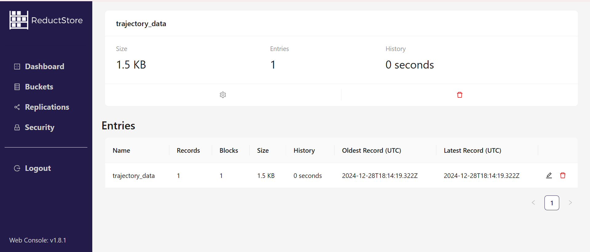

Robots generate massive amounts of data that must be managed effectively. Challenges like limited on-device storage, the need for real-time processing, and high cloud storage costs make it essential to find efficient solutions. Balancing edge and cloud storage while keeping data synchronized is a key part of effective management.

This article begins by outlining these challenges and offering practical strategies, such as using time-series databases and implementing retention policies. We will then introduce [**ReductStore**](/), a specialized database designed to meet the unique needs of robotic systems. With features like real-time ingestion, efficient querying with batching, smart retention policies, and edge-to-cloud replication, _ReductStore offers a cost-effective and high-performance solution for storing and managing robotic data._

We’ll also explore a hand-on example where we’ll show how you can set up ReductStore and use it for storing and managing data. Finally, we will compare ReductStore with MongoDB, explaining why ReductStore is the better choice for robotics. This comprehensive guide is designed to help engineers and developers overcome the challenges of robotic data management and optimize their systems.

{/* truncate */}

What we’ll cover:

- [**Challenges in Robotic Data Management**](#challenges-in-robotic-data-management)
- [**General Strategies for Managing Robotic Data**](#general-strategies-for-managing-robotic-data)
- [**ReductStore: A Purpose-Built Solution for Robotic Data**](#reductstore-a-purpose-built-solution-for-robotic-data)
- [**MongoDB vs. ReductStore for Robotics**](#mongodb-vs-reductstore-for-robotics)
- [**Hands-On Example: Storing and Handling Robotic Data in ReductStore**](#hands-on-example-storing-and-handling-robotic-data-in-reductstore)

## Challenges in Robotic Data Management

Robots often operate in dynamic and unpredictable environments and are continuously generating large amounts of data. Therefore, finding an efficient way to store and manage this data can at times be challenging, mainly due to the following factors:

- **High Frequency and Real-Time Requirements**: Robots often operate in real-time environments; for example, a drone navigating through a city must process camera and sensor data in milliseconds to avoid potential obstacles and stay on track. Data storage solutions must be able to manage these high-frequency streams and make them easily and quickly accessible in order to ensure fast analysis and good decision-making.
- **Limited On-Device Storage**: Most robots cannot store all the data they generate because they have limited edge storage capacity due to size, weight, and power limitations. That’s why it’s important for engineers to make effective data management strategies and ensure that important data is maintained without exceeding storage limits.
- **High Volume of Data**: An autonomous vehicle can produce up to [**5 terabytes of data every hour**](https://www.datacenterfrontier.com/connected-cars/article/11429212/rolling-zettabytes-quantifying-the-data-impact-of-connected-cars), including camera feeds, LiDAR scans, radar data, GPS logs, and sensor readings. Processing, storing, and managing such large datasets requires storage systems designed for scalability, which is something traditional relational databases often lack.
- **Cloud Storage Costs**: Sending all robotic data to the cloud is impractical and costly. Cloud services charge for storage and data transfer, and since robots generate many terabytes of data, the costs can grow quickly. Balancing what to store locally and what to offload to the cloud is an important part of cost-effective data management.
- **Reduction Challenges**: Implementing good reduction strategies can be tricky, as it requires balancing storage efficiency with maintaining important information. Without clear strategies, valuable data might be lost, or storage could fill up with unnecessary details.

## General Strategies for Managing Robotic Data

In order to have an effective data management system for handling robotic data, engineers must have a clear strategy and use various specialized tools. The key is to implement solutions that can handle high-frequency data streams while at the same time optimizing storage space and costs.

- **Time-Series Object Stores**: Time-series object stores, such as ReductStore, are designed to handle high-frequency, time-stamped unstructured data streams, which makes them ideal for managing robotic data. They offer efficient storage, real-time querying, and high-performance data writing, ensuring that robots can operate effectively while keeping costs manageable.
- **Balance Edge and Cloud Storage**: To optimize storage, keep critical data - such as the latest logs or details of high-priority events - on edge devices for immediate access, while moving less time-sensitive data to the cloud for long-term analysis and archiving. With such hybrid model, you can definitely reduce cloud storage, while also making sure that there will be a minimal delay when accessing decision-making data.
- **Implement Retention Policies**: Retention policies are automated rules for data lifecycle management, and they help manage storage by automatically deleting or archiving outdated or non-essential data. Robot's Edge devices are quite space-constrained, and often we just want to keep as much history as possible. The best retention policy in this case is a FIFO quota based on storage volume. For example, an entry with a 1TB FIFO quota would not delete older records until the quota was full.
- **Compress and Optimize Data**: Another way to reduce storage but still maintain usability is to compress large datasets, such as images or videos. Advanced compression formats like H.265 for video and JPEG for images allow robotics teams to save loads of storage space.
- **Prioritize Data Relevance**: Not all robotic data holds the same value, so it’s important for engineers to know how to make the distinction between what’s considered critical data and should be kept, and what data is not important and can be discarded.

## ReductStore: A Purpose-Built Solution for Robotic Data

In this section, we’ll get into more detail about what ReductStore actually is and why it is such a good solution when it comes to storing and managing high volumes of robotic data.

### Key Features and Benefits

ReductStore is a high-performance, time-series database specifically designed to handle the complex data needs of robotics systems and the challenges that we’ve discussed about in the previous sections. It is designed to handle unstructured data and is optimized for real-time data ingestion, allowing it to process high-frequency sensor readings and large data streams generated by autonomous vehicles, drones, industrial robots, and more.

### Cost-Efficiency

ReductStore can actually achieve 10-100x better performance for 1/10th of the cost compared to traditional time-series object stores when working with records of around 100KB. But how exactly does it do it? Well, firstly, it can integrate with blob storages like _Azure Blob Storage_ or _Google Cloud Storage_ with a _Fuse driver_. In the example below, we’ll be using Azure Blob Storage.

- **Azure Blob Storage**: A scalable object storage service optimized for large amounts of unstructured data.
- **BlobFuse**: An open-source virtual file system driver for Azure Blob Storage.

ReductStore leverages Azure's storage tiers and stores infrequently accessed data in lower-cost tiers like Cool or Cold, and it also utilizes a _pay-as-you-go model_. Moreover, while traditional databases require high IOPS (Input/Output Operations per Second) and often rely on expensive storage options like SSDs to maintain performance, ReductStore, with BlobFuse, stores data directly in Blob Storage, eliminating the need for redundant high-cost storage setups. BlobFuse allows ReductStore to treat blob storage like a local file system, meaning that data can be quickly accessed without having duplicate data in other layers like caches or local databases. Plus, unlike traditional databases, _Blob Storage can scale virtually infinitely_. ReductStore takes advantage of this scalability without additional costs for maintaining database indexes or clusters.

When it comes to data replication, ReductStore allows _replication at the bucket level_, not the entire dataset, meaning we may only replicate high-priority sensor data or logs while leaving unimportant data untouched. This minimizes storage and network costs compared to traditional databases that replicate entire datasets. In addition, _ReductStore replicates data incrementally_, which ensures that only changes or new data will be replicated and in this way avoids extra costs for potential duplicate files. Additionally, ReductStore supports storing _summary metrics as labels_ alongside each record. These labels act as metadata, making it easier to filter important records and design efficient replication strategies for selectively replicating only the most critical data to the cloud.

### Query Language and Batching Capabilities

ReductStore uses a flexible and powerful [**query language that is based on JSON syntax**](/docs/next/conditional-query#query-syntax) and is optimized for robotics data. The query language allows for real-time and historical analysis of data, as well as powerful filtering, aggregation, and joining of datasets. For robotics applications, where performance and precision are critical, the ability to run complex queries in real-time is essential.

The query language also supports time-series operations, which allow engineers to analyze sensor data over specified time windows. For example, you can query for vibration data from a specific robot within a defined timeframe or compare sensor data from different robots in parallel.

Additionally, ReductStore provides APIs and SDKs for integration with popular programming languages, making it easy to interface with robotic systems and third-party software applications. Whether you're working in _Python, C++, JavaScript_, or _Rust_, ReductStore ensures that you can access and manipulate data with minimal overhead.

ReductStore optimizes data retrieval through _batching_, allowing multiple records to be grouped into a single query based on a time range. This reduces the number of requests, improving performance and reducing delays. Queries are processed iteratively, returning batches of records per iteration, which is beneficial for managing large datasets. For more details, visit the [**official guide on data querying**](/docs/guides/data-querying).

### Replication Strategies and Edge-To-Cloud Syncing


In this example, there are a couple of industrial robots that produce a large amount of data which then gets ingested by Kafka and then distributed to a local storage on the edge. This is where the replication comes into play - in order to optimize costs, only a part of the data that’s stored locally is actually going to be stored on the cloud. For example, if we ingest and store sensor data every second, only 1 in 10 seconds are actually going to be stored on the cloud, as well as some common metrics which may be useful for analysis later on. Due to the fact that we can create custom policies for the replication strategy, ReductStore offers a great solution to the edge-to-cloud syncing problem and shows that it is possible to have great performance while still significantly cutting on costs.

### Retention Strategies

As mentioned in the previous section, implementing effective retention policies is crucial for ensuring that the local storage doesn’t fill up and lead to potential bottlenecks, but we also must make sure that all the data that we need quick access to is actually stored at the edge.

[**ReductStore implements volume-based retention policies**](/docs/guides/buckets#quota-type) that follow the _FIFO_ (first-In, First-Out) principle. That means that old data will be deleted only when the storage is at full capacity in order for new data to be stored. These retention policies are customizable and can be adjusted separately for each data bucket.

This is different from how most of the other databases are handling retention – they’re implementing them based on _time periods_. This can be problematic because even if the system was not working for some time due to an outage or any other problem and the storage is not filled up, the database will delete data that it mustn’t have deleted, only because the predefined timeframe has passed.

### Example Applications

- **Autonomous Vehicles**: Autonomous vehicles generate massive amounts of sensor data that need to be processed and analyzed in real-time. ReductStore’s ability to handle time-series data and support high-throughput ingestion makes it an excellent solution for managing this data.
- **Industrial Robots**: In manufacturing, robots rely on real-time sensor data to adjust operations and monitor performance. ReductStore is ideal for storing and analyzing diagnostic data, enabling predictive maintenance and continuous optimization.
- **Drones and UAVs**: Drones often operate in remote areas with limited connectivity. ReductStore’s offline data synchronization and edge storage capabilities allow for reliable operation, even in environments with poor network coverage.

## MongoDB vs. ReductStore for Robotics

MongoDB and ReductStore are both robust databases, but they are built for different purposes. ReductStore is great at handling high-speed time-series data, making it perfect for storing unstructured “blob” data. It uses buckets to organize data by time, which helps with fast real-time processing. MongoDB, on the other hand, is a flexible database for semi-structured data, but it struggles with big files unless you use GridFS, which can slow things down.

With features like batch querying, smart edge-to-cloud syncing, and simple retention policies to avoid storage issues, ReductStore is a perfect solution for robotics applications, where data is processed locally and only important pieces are sent to the cloud. MongoDB has good features like replication and time-based data deletion, but it’s not as well-suited for these specific needs. Moreover, in performance tests, ReductStore was up to 900% faster for writing data and 2300% faster for reading compared to MongoDB.

For a deeper analysis, explore the full comparison here: [**MongoDB vs ReductStore: Choosing the Right Database for Robotics Applications**](/blog/robotics-mongodb-vs-reductstore).

## Hands-On Example: Storing and Handling Robotic Data in ReductStore

In this section, we’ll walk through a practical example of how to store and handle robotic data using ReductStore. ReductStore is very efficient for storing “episodes” - for example, 10-second raw data with all the logs generated by robots that would be around 100KB. For simplicity reasons, we’ll show how to store trajectory data, but in reality, engineers will most probably work with bigger and more diverse data.

For this example, we’ll use Python, so make sure you have _Python 3.8+_ installed in your environment.

### Setting Up ReductStore

We’ll start by using Docker to set up ReductStore in a containerized environment. Docker ensures that our setup is isolated, reproducible, and easy to manage. To get started, create a folder on your system, and inside of it, create a _docker-compose.yaml_ file with the necessary configuration to run ReductStore:

```yaml
version: "3.8"

services:
  reductstore:
    image: reduct/store:latest
    ports:
      - "8383:8383"
    volumes:
      - data:/data
    environment:
      - RS_API_TOKEN=my-token

volumes:
  data:
    driver: local
```

Then, to start the ReductStore container, simply run:

```bash
docker compose up -d
```

This command will pull the latest ReductStore image and start the container. Once the container is up, ReductStore will be available on port http://127.0.01:8383 and can be accessed by your robotic system.

You can check the status of your container by running:

```bash
docker ps
```

One last thing you need to do before we begin is make sure you have the necessary libraries installed by running:

```bash
pip install reduct-py numpy
```

### Store and Manage Data

Now that ReductStore is running and we have everything that we need installed, let's look at how we can store robotic data. In our example, we’ll work with trajectory data like coordinates, speed, and orientation.

#### Create (or Get) a Bucket

Let us first create a new bucket for storing the robot trajectory data named _trajectory_data_.

```python
async def create_trajectory_bucket():
	async with Client("http://localhost:8383", api_token="my-token") as client:
    	settings = BucketSettings(
        	quota_type=QuotaType.FIFO,
        	quota_size=1000_000_000,
    	)
    	await client.create_bucket("trajectory_data", settings, exist_ok=True)
```

The quota type of this bucket will be FIFO and its size will be 1 GB. In case we don’t define this as a setting, the bucket will be created with a default quota type of _NONE_.

#### Generate Trajectory Data

Now, let’s create a _generate_trajectory_data_ function that simulates the generation of trajectory data points for a robot moving in a 2D space.

```python
async def generate_trajectory_data(frequency: int = 10, duration: int = 1):
	interval = 1 / frequency
	start_time = datetime.now()

	for i in range(frequency * duration):
    	time_step = i * interval
    	x = np.sin(2 * np.pi * time_step) + 0.2 * np.random.randn()
    	y = np.cos(2 * np.pi * time_step) + 0.2 * np.random.randn()
    	yaw = np.degrees(np.arctan2(y, x)) + np.random.uniform(-5, 5)
    	speed = abs(np.sin(2 * np.pi * time_step)) + 0.1 * np.random.randn()
    	timestamp = start_time + timedelta(seconds=time_step)

    	yield {
        	"timestamp": timestamp.isoformat(),
        	"position": {"x": round(x, 2), "y": round(y, 2)},
        	"orientation": {"yaw": round(yaw, 2)},
        	"speed": round(speed, 2),
    	}
    	await asyncio.sleep(interval)
```

The frequency is the number of data points generated per second (default is 10 Hz), while the duration is the total time, in seconds, for which the data generation will run (the default is 1 second). _X_ and _y_ are the coordinates and they dictate the position of the robot, _yaw_ is its orientation, _speed_ is its approximate speed based on position changes, while _timestamp_ is the current timestamp for the current data point.

#### Calculate Metrics

Now, we would like to calculate some important metrics that can be useful for further analysis of our robots. In this example, we will calculate the average speed and total distance of the robot by analyzing the data that we generated in the previous section:

```python
def calculate_trajectory_metrics(trajectory: list) -> tuple:
	positions = np.array([[point["position"]["x"], point["position"]["y"]] for point in trajectory])
	speeds = np.array([point["speed"] for point in trajectory])

	deltas = np.diff(positions, axis=0)
	distances = np.sqrt(np.sum(deltas**2, axis=1))
	total_distance = np.sum(distances)

	average_speed = np.mean(speeds)

	return total_distance, average_speed
```

#### Storing data in ReductStore

```python
async def store_trajectory_data():
	trajectory_data = []
	async for data_point in generate_trajectory_data(frequency=10, duration=1):
    	trajectory_data.append(data_point)

	total_distance, average_speed = calculate_trajectory_metrics(trajectory_data)

	labels = {
    	"total_distance": total_distance,
    	"average_speed": average_speed
	}

	packed_data = pack_trajectory_data(trajectory_data)

	timestamp = datetime.now()

	async with Client("http://localhost:8383", api_token="my-token") as client:
    	bucket = await client.get_bucket("trajectory_data")
    	await bucket.write("trajectory_data", packed_data, timestamp, labels=labels)


def pack_trajectory_data(trajectory: list) -> bytes:
	"""Pack trajectory data json format"""
	return json.dumps(trajectory).encode("utf-8")
```

In the _store_trajectory_data_ function, we’re making use of the functions we previously created to generate the data and calculate the metrics. Then, we need to somehow pack the data, therefore we create the _pack_trajectory_data_ function where, as an example, we convert the trajectory list output to a json dump. Next step is to store that data in the bucket we have already created. The fact that we’re calling the functions for generating the data and calculating the metrics inside of the _store_trajectory_data_ function is due to simplicity reasons, but in general, these functions should be called from the outside and then simply fed to this function.

Now, if we take a look at the **Buckets** section in ReductStore, we’ll see that our bucket now has data inside.



#### Retrieving Data

The next step would be to retrieve the data we just stored queried by a specific label. Here’s the query:

```python
async def query_by_label(bucket_name, entry_name, label_key, label_value):
	async with Client("http://localhost:8383", api_token="my-token") as client:
    	try:
        	bucket = await client.get_bucket(bucket_name)

        	async for record in bucket.query(
            	entry_name,
            	when={
                	label_key: {"$gt": label_value}
            	},
        	):
            	print(record)

    	except Exception as e:
        	print(f"Error querying data by label: {e}")
        	return None
```

Note that in order to get all records with no filtering at all, you just have to remove the _‘when’_ condition.

#### Running Everything

This is our main function in which we’re calling the functions for creating the bucket, storing the trajectory data (which inside includes functions for generating the data and its labels), and retrieving records filtered by a specific label.

```python
async def main():
	await create_trajectory_bucket()
	await store_trajectory_data()
	label_query_result = await query_by_label("trajectory_data", "trajectory_data", "&total_distance", HIGH_DISTANCE)
	if label_query_result:
    	print(f"Data queried by label: {label_query_result}")

asyncio.run(main())
```

## Conclusion

Managing robotic data doesn't have to be complicated. With the right tools and strategies, you can handle large amounts of data efficiently while keeping costs low. ReductStore offers a practical solution that meets the unique needs of robotics systems, from real-time processing to smart storage management. By implementing these approaches, robotics teams can focus less on data management and more on building better robots.

Ready to improve your robotic data management? Try ReductStore today at [**reduct.store**](/) or check out our [**documentation**](/docs/how-does-it-work) to get started.

Thanks for reading.
If you have any questions or comments, feel free to use the [**ReductStore Community Forum**](https://community.reduct.store).
