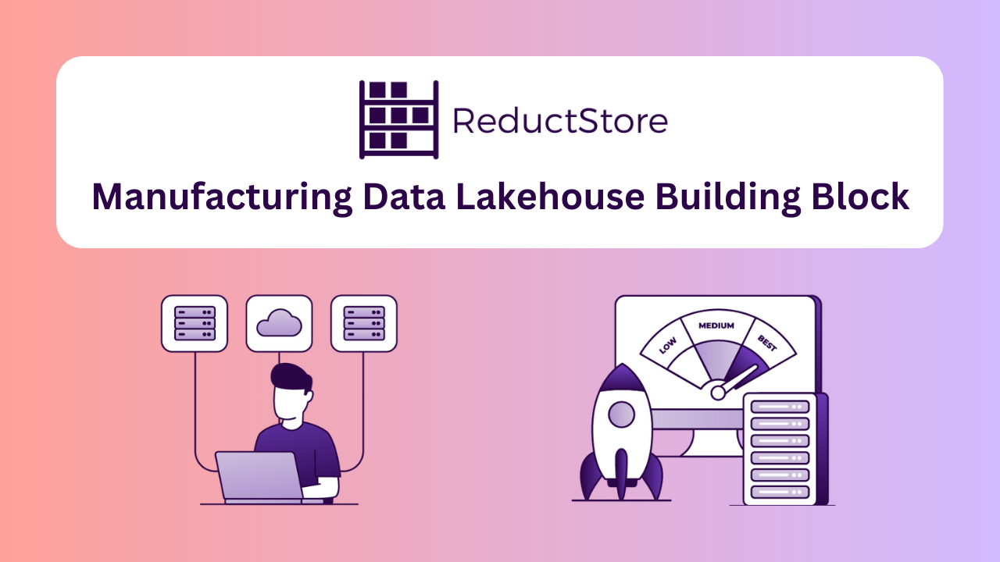

import PerformanceComparison from "@site/src/components/tables/PerformanceComparison";

In today's data landscape, flexibility in terms of performance, cost, and storage availability is at a premium. Data warehouses provide structured, analytical capabilities to process large amounts of data. Data lakes, on the other hand, are known for scalability, and the flexibility to handle vast amounts of unstructured data.

In recent years, however, demand has grown for a robust marriage of these two concepts, leveraging cloud-based technologies and advanced data processing frameworks to store massive volumes of data in raw form (data lake), while also supporting structured querying and analytics (data warehouse). This combined data solution is referred to as a data lakehouse.

The data lakehouse concept is particularly useful for manufacturing, as manufacturing requires fast processing of large amounts of data from numerous sources, including sensors (vibration, temperature, power), employee productivity data (files, spreadsheets, documents), logs, cameras, GPS, and more, creating an unstructured jumble of formats that is difficult to process in a traditional data warehouse.

A data lakehouse is an IT infrastructure that provides a unified solution to handle multiple data formats while still providing the capacity to make sense of this data. It supports intelligent query-based analytics and applies structure to the chaos.

At the same time, [**ReductStore**] is a special type of data storage solution that combines the flexibility of a time series database with the capacity of an object storage. In this article, we will explain these strengths in detail and why we think ReductStore has many advantages as a building block to create a data lakehouse for manufacturing.

In order to present these strengths, we will tie our case to the core components of a strong data lakehouse solution.

{/* truncate */}

## Storage Layer

The first key component of a strong data lakehouse solution is unified storage - and a lot of it. As one might guess from the term lakehouse, a deep and vast reservoir is required to house the data. In most situations, this will be cloud storage, such as AWS S3, Azure Blob storage or Google Cloud. In order to store large volumes of raw, unstructured, and semi-structured data more economically, [**ReductStore Cloud Solution**](/solutions/cloud) allows you to leverage and integrate this type of storage, including low cost Blob storage. As an example, Azure Blob storage can be obtained [**for approximately $20 USD per terabyte per month**](https://azure.microsoft.com/en-us/pricing/details/storage/blobs/), and combined with leveraging a FUSE driver ([like BlobFuse for Azure](https://learn.microsoft.com/en-us/azure/storage/blobs/blobfuse2-what-is)), cost-effective performance can be achieved that is ten times cheaper than traditional Time Series Databases (TSDBs) like TimescaleDB, and InfluxDB, with comparable or better performance for record sizes higher than 1kB.

When higher performance is required, such as for high compute data analytics, each of the top cloud storage vendors offer higher tier storage that is equally compatible with ReductStore, allowing you to tailor your storage solution according to use case. ReductStore optimizes performance no matter the tier of blob storage leveraged, and has the performance metrics to prove it, out-performing TimescaleDB, MongoDB and InfluxDB when handling time series unstructured data and high frequency sensor data such as vibration or acoustic data.

## Support for Schemas and Structured Data

Flexibility in storage type is not enough to make a data lakehouse function. You also need flexibility in data type. Both structured and unstructured data needs to be accessible and processable by your data lakehouse solution. Both traditional data lakes and data lakehouses implement a schema-on-read approach, allowing nearly any type of data to be stored without applying a schema to the data. Schemas are applied as necessary when the data is read, allowing for a single point of storage to be used for several use cases. Where lakehouses differ is their support for schema enforcement and transactional consistency, allowing them to handle structured data and unstructured, like a data warehouse.

Lakehouses, such as Databricks, Apache Hudi, or Apache Iceberg, can manage schema evolution, ACID transactions, and data versioning. ReductStore, on the other hand, is tailored and specialized for time-series objects and is not a data lakehouse, but it can be a key part of one, storing file streams, robot logs and vibration data at scale for manufacturing IT infrastructures.

When it comes to manufacturing, time-stamped data makes up a great portion of the data produced for and processed by the data lakehouse. There are several types of data that are part of the typical manufacturing industry:

- **Quality data** - product dimensions/measurements, defect rates, and deviations
- **Production data** - metrics on quantity, rate of production, and efficiency
- **Machine data** - sensor data (notably vibration monitoring), downtime, and operating conditions
- **Inventory data** - raw material levels, work-in-progress, finished product
- **Process data** - cycle times, changeover times, and labor input

What do all these types of data have in common? They all rely on accurate time-stamps, and are often reliant on sensor information, or camera information. While product dimensions or measurements might not require time-stamps, quality metrics such as defect rates and deviations do. Production rates, too, rely on accurate time-stamped data. Machine data on equipment status, downtime, and operating conditions relies on time-stamped sensor data, which can in turn be processed via AI/ML to define safe operating conditions and optimal performance. This is not possible without noting the time. In fact, in each of the above data types, time-series data is not only useful, but necessary. As is the capacity to process this amalgamated and often unstructured data from a multitude of sources in an efficient and timely manner.

ReductStore offers a number of features that makes it an ideal solution for time-series manufacturing data. Let us take vibrational data as an example. Vibrational data is often used in manufacturing, notably to monitor the condition of machines and equipment. It can also be used to monitor the structural integrity of pipes (for transporting fuel, coolant, or water) and large structures (large water reservoirs, silos, fuel tanks, etc.). Such sensors are often vital for ensuring safe operation and avoiding disasters such as oil spills.

In [**How to Store Vibration Sensor Data**](/blog/how-to-store-vibration-sensor-data), we provided guidance on how to handle vibrational data, and the key benefits realized by proper configuration of our solution. In this article, some of the key capabilities outlined include the ability to break up sensor data into pre-defined and manageable chunks (1 second samples), to define volume-based retention policies, automated data replication, and to pre-process and prioritize data, ensuring the most relevant and critical diagnostic data is kept current in the system, even if some raw data must be overwritten.

One of the key features that allows for this efficient management of data, particularly at edge locations where storage is at a premium, is our built-in, real-time, FIFO (first in, first out) quota system. At edge locations, this capacity ensures disk space remains optimized, and prevents shortages (due to space constraints) that could disrupt operations on edge devices.

Vibrational data for manufacturing can come from a number of machines, across numerous factory locations, and can take up a considerable amount of storage. The ability to determine the most recent data for analysis and automatically discard the oldest is vital for edge computing.

But it's not all about time. Priority plays a part too. When processing the large amounts of data generated by manufacturing sensors, it is important to be able to classify and organize the data. In ReductStore, each record can be associated with labels, easily leveraged by AI applications, containing key-value pairs and meta information. These can be used for both filtering and for replication, in order to deliver them as needed, whether for archiving or processing. Must-be-kept information can be prioritized for retention or redirected for processing according to these labels.

## Data Processing Layer

In discussing the features above, we've already discussed the first bit of the data processing layer - the ability to pre-process data on read based on labels and time. A data lakehouse needs to be able to handle data efficiently, delivering it where necessary, in the format required for its use case. For manufacturing, as implied above, this is often sensor data and IoT data from edge locations, used for AI/ML analysis.

ReductStore processes such data differently than other S3-based object storage solutions. Our solution relies heavily on time-based access. Each record is time-stamped, allowing for precise retrieval based on both the entry name and the time, which is essential for time-series applications that require efficient access to data over specific time intervals. This model is ideal for fast, time-based queries, making it ideal for real-time analytics, monitoring, and historical data analysis.

Because of our flat storage structure, using only buckets and entries with unique names, timestamps can be considered the common piece of metadata shared across ReductStore. This structure is particularly suited for time-series data, where the main focus is on the time aspect of the records rather than hierarchical relationships (see computer vision example below). Innate batching features help to optimize the ingestion and querying of large datasets by grouping records in HTTP requests, reducing network overhead and enabling faster write and retrieval operations, especially when querying data over time ranges.

We also leverage forward writing. By appending new records to the current file system block, we ensure that data is written as efficiently as possible in chronological order. We've already mentioned our FIFO quota system, which, of course, is a time-centric and simple to implement method of ensuring that current data is prioritized and retained, as well as our labeling feature which allows us to define other parameters for retention and processing. Combined, all of this makes ReductStore the most efficient solution for processing time series blob data.

## Data Querying and Analytics

Time-stamped records and labelling are the primary methods by which a data can be used for data querying and analytics, as intimated in earlier paragraphs. Lakehouse solutions usually offer additional query flexibility, particularly in terms of filtering by values and complex queries. ReductStore only offers significant advantages for time-series data queries. But, as we established, this covers a significant cross-section of manufacturing data.

Data stored in ReductStore can be queried by the ReductStore CLI, SDKs, or HTTP API. Parameters are the same across these interfaces, and divided into filter and control parameters.

### Filter Parameters

Filter parameters are used to select records based on a particular criteria. Multiple parameters can be applied for more complex queries. The primary parameters are based on time range, such as start and end date parameters. `When` parameters can be used to [**filter for records when a particular condition is met**](/docs/next/conditional-query). Other parameters can be used to define the number of records to retrieve, or to limit the number of records retrieved when downsampling.

### Control Parameters

Control parameters are for more complex queries, allowing you to control the behavior of queries. For example, `TTL`, or time to live, sets a time interval for a particular query. The query is automatically closed at the end of the defined `TTL`. You can also keep queries open indefinitely by using the `continuous` parameter. Another example is `head`, which tells the system to only retrieve the metadata for a dataset.

While these parameters may not provide everything needed for more complex queries for specific use cases, they are efficient and powerful for time-series data.

## ReductStore Performance

But how do these differences translate into performance metrics? Quite well, it turns out. In [**head to head tests of time-series based data against competitors such as MinIO**](/blog/comparisons/computer-vision/iot/performance-comparison-reductstore-vs-minio), TimescaleDB, and MongoDB ReductStore left them in the dust. At record sizes of 1 MB, ReductStore proved much faster at read operations than all but MongoDB. However, with MongoDB, at 1MB, ReductStore beat MongoDB with write operations by 170%. At lower record sizes, ReductStore beat all listed competitors by ever increasing margins, save read operations at 1 KB for TimescaleDB. Again, for write operations, ReductStore came out on top in this matchup.

<PerformanceComparison />

It should be noted that these performance metrics are not only impressive, but also translate into real cost savings. When considering cloud storage costs, it is not only the volume of data transferred that must be considered. While most cloud platforms charge based on this metric, there are additional costs associated with the time it takes to transfer data, notably CPU time and resource usage. While an exact cost for such metrics is difficult to determine, we know that long data transfer times result not only in additional costs, but takes its toll on application performance as well. While waiting for data to trickle in, the system cannot perform other critical actions. For example, [**in our white paper**](/whitepaper), we saw write operations savings (per terabyte) of 31.8 hours for read operations compared to MongoDB, and 14.5 hours for write operations.

## Conclusion

While there are numerous building blocks for data lakehouses, we truly believe that ReductStore offers significant advantages in terms of performance for manufacturing time series data, storage flexibility (note that ReductStore can also be used on-premises, a topic not really touched on in the article, but which provides an additional element of flexibility), edge computing scenarios, and more. These advantages make ReductStore a strong candidate for any manufacturing use cases where time-stamped IoT and AI/ML data is collected and processed from sensors, especially when it comes from multiple edge locations. We are confident that our solution, which has already proven itself against significant competition, will prove to be a key component of modern data lakehouses in the manufacturing industry. Stay tuned for more test results as we continue to prove our solution against the best in the industry!

If you have any questions or comments, feel free to use the [**ReductStore Community Forum**](https://community.reduct.store).
