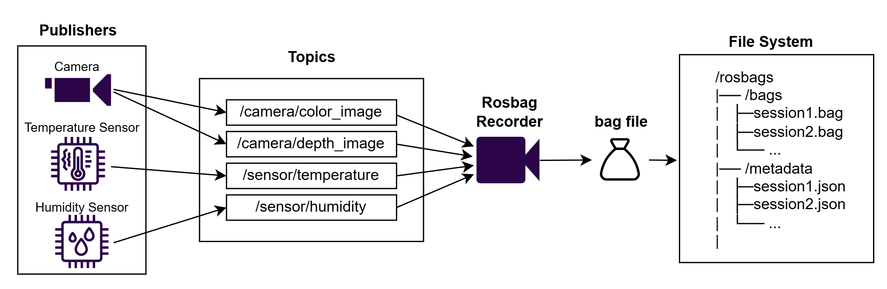
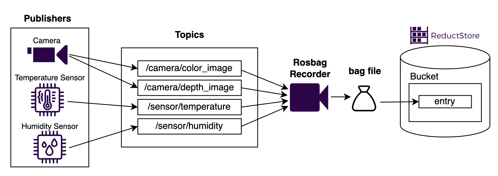
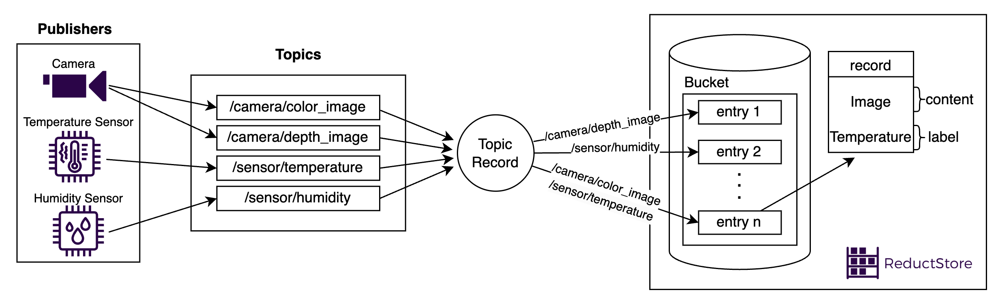

The **Robot Operating System (ROS)** is a powerful framework for developing and managing robotic systems. It simplifies integration, communication, and development through various tools and libraries. ROS is built around a communication system that uses a _publish-subscribe model_ to connect components, where some, like sensors or cameras, act as _publishers_, and others, like motors or processors, are _subscribers_. The data shared between these components is organized into _topics_.

To make the most of this data, especially when it's needed later for analysis, debugging, or sharing, it's crucial to store it efficiently. In this article, we'll dive into three methods for storing ROS topics, comparing their benefits and limitations to help you choose the best one for your needs. In case you need to gain a broader understanding of how to handle robotics data effectively, make sure to check out our [**article on storing and managing robotics data**](/blog/store-robotic-data) first.

{/* truncate */}

## Why Storing ROS Topics is Important

Storing ROS topics enables robotic engineers to better manage their data for various purposes, such as:

- **Post-Processing**: After collecting data, engineers can use the data to analyze the robot's behavior, performance, and decision-making in detail, helping identify patterns or issues. They can also use the analyzed information for algorithm optimizations or for training machine learning models.
- **Debugging**: When something goes wrong in a robot's operation, having a stored history of ROS topics can be useful for reviewing past data and pinpointing exactly when and where the problem occurred.
- **Reproducibility**: Storing topics makes it possible to recreate the same scenario over and over again, which is useful for troubleshooting or testing with different configurations.
- **Documentation**: Having the data that the robot produced stored somewhere can be useful for reporting, training, or improving systems based on previous results.

Each method of storing ROS topics has its strengths, so let’s dive into the three main approaches.

## Method 1: Store ROS Topics to File System Using Rosbag

**Rosbag** is the default and most commonly used tool in ROS for handling recorded data. It works by capturing the messages being published on ROS topics and saving them into a _.bag file_. Since rosbag supports recording multiple topics at once, it is a great tool for scenarios where you need to capture many different data streams, such as sensor readings, images, or even logs. However, in case you don’t need the data from all the topics that exist on the system, there is an option to record only a subset of them.

**Advantages**:

- **Easy to set up**: Rosbag is a built-in ROS tool, so no additional software installation is required.
- **Offline analysis**: There is no need to connect to the live robot in order to analyze the recorded data.

**Drawbacks**:

- **Limited scalability**: Since Rosbag is made for debugging but not for storing data continuously, managing and storing large Rosbag files can become very difficult as the amount of data grows.
- **No advanced filtering**: Rosbag doesn’t provide advanced tools for filtering or querying data efficiently.
- **No built-in User Interface**: Rosbag is a command line tool and as such, it has no built-in UI, meaning engineers have to interact with Rosbag through terminal commands.

[**The Bag Database**](https://github.com/swri-robotics/bag-database), an open-source tool, addresses the challenges of working with Rosbag files by offering a user-friendly, web-based user interface for managing bag files. This tool makes it easier to search for specific bags, download them, or run post-processing scripts. Additionally, the Bag Database provides a REST API, allowing engineers to automate tasks like indexing or organizing bag files.

## Method 2: Store Rosbag Data in Time-Series Object Storage

Another option is to store compressed Rosbag files in a _time-series object storage solution_ like [**ReductStore**](/). Time-series storage works really well for ROS data because it sorts and retrieves information by time, which fits naturally with how robots process and use data. This approach also lets you add helpful labels to the files, like AI labels, sensor types, or recording locations, making it easier to manage and access your data.

**Advantages**:

- **Advanced filtering**: Labels make it easier to search and filter large datasets based on specific criteria.
- **Scalable**: ReductStore can easily handle large amounts of data, making it suitable for long-term storage of robotics data.

**Drawbacks**:

- **Learning curve**: Engineers new to time-series storage may need some time to set up and learn how to use them effectively.
- **Costs**: Using cloud-based object storage can cost more than simply storing the files on your system.

## Method 3: Store Topics in Separate ReductStore Records for Granular Control

This method involves _storing each ROS topic as a separate record in ReductStore_, giving you great flexibility over how your data is managed. By grouping data by topic, you gain way better control over filtering, searching, and replicating the data. Each record can be configured with its own compression settings depending on the type of the data that’s being sent over that topic. Moreover, having specific metadata labels for each topic makes it easier to create useful and efficient queries.

This approach also makes it easier to replicate data to the cloud. For example, you can make a rule to replicate only the most important topics - such as camera data or specific events - while excluding less relevant information.

**Advantages**:

- **Better control over your data**: You can customize how each topic is stored, compressed, and labeled.
- **Conditional filtering and replication**: With the ability to filter records based on label, you can quickly find what you need. You can also have granular replication by replicating only the important topics to the cloud.

**Drawbacks**:

- **Requires careful management**: Storing topics as separate records means you'll need to plan ahead to keep track of the data and its metadata, ensuring everything stays well-organized and manageable.

**Examples**:

- **Vibration Data**: Vibration sensors generate a large volume of data, which can quickly become challenging to manage. To handle this efficiently, data is often chunked and stored as objects. Keeping these chunks in separate records makes filtering and analysis much easier, especially for tracking machinery or robots where vibration patterns reveal potential issues. For more tips on managing vibration sensor data, check out this [**blog article on storing vibration sensor data**](/blog/how-to-store-vibration-sensor-data).
- **LiDAR Data**: LiDAR data can be quite large, so applying compression is key to reducing storage needs. There are special compression formats designed specifically for LiDAR, which help shrink the size without losing the quality of the 3D point clouds. By storing LiDAR data as a separate record in ReductStore, you can apply these specialized compression techniques to that particular topic without affecting other types of data.
- **Logs and JSON Data**: Storing logs and JSON data in separate records allows you to organize and query them easily based on metadata labels. Logs may include useful details like timestamps, event types, or sensor statuses, while JSON is great for storing structured information. Keeping them as individual topics allows you to quickly filter and retrieve only the data you need, making analysis or debugging simpler.
- **Images**: Imagine that the robotic system has two separate topics, one for sharing image data, and the other for position data (like X, Y coordinates). Now, what you can do is sync these two topics by storing them together - in this scenario, the images would be the data itself, while the coordinates would be the labels of the record. This allows you to link the image to specific location data, enabling you to query images based on the robot’s position. For a step-by-step guide with code examples on how to store images in ROS using ReductStore, take a look at this [**blog article on storing images in ROS**](/blog/tutorials/ros/optimal-image-storage-solutions-for-ros-based-computer-vision).

## Best Practices for Storing ROS Topics

When choosing how to store ROS topics, consider the following:

- **Data Size and Scalability**: For large datasets like LiDAR or images, ReductStore's time-series storage is ideal. Simpler solutions like Rosbag are enough for smaller data, but become difficult to manage as the project grows.
- **Query and Filtering Needs**: Storing each topic separately in ReductStore allows you to query data based on labels, enabling you to retrieve only the specific data you need. So, in case you need more granular filtering of the data, the best option would be storing each topic in its own record.
- **Cost and Complexity**: Storing topics separately offers great flexibility, but it takes more planning and management. If you're on a budget, simpler solutions like Rosbag or storing entire bag files in a time-series storage like ReductStore can work well for smaller projects.

## Conclusion

In conclusion, there are various ways to store ROS data, each with its own set of advantages and disadvantages. Choosing the right storage method for your ROS topics depends on data size, query needs, and scalability. For larger datasets and advanced filtering, [**ReductStore**](/)'s time-series storage is a great fit. Smaller projects may find simpler options like Rosbag more suitable. Therefore, it's important to consider the specific requirement of your project and plan accordingly.

---

If you have any questions or comments, feel free to use the [**ReductStore Community Forum**](https://community.reduct.store).
