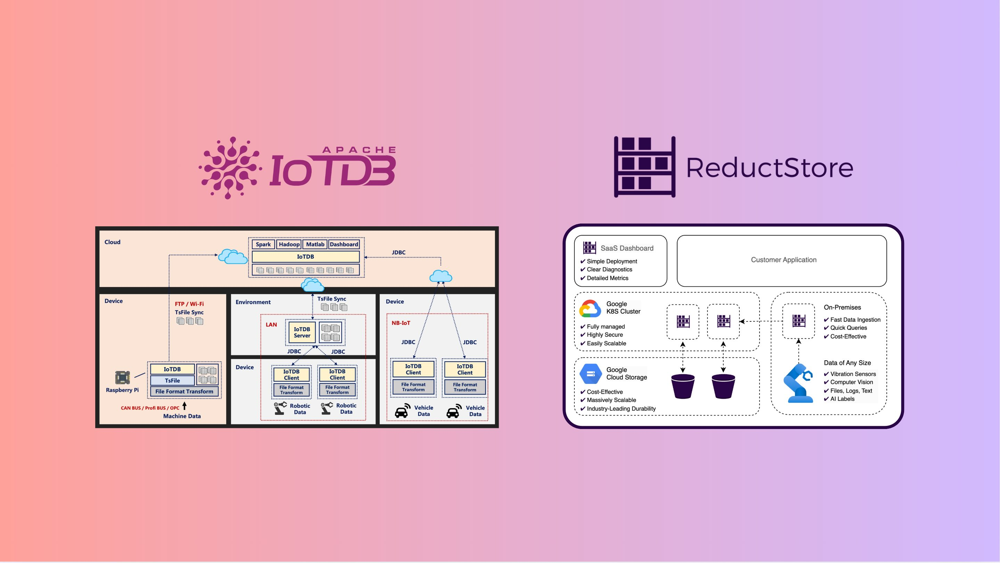
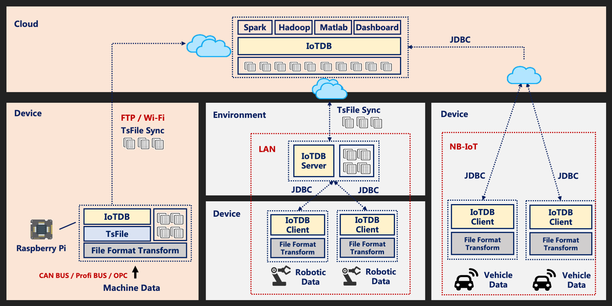
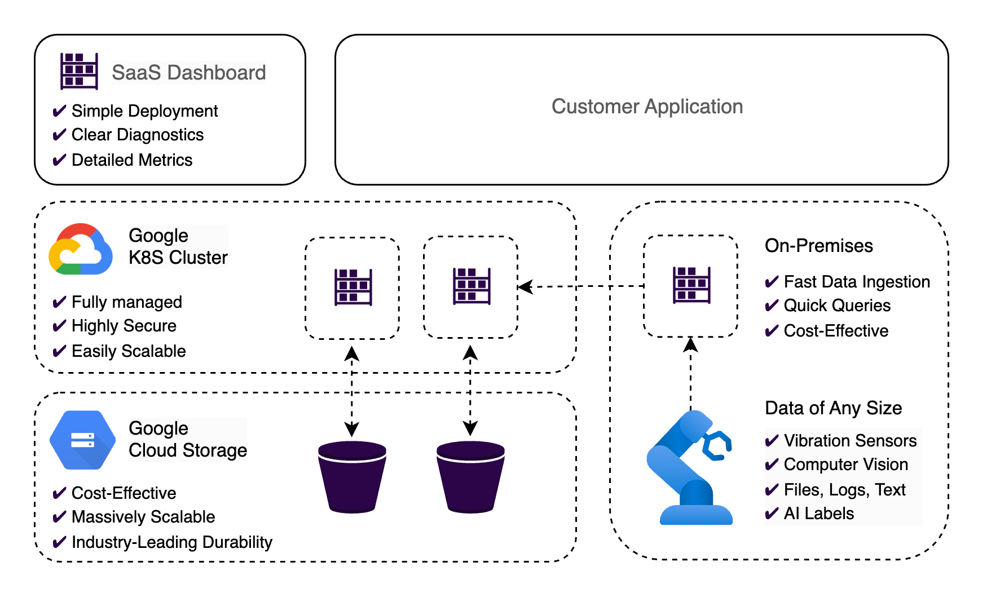

With the vastly growing amount of data produced world-wide, it is no surprise that there are an ever increasing number or methods and approaches to dealing with this influx. It is also no surprise that specialized solutions are developed for subsets of this data. Reductstore, as we've covered in numerous previous articles, is highly specialized in handling one such sub-set, time-series data. But it is not the only one. IoTDB is another such solution, and also very good at what it does. In this article, we will help you to understand the differences between the two, and where one can excel over the other.

{/* truncate */}

## Apache IoTDB

Apache IoTDB (Database for Internet of Things) is a flexible and light-weight database designed for IoT use cases. It offers lightning fast write speeds for small record sizes for large numbers of low-power and intelligently networked devices, in any number of sectors. It also supports lightning fast read access. As a result, it can ingest, organize and structure such data at scale, and ready it for analysis.

IoTDB uses a columnar structure, particularly effective for time-series data where the same sensor might produce a large number of readings across a period of time. Storing the data in columns rather than rows helps to minimizes storage costs and improves query performance. It also supports time-slice partitioning, allowing this structured data to be queried based on particular time periods (hourly, daily, weekly) providing increased efficiency, especially when dealing with vast amounts of data.

<small style={{ display: "block", marginTop: "-20px" }}>
  IoTDB Scenarios. Source: [IoTDB](https://iotdb.apache.org/)
</small>

IoTDB is highly optimized for structured, schema-based time-series data with pre-defined fields and hierarchies (e.g., devices, measurements, etc.). With their schema template function, they are uniquely suited to handle difficult to sort data of a similar nature from a large number of entities of the same type, where measurements and associated time-series data is remarkably similar and difficult to sort. In such cases, the metadata of time series data can consume alot of memory resources, and maintenance of the large number of time series records can become very complex. IoTDB's schema template allows similar entities to share metadata, reducing memory costs, and simplifies the management of the data from these similar entities. Along with strong integration with other Apache open-source projects like Kafka, Hadoop, Nifi and others, a strong ETL (or ELT) data pipeline can be configured for high-end data analysis of both structured and unstructured data. However, the abundance of Apache projects means that you will spend considerable time determining the best fit, learning the product, and integrating each piece of the solution. Considering that Apache projects are open-source and have strong community support, this is a trade-off many organizations are willing to make.Despite these strengths, IoTDB has some limitations when handling unstructured time-series data. Its schema-based model is less flexible for unstructured or semi-structured data types like logs, multimedia, or free-form text. While it is possible to store binary or text data in IoTDB, this is limited to 128 characters (according to max_string_length parameter). Storing text data can also lead to inefficiencies in storage utilization and retrieval performance, especially at scale.

## ReductStore and Unstructured Data

What about ReductStore then? Where does our solution fit in? Well, our solution is also designed to handle time-series data at scale, but is further specialized for unstructured time-series data. This makes it ideally suited for industrial IoT, in some ways more so than IoTDB. There is no question that IoTDB can handle a great deal of data from a number of IoT sources, but it excels in situations where there is minimal variance in data structure. In other words, it can process a large amount of data from a number of sources, but it excels where these sources are largely similar in structure. They do not have to have exactly the same structure, but the more common sets of data present, the better the performance, and the less configuration needed. As an example, ReductStore offers a number of distinct advantages for robotics and AI/ML applications, notably those using time-series data from numerous disparate sources, for example audio-visual data from cameras, gps, gyroscopic and vibrational data used to calibrate movement or navigation, particularly if stored in a single, centralized repository.

Where IoTDB excels in efficient storage and processing of continuous streams of similar IoT data, ReductStore offers similar benefits in situations where efficient storage of time series objects is a priority, notably edge locations, which is often where IoT data is generated. For example, with vibrational data (something IoTDB does also handle very well) it can be much more efficient to split the data into bite-size (pun somewhat intended) chunks, such as 1 second intervals, and store that information in a binary format. This ensures complete control over the format of the data (compression, etc). We can also set sample intervals to limit the amount of data to be stored (for example, storing ten seconds of every minute of vibrational data to limit the amount of data that must be stored or processed). With IoTDB, compression and columnar data do their part to minimize storage costs, but unnecessary data may be retained, leading to larger storage costs, or storage quotas filled early, resulting in data loss if available storage is leveraged early.

Such situations can be managed by careful configuration of policies and rigorous monitoring, but for simplicity, Reductstore's real-time FIFO (first in, first out) quota system based on storage volume is an elegant solution to ensuring that the most relevant and recent information is preserved. For example, a quota could be applied to high-frequency vibration sensor data from industrial machinery, which can generate large records, ensuring that disk space is optimally managed with minimal effort, preventing storage shortages that could disrupt operations on edge devices. Another key issue for edge locations is latency. For high latency environments, ReductStore offers batching capabilities, reducing latency overhead for data retrieval operations.

ReductStore treats the query process as an iterator, returning a batch of records each iteration. This approach is more efficient than time-slice based querying (such as that used by IoTDB) , particularly for unstructured storage at scale. This batching and iteration approach has proven highly efficient in performance tests conducted against solutions similar to IoTDB such as [**influxDB**](/blog/comparison/iot/reductstore-benchmark) and [**TimescaleDB**](/blog/comparisons/iot/reductstore-vs-timescaledb).

## Conclusion

While both IoTDB and ReductStore excel in handling time-series data, their areas of specialization make them suitable for different scenarios. IoTDB's strengths lie in its schema-based structure, efficient storage, and querying for structured time-series data, making it a solid choice for IoT ecosystems with homogeneous data sources. Its integration with other Apache projects also enhances its capabilities for comprehensive data pipelines, especially when already leveraging other Apache tools.

ReductStore, on the other hand, is designed to tackle the complexities of unstructured time-series data. It excels in environments with diverse data formats, high-latency edge devices, and scenarios where efficient storage and retrieval are critical. Its real-time FIFO quota system, batching capabilities, and iterative query processing make it an ideal solution for AI/ML applications, robotics, manufacturing (notably vibrational and other sensor data with large record sizes) and other domains requiring flexibility and high performance.

Choosing between the two ultimately depends on your specific use case. For structured IoT data, IoTDB provides an efficient and scalable option. For handling unstructured data in complex environments, ReductStore offers a tailored solution to meet those challenges head-on.

---

If you have any questions or comments, feel free to use the [**ReductStore Community Forum**](https://community.reduct.store).
