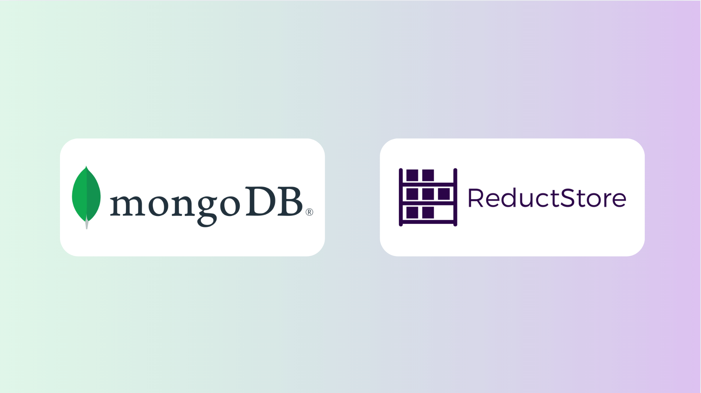

With the rapid expansion of data-driven applications, choosing the right database for your workload has never been more crucial. As data complexity increases, so do the number of specialized solutions. ReductStore, as we've covered before, is a powerful [**alternative for handling time series unstructured data**](/blog/comparisons/iot/reductstore-vs-mongodb), but it's not the only player in the space. MongoDB, one of the most widely used NoSQL databases, also offers an effective solution for managing large-scale data. However, each has their own key areas of strength. In this article, we'll break down the differences between ReductStore and MongoDB, and help you determine which is best suited for your needs.

{/* truncate */}

## Understanding MongoDB: The NoSQL Powerhouse

MongoDB is a document-based NoSQL database designed for flexibility and scalability. Unlike relational databases, it doesn't enforce a strict schema, making it ideal for applications where data structures may evolve over time.

One of MongoDB's biggest advantages is its JSON-like document model (BSON), which allows developers to store and retrieve complex, hierarchical data efficiently. Combined with horizontal scaling via sharding, MongoDB can handle massive datasets across multiple distributed nodes. This makes it a preferred choice for applications that demand real-time performance, fast read/write capabilities, and scalability.

### Key Features of MongoDB

- **Schema Flexibility**: MongoDB allows users to store data without a fixed schema, making it highly flexible for modern applications.
- **Indexing & Query Performance**: Allows the creation of powerful indexing options including single field, compound, multikey, geospatial, text and more.
- **Replication & High Availability**: Replicates data across multiple servers to ensure data redundancy and reliability.
- **Horizontal Scaling**: Data can be sharded across multiple servers for performance optimization.
- **Aggregation Framework**: Enables complex data transformations using MongoDB Query Language and SQL-style queries.
- **Built-in Load Balancing**: Ensures smooth performance even with high-volume transactions.

For applications that involve real-time analytics, dynamic content management, or large-scale web and mobile applications, MongoDB's high write throughput and indexing capabilities make it a strong choice. However, while MongoDB can manage time-series data, it's not inherently optimized for binary large objects (BLOBs). While this can be mitigated by GridFS, which can handle data files above 16MB, it is slower, and cannot [**optimize storage costs by storing blobs in a commodity cloud storage solution**](/solutions/cloud).

## ReductStore: The Specialist for Time Series Unstructured Data

Now that we've covered the basics of MongoDB, let's turn to [**ReductStore**](/). While MongoDB is highly versatile, ReductStore is built specifically for time series unstructured data, making it a stronger choice for industrial IoT, computer vision, and edge computing applications. Unlike MongoDB, which is better suited to storing documents, ReductStore stores time-ordered binary data in a lightweight, object-store-based structure. This makes it a natural fit for machine-generated data, including sensor readings, video feeds, or other large-scale unstructured datasets.

### Key Features of ReductStore

- **Optimized for Time-Series Data**: Purpose-built for handling time series unstructured data in a compact format.
- **High-Speed Data Ingestion**: Supports extremely fast write speeds for records larger than a few KB, making it ideal for data acquisition (DAQ) systems (e.g., vibration sensors, cameras, log files, etc.).
- **Real-Time FIFO Quota System**: Ensures storage is efficiently managed, preventing storage overflow on edge devices, while retaining the most recent and necessary data.
- **Batching & Low Latency**: Reduces network overhead for high-latency environments.
- **Efficient Storage Management**: When it comes to its [**cloud solution**](/solutions/cloud), ReductStore can leverages low cost blob storage to reduce costs and stores these large binary objects (BLOBs) in a scalable and efficient way.

One of ReductStore's key advantages is its real-time FIFO (First-In, First-Out) quota system based on storage volume, which ensures that older data is automatically replaced as needed. This makes it highly efficient for edge computing, where storage resources are often limited.

Another key feature is data replication between edge devices and the cloud (or across edge devices) using label-based filtering. Each data record can be labeled with key-value pairs (such as AI labels), allowing replication tasks to automatically select and transfer only the relevant data. This approach provides flexibility to optimize bandwidth and storage costs, or to ensure that critical data is always accessible.

In addition, ReductStore optimizes data retrieval and storage efficiency by adapting to different data sizes and network conditions. For large records, it supports chunked downloads to avoid overwhelming system memory. In high-latency environments or when handling many small records, its batching capabilities minimize overhead and ensure faster writes and retrievals. In addition, rather than relying on traditional query mechanisms, ReductStore uses an iterative approach to efficiently navigate and retrieve unstructured-time series data with minimal resource consumption.

## Key Differences: ReductStore vs. MongoDB

| **Feature**            | **MongoDB**                                                                 | **ReductStore**                                                                                 |
| ---------------------- | --------------------------------------------------------------------------- | ----------------------------------------------------------------------------------------------- |
| **Data Model**         | NoSQL Document Store (BSON)                                                 | Time-Series Object Storage                                                                      |
| **Best For**           | Scalable web applications                                                   | Fast data acquisition systems                                                                   |
| **Schema**             | Flexible, dynamic schema                                                    | Flat storage structure                                                                          |
| **Transport Protocol** | TCP                                                                         | HTTP/1, HTTP/2                                                                                  |
| **Query Language**     | MongoDB Query Language (MQL)                                                | Conditional Query Language                                                                      |
|                        |
| **Scalability**        | Horizontal scaling with sharding                                            | Optimized for edge computing and centralized cloud storage                                      |
| **Performance**        | High read/write throughput for document storage                             | High-speed ingestion and retrieval for large binary data                                        |
| **Ideal Use Cases**    | Real-time analytics, content management, mobile/web apps, and Generative AI | Industrial IoT, vibration / acoustic sensors, predictive maintenance, robotics, computer vision |

## Real-World Applications and Use Cases

### When to Use MongoDB

MongoDB is ideally suited for web and mobile applications requiring a dynamic schema, high speed queries, and distributed data storage. Other use cases include e-commerce platforms, which benefit from MongoDB's flexible schema and fast search capabilities, big data and analytics, where its aggregation framework allows it to optimally store and analyze structured or semi-structured data. It is also ideal for content management systems and generative AI where its JSON-like BSON language allows it to more efficiently retrieve user-generated content, blogs or media files, and to efficiently create new content of this type..

### When to Use ReductStore

ReductStore is an ideal solution for time series unstructured data from any source. Sources of such time series unstructured data include Industrial IoT, edge computing devices, manufacturing machine sensors or vibration sensors, computer vision, robotics, GPS, log files, and more.

If your use case involves large amounts of sensor data, especially those with large file sizes, ReductStore offers the best performance and storage efficiency. Since disk space is often at a premium in edge and cloud locations, FIFO quotas and cost-effective blob storage are additional benefits. And because ReductStore's performance metrics are so high, you need fewer disks or edge devices in parallel to ingest data at speed.

The ability to leverage cheaper blob storage in the cloud without taking a significant performance hit means that ReductStore offers the biggest bang for your buck. AI/ML applications is another area in which ReductStore excels. Learning models that rely on time-series data can greatly benefit from ReductStore's optimized ingestion and retrieval speeds.

Robotics is another potential use case, where video files, positional data, logs and sensor readings of various sizes need to be processed quickly. For larger file sizes, such as video and images, vibrational sensor data, or audio, ReductStore's read and write efficiency cannot be beat.

## Which One Should You Choose?

If you're looking for a general-purpose NoSQL database with flexibility, scalability, and strong query support, MongoDB is an excellent choice. It works well for applications that require structured yet schema-flexible data storage, such as e-commerce platforms, social media applications, and analytics dashboards.

However, if your application deals primarily with time series unstructured data, especially in an AI-driven environment, ReductStore offers a more specialized, high-performance solution. Its FIFO quota system, efficient batching, and low-latency retrieval make it ideal for managing large-scale sensor data, image processing, and robotics applications.

Ultimately, your choice will depend on the type of data you are working with and the performance requirements of your system. For flexible document storage, go with MongoDB. For efficient time series unstructured data storage, ReductStore is the better fit.

By understanding the strengths and limitations of both, you can make an informed decision and ensure your data management strategy aligns with your application's needs.

---

If you have any questions or comments, feel free to use the [**ReductStore Community Forum**](https://community.reduct.store/signup).
