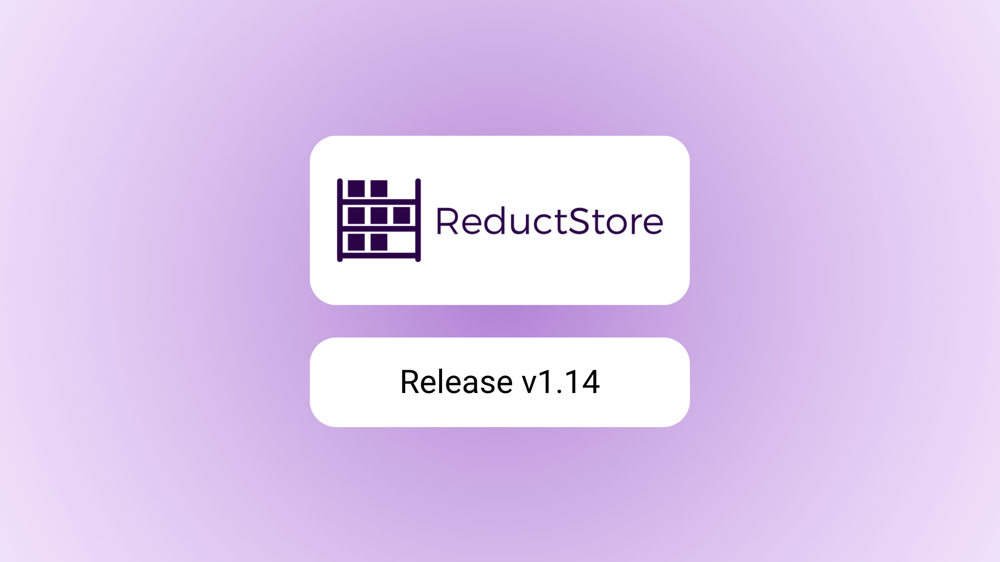
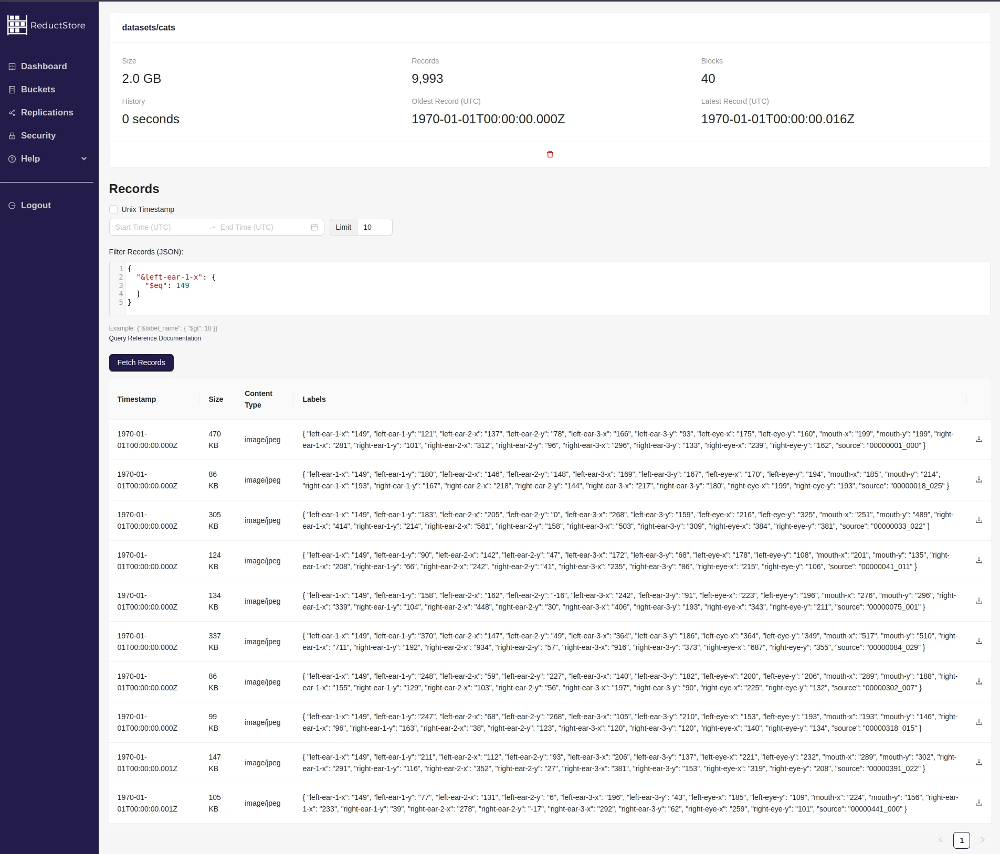

We are pleased to announce the release of the latest minor version of [**ReductStore**](/), [**1.14.0**](https://github.com/reductstore/reductstore/releases/tag/v1.14.0). ReductStore is a time series database designed for storing and managing large amounts of blob data.

To download the latest released version, please visit our [**Download Page**](/download).

## What's new in 1.14.0?

This release introduces several new features and enhancements, including new conditional query operators, I/O and replication settings, and data browsing in the Web console.

{/* truncate */}

### New Conditional Query Operators

In **[version 1.13](/blog/2024-12-05-reductstore-v1_13_0-released.mdx)** we introduced support for conditional queries, allowing you to filter data using labels in complex conditions.
Now we have added several new conditional query operators that allow you to filter data more effectively.

**[Arithmetic Operators](/docs/conditional-query/arithmetic-operators)** perform arithmetic operations on labels in a query like arithmetic addition, subtraction etc.
This allows you to perform complex calculations on the fly when querying data and use the results to filter records.
For example, you can use arithmetic operators to filter records where the deviation of `score` is greater than 10 of its mean:

```json
{
  "$gt": [
    {
      "$abs": [{ "&score": { "$sub": "&mean_score" } }]
    },
    10
  ]
}
```

**[String Operators](/docs/conditional-query/string-operators)** perform string operations on values in a query like checking if a string contains a substring, starts with, or ends with.
You can use string operators to filter records based on the string values of their labels.
For example, you can filter records where the `name` label contains the substring `bottle`:

```json
{
  "&name": { "$contains": "bottle" }
}
```

**[Miscellaneous Operators](/docs/conditional-query/misc-operators)** provide additional functionality like checking if a label exists in a record, casting a label value to a different type, or referencing a label value in a record.
These can be useful if you want to filter records based on the presence of a label, explicitly cast a label value to another type, or explicitly reference a label value in a record.

All these new operators are available in the latest version of ReductStore and its client SDKs.
You can start using them right away to improve your data retrieval experience.

### I/O and Replication Settings

Since version 1.14.0, ReductStore gives you more control over I/O and replication settings which you can apply using environment variables.

The following I/O settings are available:

| Name                            | Default | Description                                                                                                                             |
| ------------------------------- | ------- | --------------------------------------------------------------------------------------------------------------------------------------- |
| `RS_IO_BATCH_MAX_SIZE`          | 8MB     | Maximum size of a batch of records sent to the client.                                                                                  |
| `RS_IO_BATCH_MAX_RECORDS`       | 85      | Maximum number of records in a batch sent and received from the client.                                                                 |
| `RS_IO_BATCH_MAX_METADATA_SIZE` | 8KB     | Maximum size of metadata in a batch of records sent and received from the client.                                                       |
| `RS_IO_BATCH_TIMEOUT`           | 5s      | Maximum time for a batch of records to be prepared and sent to the client. If the batch is not full, it will be sent after the timeout. |
| `RS_IO_BATCH_RECORD_TIMEOUT`    | 1s      | Maximum time to wait for a record to be added to a batch. If the record is not added, the unfinished batch will be sent to the client.  |

The I/O settings allow you to control the size and number of records in a batch, the size of metadata, and the timeouts for sending batches to the client.
This can be useful if you want to optimise the performance of your ReductStore instance and tailor it to your specific use case and network conditions.
In addition, the `RS_IO_BATCH_MAX_METADATA_SIZE` and `RS_IO_BATCH_MAX_RECORDS` settings specify the size of HTTP/1 headers, which is important if your instance is behind a reverse proxy or load balancer.

In addition, you can now configure replication settings using the following environment variables:

| Name                      | Default | Description                                                                                                             |
| ------------------------- | ------- | ----------------------------------------------------------------------------------------------------------------------- |
| `RS_REPLICATION_TIMEOUT`  | 5s      | Timeout for attempts to reconnect to the target server in seconds.                                                      |
| `RS_REPLICATION_LOG_SIZE` | 1000000 | Maximum number of pending records in the replication log. The oldest records are overwritten when the limit is reached. |

The replication settings allow you to control the timeout for attempts to reconnect to the target server and the maximum number of pending records in the replication log.

Read more about all available settings in the [**Configuration Reference**](/docs/configuration).

### Data Browsing in Web Console

ReductStore has an embedded Web Console that allows you to manage your buckets, monitor data ingestion, and manage replication settings.
Since version 1.14.0, the Web Console has a new feature that allows you to browse the data stored in your buckets.



Now you can easily view the records stored in your buckets, filter them by labels, and download the contents of the records.
This feature can be useful if you want to quickly check the data stored in your buckets or debug problems related to data ingestion.

You can try it right now with our **[demo server](https://play.reduct.store/)** (API token: **reductstore**) or with our **[SaaS offer](/solutions/cloud)**.

## What next?

We have very exciting plans for the future of ReductStore, including new features, enhancements and integrations.

### Extensions

Firstly, we are working on an extension system that will allow you to extend the functionality of ReductStore with custom plugins and integrations written in Rust.
One of the first extensions we plan to release is a plugin for structured data such as JSON, CSV and Parquet, which will allow you to store structured data in ReductStore and query it with SQL-like queries.

The goal is to make ReductStore more versatile and suitable for a wider range of use cases, and not just blob storage, but an advanced way to store and query data with different structures.

### Web Console Improvements

We are also planning to improve the Web Console by adding more features for data management, diagnostics and monitoring.
One of the features we are working on will allow data and updated records to be uploaded directly from the Web Console without using the HTTP API.

---

I hope you find those new features useful. If you have any questions or feedback, don’t hesitate to use the [**ReductStore Community**](https://community.reduct.store/signup) forum.

Thanks for using [**ReductStore**](/)!
