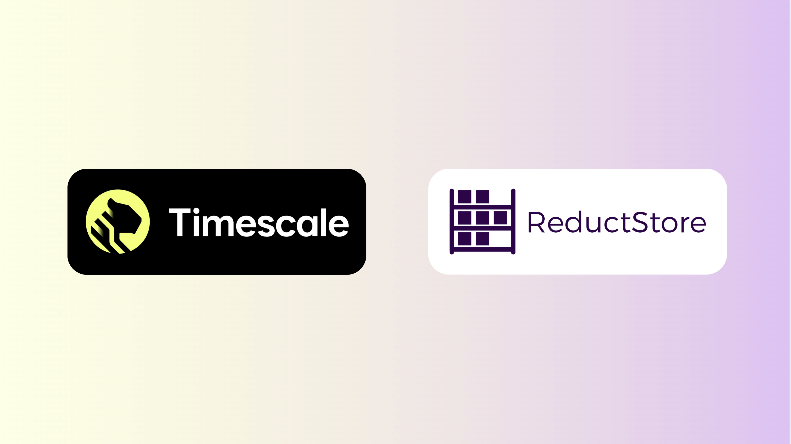

With the rapid growth of time-series data in AI, IoT, and industrial automation, choosing the right database solution can significantly impact performance, scalability, and efficiency. As we covered briefly in [**our whitepaper**](/whitepaper), ReductStore and TimescaleDB are two powerful but distinct solutions, each designed to handle time-series data in different ways. ReductStore specializes in unstructured time-series data, making it ideal for edge computing and large binary objects. TimescaleDB, on the other hand, is an extension of PostgreSQL, optimized for structured time-series data with robust querying capabilities. In this article, we'll explore these differences between ReductStore and TimescaleDB, as well as their other strengths, and when to use each.

{/* truncate */}

## Understanding TimescaleDB: The PostgreSQL-Based Time-Series Database

TimescaleDB is a time-series database built as an extension of PostgreSQL, leveraging SQL's familiarity while adding optimizations for time-series workloads. Unlike traditional relational databases, TimescaleDB structures data into hypertables, which automatically partitions data across multiple chunks, improving read and write performance.

### Key Features of TimescaleDB

- **SQL Compatibility**: Allows users to run traditional SQL queries on structured time-series data.
- **Hypertables & Automatic Partitioning**: Improves storage efficiency and query performance.
- **Compression & Data Retention Policies**: Reduces storage costs by compressing or discarding older data.
- **Full PostgreSQL Ecosystem**: Supports joins, indexing, and relational data integration.
- **Efficient Querying**: Optimized for aggregations, rollups, and downsampling.
- **Extensive Analytical Capabilities**: Ideal for real-time monitoring, forecasting, and trend analysis.
- **Scalability & Replication**: Supports distributed architectures for improved availability.

Because TimescaleDB is based on PostgreSQL, it's particularly useful for applications that blend time-series data with relational datasets. It excels in scenarios requiring frequent queries, detailed analytics, and structured data storage. With features such as full-text or vector search, it is hard to beat the performance that TimescaleDB offers for structured PostgreSQL time series data, especially when dealing with deep metadata queries. Like ReductStore, TimescaleDB is able to leverage on-premise and cloud storage to create a powerful, efficient and affordable solution, provided the dataset is structured. Because of this flexibility, performance, built-in SQL integration, and deep query capabilities, TimescaleDB is widely used in financial transactions, predictive maintenance, and smart city infrastructure.

## ReductStore: Optimized for Unstructured Time-Series Data

While TimescaleDB shines in structured environments, ReductStore is purpose-built for high-speed, unstructured time-series data. It is designed for scenarios where time-series data consists of binary large objects (BLOBs), such as images, videos, and sensor logs. Unlike relational databases, ReductStore organizes data into buckets and entries, with specialised features for edge computing and industrial IoT applications.

### Key Features of ReductStore

- **Designed for Unstructured Data**: Efficiently stores and retrieves binary time-series objects.
- **Volume Based FIFO (First-In, First-Out) Quota System**: Ensures the most relevant and recent data is retained with minimal configuration, and ensures that edge storage is not overrun.
- **Batching & Low-Latency Retrieval**: Reduces network overhead, making it highly efficient for edge devices.
- **Lightweight HTTP API (and ReductStore SDKs)**: Provides a simple interface for integrating with AI, robotics, and other IoT systems.
- **Optimized for Large Data Objects**: Unlike TimescaleDB, ReductStore handles large records natively.
- **Cost-Effective Storage Management**: Aside from efficient data retention policies with minimal configuration, leverage lower cost blob storage to keep costs down. (For more information, see our article on [**data lakehouses for manufacturing**](/blog/data-lakehouse-manufacturing))

ReductStore excels in AI, robotics, and industrial automation, where managing high-frequency unstructured time-series data is critical. It is particularly well-suited for environments requiring efficient storage and processing of large sensor data, video streams, or machine logs. Organizations developing autonomous systems, security monitoring applications, and predictive maintenance solutions could benefit significantly from ReductStore's ability to efficiently handle and prioritize large volumes of binary time-series data. Its flexibility in leveraging both on-premise and cloud storage solutions allows for seamless integration into a variety of industrial and AI-driven pipelines.

One of ReductStore's standout features is its real-time FIFO (First-In, First-Out) quota system based on storage volume, which ensures optimal storage management by automatically replacing older data while retaining high-priority information. This capability is particularly valuable in edge computing, where storage constraints require careful storage management. [**Additionally, ReductStore's batching and iterator-based query approach significantly reduces latency overhead**](/blog/comparisons/iot/reductstore-vs-timescaledb), making it an efficient choice for high-frequency data retrieval. While TimescaleDB offers advanced SQL-based time-series indexing and partitioning, it is inherently optimized for structured datasets and relational metadata, making ReductStore the preferred choice for workloads involving continuous ingestion and rapid access to unstructured binary time-series data.

## Key Differences: ReductStore vs. TimescaleDB

|      **Feature**       |                                **TimescaleDB**                                 |                                        **ReductStore**                                        |
| :--------------------: | :----------------------------------------------------------------------------: | :-------------------------------------------------------------------------------------------: |
|     **Data Model**     |             Relational time-series database (PostgreSQL extension)             |                                  Time-series object storage                                   |
|      **Best For**      |              SQL-based analytics and structured time-series data               |              Fast data acquisition systems (primarily unstructured/binary data)               |
|       **Schema**       |                       Standard relational schema design                        |                                    Flat storage structure                                     |
| **Transport Protocol** |                         PostgreSQL wire protocol (TCP)                         |                                       HTTP/1 and HTTP/2                                       |
|   **Query Language**   |                               SQL-based queries                                |                            Conditional Query Language (HTTP-based)                            |
|    **Scalability**     |    Vertical/horizontal scaling via hypertables and distributed hypertables     |                  Optimized for edge computing and centralized cloud storage                   |
|    **Performance**     |   High ingest rates for structured data; optimized compression for analytics   |                   High-speed ingestion and retrieval for large binary data                    |
|  **Ideal Use Cases**   | Real-time analytics, monitoring, IoT with structured data, financial workloads | Industrial IoT, vibration/acoustic sensors, predictive maintenance, robotics, computer vision |

## When Both Solutions Might Work Together

While ReductStore and TimescaleDB specialize in different areas, there are scenarios where using both solutions together can provide the best of both worlds. For example, in an industrial IoT setting, TimescaleDB can be used to store structured metadata, such as device identifiers and timestamps, while ReductStore can manage the corresponding unstructured data, such as sensor images, audio logs, or vibration waveforms.

Similarly, AI-driven applications might rely on ReductStore for raw data storage while using TimescaleDB for structured annotations and analytics. For instance, in predictive maintenance, TimescaleDB could store structured sensor readings like temperature and pressure logs, while ReductStore could handle infrared images, vibrational sensor data or audio recordings used for diagnosing issues.

## Which One Should You Choose?

If your application requires structured, SQL-compatible time-series data with strong analytics and query performance, TimescaleDB is a great choice. It excels in scenarios like financial monitoring, IoT device management, and predictive analytics where structured data is key. Organizations that need deep historical analysis, trend forecasting, and regulatory compliance for long-term data storage often find TimescaleDB to be a perfect fit.

On the other hand, if your workload involves unstructured time-series data with large binary objects, ReductStore is the better fit. It is optimized for high-speed ingestion, edge computing, and AI-driven applications, making it ideal for robotics, manufacturing, and high-frequency sensor data. Its ability to handle binary time-series data makes it a natural choice for applications in satellite imaging or industrial automation.

## Final Thoughts

Both ReductStore and TimescaleDB offer powerful solutions for managing time-series data, but their strengths lie in different areas. Understanding these differences allows you to choose the best fit for your specific use case—or even leverage both for a comprehensive data storage strategy.

If your project deals with structured time-series data analytics, particularly if it involves SQL in any way, TimescaleDB is a great choice. If you work with large unstructured time-series datasets, ReductStore is the optimal solution. For businesses handling both types of data, integrating the two databases can offer a balanced, efficient, and scalable approach to time-series data management.

---

If you have any questions or comments, feel free to use the [**ReductStore Community Forum**](https://community.reduct.store/signup).
