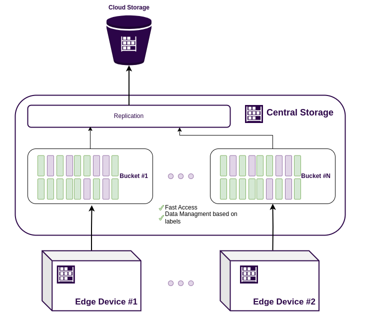
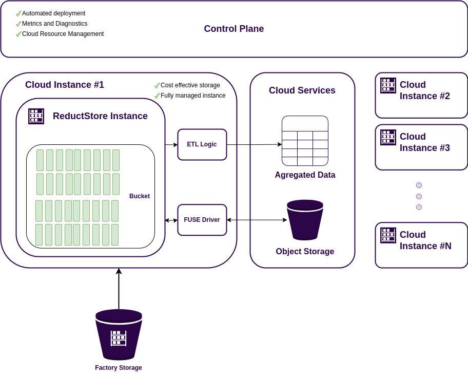

Large manufacturing plants generate vast amounts of data from machines and sensors.
This data is valuable for monitoring machine health, predicting failures, and optimizing production. It also serves as a foundation for building industrial AI models for predictive maintenance, quality control, and process optimization.

A **Data Acquisition (DAQ)** system collects this data, processes it, and stores it for further analysis.
It typically consists of edge devices that gather real-time data, central servers or cloud storage for retention, and software that enables analytics and AI-driven insights.

<small style={{ textAlign: "right" }}>
  An example of a 3 tier DAQ system based on ReductStore.
</small>

Traditional automation solutions like SCADA and historians are complex, expensive, and not optimized for modern cloud-based AI applications.
They often limit access to data, making it difficult for engineers and data scientists to develop machine learning models and gain actionable insights.

In this article, we’ll explore the challenges of building a modern DAQ system for manufacturing and how **[ReductStore](/)** can simplify the process and
support **ELT (Extract, Load, Transform) workflows** for advanced analytics and **AI applications**.

{/* truncate */}

## The Role of DAQ Systems in Manufacturing

In the 21st century, manufacturing is becoming increasingly data-driven. While many factories are already equipped with automation systems, SCADA systems, and historians that collect data from machines and sensors, these solutions are limited when it comes to today's data needs.

Traditional systems struggle with data-intensive sources such as vibration analysis and video surveillance, which generate **large volumes of unstructured data**.
They don't have interfaces to efficiently access the **history of the raw data**, which is essential for building advanced analytics and AI models.
In addition, they often lack the flexibility to integrate with modern **cloud-based storage** and analytics platforms.

This is where a dedicated data acquisition (DAQ) system comes in.
A DAQ system efficiently collects, processes, and stores manufacturing data, providing real-time access for optimization and predictive analytics.
They are more flexible and scalable than traditional automation solutions and can handle multiple data sources, from sensors and PLCs to cameras and vision systems.

Importantly, implementing a DAQ system does not mean replacing the existing automation infrastructure.
In many cases, DAQ systems are deployed alongside automation systems, complementing rather than replacing them.

## Challenges of Building a DAQ System

DAQ systems are often perceived as simpler and more cost-effective than full-scale automation solutions. However, designing a robust DAQ system for manufacturing comes with its own set of challenges:

- **Handling Massive Data Volume and Velocity** – Manufacturing plants generate vast amounts of high-frequency data from machines and sensors. Efficiently collecting, processing, and storing this data in real-time requires a scalable architecture.
- **Ensuring Reliable Connectivity with Low Latency** – Edge devices must transmit data to central servers or cloud storage with minimal latency and high reliability, even in industrial environments with network constraints.
- **Balancing Cost and Scalability** – As data volume grows, the DAQ system must scale efficiently without excessive costs, requiring optimized storage, compression techniques, and cloud integration.

With these challenges in mind, let’s explore how ReductStore can simplify the process of building a DAQ system for manufacturing.

A DAQ system can range from a single edge device near a machine to a complex infrastructure spanning multiple factories and cloud instances.
Below is a high-level overview of its structure.

## Shop Floor

The **shop floor** is where the manufacturing process takes place, and it is the closest point to the machines and sensors that generate data.
Due to the real-time nature of manufacturing data, it is crucial to have edge devices positioned near the machines to collect and transmit data efficiently.

Edge devices can either process data locally or act as **FIFO buffers**, temporarily storing data before sending it to the next level of the system.
Their role depends on system requirements, but their primary function is to ensure seamless data acquisition without overloading the network or losing critical information.

<small style={{ textAlign: "right" }}>
  An example of a DAQ edge device based on ReductStore.
</small>

### Data Ingestion

Industrial data comes in a variety of formats and frequencies.
A DAQ system must support acquisition from multiple sources such as **sensors, PLCs, and cameras**.
As manufacturing environments rely on various industrial protocols such as OPCUA, IO-Link, and GenICam, the DAQ system must be able to collect data from these sources.
For this purpose, edge devices are equipped with **data connectors** that collect data from different sources and convert it into standardized formats e.g. JSON, CSV, WAV and JPEG.

By using standard protocols, a DAQ system remains flexible and scalable, allowing integration with a variety of industrial devices.
However, the raw data collected from these sources is often **unstructured and storage-intensive**, requiring effective processing and storage strategies.

ReductStore enables the storage of a history of unstructured data and provides an HTTP API and SDKs for multiple programming languages, allowing data connectors to write data in various formats directly to storage.

### Data Storage

Data storage in a DAQ system must handle diverse data types and support real-time ingestion.
Additionally, edge devices have **limited storage**, meaning the system cannot afford to stop data collection when storage is full.

ReductStore solves these challenges by providing a unified data storage solution optimized for manufacturing environments:

- **High-Speed Ingestion** – Designed for fast, real-time data collection from multiple sources.
- **FIFO Quotas** – Automatically deletes old data when storage is full, ensuring continuous operation without manual intervention.
- **Data Labeling** – Enables structured organization by tagging data based on source, type, or timestamp, making retrieval and analysis more efficient.

Data labeling is particularly useful for structuring information. For instance, video data can be labeled with machine states (e.g., running, stopped, fault), making it easy to filter and retrieve condition-specific records.

### Data Replication

In most cases, edge devices serve as temporary storage before data is transferred to a central server or cloud storage for long-term retention and further analysis.

However, manufacturing environments present several connectivity challenges that must be addressed.
One of the most common issues is network reliability.
Edge devices may operate in remote locations with unstable or slow networks, making it difficult to maintain a continuous connection to the central server.
In addition, **limited bandwidth** and **firewall restrictions** can further complicate data transfer.
Security concerns often restrict direct access to edge devices, requiring a more sophisticated replication mechanism.

:::info
Although **IoT protocols such as MQTT** can address many of connectivity issues, using a **database for streaming data** ensures persistence and reliability - data is stored on disk and can be replicated even after prolonged loss of connectivity.
:::

ReductStore is designed to meet these industrial constraints with robust replication capabilities:

- **Push Replication** - Edge devices push data to the central server/cloud only when a connection is available, eliminating the need for a permanent connection and direct access to the edge device.
- **HTTP/HTTPS Support** - Ensures compatibility with firewalls and industrial network configurations.
- **Batch Replication** - Sends multiple records in a single request, optimizing bandwidth usage and reducing network overhead.
- **Conditional Replication** - Replicates only necessary data based on labels, timestamps, or other conditions, optimizing network traffic and storage costs.

With ReductStore, setting up replication requires no custom logic - simply label your data, define replication conditions, and the system does the rest. This approach ensures efficient, cost-effective, and scalable data collection for manufacturing environments.

## Factory Data Store

The **factory storage system** is the next level of the DAQ architecture, responsible for aggregating data from multiple edge devices and providing structured access for data scientists and engineers.

Unlike edge devices, which have limited **processing power and storage**, the factory storage system can leverage more powerful hardware and larger storage capacity, allowing for **longer data retention** and more advanced processing.

<small style={{ textAlign: "right" }}>
  An example of a DAQ factory storage based on ReductStore.
</small>

### Massive Data Volumes

The factory storage can be a **dedicated server**, **NAS**, or **SAN** optimized for high-throughput data storage.
But independent of the implementation, the storage system must be capable to store **TBs or even PBs** of data because of the high-frequency data generated by manufacturing processes.

:::info
Usually, large amount of unstructured data is stored just in a file system or object storage, which is not optimized for **historical data access**.
:::

ReductStore provides a scalable and efficient storage solution for manufacturing data, designed to handle massive amounts of data.
and ensure fast access to manufacturing data:

- **Indexing by time** - ReductStore indexes data by time, enabling fast retrieval of data over time intervals.
- **Separate storage for metadata** - ReductStore stores and manages metadata separately from data, allowing it to scale and handle more data.
- **Batching** - ReductStore batches data at the communication and file system level, optimizing data storage and access.

### Data Management

When we talked about the need for factory storage to handle massive amounts of data, we meant not only storing the data, but also providing efficient data management.
with access control, data retention policies, and data labeling.

The data engineers and data scientists need to be able to manage the data for the following tasks:

- **Retrieve data** - Efficiently search and retrieve data based on timestamps, labels. This is important for building analytics and AI models.
- **Data Labeling** - Label data based on source, type, or timestamps, enabling efficient search and conditional data retrieval.
- **Data Access Control** - Restrict access to sensitive data based on user roles and privileges.

With ReductStore, you can manage data efficiently and securely, ensuring that only authorized users have access to sensitive data.
ReductStore provides a RESTful API and SDKs for multiple programming languages, enabling data engineers and data scientists to programmatically interact with the data store.

## Cloud Storage and Processing

Factory storage can be further extended to a **cloud-based data acquisition system**, providing additional scalability, redundancy, and advanced analytics capabilities.
It allows data to be accessed from anywhere, enabling remote monitoring, predictive maintenance, and AI-driven insights.

Building a cloud component of the DAQ system that can handle data from multiple plants requires a robust architecture that can scale horizontally and vertically.
There are several key components to consider when designing a cloud-based data acquisition system:

- **Data Ingestion** - The cloud component must be able to ingest data from multiple factories and edge devices, handling different data types and formats.
- **Cost-Effective Storage** - Cloud storage costs can escalate quickly with large volumes of data. The system must be optimized for cost-effective storage and retrieval.
- **Data Transformation** - Data from multiple sources must be transformed and aggregated for analytics, visualization, and AI applications.
- **Automated workflows** - The cloud component should support automated workflows to efficiently scale and manage the cloud infrastructure.

Let's discuss these parts in more detail.

<small style={{ textAlign: "right" }}>
  An example of a cloud-based DAQ storage based on ReductStore.
</small>

### Data Ingestion

Many cloud platforms offer services for data ingestion, with many of them leveraging the Pub/Sub pattern using message brokers such as Kafka, MQTT, or AMQP.
The general concept is to have a **message broker** that receives data from edge devices and then transmits it to the cloud storage.
Subsequently, data is transformed with AWS Lambda or Google Cloud Functions, and the aggregated data is stored in a database.
This approach is referred to as **ETL (Extract, Transform, Load)**.

While this approach is widely used and highly scalable, it has some drawbacks:

- **Loss of raw data** - The raw data is transformed during the ETL process, resulting in the loss of the source of truth.
- **Complexity** - Establishing and maintaining a message broker, data transformation, and cloud storage can be complex and time-consuming.
- **Costs** - cloud services can be costly, particularly when dealing with substantial data volumes.

:::warning
It is important to understand that during the ETL process, the raw data is transformed, making it irrecoverable.
This limitation precludes the ability to revert to the raw data or apply a different transformation to historical data.
:::

ReductStore uses the **ELT (Extract, Load, Transform)** approach, where data is extracted from edge devices and loaded directly into cloud storage.
This approach greatly simplifies the ingestion process by leveraging ReductStore's replication mechanism.

### Scalable Storage

The most common cloud storage solutions are **object storage** such as Amazon S3, Google Cloud Storage, and Azure Blob Storage.
It is many times cheaper than persistent disk and provides a scalable and durable storage solution for large volumes of data.
Unfortunately, as mentioned earlier, object storage is not optimized for historical data access.

ReductStore can use object storage as backend storage using **FUSE drivers**.
This allows you to store data in a scalable and cost-effective manner while maintaining fast access to historical data.

### Data Transformation

Data transformation is a critical step in the cloud data acquisition system. It involves aggregating data from multiple sources, cleaning and normalizing data, and preparing it for analytics, visualization, and AI applications.
Cloud platforms provide services such as AWS Lambda, Google Cloud Functions, and Azure Functions for data transformation; they are elastically scalable, but can be expensive.

ReductStore provides a **subscription mechanism** that allows you to subscribe to data changes and apply **transformations on the fly**,
With the ReductStore SDKs, you can write your own transformation functions in Python, JavaScript, or any other language.

### Automated Workflows

The cloud data acquisition system must support automated workflows to efficiently manage the cloud infrastructure.
This includes scaling resources on demand, monitoring system health, and handling failures gracefully.

ReductStore provides a **[SaaS solution](/solutions/cloud)** that takes care of the storage infrastructure management, monitoring, and scaling so you can focus on building analytics and AI applications.

## Conclusion

In this article, we have explored the challenges of building a modern data acquisition system for manufacturing.
Every DAQ system is unique and depends on the specific requirements of the manufacturing environment. It may include all of the components described or only a subset of them.
The data transformation can be done on the edge devices, factory storage, or cloud storage, depending on the use case.
What can change the scale and complexity of the system.
However, the key principles of efficient data acquisition, processing, and storage remain the same, and your DAQ system should be designed to handle massive amounts of data and ensure reliable connectivity.

With ReductStore, you can adopt the **ELT approach**, simplify the process of building a manufacturing DAQ system, replicate data from edge devices to central servers or cloud storage, and provide efficient data storage and management.

---

We hope this article has provided you with valuable insights into building a modern data acquisition system for manufacturing.
If you have any questions or comments, feel free to use the [**ReductStore Community Forum**](https://community.reduct.store/signup).
