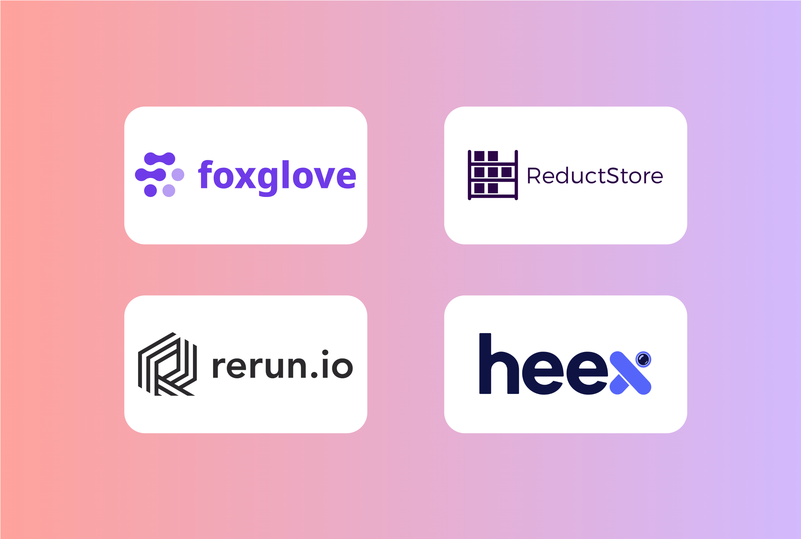

Data management is a very important element in modern robotics systems. As robots become more advanced, they generate massive amounts of information from various sources, such as sensor readings, system logs, and video feeds, and being able to manage this data effectively can mean the difference between a robot that performs well and one that fails to meet expectations.

In this article, we will compare different data management tools for robotics by looking into their key features, strengths, and the types of use cases they are best suited for. Understanding these differences will help robotics engineers and developers choose the right tool for their specific needs.

{/* truncate */}

## Key Criteria for Comparison

When evaluating data management tools for robotics, several critical factors must be considered to ensure the selected solution meets the unique demands of robotic systems:

- **Data Type Support:** Different robotics applications generate and require various types of data, each with its own storage and processing needs:

  - _Lightweight telemetry data_: Includes GPS coordinates, IMU readings, joint positions, and system status. This data requires low bandwidth and offers near real-time access, making it valuable for analytics and monitoring robot performance over time.
  - _Downsampled sensor data_ represents a middle ground when it comes to the volume. It consists of reduced framerate camera feeds and lower-resolution lidar scans, making it particularly useful for monitoring robot operations and investigating incidents without consuming excessive storage.
  - _Full-resolution data_ comprises the complete, uncompressed outputs from sensors - raw camera frames at maximum framerate, high-frequency LiDAR point clouds, and detailed depth maps. Even though this data requires a larger storage capacity, it's essential for in-depth debugging and retraining machine learning models to improve robot performance and capturing specific events for incident triage.

- **Integration & Ecosystem:** Data management tools must integrate well with other systems and tools, such as ROS (Robot Operating System), cloud platforms, and development environments. Good integration leads to smoother data flow, which leads to reduced time and effort needed to synchronize components of the system. Compatibility with cloud platforms is also important, as it offers scalability and the flexibility to store large amounts of data without needing on-premise infrastructure.
- **Performance & Scalability:** Fast data processing in robotics is essential, especially for tasks like autonomous navigation and robotic manipulation where even small delays can cause errors or safety concerns. Additionally, as data volumes grow, systems must scale effectively without performance loss. Storing large files, such as ROS bags, on edge devices can overwhelm resources, leading to overheating and slower performance, and transferring these files to the cloud may also cause delays. Efficient data management helps avoid these issues, ensuring efficient performance and scalability as the system grows.
- **Ease of Use & API Support:** The data management tool's ease of use and API support can make a big difference in how easily it fits into day-to-day development. A clean, intuitive interface helps engineers and data scientists to quickly familiarize themselves with the tool and therefore increase productivity, while having reliable, well-documented API support makes it easier to automate tasks, connect with other tools, and adapt the system to match specific needs.

## In-Depth Comparison of Tools

### ReductStore

ReductStore is a high-performance storage and streaming solution for robotics and industrial IoT applications optimized for managing and storing large volumes of unstructured data. Its design makes it especially suitable for high-frequency sensor data, telemetry, and full-resolution sensor data like raw camera images and lidar frames coming from autonomous vehicles, industrial robots, drones, and other robotic applications.

One key aspect of ReductStore is its ability to effectively manage data both locally on edge and in centralized cloud storage. It enables efficient storage of large files, such as rosbag files, by allowing users to [**split them by topic and save each topic as a separate record**](/blog/store-ros-topics) or entry, rather than storing the entire rosbag file. This approach provides greater flexibility in managing the data, enabling different storage, replication, and retention strategies for different data types.

As edge devices often have limited storage capacity, ReductStore offers volume-based retention policies based on the First In, First Out (FIFO) principle. This approach ensures that older data is deleted only when the storage reaches full capacity. These retention policies are customizable and can be adjusted separately for each data bucket, allowing users to make different data management strategies according to their specific needs and thus avoid storage overrun on the robot.

When it comes to syncing the robot's data to a cloud or central storage, ReductStore uses conditional replication, which basically means that users can set filters in order to replicate only specific entries or a subset of records that satisfy a given set of rules. This is achieved through a JSON-like query language in the ReductStore HTTP API, enabling efficient data transfer based on customized conditions. The API also supports batch operations, reducing the number of requests and improving overall performance when transferring large datasets.

[**ReductStore integrates with Google Cloud's Blob Storage**](/solutions/cloud), offering the fastest and most cost-effective cloud storage for time series objects. It cuts data storage costs by storing infrequently accessed data in lower-cost tiers, such as Cool or Cold. Additionally, it uses the pay-as-you-go model, allowing users to pay only for the storage they use.

### Foxglove & MCAP

Foxglove is a web-based visualization and observability platform for robotics data, with tight support for ROS 1, ROS 2, and MCAP logs. It supports a wide range of data types that robotics teams commonly work with, like telemetry, camera feeds, lidar point clouds, and depth maps.

For large, high-resolution data, Foxglove relies on _MCAP_, its open-source log format built for robotics and optimized for both speed and storage. The tool provides an efficient way to explore and visualize these MCAP files, allowing users to stream only the specific data they need.

To facilitate real-time monitoring, Foxglove provides a simple agent that automatically detects new MCAP files on the robot and sends them to the Foxglove platform. To use the Foxglove agent effectively, robots must continuously record data with rosbag2, creating small, rotating files (typically 1-5 minutes each). Once a file reaches its set limit, it's closed, and a new one is created. While this will work, it is highly inefficient, since the robot constantly writes data to the storage. All in all, Foxglove is a good solution for managing bag files and data visualization, but it definitely has its limitations.

Foxglove integrates with key systems and platforms commonly used in robotics development. It works great with ROS, allowing direct ingestion of data from ROS topics, services, and actions. It also supports integration with external systems via APIs, such as WebSocket and REST APIs. For cloud integration, Foxglove can connect to platforms like AWS, Azure, or Google Cloud for scalable storage solutions, ensuring that your data is accessible without local storage limitations.

Foxglove offers a clean, intuitive interface with a strong emphasis on handling large sensor and time-series data commonly found in robotics. It focuses heavily on data streaming, with interactive visualizations such as graphs, plots, and camera feeds. It also supports a "drag-and-drop" interface for easy interaction with data.

### Rerun

Rerun is an open-source visualization toolbox and data platform for multimodal and temporal data. It is designed to handle a wide variety of data types such as images, point clouds, tensors, LiDAR scans, depth maps, and sensor data. Its main strength is in its ability to combine easy log handling with a fast, built-in visualizer designed for robotics and XR applications.

When working with large-scale time-series data**,** Rerun provides a special, _Column-Oriented API_ (apart from its row-based API), which optimizes both data ingestion speed and memory usage. Rerun also leverages efficient data structures, like the _Chunk_ structure, to minimize memory allocations and boost data manipulation efficiency. Furthermore, the platform allows for selective logging, enabling the capture of only necessary data.

When it comes to integration, it's important to note that Rerun currently does not have native support for ROS. However, users can still use it with ROS 2 by implementing custom logging within their ROS 2 nodes.

Rerun supports embedding within Jupyter notebooks and web pages and it offers integrations with native loggers in languages like Python, Rust, and C++, allowing you to stream logs directly into the Rerun Viewer.

Rerun's UI is more focused on real-time 3D visualization, with an interactive approach that allows users to explore robot environments in depth. It features easy-to-use 3D overlays and it supports live streaming and tracking, letting users explore their data in real-time and view different data types in a unified 3D space.

### Heex

The biggest difference between Heex and the other platforms is that, instead of recording everything all the time, Heex focuses on capturing only what's important — like when an error happens or a specific event is triggered. This tool is built to efficiently handle large amounts of different data, such as logs, images, and sensor data, without overwhelming the users' system.

A key feature of Heex is its RDA (Resource and Data Automation) for ROS 2, which automates data capture, processing, and management in real time. It works in the following way: the robot runs a small software agent that monitors its activity and knows when to start recording based on specific rules or scenarios set by the user. These rules can be updated remotely in real-time, without the need to plug anything in or restart the robot.

The platform manages recorded data using the MCAP format—similar to Foxglove—and even embeds Foxglove's visualization tools directly into its platform, allowing users to explore data in context. Once relevant data is captured, it's sent to the cloud, where teams can review it through the Heex dashboard. This setup makes it easy to manage and analyze data across an entire fleet of robots, even if they're in different locations. Since only important moments are logged, the system runs faster, uses less bandwidth, and keeps storage manageable.

Heex integrates easily with your systems using SDK Agents for real-time data collection, APIs to connect with other tools and workflows, and a Command Line Interface (CLI) for advanced users who prefer direct control. It also integrates with ROS 1 and ROS 2, offering native logging and data streaming.

Heex's UI offers interactive dashboards where users can view and analyze data from connected robots in real time. The platform allows users to customize their dashboards to highlight specific events or metrics that are important for their workflows, such as errors, system status, and sensor readings. It also provides detailed insights into the robot's state, with easy navigation through timelines and data streams.

## Comparative Analysis Table

To help visualize the differences between the various data management tools discussed, here's a comparison table that summarizes their key differences:

| **Tool**                   | **ReductStore**                                                            | **Foxglove**                                         | **Rerun**                                                      | **Heex**                                                        |
| -------------------------- | -------------------------------------------------------------------------- | ---------------------------------------------------- | -------------------------------------------------------------- | --------------------------------------------------------------- |
| **Primary Focus**          | High-frequency unstructured time-series robotics data, large-scale storage | Real-time data streaming and visualization           | Real-time 3D multimodal data visualization and XR applications | Real-time, event-driven data capture and fleet management       |
| **Data Types**             | High-frequency sensor data, telemetry, complex data streams                | Telemetry, camera feeds, lidar, depth maps, ROS data | Images, point clouds, tensors, text, multimodal data           | Logs, images, sensor data                                       |
| **Storage System**         | Cloud-based (Azure Blob Storage)                                           | Cloud storage (AWS, Azure, Google Cloud)             | Local storage                                                  | Cloud storage (with real-time capture)                          |
| **Performance Advantages** | Batch processing, optimized query language                                 | Selective data streaming                             | Fast ECS data model with optimized memory usage                | Lightweight capturing of only relevant data, based on set rules |
| **ROS Integration**        | Supports ROS (via custom setups)                                           | Native ROS1 and ROS2 support                         | No native ROS support (custom integration possible)            | Native ROS1 and ROS2 support                                    |
| **UI**                     | Web-based UI and CLI tools                                                 | Web-based (browser UI with timeline, 2D/3D viewers)  | App-based (cross-platform native app; browser UI in dev)       | Web-based dashboard with filters, events, alerts                |

## Conclusion

In this article, we covered the key challenges of managing robotics data, such as data type support, performance and scalability, integration with other systems, and ease of use. We also examined several data management platforms like ReductStore, Foxglove, Rerun, and Heex, each with its own set of strengths and disadvantages. Understanding these differences can help you make informed decisions about which solution best fits your specific needs.

---

Thanks for reading, I hope this article will help you choose the right storage strategy for your vibration data.
If you have any questions or comments, feel free to use the [**ReductStore Community Forum**](https://community.reduct.store/signup).
