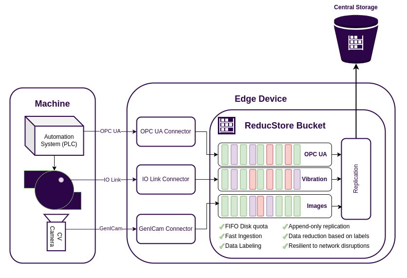
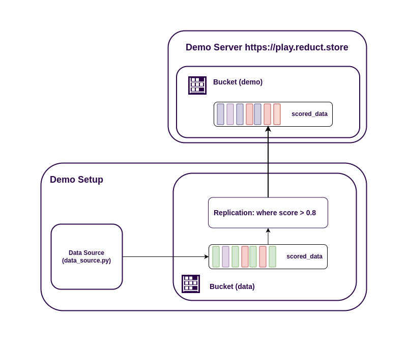
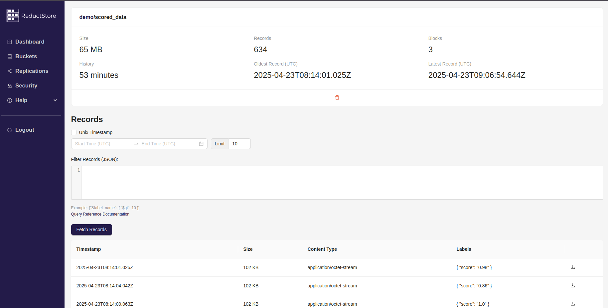

As modern manufacturing becomes increasingly data-driven, the need for efficient data acquisition systems is more critical than ever.
In my previous article, [**"Building a Data Acquisition System for Manufacturing"**](blog/2025-03-17-daq-manufacture-system/index.mdx), we discussed the challenges of data acquisition in manufacturing and how [**ReductStore**](/) can help solve them.
Here we will learn how to use ReductStore at the edge of the shop floor and stream data to the cloud.

## DAQ Edge Device

The shop floor is the place where data is generated, and it is essential to have a reliable **data acquisition (DAQ)** device that can collect and process this data.
The DAQ device can process data locally or act as a FIFO buffer, sending data to long-term storage on premises or in the cloud.



The DAQ device can be a Raspberry Pi with a USB stick or a powerful industrial computer with a 1TB or larger NVMe SSD.
Despite the differences in hardware, your DAQ device should have the following capabilities:

- **Data ingestion**: The DAQ device must be able to ingest data from various sources, such as sensors, PLCs, and other devices, with minimal latency and high throughput.
- **Data storage**: The DAQ device must be able to store data locally and provide data retention policies to manage the amount of data.
- **Data replication**: The DAQ device must be able to replicate data to the cloud or local storage for long-term retention and analysis.

{/* truncate */}

These features don't look like much, but the devil is in the detail. If you have very intensive data acquisition, **you can't store and replicate everything**.
You need an intelligent data collection system that can filter and process data before sending it to long-term storage.
You may also face connectivity issues, and your DAQ device should be able to handle these issues gracefully without losing data.

Let's take a look at ReductStore and how it can help you build a modern data acquisition system for manufacturing.

## Demo Setup

For demonstration purposes, we will build a simple data acquisition system that includes:

- **Data Source**: A simple data source that generates random data and writes it to ReductStore.
- **ReductStore**: A ReductStore instance running on the DAQ device that replicates data to a cloud instance.
- **Cloud Storage**: A cloud instance of ReductStore at [**play.reduct.store**](https://play.reduct.store) that stores the replicated data.



### Provisioning ReductStore

In this example we will create a bucket called `data` with a [**FIFO quota**](/docs/glossary#fifo-quota) of 1GB and a replication task called `repl-task`
which will replicate data from the `data` bucket to the `demo` bucket on [**our demo server**](https://play.reduct.store).
Note the `RS_REPLICATION_1_WHEN` environment variable, which is a filter that allows you to replicate only data with a score greater than 0.8.

This is a simple example, but you can use more complex filters to replicate data according to your needs.

You are now ready to start ReductStore using Docker Compose:

```yaml
services:
  reductstore:
    image: reduct/store:latest
    container_name: reductstore
    environment:
      RS_DATA_PATH: /data

      RS_BUCKET_1_NAME: data
      RS_BUCKET_1_QUOTA_TYPE: FIFO
      RS_BUCKET_1_QUOTA_SIZE: 1GB

      RS_REPLICATION_1_NAME: repl-task
      RS_REPLICATION_1_SRC_BUCKET: data
      RS_REPLICATION_1_DST_HOST: https://play.reduct.store
      RS_REPLICATION_1_DST_TOKEN: reductstore
      RS_REPLICATION_1_DST_BUCKET: demo
      RS_REPLICATION_1_WHEN: '{"&score": {"$$gt": 0.8}}' # we need $$ to escape $ in YAML

    volumes:
      - ./data:/data
    ports:
      - 8383:8383
```

In this example, we create a bucket named `data` with a [**FIFO quota**](/docs/glossary#fifo-quota) of 1GB and a replication task named `repl-task` that replicates data from the `data` bucket to the `demo` bucket on [**our demo server**](https://play.reduct.store).
Pay attention to the `RS_REPLICATION_1_WHEN` environment variable, which is a filter that allows you to replicate only data with a score greater than 0.8.

This is a simple example, but you can use more complex filters to replicate data based on your needs.

Now you can start ReductStore with Docker Compose:

```bash
docker-compose up
```

You can open the Web Console at `http://localhost:8383` and check the status of the bucket and replication task.

### Data Ingestion

Now we need to create a data source that will generate random data and write it to ReductStore.

We provide several SDKs for different programming languages, but for this example we will use the Python SDK.
Let's install it:

```bash
pip install reduct-py
```

Now we can create a simple data source. Create a file called `data_source.py` and add the following code:

```python
from asyncio import sleep
from random import randbytes, randint

from reduct import Client

BLOB = randbytes(100 * 1024)  # 100 KB of random bytes

async def send_data():
    async with Client("http://127.0.0.1:8383") as client:
        # Get bucket
        bucket = await client.get_bucket("data")

        while True:
            # Generate score
            score = randint(1, 100) / 100.0

            # Write record
            await bucket.write(
                "scored_data",
                BLOB,
                labels={
                    "score": score,
                },
            )

            print(f"Record with score {score} written")
            await sleep(1)


if __name__ == "__main__":
    import asyncio
    loop = asyncio.new_event_loop()
    loop.run_until_complete(send_data())
```

As you can see, it's very simple. You can read working with the Python SDK in the [**Quick Start With Python**](/docs/getting-started/with-python) guide.

Let's run the data source:

```bash
python data_source.py
```

You can check if the data is ingested by opening the Web Console and checking the `data` bucket.

### Data Replication

Now we need to check that the data is replicated to the demo server.
You can do this by opening the Web Console at `https://play.reduct.store` then logging in with the `reductstore` token and checking the `demo` bucket.
You should find the `scored_data` entry with the replicated data:



You should see the records with a score greater than 0.8, as we specified in the replication task.

Let's simulate a network outage and see how ReductStore handles it. If you run the demo setup locally on your computer, you can simply disconnect from the internet for a while and see in the web console that the replication task has pending records. The replication task will store any pending records in a log to be sent later.
When you re-enable the Internet connection, the replication task will automatically send the pending records to the demo server.

Now you don't need to worry about **network outages or data loss**. ReductStore will take care of that for you.

## Best Practices

The example we have provided is very simple and does not cover all aspects of building a modern data collection system for manufacturing.
Here are some best practices to consider when building your own system based on ReductStore:

- Security: Use secure connections (HTTPS) and authentication tokens to protect your data. Read more about access control in the [**Access Control**](/docs/guides/access-control) guide.
- Data retention: Use the [**FIFO quota**](/docs/glossary#fifo-quota) to limit the amount of data stored in ReductStore. This will help you avoid running out of disk space and keep your data fresh.
- Store data in the cloud: Use the [**ReductStore Cloud**](https://cloud.reduct.store) to store your data in the cloud. It uses a cloud object storage as a backend and reduces the cost of storing data.

## Conclusion

Building a modern and robust data acquisition system for manufacturing can be a challenging task.
In this article, we have shown you how ReductStore can help you build a data acquisition system that can ingest, store, and replicate data from the shop floor to the cloud with minimal effort and maximum performance.

## Resources

- [**ReductStore Documentation**](https://docs.reduct.store)
- [**Building a Data Acquisition System for Manufacturing**](blog/2025-03-17-daq-manufacture-system/index.mdx)
- [**ReductStore GitHub**](https://github.com/reductstore/reductstore)
- [**Example On GitHub**](https://github.com/reductstore/daq-edge-example)

---

We hope this article has provided you with valuable insights into building a modern data acquisition system for manufacturing.
If you have any questions or comments, feel free to use the [**ReductStore Community Forum**](https://community.reduct.store/signup).
