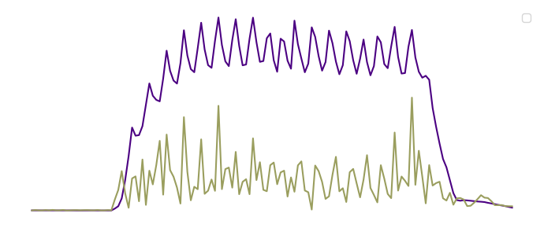
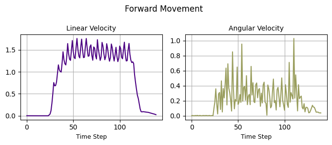
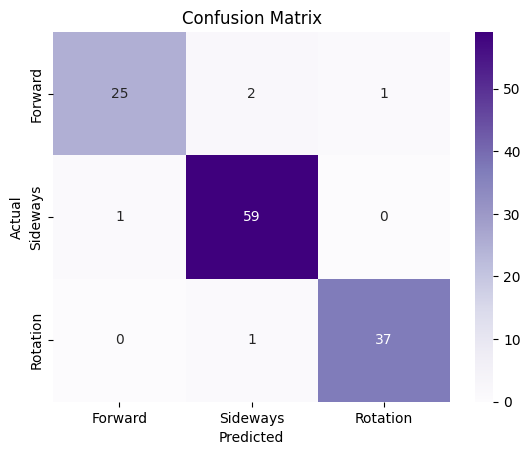
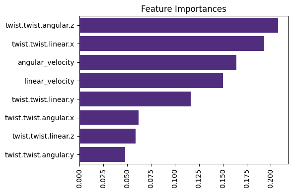

Working with real-world robot data depends on how ROS (Robot Operating System) messages are stored. In the article [**3 Ways to Store ROS Topics**](https://www.reduct.store/blog/store-ros-topics#method-2-store-rosbag-data-in-time-series-object-storage), we explored several approaches — including storing compressed Rosbag files in time-series storage and storing topics as separate records.

In this tutorial, we'll focus on the most common format: `.bag` files recorded with Rosbag. These files contain valuable data on how a robot interacts with the world — such as odometry, camera frames, LiDAR, or IMU readings — and provide the foundation for analyzing the robot's behavior.

You’ll learn how to:

- Extract motion data from `.bag` files
- Create basic velocity features
- Train a classification model to recognize different types of robot movements

We'll use the `bagpy` library to process `.bag` files and apply basic machine learning techniques for classification.

Although the examples in this tutorial use [**data from a Boston Dynamics Spot robot**](http://ptak.felk.cvut.cz/darpa-subt/qualification_videos/spot/) (performing movements like moving forward, sideways, and rotating), you can adapt the code for your recordings.

{/* truncate */}

### Install Required Libraries

```python
!pip install numpy pandas matplotlib seaborn scikit-learn bagpy
```

## Loading and Preprocessing Bag Files

Let's create a function to load a `.bag` file and extract velocity features.

In our example, the odometry data is published under the `/spot/odometry` topic. Make sure to specify the correct topic where your robot's motion data is recorded. Depending on your use case, you might find other features, such as accelerations or additional sensor data, more relevant for recognizing your robot's movements. For this task, we'll primarily focus on linear and angular velocities.

```python
import numpy as np
import pandas as pd
from bagpy import bagreader

def process_bag_to_dataframe(bag_path, topic='/spot/odometry', target_label=0):

    # Load a .bag file and generate a DataFrame with velocity features and a target label

    bag = bagreader(bag_path)
    df = pd.read_csv(bag.message_by_topic(topic))

    # Calculate linear and angular velocities
    df['linear_velocity'] = np.sqrt(df['twist.twist.linear.x']**2 +
                                    df['twist.twist.linear.y']**2 +
                                    df['twist.twist.linear.z']**2)

    df['angular_velocity'] = np.sqrt(df['twist.twist.angular.x']**2 +
                                     df['twist.twist.angular.y']**2 +
                                     df['twist.twist.angular.z']**2)

    # Assign target label
    df['target'] = target_label

    # Keep only relevant columns
    return df[['twist.twist.linear.x', 'twist.twist.linear.y', 'twist.twist.linear.z',
               'twist.twist.angular.x', 'twist.twist.angular.y', 'twist.twist.angular.z',
               'linear_velocity', 'angular_velocity', 'target']]
```

### Processing three different movement types

Let's use the `process_bag_to_dataframe` function to load and process the data for each of the three movement types. Each movement type was recorded in a separate `.bag` file, so we'll apply the function to each file individually, and then merge the results into a single DataFrame.

```python
df_forward = process_bag_to_dataframe('linear_x.bag', target_label=1)   # moving forward
df_sideways = process_bag_to_dataframe('linear_y.bag', target_label=2)  # moving sideways
df_rotation = process_bag_to_dataframe('rotation.bag', target_label=3)  # rotating

# Combine all samples
df_all = pd.concat([df_forward, df_sideways, df_rotation], ignore_index=True)
```

### Visualizing velocities

We can visualize the linear and angular velocities over time for each type of motion, as shown in the example for the forward movement. This will help us better understand how the velocities change during each specific motion.

```python
import matplotlib.pyplot as plt

def plot_velocities(df, title=''):

    plt.figure(figsize=(7, 3))

    plt.subplot(1, 2, 1)
    plt.plot(df['linear_velocity'], color='#4B0082')
    plt.title('Linear Velocity')
    plt.xlabel('Time Step')

    plt.subplot(1, 2, 2)
    plt.plot(df['angular_velocity'], color='#9A9E5E')
    plt.title('Angular Velocity')
    plt.xlabel('Time Step')

    plt.suptitle(title)
    plt.tight_layout()
    plt.show()

plot_velocities(df_forward, 'Forward Movement')
```



## Training and Evaluating Classification Models

We'll test several popular models, including Logistic Regression, Decision Tree, Random Forest, and Support Vector Machine, and tune their hyperparameters using `GridSearchCV`. You can also experiment with other hyperparameters to optimize the models based on your specific data and requirements.

To evaluate the classifier, we'll use the **F1 Score** metric, which balances precision and recall and is especially useful for imbalanced datasets. However, you can also choose to evaluate using Accuracy, Precision, or Recall, depending on your needs.

Now, let's prepare the data for training.

```python
X = df_all.drop('target', axis=1)
y = df_all['target']
```

The features `X` consist of the velocity data, and the labels `y` represent the different movement types.

Next, let’s define the scalers, models, and their respective hyperparameters.

```python
from sklearn.preprocessing import StandardScaler, MinMaxScaler, RobustScaler
from sklearn.linear_model import LogisticRegression
from sklearn.tree import DecisionTreeClassifier
from sklearn.ensemble import RandomForestClassifier
from sklearn.svm import SVC

# Scalers
scalers = {
    'Standard Scaler': StandardScaler(),
    'MinMax Scaler': MinMaxScaler(),
    'Robust Scaler': RobustScaler()
}

# Models
models = {
    'Logistic Regression': LogisticRegression(max_iter=10000),
    'Decision Tree': DecisionTreeClassifier(),
    'Random Forest': RandomForestClassifier(),
    'SVM': SVC(probability=True)
}

# Hyperparameters for tuning
parameters = {
    'Logistic Regression': {'C': [0.01, 0.1, 1, 10, 100]},
    'Decision Tree': {'max_depth': [3, 5, 10, None]},
    'Random Forest': {'n_estimators': [50, 100]},
    'SVM': {'C': [0.1, 1, 10], 'kernel': ['linear', 'rbf']}
}
```

Let's train and test the models using the defined scalers, models, and hyperparameters.

```python
from sklearn.model_selection import train_test_split, GridSearchCV, StratifiedKFold
from sklearn.metrics import f1_score, confusion_matrix

def run_classification(model_name, scaler_name, X, y):

    # Split data into train and test sets
    X_train, X_test, y_train, y_test = train_test_split(X, y, stratify=y, test_size=0.2)

    # Apply the chosen scaler to the data
    scaler = scalers[scaler_name]
    X_train = scaler.fit_transform(X_train)
    X_test = scaler.transform(X_test)

    # Set up hyperparameter grid and cross-validation
    param_grid = parameters[model_name]
    cv = StratifiedKFold(n_splits=5, shuffle=True)
    grid = GridSearchCV(models[model_name], param_grid, cv=cv, scoring='f1_weighted')
    grid.fit(X_train, y_train)

    # Get the best model from the grid search
    best_model = grid.best_estimator_

    # Make predictions on the test set
    y_pred = best_model.predict(X_test)

    print(f'Best parameters: {grid.best_params_}')
    print(f'F1 Score: {f1_score(y_test, y_pred, average="weighted"):.3f}')

    return y_test, y_pred, best_model, X.columns
```

After training and testing the models, we'll plot the confusion matrix to visualize how well our model is performing by comparing the predicted labels with the actual labels.

```python
import seaborn as sns

# Plot confusion matrix
def plot_confusion_matrix(y_test, y_pred):

    cm = confusion_matrix(y_test, y_pred)

    sns.heatmap(cm, annot=True, fmt='d', cmap='Purples')
    plt.title('Confusion Matrix')
    plt.xlabel('Predicted')
    plt.ylabel('Actual')
    plt.show()
```

After evaluating the model's performance, we’ll visualize the feature importance for the Decision Tree and Random Forest models to understand which features contribute the most to the model’s predictions.

```python

# Feature importance for Decision Tree and Random Forest
def plot_feature_importance(best_model, X_columns):

    importances = best_model.feature_importances_
    sorted_idx = importances.argsort()[::-1]

    sns.barplot(x=importances[sorted_idx], y=X_columns[sorted_idx], color='#50208B')
    plt.title('Feature Importances')
    plt.xticks(rotation=90)
    plt.tight_layout()
    plt.show()
```

### Training a Random Forest classifier

Finally, let's apply the Random Forest classifier to our data and evaluate its performance.

```python
y_test, y_pred, best_model, X_columns = run_classification('Random Forest', 'MinMax Scaler', X, y)
```

The optimal parameter for **n_estimators** is **100**, and the model achieved an **F1 score** of **0.976**.

We’ll plot the **confusion matrix** to assess the classifier's performance across different movement types. The diagonal elements represent the correctly classified instances, while the off-diagonal elements indicate the misclassifications.

```python
plot_confusion_matrix(y_test, y_pred)
```



After evaluating the Random Forest model, we can check the **Feature Importance** to see which velocity components were most important in distinguishing the movement types. This is especially useful for Decision Tree and Random Forest models, as they automatically rank features by their importance.

```python
plot_feature_importance(best_model, X_columns)
```



### Best practices

When working with `.bag` files and training machine learning models, these best practices can help you manage data more effectively and build better-performing models:

- **Split large files:** If your `.bag` files are too large, divide them into smaller episodes. This helps avoid memory issues and makes the files easier to process.

- **Separate topics by type:** If your `.bag` file includes both lightweight messages (like battery level) and large data streams (like images or LiDAR), store them in separate `.bag` files. This separation can optimize performance and make your workflow simpler.

- **Use Randomized Search for tuning:** If your model’s accuracy isn’t good enough, try using RandomizedSearchCV instead of GridSearchCV. It can find the best hyperparameters faster and more efficiently.

- **Try different algorithms:** Experiment with different algorithms to find what works best for your specific data.

- **Consider ensemble methods:** Techniques like bagging or boosting can improve accuracy by combining multiple models and leveraging their strengths.

- **Explore deep learning:** If you have a large dataset and enough computing power, deep learning models can capture complex patterns that simpler models may miss.

- **Prevent overfitting:** Make sure that your model generalizes well by splitting your dataset into training, validation, and test sets. Use cross-validation to evaluate your model’s performance more reliably.

# Conclusion

In this tutorial, we walked through the process of handling robot movement data stored in `.bag` files. We extracted key velocity features and used them to train machine learning models for classifying different types of robot movements.

As a next step, you can experiment with various models, hyperparameters, or additional features to improve classification performance. You can also explore advanced techniques such as deep learning for more complex tasks.

---

We hope this tutorial provided a clear starting point for processing robot data and building basic movement classification models. If you have any questions or comments, feel free to use the [**ReductStore Community Forum**](https://community.reduct.store/signup).
