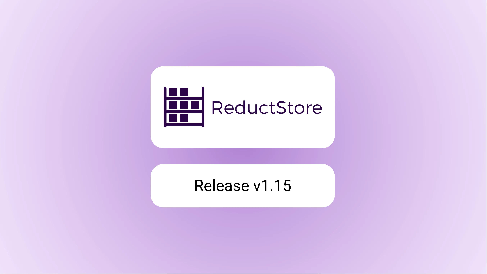
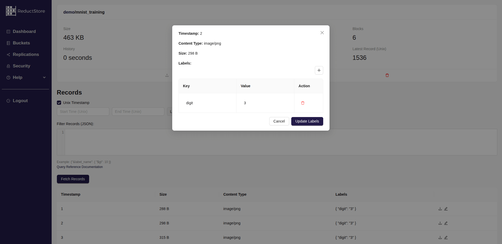

We are pleased to announce the release of the latest minor version of [**ReductStore**](/), [**1.15.0**](https://github.com/reductstore/reductstore/releases/tag/v1.15.0). ReductStore is a high-performance storage and streaming solution designed for storing and managing large volumes of historical data.

To download the latest released version, please visit our [**Download Page**](/download).

## What's new in 1.15.0?

This release includes several new features and enhancements. These are the extension API, the improved Web Console and the new conditional query operators.

{/* truncate */}

### Extension API

ReductStore is blob storage. It doesn't know anything about the data it stores.
We are determined to maintain this because it enables us to ingest and query data in any format with optimal performance.
We know that you sometimes need to perform processing and special queries based on the original data format.

For example, if you ingest data in the JSON format, you should be able to query only some fields of the JSON object or use it in the query condition for filtering.
The new extension API makes it possible.

The extension API is experimental and not yet documented. We are developing extensions for columnar data, CSV and mcap formats.
Once we have enough experience, we will document the API and publish the extensions so that you can build your own extensions for your data formats.

For most curious users, a demo extension that scales JPEG images on the fly can be found on GitHub: https://github.com/reductstore/img-ext

### Improved Web Console

In the v1.14.0 release, we introduced the ability to browse data in the Web Console.
This release includes two new features: the ability to upload files to the database and update labels in the Web Console.



The upload feature can be useful when you store some artifacts e.g. AI models or configuration files in the storage and want to update it occasionally.

### New Conditional Query Operators

We have expanded the set of conditional query operators with new ones that allow you to filter and aggregate data more effectively:

- `$each_n` - keeps only every N-th record in the result set.
- `$each_t` - keeps only one record within given time period in seconds.
- `$limit` - limits the number of records in the result set.
- `$timestamp` - allows you to filter records by timestamp.

The `$timestamp` operator can be particularly useful if you store timestamps and metadata in another database and want to retrieve blobs from ReductStore:

```python

client = Client("http://localhost:8080")
bucket = await client.get("my_bucket")
async for record in bucket.query(start=1231231081, end=1231231085,
    when ={
        "$in": [
            "$timestamp",
            1231231081,
            1231231082,
            1231231083,
            1231231084,
        ]
    },
):
    content = await record.read_all()

```

You can read more about the new operators in the [**Conditional Query**](/docs/conditional-query) documentation.

## What next?

We are constantly working on improving ReductStore and adding new features to provide the best experience for our users.
In the next few releases we plan to add new features and improvements, including:

### Integration with ROS

ReductStore is a great solution for storing and managing large amounts of data in robotic applications.
Currently, we are working on integrating ReductStore with ROS to provide a seamless experience for storing and retrieving data in ROS applications.
We have started a new [**ROS2 Agent**](https://github.com/reductstore/ros2-reduct-agent) that allows you to store and retrieve data in ReductStore from ROS2 applications. The agent is designed to be easy to use and integrate with existing ROS2 applications.
We are also going to add support for the mcap format with the new Extension API, which will allow you to retrieve data in the original format from mcap files, filter topics and many other features.

### Golang SDK

Our big goal is to integrate Grafana by the end of 2025. This month we started work on the Golang SDK, which is the first step towards achieving this goal.
The project is still in the early stages of development, but you can already check it out on GitHub: [**ReductStore Golang SDK**](https://github.com/reductstore/reduct-go).

---

I hope you find those new features useful. If you have any questions or feedback, don’t hesitate to use the [**ReductStore Community**](https://community.reduct.store/signup) forum.

Thanks for using [**ReductStore**](/)!
