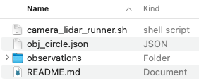
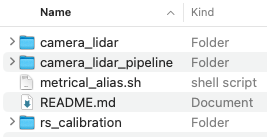
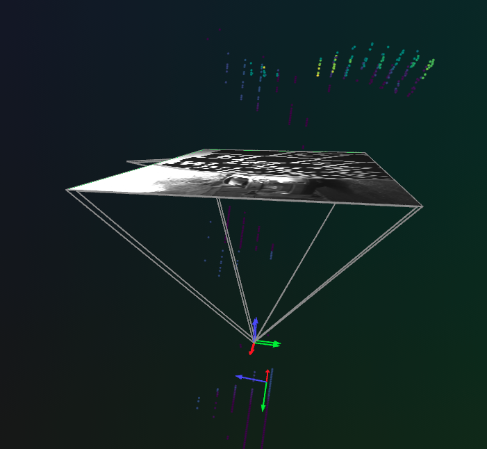
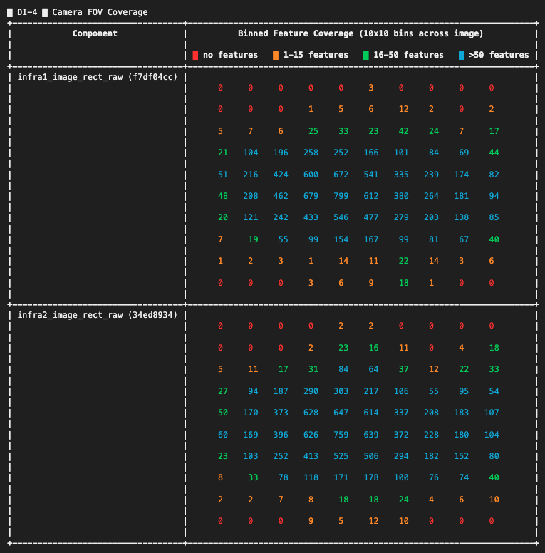
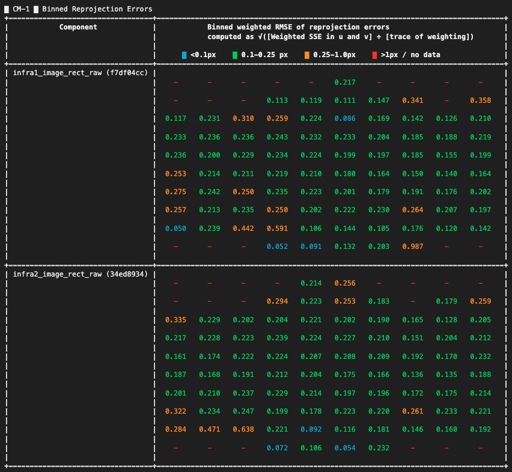
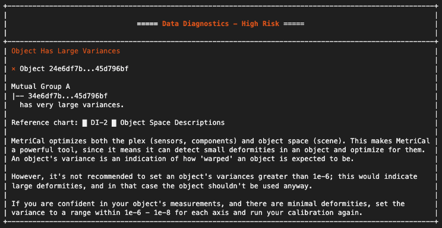

**Sensor calibration** is the process of determining the exact mathematical settings that describe how a sensor perceives or measures the physical world. By comparing sensor data to known reference values, we can fix measurement errors and make sure data from different sensors lines up properly.

There are two main types of calibration:

- **Intrinsic Parameters (Intrinsics):** These describe how a sensor works internally, such as lens distortion in cameras or bias and scaling errors in IMUs. Correcting intrinsics helps eliminate built-in measurement errors.

- **Extrinsic Parameters (Extrinsics):** These define the position and orientation of one sensor relative to another or to the environment. Understanding extrinsics lets us combine data from different sensors into the same coordinate system.

Accurate calibration is key to getting reliable, consistent data, which is critical for mapping, perception, and decision-making in robotics and autonomous systems.

{/* truncate */}

## What is MetriCal?

[**MetriCal**](https://www.tangramvision.com/products/calibration/metrical) is a calibration tool developed by Tangram Vision for working with systems that include different types of sensors. It’s designed to handle practical calibration scenarios and supports simultaneous processing of data from cameras, LiDARs, and IMUs. MetriCal can be used in both small-scale setups and larger, production-level environments, offering tools for precise and consistent multi-sensor calibration.

### Key Features

- **Flexible data input:** Supports ROSbags, MCAP files, and folder-based datasets (until July 2025)

- **Automatic extrinsics estimation:** Computes sensor and target poses without CAD models or manual setup

- **Unlimited sensor streams:** No restrictions on the number of input streams

- **Broad target support:** Works with a range of 2D and 3D [**targets**](https://docs.tangramvision.com/metrical/first_steps/choosing_targets), with [**premade**](https://gitlab.com/tangram-vision/platform/metrical_premade_targets) templates

- **Modular calibration workflow:** Supports splitting calibration into multiple datasets and stages 

- **Detailed diagnostics:** Visual and numerical feedback on data quality and calibration performance

- **ROS integration:** Outputs can be exported as [**URDF**](https://docs.tangramvision.com/metrical/modes/shape/shape_urdf) files

- **Pixel-level corrections:** Generate lookup tables for single-camera undistortion and stereo rectification

- **Lightweight deployment:** CPU-only operation; runs on compact devices like Intel NUCs or in the cloud

## How MetriCal Works?

MetriCal is structured as a CLI-based, fully scriptable pipeline designed to support reproducible workflows and automation. The core calibration process is divided into four main stages:

**1. Initialization ([init](https://docs.tangramvision.com/metrical/modes/init))**

Before this step, we must carefully select and construct appropriate calibration [**targets**](https://docs.tangramvision.com/metrical/first_steps/choosing_targets),then capture high-quality data according to the [**guidelines**](https://docs.tangramvision.com/metrical/first_steps/data_capture).

Once the dataset and configuration files are prepared, MetriCal’s init mode analyzes the observations and relationships within the data to infer an initial sensor graph (called a [**plex**](https://docs.tangramvision.com/metrical/core_concepts/plex/overview)), specifying sensor types, model parameters, calibration targets, and the intended layout. This plex serves as the structured starting point for all further calibration operations.

**2. Calibration ([calibrate](https://docs.tangramvision.com/metrical/modes/calibrate))**

MetriCal uses nonlinear optimization to refine the initial plex. It adjusts intrinsic and extrinsic parameters, as well as time offsets if needed. The [**object space**](https://docs.tangramvision.com/metrical/core_concepts/object_space/overview) geometry is fine-tuned, motion artifacts are filtered out, and detections are cached for future runs. We can also visualize the detection process and calibration data in this step.

**3. Diagnostics & Visualization ([**display**](https://docs.tangramvision.com/metrical/modes/display))**

MetriCal generates a detailed diagnostic [**report**](https://docs.tangramvision.com/metrical/results/report) with color-coded charts that summarize calibration quality. These include camera model accuracy, field-of-view coverage, motion sufficiency, and synchronization health. Warnings are grouped by severity to help identify what needs attention.

Calibration results are visualized in [**Rerun**](https://docs.tangramvision.com/metrical/configuration/visualization), helping inspect residuals, assess target coverage, and validate confidence levels — a quick check before export. This step can also be used to test results on a separate dataset.

**4. Export ([**shape**](https://docs.tangramvision.com/metrical/modes/shape/shape_overview))**

After calibration, results are exported in formats ready for deployment, such as ROS URDFs and JSON camera models, or stereo rectification LUTs. These outputs capture both the optimized system geometry and diagnostics for downstream use or inspection.

Each calibration produces a structured result file containing:

- **Optimized Plex:** refined spatial layout of all components

- **Optimized Object Space:** updated model of calibration objects (e.g. flatness of checkerboards)

- **Summary Statistics**

- **Residual Metrics:** observation-level errors across all modalities

## MetriCal Example

To evaluate MetriCal’s multi-sensor capabilities, we try the official [**example**](https://gitlab.com/tangram-vision/platform/metrical/-/tree/main/examples/camera_lidar) that demonstrates a typical use case: calibrating a multi-sensor setup with two cameras and a LiDAR.  This example shows how MetriCal simultaneously estimates the spatial relationships between the sensors and refines the target geometry using real-world data.

The dataset includes synchronized observations from two cameras and one LiDAR, capturing a [**LiDAR circle target**](https://docs.tangramvision.com/metrical/configuration/targets?target-type=circle) across multiple viewpoints. This allows MetriCal to simultaneously resolve:

- Intrinsics and poses for both cameras

- Extrinsics between each camera and the LiDAR

- Target geometry and consistency across views

**Installation**

We [**installed**](https://docs.tangramvision.com/metrical/configuration/installation?install-method=docker) MetriCal via Docker. Make sure you have set up an alias during the installation:

```bash #zsh, using bash for highlighting only
~/.zshrc

metrical() {
    docker run --rm --tty --init --user="$(id -u):$(id -g)" \
    --volume="$PATH/metrical/":"/datasets" \
    --volume=metrical-license-cache:/.cache/tangram-vision \
    --workdir="/datasets" \
    --add-host=host.docker.internal:host-gateway \
    tangramvision/cli:latest \
    --license="LICENSE KEY" \
    "$@";
}
```

**Running Calibration**

After cloning the [**repository**](https://gitlab.com/tangram-vision/platform/metrical), we downloaded and unpacked the `.zip` [**file**](https://drive.google.com/file/d/1UFKpVXNI1IZPRiupODyhU0tMedXabKEn/view?usp=drive_link), then placed the `observations` folder into `$PATH/metrical/examples/camera_lidar`.



Before doing so, ensure that you have configured your `LICENSE` variable in the `metrical_alias.sh` file located in `$PATH/metrical/examples`.



Once everything is configured, you can run the full pipeline by executing the provided shell script:

```bash
$PATH/metrical/examples/camera_lidar/camera_lidar_runner.sh
```

**[**Visualization**](https://docs.tangramvision.com/metrical/modes/display) of Results**

We installed [**Rerun**](https://docs.tangramvision.com/metrical/configuration/visualization#installing-rerun) using `pip` and started the Rerun server on a separate terminal tab.

Running the following command in the terminal visualizes the calibration results and shows the data in real-time:

```zsh
metrical display /datasets/examples/camera_lidar/observations /datasets/examples/camera_lidar/results.json
```



### [Understanding Results](https://docs.tangramvision.com/metrical/results/report)

Performing a calibration, MetriCal generates a series of charts and diagnostic outputs. These results provide a comprehensive view of the calibration quality and help identify areas where the process may need refinement.

#### Data Inputs (DI Section)

The Data Inputs section gives an overview of the dataset used during calibration. It ensures that the input data was appropriate for a successful calibration.

**Key Metrics:**

- **Processed Observation Count (DI-3):** Indicates how many features were detected, how many passed quality filters, and how many passed the motion filter. A significant drop in these values can suggest issues with your dataset quality or configuration.

```text
█ DI-3 █ Processed Observation Count
+----------------------------------+--------+-------------------+------------------------+-----------------------+
| Component                        | # read | # with detections | # after quality filter | # after motion filter |
+----------------------------------+--------+-------------------+------------------------+-----------------------+
| infra1_image_rect_raw (f7df04cc) |    283 |               276 |                    273 |                   273 |
+----------------------------------+--------+-------------------+------------------------+-----------------------+
| infra2_image_rect_raw (34ed8934) |    284 |               282 |                    278 |                   278 |
+----------------------------------+--------+-------------------+------------------------+-----------------------+
|      velodyne_points1 (38140838) |   2750 |              2026 |                   2026 |                  2026 |
+----------------------------------+--------+-------------------+------------------------+-----------------------+
```

- **Camera FOV Coverage (DI-4):** Displays the coverage of detected features across the camera’s field of view (FOV). Ideal coverage is characterized by minimal red cells, which represent areas with no detected features.



If you observe that many detections were filtered out, verify the quality of your input data (e.g., sensor noise, improper lighting, or misconfigured thresholds).

For FOV coverage, ensure that the cameras are capturing data from all parts of the scene. Gaps in coverage can lead to poor calibration, especially for intrinsic parameters.

#### Camera Modeling (CM Section)

The Camera Modeling section evaluates how well the camera models fit the actual calibration data. This is critical for assessing the accuracy of your camera’s intrinsic calibration, which directly impacts image quality and the effectiveness of vision-based applications.

**Key Metrics:**

- **Binned Reprojection Errors (CM-1):** This heatmap shows the reprojection errors across the camera’s FOV. Color coding indicates error magnitude, with cyan/green representing low error and red/orange indicating significant inaccuracies.



- **Stereo Pair Rectification Error (CM-2):** For multi-camera setups, this shows the stereo rectification error between camera pairs, indicating how well the cameras are aligned for stereo vision.

```text
█ CM-2 █ Stereo Pair Rectification Error
+---------------------------------------+--------------+-------+-------------------------------------------------------------------------------------+
| Stereo Pair                           | # Mutual Obs | RMSE  | Binned rectified error (px)                                                         |
+---------------------------------------+--------------+-------+-------------------------------------------------------------------------------------+
| Dominant eye:  infra1_image_rect_raw  | 155          | 0.742 | ⡇⠀⠀⠀⠀⠀⠀⠀⠀⠀⠀⠀⠀⠀⠀⠀⠀⠀⠀⠀⠀⠀⠀⠀⠀⠀⠀⠀⠀⠀⠀⠀⠀⠀⠀⠀⠀⠀⠀⠀⠀⠀⠀⠀⠀⠀⠀⠀⠀⠀⠀⠀⠀⠀⠀⠀⠀⠀⠀⠀⠀⠀⠀⠀⠀⠀⠀⠀⠀⠀⠀⠀⠀⠀⠀⠀ 3202.0 |
| Secondary eye: infra2_image_rect_raw  |              |       | ⡇⠀⠀⠀⠀⠀⠀⠀⠀⠀⠀⠀⠀⠀⠀⠀⠀⠀⠀⠀⠀⠀⠀⠀⠀⠀⠀⠀⠀⠀⠀⠀⠀⠀⠀⠀⠀⠀⠀⠀⠀⠀⠀⠀⠀⠀⠀⠀⠀⠀⠀⠀⠀⠀⠀⠀⠀⠀⠀⠀⠀⠀⠀⠀⠀⠀⠀⠀⠀⠀⠀⠀⠀⠀⠀⠀        |
|                                       |              |       | ⡇⠀⠀⠀⠀⠀⠀⠀⠀⠀⠀⠀⠀⠀⠀⠀⠀⠀⠀⠀⠀⠀⠀⠀⠀⠀⠀⠀⠀⠀⠀⠀⠀⠀⠀⠀⠀⠀⠀⠀⠀⠀⠀⠀⠀⠀⠀⠀⠀⠀⠀⠀⠀⠀⠀⠀⠀⠀⠀⠀⠀⠀⠀⠀⠀⠀⠀⠀⠀⠀⠀⠀⠀⠀⠀⠀        |
|                                       |              |       | ⣇⣀⠀⠀⠀⠀⠀⠀⠀⠀⠀⠀⠀⠀⠀⠀⠀⠀⠀⠀⠀⠀⠀⠀⠀⠀⠀⠀⠀⠀⠀⠀⠀⠀⠀⠀⠀⠀⠀⠀⠀⠀⠀⠀⠀⠀⠀⠀⠀⠀⠀⠀⠀⠀⠀⠀⠀⠀⠀⠀⠀⠀⠀⠀⠀⠀⠀⠀⠀⠀⠀⠀⠀⠀⠀⠀        |
|                                       |              |       | ⡇⢸⠀⠀⠀⠀⠀⠀⠀⠀⠀⠀⠀⠀⠀⠀⠀⠀⠀⠀⠀⠀⠀⠀⠀⠀⠀⠀⠀⠀⠀⠀⠀⠀⠀⠀⠀⠀⠀⠀⠀⠀⠀⠀⠀⠀⠀⠀⠀⠀⠀⠀⠀⠀⠀⠀⠀⠀⠀⠀⠀⠀⠀⠀⠀⠀⠀⠀⠀⠀⠀⠀⠀⠀⠀⠀        |
|                                       |              |       | ⡇⢸⠀⠀⠀⠀⠀⠀⠀⠀⠀⠀⠀⠀⠀⠀⠀⠀⠀⠀⠀⠀⠀⠀⠀⠀⠀⠀⠀⠀⠀⠀⠀⠀⠀⠀⠀⠀⠀⠀⠀⠀⠀⠀⠀⠀⠀⠀⠀⠀⠀⠀⠀⠀⠀⠀⠀⠀⠀⠀⠀⠀⠀⠀⠀⠀⠀⠀⠀⠀⠀⠀⠀⠀⠀⠀        |
|                                       |              |       | ⡇⢸⣀⡀⠀⠀⠀⠀⠀⠀⠀⠀⠀⠀⠀⠀⠀⠀⠀⠀⠀⠀⠀⠀⠀⠀⠀⠀⠀⠀⠀⠀⠀⠀⠀⠀⠀⠀⠀⠀⠀⠀⠀⠀⠀⠀⠀⠀⠀⠀⠀⠀⠀⠀⠀⠀⠀⠀⠀⠀⠀⠀⠀⠀⠀⠀⠀⠀⠀⠀⠀⠀⠀⠀⠀⠀        |
|                                       |              |       | ⠇⠸⠀⠏⠹⠒⠖⠲⠒⠖⠲⠒⠦⠤⠤⠤⠤⠤⠤⠤⠤⠤⠤⠤⠤⠤⠤⠤⠤⠤⠤⠤⠤⠤⠤⠤⠤⠤⠤⠤⠤⠤⠤⠤⠤⠤⠤⠤⠤⠤⠤⠤⠤⠤⠤⠤⠤⠤⠤⠤⠤⠤⠤⠤⠤⠤⠤⠤⠤⠤⠤⠤⠤⠤⠀⠀ 0.0    |
|                                       |              |       | 0.0                                                                     7.0         |
+---------------------------------------+--------------+-------+-------------------------------------------------------------------------------------+
```

Ideally, most of the reprojection error should fall in the cyan or green range. If certain areas have high error (orange or red), consider improving the camera model, increasing data coverage, or using better calibration targets.

For multi-camera setups, ensure that the stereo pairs have minimal rectification error, which is crucial for accurate depth perception.

#### Extrinsics Info (EI Section)

The Extrinsics Information section focuses on the spatial relationships between components in the calibration setup. Accurate extrinsic calibration ensures that the relative positions and orientations of your sensors are well understood.

**Key Metrics:**

- **Component Extrinsics Errors (EI-1):** Displays the RMSE of translation and rotation errors between pairs of components. Smaller values indicate better alignment.

```text
█ EI-1 █ Component Extrinsics Errors
+--------------------------------------------+----------+----------+----------+----------+-----------+---------+
| Weighted Component Relative Extrinsic RMSE | X (m)    | Y (m)    | Z (m)    | Roll (°) | Pitch (°) | Yaw (°) |
| Rotation is Euler XYZ ext                  |          |          |          |          |           |         |
+--------------------------------------------+----------+----------+----------+----------+-----------+---------+
| To: infra1_image_rect_raw (f7df04cc),      | 2.254e-3 | 1.802e-3 | 3.780e-3 |    0.077 |     0.100 |   0.148 |
|    From: infra2_image_rect_raw (34ed8934)  |          |          |          |          |           |         |
+--------------------------------------------+----------+----------+----------+----------+-----------+---------+
```

- **Observed Camera Range of Motion (EI-3):** Shows how much motion was observed for each camera during the data collection. Sufficient motion is required for an accurate calibration, especially for depth and orientation.

```text
█ EI-3 █ Observed Camera Range of Motion
+----------------------------------+--------+----------------------+--------------------+
| Camera                           | Z (m)  | Horizontal angle (°) | Vertical angle (°) |
+----------------------------------+--------+----------------------+--------------------+
| infra1_image_rect_raw (f7df04cc) | 6.308  | 127.081              | 63.801             |
+----------------------------------+--------+----------------------+--------------------+
| infra2_image_rect_raw (34ed8934) | 6.434  | 144.606              | 126.280            |
+----------------------------------+--------+----------------------+--------------------+
```

If extrinsics errors are large, investigate whether all components are positioned and oriented correctly.

A limited range of motion (especially in the Z-axis, or depth) can lead to poor calibration of camera intrinsics and extrinsics. Ensure that cameras and sensors are moved sufficiently during data collection to cover a wide range of positions and angles.

#### Calibrated Plex (CP Section)

The Calibrated Plex section displays the final results of your calibration, including the intrinsic and extrinsic parameters that can be used for your system.

**Key Metrics:**

- **Camera Metrics (CP-1):** Contains the intrinsic parameters of each camera, including focal length, principal point, and distortion coefficients. The standard deviations (±) indicate the uncertainty of each parameter.

```text
█ CP-1 █ Camera Metrics
+----------------------------------+-------------------------+-----------------------------------------+--------------------------------------+
| Camera                           | Specs                   | Projection Model                        | Distortion Model                     |
+----------------------------------+-------------------------+-----------------------------------------+--------------------------------------+
| infra1_image_rect_raw (f7df04cc) |  width (px)        848  |  Pinhole                                |      OpenCV Distortion               |
|                                  |  height (px)       480  |  f (px)      431.914 ±      0.224 (1σ)  |  k1   -1.574e-3 ±   8.715e-4 (1σ)    |
|                                  |  pixel pitch (um)  1    |  cx (px)     421.938 ±      0.395 (1σ)  |  k2       0.011 ±   1.876e-3 (1σ)    |
|                                  |                         |  cy (px)     230.592 ±      0.465 (1σ)  |  k3   -6.171e-3 ±   1.241e-3 (1σ)    |
|                                  |                         |                                         |  p1   -2.037e-3 ±   2.680e-4 (1σ)    |
|                                  |                         |                                         |  p2   -1.479e-3 ±   2.443e-4 (1σ)    |
|                                  |                         |                                         |                                      |
+----------------------------------+-------------------------+-----------------------------------------+--------------------------------------+
| infra2_image_rect_raw (34ed8934) |  width (px)        848  |  Pinhole                                |      OpenCV Distortion               |
|                                  |  height (px)       480  |  f (px)      429.085 ±      0.215 (1σ)  |  k1   -3.050e-4 ±   8.638e-4 (1σ)    |
|                                  |  pixel pitch (um)  1    |  cx (px)     421.203 ±      0.387 (1σ)  |  k2    1.517e-3 ±   1.809e-3 (1σ)    |
|                                  |                         |  cy (px)     230.821 ±      0.436 (1σ)  |  k3   -6.881e-4 ±   1.170e-3 (1σ)    |
|                                  |                         |                                         |  p1   -1.887e-3 ±   2.510e-4 (1σ)    |
|                                  |                         |                                         |  p2   -1.630e-3 ±   2.358e-4 (1σ)    |
|                                  |                         |                                         |                                      |
+----------------------------------+-------------------------+-----------------------------------------+--------------------------------------+
```

- **Calibrated Extrinsics (CP-3):** Shows the final relative positions and orientations of all components in the system.

```text
█ CP-3 █  Calibrated Extrinsics
+---------------------------+------------+-----------------+----------------------+---------------+---------------------+
| Final Extrinsics          | Subplex ID | Translation (m) | Diff from input (mm) | Rotation (°)  | Diff from input (°) |
| 'To' component is Origin  |            |                 |                      |               |                     |
| Rotation is Euler XYZ ext |            |                 |                      |               |                     |
+---------------------------+------------+-----------------+----------------------+---------------+---------------------+
| To: infra1_image_rect_raw | A          | X: 0.360        | ΔX: 359.862          | Roll: -85.208 | ΔRoll: -85.208      |
|     f7df04cc, RDF         |            | Y: 0.083        | ΔY: 82.722           | Pitch: -2.812 | ΔPitch: -2.812      |
| From: velodyne_points1    |            | Z: 0.048        | ΔZ: 48.451           | Yaw: 171.579  | ΔYaw: 171.579       |
|     38140838, Unknown     |            |                 |                      |               |                     |
+---------------------------+------------+-----------------+----------------------+---------------+---------------------+
| To: infra2_image_rect_raw | A          | X: 0.319        | ΔX: 318.513          | Roll: -85.317 | ΔRoll: -85.317      |
|     34ed8934, RDF         |            | Y: 0.086        | ΔY: 85.533           | Pitch: -2.717 | ΔPitch: -2.717      |
| From: velodyne_points1    |            | Z: 0.033        | ΔZ: 33.454           | Yaw: 171.470  | ΔYaw: 171.470       |
|     38140838, Unknown     |            |                 |                      |               |                     |
+---------------------------+------------+-----------------+----------------------+---------------+---------------------+
```
These values should be used to update your system configuration, ensuring that your cameras, IMUs, and other sensors are aligned according to the calibrated results.

Significant differences between initial and final values may indicate that your initial guesses for positions or orientations were incorrect, and that the calibration process significantly adjusted these values.

#### Summary Statistics (SS Section)

The Summary Statistics section provides a high-level overview of the optimization process and the overall calibration quality.

- **Optimization Summary Statistics (SS-1):** Includes the overall reprojection error and the posterior variance, which indicate the calibration’s accuracy and uncertainty.

```text
█ SS-1 █ Optimization Summary Statistics
+------------------------+----------+
| Optimized Object RMSE, | 0.206 px |
| based on all cameras   |          |
+------------------------+----------+
| Posterior Variance     | 0.731    |
+------------------------+----------+
```

- **Camera Summary Statistics (SS-2):** Summarizes the reprojection errors for each camera. An RMSE under 0.5 pixels is typically acceptable; under 0.2 pixels is excellent.

```text
█ SS-2 █ Camera Summary Statistics
+----------------------------------+------------------------------------------+
| Camera                           | Reproj. RMSE, outliers downweighted (px) |
+----------------------------------+------------------------------------------+
| infra1_image_rect_raw (f7df04cc) | 0.209 px                                 |
+----------------------------------+------------------------------------------+
| infra2_image_rect_raw (34ed8934) | 0.204 px                                 |
+----------------------------------+------------------------------------------+
```

- **LiDAR Summary Statistics (SS-3):** If LiDAR is included, these metrics show the calibration error for various LiDAR-camera and LiDAR-LiDAR pairs.

```text
█ SS-3 █ LiDAR Summary Statistics
+-----------------------------+-------------------------------+------------------------------------+--------------------------+--------------------------+
| LiDAR                       | Circle misalignment RMSE with | Circle edge misalignment RMSE with | Interior point RMSE with | Plane normal difference, |
|                             | all cameras, outliers         | all cameras, outliers              | all cameras, outliers    | lidar-lidar, outliers    |
|                             | downweighted (m)              | downweighted (m)                   | downweighted (m)         | downweighted (deg)       |
+-----------------------------+-------------------------------+------------------------------------+--------------------------+--------------------------+
| velodyne_points1 (38140838) | 0.020 m                       | 0.028 m                            | 0.018 m                  | (n/a)                    |
+-----------------------------+-------------------------------+------------------------------------+--------------------------+--------------------------+
```

Ensure that the overall reprojection error (RMSE) is within acceptable limits. If it's too high, revisit the dataset to improve the quality and coverage of the input data.

Use the LiDAR RMSE to assess the alignment between LiDAR and camera sensors. Significant errors here may require revisiting the LiDAR calibration or the way LiDAR and camera data are synchronized.

#### Diagnostics

The Diagnostics section highlights potential issues with your calibration setup, data, or process.



**High-Risk Diagnostics:** Issues such as insufficient camera motion, missing components, or poor feature detections that require immediate attention.

**Medium and Low-Risk Diagnostics:** Less critical issues, but still worth addressing for improved calibration quality.

Address any high-risk issues immediately to ensure the integrity of your calibration. For example, if the system flags "Poor Camera Range of Motion," capture additional data with more diverse camera movements.

Medium- and low-risk issues, while not critical, should still be monitored and corrected when possible to improve the overall quality of the calibration.

```text
+------------------------+------------------------------------------------------------+
| Results JSON           | /datasets/camera_lidar/results.json                        |
+------------------------+------------------------------------------------------------+
| Calibrated Plex        | Run `jq .plex [results.json] > optimized_plex.json`        |
+------------------------+------------------------------------------------------------+
| Optimized Object Space | Run `jq .object_space [results.json] > optimized_obj.json` |
+------------------------+------------------------------------------------------------+
| Cached Detections JSON | /datasets/camera_lidar/observations.detections.json        |
+------------------------+------------------------------------------------------------+
| Report Path            | /datasets/camera_lidar/report.html                         |
+------------------------+------------------------------------------------------------+
```

---

## Conclusion

---

We hope this tutorial provided a ... If you have any questions or comments, feel free to use the [**ReductStore Community Forum**](https://community.reduct.store/signup).