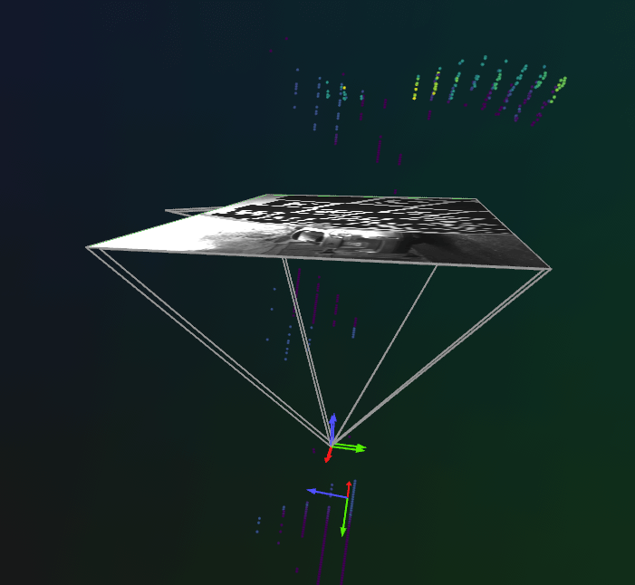
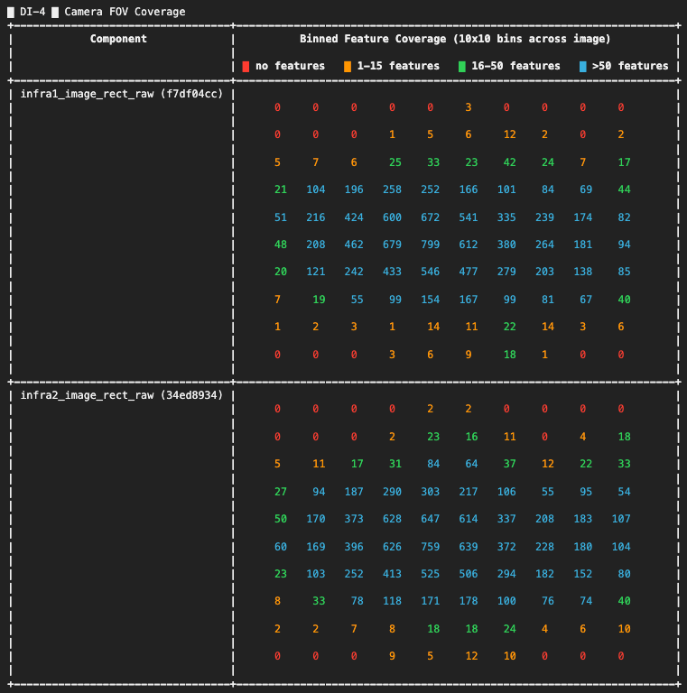
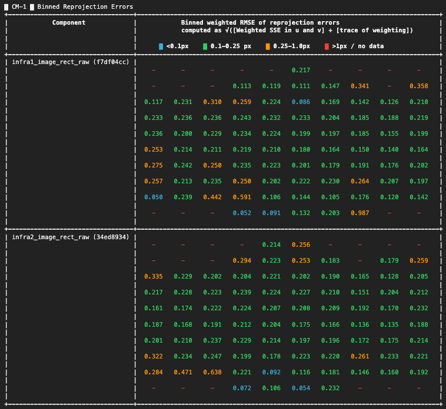
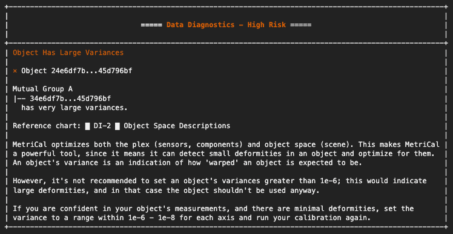

**Sensor calibration** is the process of determining the precise mathematical parameters that describe how a sensor perceives or measures the physical world. By comparing sensor outputs to known reference values, we can correct measurement errors and ensure data from different sensors align accurately.

There are two main categories of calibration parameters:

- **Intrinsic parameters (Intrinsics):** These capture the internal characteristics of a sensor, such as lens distortion in cameras or bias and scaling errors in IMUs. Calibrating intrinsics helps eliminate built-in measurement errors.

- **Extrinsic parameters (Extrinsics):** These define a sensor's position and orientation relative to another sensor or the environment. Accurate extrinsics are essential for transforming and combining data from multiple sensors into a shared coordinate system.

{/* truncate */}

High-quality calibration is key to getting reliable, consistent data, which is critical for mapping, perception, and decision-making in robotics and autonomous systems. Recognizing this need, [**ReductStore**](/) can be used to manage the entire calibration data pipeline — from raw inputs such as LiDAR scans and calibration images to the output files produced during processing (e.g., intrinsic/extrinsic parameters, transformation matrices). When used together with tools like [**MetriCal**](https://www.tangramvision.com/products/calibration/metrical), which streamline the calibration of multimodal sensor data, ReductStore can help enable scalable, automated workflows across distributed systems by making it easy to collect, store, and manage sensor data directly at the edge. Calibration results can then be saved back to ReductStore for persistent access and reuse.

## What is MetriCal?

[**MetriCal is a calibration tool developed by Tangram Vision**](https://docs.tangramvision.com/metrical/intro/) for systems that include diverse types of sensors. It’s designed to handle real-world calibration scenarios and supports the simultaneous processing of data from cameras, LiDARs, and IMUs. MetriCal is suitable for both small-scale setups and larger, production-level environments, providing tools for precise and consistent multi-sensor calibration.

### Key Features

- **ROS Data Input:** Supports `.bag` and `.mcap` files (recommended)

- **Automatic Extrinsics Estimation:** Computes sensor and target poses without requiring CAD models or manual setup

- **Unlimited Sensor Streams:** Supports an arbitrary number of input streams

- **Broad Target Support:** Compatible with both 2D and 3D targets; includes a library of premade targets and supports multiple targets at once

- **Modular Calibration Workflow:** Allows splitting the calibration process into multiple datasets and stages

- **Detailed Diagnostics:** Provides visual and numerical feedback on data quality and calibration performance

- **ROS Integration:** Outputs calibration results as an URDF file

- **Pixel-Level Corrections:** Generates lookup tables for single-camera undistortion and stereo rectification

- **Lightweight Deployment:** CPU-only operation; runs efficiently on compact devices like Intel NUCs or in the cloud

## How MetriCal Works

MetriCal is structured as a CLI-based, fully scriptable pipeline designed to support reproducible workflows and automation. The core calibration process can be divided into the following stages:

**1. Preparation**

The quality of calibration strongly depends on the choice of targets and the quality of the input data. It's important to select or build targets suited to your use case and follow MetriCal’s data capture guidelines to ensure the collected data meets the required quality standards.

At this stage, you'll also prepare an **object space file**, which describes all calibration targets and their properties.

**2. Initialization**

Once the dataset and configuration files are ready, MetriCal’s `init mode` analyzes sensor observations to infer a raw input **plex** — a description of the spatial, temporal, and semantic relationships within your perception system. It represents the physical system being calibrated and serves as the starting point for all further calibration steps.

> If you already have a plex with existing calibration results that you want to preserve, it can be used as a seed for an init plex.

**3. Calibration**

In `calibrate mode`, MetriCal performs a full bundle adjustment to refine both the initial plex and the object space. It applies motion filtering to remove features affected by motion blur, rolling shutter, false detections, and other artifacts in images or point clouds.

A `.json` cache file is created at this step. This file stores detected objects, allowing future runs to skip the detection process and complete faster.

> The calibration data capture and detection process can also be visualized during this step.

**4. Diagnostics**

MetriCal generates a detailed diagnostic report with color-coded charts summarizing calibration quality:

- **Cyan** – spectacular
- **Green** – good
- **Orange** – okay, but generally poor
- **Red** – bad

**5. Visualization**

In `display mode`, calibration results are visualized using [**Rerun, an open-source tool for multimodal data visualization**](https://rerun.io/). It allows you to quickly verify the calibration quality before exporting.

> Typically, the same dataset is used for visualization, but you can also use a different one if it has the same topic names.

**6. Export**

In `shape mode`, the optimized plex can be transformed into various configurations for use in deployed systems, for example, ROS URDFs or pixel-wise lookup tables.

> MetriCal also includes several additional modes to support advanced workflows: `completion mode`, `consolidate object spaces mode`, `pipeline mode`, and `pretty print mode`.

## MetriCal Example

To test MetriCal’s multi-sensor capabilities, we use the [**official example featuring two cameras and a LiDAR**](https://gitlab.com/tangram-vision/platform/metrical/-/tree/main/examples/camera_lidar). The dataset contains synchronized observations from all three sensors, capturing a LiDAR circle target from different angles. This allows MetriCal to calculate:

- Intrinsics and poses for both cameras

- Extrinsics between each camera and the LiDAR

- Target geometry and consistency across different views

**Installation**

We installed MetriCal via Docker. Make sure to set up an alias for convenient access during installation:

```bash #zsh, using bash for highlighting only
~/.zshrc

metrical() {
    docker run --rm --tty --init --user="$(id -u):$(id -g)" \
    --volume="$PATH/metrical/":"/datasets" \
    --volume=metrical-license-cache:/.cache/tangram-vision \
    --workdir="/datasets" \
    --add-host=host.docker.internal:host-gateway \
    tangramvision/cli:latest \
    --license="LICENSE KEY" \
    "$@";
}
```

> MetriCal requires a license key.

You can also install MetriCal natively on `Ubuntu` or `Pop!_OS`.

**Calibration**

After cloning the repository, download and unzip the `.zip` file. Place the observations folder into:

```zsh
$PATH/metrical/examples/camera_lidar
```

Next, set the `LICENSE` variable inside `metrical_alias.sh`, located in the same directory.

Once everything is configured, you can run the full calibration pipeline using the provided shell script:

```zsh
$PATH/metrical/examples/camera_lidar/camera_lidar_runner.sh
```

**Visualization**

To visualize the results, install Rerun via `pip` and launch the Rerun server in a separate terminal tab.

Then, run the following command to display calibration results in `display mode` and view the data in real time:

```zsh
metrical display /datasets/examples/camera_lidar/observations /datasets/examples/camera_lidar/results.json
```



### Understanding Results

During calibration, MetriCal produces charts and diagnostics that show the quality of the process and highlight areas that may need improvement.

#### Data Inputs (DI Section)

The Data Inputs section provides an overview of the input data and ensures that the dataset is appropriate for a successful calibration.

**Key Metrics:**

- **Calibration Inputs (DI-1):** Displays basic configuration parameters.

```text█ DI-1 █ Calibration Inputs
+--------------------------------------+----------+
| Calibration Parameter                | Value    |
+--------------------------------------+----------+
| MetriCal Version                     | 13.2.1   |
+--------------------------------------+----------+
| Optimization Profile                 | Standard |
+--------------------------------------+----------+
| Camera Motion Threshold              | Disabled |
+--------------------------------------+----------+
| Lidar Motion Threshold               | Disabled |
+--------------------------------------+----------+
| Preserve Input Constraints           | Disabled |
+--------------------------------------+----------+
| Object Relative Extrinsics Inference | Enabled  |
+--------------------------------------+----------+
```

- **Object Space Descriptions(DI-2):** Describes the calibration targets (object spaces).

```text█ DI-2 █ Object Space Descriptions
+-------------+-------------------------+---------------------------------------+------------------------+
| Type        | UUID                    | Detector                              | Variance               |
+-------------+-------------------------+---------------------------------------+------------------------+
| Circle      | 34e6df7b...45d796bf     | - 0.6m radius                         | 1e-8, 1e-8, 1e-8       |
|             |                         | - 0.375m x offset                     |                        |
|             | Mutual Group A          | - 0.375m y offset                     |                        |
|             | |-- 24e6df7b...45d796bf | - 0m z offset                         |                        |
|             |                         | - 0.05m reflective tape width         |                        |
|             |                         | - Detect interior points: true        |                        |
+-------------+-------------------------+---------------------------------------+------------------------+
| Markerboard | 24e6df7b...45d796bf     | - 7x7 grid                            | 0.0002, 0.0002, 0.0002 |
|             |                         | - 0.097m markers                      |                        |
|             | Mutual Group A          | - 0.125m checkers (aka solid squares) |                        |
|             | |-- 34e6df7b...45d796bf | - Dictionary: Aruco4x4_1000           |                        |
|             |                         | - Marker IDs start at 0               |                        |
|             |                         | - Top-left corner is a Marker         |                        |
+-------------+-------------------------+---------------------------------------+------------------------+
```

- **Processed Observation Count (DI-3):** Shows how many observations were processed from the dataset.

  If you observe that a significant number of detections were filtered out, verify the quality of the input data or settings (e.g., sensor noise).

```text
█ DI-3 █ Processed Observation Count
+----------------------------------+--------+-------------------+------------------------+-----------------------+
| Component                        | # read | # with detections | # after quality filter | # after motion filter |
+----------------------------------+--------+-------------------+------------------------+-----------------------+
| infra1_image_rect_raw (f7df04cc) |    283 |               276 |                    273 |                   273 |
+----------------------------------+--------+-------------------+------------------------+-----------------------+
| infra2_image_rect_raw (34ed8934) |    284 |               282 |                    278 |                   278 |
+----------------------------------+--------+-------------------+------------------------+-----------------------+
|      velodyne_points1 (38140838) |   2750 |              2026 |                   2026 |                  2026 |
+----------------------------------+--------+-------------------+------------------------+-----------------------+
```

- **Camera FOV Coverage (DI-4):** Displays how well the calibration data covers the field of view (FOV) of each camera. Ideal coverage is characterized by minimal red cells, which represent areas without detected features.

  For FOV coverage, ensure that the cameras are capturing data from all parts of the scene. Gaps in coverage can lead to poor calibration, especially for intrinsic parameters.



- **Detection Timeline(DI-5):** Displays when detections occurred across the dataset timeline. Each row corresponds to a different sensor, making it easier to check synchronization.

```text█ DI-5 █ Detection Timeline
+----------------------------------+-------------------------------------------------------------------------------------------------+
|            Components            |          Detection Timeline (x axis is seconds elapsed since first observation)                 |
|                                  |          Every point on the timeline represents an observation with detected features.          |
+----------------------------------+-------------------------------------------------------------------------------------------------+
|                                  | ⡁⠀⠀⠀⠀⠀⠀⠀⠀⠀⠀⠀⠀⠀⠀⠀⠀⠀⠀⠀⠀⠀⠀⠀⠀⠀⠀⠀⠀⠀⠀⠀⠀⠀⠀⠀⠀⠀⠀⠀⠀⠀⠀⠀⠀⠀⠀⠀⠀⠀⠀⠀⠀⠀⠀⠀⠀⠀⠀⠀⠀⠀⠀⠀⠀⠀⠀⠀⠀⠀⠀⠀⠀⠀⠀⠀⠀⠀⠀⠀⠀⠀⠀⠀⠀⠀⠀⠀⠀⠀⠀ 4.0 |
| infra1_image_rect_raw (f7df04cc) | ⠄⠀⠀⠀⠀⠀⠀⠀⠀⠀⠀⠀⠀⠀⠀⠀⠀⠀⠀⠀⠀⠀⠀⠀⠀⠀⠀⠀⠀⠀⠀⠀⠀⠀⠀⠀⠀⠀⠀⠀⠀⠀⠀⠀⠀⠀⠀⠀⠀⠀⠀⠀⠀⠀⠀⠀⠀⠀⠀⠀⠀⠀⠀⠀⠀⠀⠀⠀⠀⠀⠀⠀⠀⠀⠀⠀⠀⠀⠀⠀⠀⠀⠀⠀⠀⠀⠀⠀⠀⠀⠀     |
| infra2_image_rect_raw (34ed8934) | ⠂⠀⠀⠀⠀⠀⠀⠀⠀⠀⠀⠀⠀⠈⠉⠁⠉⠉⠉⠁⠉⠀⠉⠉⠉⠉⠁⠁⠉⠀⠈⠉⠉⠉⠉⠉⠈⠉⠁⠀⠀⠈⠁⠈⠈⠉⠉⠉⠁⠁⠀⠉⠀⠈⠁⠉⠉⠉⠉⠉⠉⠉⠉⠉⠉⠈⠈⠀⠉⠉⠉⠁⠉⠉⠈⠉⠉⠈⠉⠉⠈⠉⠁⠉⠉⠈⠉⠉⠀⠉⠁     |
| velodyne_points1 (38140838)      | ⡁⠀⠀⠀⠀⠀⠀⠀⠀⠀⠀⠀⠀⠀⠀⠀⠀⠀⠀⠀⠀⠀⠀⠀⠀⠀⠀⠀⠀⠀⠀⠀⠀⠀⠀⠀⠀⠀⠀⠀⠀⠀⠀⠀⠀⠀⠀⠀⠀⠀⠀⠀⠀⠀⠀⠀⠀⠀⠀⠀⠀⠀⠀⠀⠀⠀⠀⠀⠀⠀⠀⠀⠀⠀⠀⠀⠀⠀⠀⠀⠀⠀⠀⠀⠀⠀⠀⠀⠀⠀⠀     |
|                                  | ⠄⠀⠀⠀⠀⠀⠀⠀⠀⠀⠀⠀⠀⠈⠉⠁⠉⠉⠉⠁⠉⠀⠉⠉⠉⠉⠉⠀⠉⠁⠈⠉⠉⠉⠉⠉⠈⠉⠀⠀⠀⠀⠀⠉⠉⠉⠉⠉⠁⠉⠉⠉⠁⠀⠉⠉⠉⠁⠉⠈⠁⠉⠉⠉⠉⠉⠈⠁⠉⠉⠉⠉⠉⠉⠉⠉⠈⠁⠉⠉⠈⠉⠁⠉⠉⠈⠉⠉⠀⠉⠁     |
|                                  | ⠂⠀⠀⠀⠀⠀⠀⠀⠀⠀⠀⠀⠀⠀⠀⠀⠀⠀⠀⠀⠀⠀⠀⠀⠀⠀⠀⠀⠀⠀⠀⠀⠀⠀⠀⠀⠀⠀⠀⠀⠀⠀⠀⠀⠀⠀⠀⠀⠀⠀⠀⠀⠀⠀⠀⠀⠀⠀⠀⠀⠀⠀⠀⠀⠀⠀⠀⠀⠀⠀⠀⠀⠀⠀⠀⠀⠀⠀⠀⠀⠀⠀⠀⠀⠀⠀⠀⠀⠀⠀⠀     |
|                                  | ⡉⠀⠀⠈⠀⠉⠈⠈⠀⠀⠈⠁⠉⠉⠉⠉⠉⠉⠉⠉⠉⠉⠉⠉⠉⠉⠉⠉⠉⠉⠉⠉⠉⠉⠉⠉⠉⠉⠉⠈⠉⠉⠉⠉⠉⠉⠉⠉⠉⠉⠉⠉⠉⠉⠉⠉⠉⠉⠉⠉⠉⠉⠉⠉⠉⠉⠉⠉⠉⠉⠉⠉⠉⠉⠉⠉⠉⠉⠉⠉⠉⠉⠉⠉⠉⠉⠉⠉⠁⠉⠁     |
|                                  | ⠄⠀⠀⠀⠀⠀⠀⠀⠀⠀⠀⠀⠀⠀⠀⠀⠀⠀⠀⠀⠀⠀⠀⠀⠀⠀⠀⠀⠀⠀⠀⠀⠀⠀⠀⠀⠀⠀⠀⠀⠀⠀⠀⠀⠀⠀⠀⠀⠀⠀⠀⠀⠀⠀⠀⠀⠀⠀⠀⠀⠀⠀⠀⠀⠀⠀⠀⠀⠀⠀⠀⠀⠀⠀⠀⠀⠀⠀⠀⠀⠀⠀⠀⠀⠀⠀⠀⠀⠀⠀⠀     |
|                                  | ⠁⠈⠀⠁⠈⠀⠁⠈⠀⠁⠈⠀⠁⠈⠀⠁⠈⠀⠁⠈⠀⠁⠈⠀⠁⠈⠀⠁⠈⠀⠁⠈⠀⠁⠈⠀⠁⠈⠀⠁⠈⠀⠁⠈⠀⠁⠈⠀⠁⠈⠀⠁⠈⠀⠁⠈⠀⠁⠈⠀⠁⠈⠀⠁⠈⠀⠁⠈⠀⠁⠈⠀⠁⠈⠀⠁⠈⠀⠁⠈⠀⠁⠈⠀⠁⠈⠀⠁⠈⠀⠁ 0.0 |
|                                  | 0.0                                                                                  269.1      |
+----------------------------------+-------------------------------------------------------------------------------------------------+
```

#### Camera Modeling (CM Section)

This section shows how well the camera models fit the actual calibration data — that is, how accurately the system understood the camera’s behavior based on the collected data.

**Key Metrics:**

- **Binned Reprojection Errors (CM-1):** A heatmap showing reprojection errors across the camera’s FOV. If certain areas show high error (orange or red), it could indicate problems with the camera model or lens distortion that isn't being captured correctly.



- **Stereo Pair Rectification Error (CM-2):** For multi-camera setups, this shows the stereo rectification error between camera pairs, indicating how well the cameras are aligned for stereo vision.

```text
█ CM-2 █ Stereo Pair Rectification Error
+---------------------------------------+--------------+-------+-------------------------------------------------------------------------------------+
| Stereo Pair                           | # Mutual Obs | RMSE  | Binned rectified error (px)                                                         |
+---------------------------------------+--------------+-------+-------------------------------------------------------------------------------------+
| Dominant eye:  infra1_image_rect_raw  | 155          | 0.742 | ⡇⠀⠀⠀⠀⠀⠀⠀⠀⠀⠀⠀⠀⠀⠀⠀⠀⠀⠀⠀⠀⠀⠀⠀⠀⠀⠀⠀⠀⠀⠀⠀⠀⠀⠀⠀⠀⠀⠀⠀⠀⠀⠀⠀⠀⠀⠀⠀⠀⠀⠀⠀⠀⠀⠀⠀⠀⠀⠀⠀⠀⠀⠀⠀⠀⠀⠀⠀⠀⠀⠀⠀⠀⠀⠀⠀ 3202.0 |
| Secondary eye: infra2_image_rect_raw  |              |       | ⡇⠀⠀⠀⠀⠀⠀⠀⠀⠀⠀⠀⠀⠀⠀⠀⠀⠀⠀⠀⠀⠀⠀⠀⠀⠀⠀⠀⠀⠀⠀⠀⠀⠀⠀⠀⠀⠀⠀⠀⠀⠀⠀⠀⠀⠀⠀⠀⠀⠀⠀⠀⠀⠀⠀⠀⠀⠀⠀⠀⠀⠀⠀⠀⠀⠀⠀⠀⠀⠀⠀⠀⠀⠀⠀⠀        |
|                                       |              |       | ⡇⠀⠀⠀⠀⠀⠀⠀⠀⠀⠀⠀⠀⠀⠀⠀⠀⠀⠀⠀⠀⠀⠀⠀⠀⠀⠀⠀⠀⠀⠀⠀⠀⠀⠀⠀⠀⠀⠀⠀⠀⠀⠀⠀⠀⠀⠀⠀⠀⠀⠀⠀⠀⠀⠀⠀⠀⠀⠀⠀⠀⠀⠀⠀⠀⠀⠀⠀⠀⠀⠀⠀⠀⠀⠀⠀        |
|                                       |              |       | ⣇⣀⠀⠀⠀⠀⠀⠀⠀⠀⠀⠀⠀⠀⠀⠀⠀⠀⠀⠀⠀⠀⠀⠀⠀⠀⠀⠀⠀⠀⠀⠀⠀⠀⠀⠀⠀⠀⠀⠀⠀⠀⠀⠀⠀⠀⠀⠀⠀⠀⠀⠀⠀⠀⠀⠀⠀⠀⠀⠀⠀⠀⠀⠀⠀⠀⠀⠀⠀⠀⠀⠀⠀⠀⠀⠀        |
|                                       |              |       | ⡇⢸⠀⠀⠀⠀⠀⠀⠀⠀⠀⠀⠀⠀⠀⠀⠀⠀⠀⠀⠀⠀⠀⠀⠀⠀⠀⠀⠀⠀⠀⠀⠀⠀⠀⠀⠀⠀⠀⠀⠀⠀⠀⠀⠀⠀⠀⠀⠀⠀⠀⠀⠀⠀⠀⠀⠀⠀⠀⠀⠀⠀⠀⠀⠀⠀⠀⠀⠀⠀⠀⠀⠀⠀⠀⠀        |
|                                       |              |       | ⡇⢸⠀⠀⠀⠀⠀⠀⠀⠀⠀⠀⠀⠀⠀⠀⠀⠀⠀⠀⠀⠀⠀⠀⠀⠀⠀⠀⠀⠀⠀⠀⠀⠀⠀⠀⠀⠀⠀⠀⠀⠀⠀⠀⠀⠀⠀⠀⠀⠀⠀⠀⠀⠀⠀⠀⠀⠀⠀⠀⠀⠀⠀⠀⠀⠀⠀⠀⠀⠀⠀⠀⠀⠀⠀⠀        |
|                                       |              |       | ⡇⢸⣀⡀⠀⠀⠀⠀⠀⠀⠀⠀⠀⠀⠀⠀⠀⠀⠀⠀⠀⠀⠀⠀⠀⠀⠀⠀⠀⠀⠀⠀⠀⠀⠀⠀⠀⠀⠀⠀⠀⠀⠀⠀⠀⠀⠀⠀⠀⠀⠀⠀⠀⠀⠀⠀⠀⠀⠀⠀⠀⠀⠀⠀⠀⠀⠀⠀⠀⠀⠀⠀⠀⠀⠀⠀        |
|                                       |              |       | ⠇⠸⠀⠏⠹⠒⠖⠲⠒⠖⠲⠒⠦⠤⠤⠤⠤⠤⠤⠤⠤⠤⠤⠤⠤⠤⠤⠤⠤⠤⠤⠤⠤⠤⠤⠤⠤⠤⠤⠤⠤⠤⠤⠤⠤⠤⠤⠤⠤⠤⠤⠤⠤⠤⠤⠤⠤⠤⠤⠤⠤⠤⠤⠤⠤⠤⠤⠤⠤⠤⠤⠤⠤⠤⠀⠀ 0.0    |
|                                       |              |       | 0.0                                                                     7.0         |
+---------------------------------------+--------------+-------+-------------------------------------------------------------------------------------+
```

#### Extrinsics Info (EI Section)

This section focuses on the spatial relationships between components in the calibration setup. Accurate extrinsic calibration ensures that the relative positions and orientations of the sensors are well understood.

**Key Metrics:**

- **Component Extrinsics Errors (EI-1):** Displays the extrinsic errors between each pair of components. If the errors are large, check whether all components are positioned and oriented correctly.

```text
█ EI-1 █ Component Extrinsics Errors
+--------------------------------------------+----------+----------+----------+----------+-----------+---------+
| Weighted Component Relative Extrinsic RMSE | X (m)    | Y (m)    | Z (m)    | Roll (°) | Pitch (°) | Yaw (°) |
| Rotation is Euler XYZ ext                  |          |          |          |          |           |         |
+--------------------------------------------+----------+----------+----------+----------+-----------+---------+
| To: infra1_image_rect_raw (f7df04cc),      | 2.254e-3 | 1.802e-3 | 3.780e-3 |    0.077 |     0.100 |   0.148 |
|    From: infra2_image_rect_raw (34ed8934)  |          |          |          |          |           |         |
+--------------------------------------------+----------+----------+----------+----------+-----------+---------+
```

- **IMU Preintegration Errors (EI-2):** Displays a summary of all IMU preintegration errors from the system. In this example, IMUs were not calibrated.

- **Observed Camera Range of Motion (EI-3):** Shows how much motion was observed for each camera during the data collection. Sufficient motion is necessary to avoid projective compensation errors.

```text
█ EI-3 █ Observed Camera Range of Motion
+----------------------------------+--------+----------------------+--------------------+
| Camera                           | Z (m)  | Horizontal angle (°) | Vertical angle (°) |
+----------------------------------+--------+----------------------+--------------------+
| infra1_image_rect_raw (f7df04cc) | 6.308  | 127.081              | 63.801             |
+----------------------------------+--------+----------------------+--------------------+
| infra2_image_rect_raw (34ed8934) | 6.434  | 144.606              | 126.280            |
+----------------------------------+--------+----------------------+--------------------+
```

#### Calibrated Plex (CP Section)

This section displays the final results of the calibration, including the intrinsic and extrinsic parameters that can be used for updating the system configuration.

**Key Metrics:**

- **Camera Metrics (CP-1):** Contains the intrinsic parameters of each camera, such as focal length, principal point, and distortion parameters. Standard deviations indicate the uncertainty of each parameter.

```text
█ CP-1 █ Camera Metrics
+----------------------------------+-------------------------+-----------------------------------------+--------------------------------------+
| Camera                           | Specs                   | Projection Model                        | Distortion Model                     |
+----------------------------------+-------------------------+-----------------------------------------+--------------------------------------+
| infra1_image_rect_raw (f7df04cc) |  width (px)        848  |  Pinhole                                |      OpenCV Distortion               |
|                                  |  height (px)       480  |  f (px)      431.914 ±      0.224 (1σ)  |  k1   -1.574e-3 ±   8.715e-4 (1σ)    |
|                                  |  pixel pitch (um)  1    |  cx (px)     421.938 ±      0.395 (1σ)  |  k2       0.011 ±   1.876e-3 (1σ)    |
|                                  |                         |  cy (px)     230.592 ±      0.465 (1σ)  |  k3   -6.171e-3 ±   1.241e-3 (1σ)    |
|                                  |                         |                                         |  p1   -2.037e-3 ±   2.680e-4 (1σ)    |
|                                  |                         |                                         |  p2   -1.479e-3 ±   2.443e-4 (1σ)    |
|                                  |                         |                                         |                                      |
+----------------------------------+-------------------------+-----------------------------------------+--------------------------------------+
| infra2_image_rect_raw (34ed8934) |  width (px)        848  |  Pinhole                                |      OpenCV Distortion               |
|                                  |  height (px)       480  |  f (px)      429.085 ±      0.215 (1σ)  |  k1   -3.050e-4 ±   8.638e-4 (1σ)    |
|                                  |  pixel pitch (um)  1    |  cx (px)     421.203 ±      0.387 (1σ)  |  k2    1.517e-3 ±   1.809e-3 (1σ)    |
|                                  |                         |  cy (px)     230.821 ±      0.436 (1σ)  |  k3   -6.881e-4 ±   1.170e-3 (1σ)    |
|                                  |                         |                                         |  p1   -1.887e-3 ±   2.510e-4 (1σ)    |
|                                  |                         |                                         |  p2   -1.630e-3 ±   2.358e-4 (1σ)    |
|                                  |                         |                                         |                                      |
+----------------------------------+-------------------------+-----------------------------------------+--------------------------------------+
```

- **Optimized IMU Metrics (CP-2):** In this example, IMUs were not calibrated.

- **Calibrated Extrinsics (CP-3):** Shows the minimum spanning tree of spatial constraints in the plex, highlighting only the most critical constraints needed to keep the structure intact.

  Large differences between the initial and final values may indicate that the starting guesses for positions or orientations were incorrect, highlighting the extent of corrections made during the calibration process.

```text
█ CP-3 █  Calibrated Extrinsics
+---------------------------+------------+-----------------+----------------------+---------------+---------------------+
| Final Extrinsics          | Subplex ID | Translation (m) | Diff from input (mm) | Rotation (°)  | Diff from input (°) |
| 'To' component is Origin  |            |                 |                      |               |                     |
| Rotation is Euler XYZ ext |            |                 |                      |               |                     |
+---------------------------+------------+-----------------+----------------------+---------------+---------------------+
| To: infra1_image_rect_raw | A          | X: 0.360        | ΔX: 359.862          | Roll: -85.208 | ΔRoll: -85.208      |
|     f7df04cc, RDF         |            | Y: 0.083        | ΔY: 82.722           | Pitch: -2.812 | ΔPitch: -2.812      |
| From: velodyne_points1    |            | Z: 0.048        | ΔZ: 48.451           | Yaw: 171.579  | ΔYaw: 171.579       |
|     38140838, Unknown     |            |                 |                      |               |                     |
+---------------------------+------------+-----------------+----------------------+---------------+---------------------+
| To: infra2_image_rect_raw | A          | X: 0.319        | ΔX: 318.513          | Roll: -85.317 | ΔRoll: -85.317      |
|     34ed8934, RDF         |            | Y: 0.086        | ΔY: 85.533           | Pitch: -2.717 | ΔPitch: -2.717      |
| From: velodyne_points1    |            | Z: 0.033        | ΔZ: 33.454           | Yaw: 171.470  | ΔYaw: 171.470       |
|     38140838, Unknown     |            |                 |                      |               |                     |
+---------------------------+------------+-----------------+----------------------+---------------+---------------------+
```

#### Summary Statistics (SS Section)

This section provides a high-level overview of the optimization process and the overall calibration quality.

- **Optimization Summary Statistics (SS-1):** Includes overall reprojection error and posterior variance, which indicates the calibration’s uncertainty.

```text
█ SS-1 █ Optimization Summary Statistics
+------------------------+----------+
| Optimized Object RMSE, | 0.206 px |
| based on all cameras   |          |
+------------------------+----------+
| Posterior Variance     | 0.731    |
+------------------------+----------+
```

- **Camera Summary Statistics (SS-2):** Summarizes the reprojection errors for each camera. An RMSE under 0.5 pixels is typically acceptable, and under 0.2 pixels is excellent.

  > Use `pixel_pitch` in the `Plex API` to fairly compare RMSEs if your cameras have different pixel sizes.

```text
█ SS-2 █ Camera Summary Statistics
+----------------------------------+------------------------------------------+
| Camera                           | Reproj. RMSE, outliers downweighted (px) |
+----------------------------------+------------------------------------------+
| infra1_image_rect_raw (f7df04cc) | 0.209 px                                 |
+----------------------------------+------------------------------------------+
| infra2_image_rect_raw (34ed8934) | 0.204 px                                 |
+----------------------------------+------------------------------------------+
```

- **LiDAR Summary Statistics (SS-3):** Shows the RMSE of various residual metrics: circle misalignment, interior points to plane error, paired 3D point error, and paired plane normal error.

```text
█ SS-3 █ LiDAR Summary Statistics
+-----------------------------+-------------------------------+------------------------------------+--------------------------+--------------------------+
| LiDAR                       | Circle misalignment RMSE with | Circle edge misalignment RMSE with | Interior point RMSE with | Plane normal difference, |
|                             | all cameras, outliers         | all cameras, outliers              | all cameras, outliers    | lidar-lidar, outliers    |
|                             | downweighted (m)              | downweighted (m)                   | downweighted (m)         | downweighted (deg)       |
+-----------------------------+-------------------------------+------------------------------------+--------------------------+--------------------------+
| velodyne_points1 (38140838) | 0.020 m                       | 0.028 m                            | 0.018 m                  | (n/a)                    |
+-----------------------------+-------------------------------+------------------------------------+--------------------------+--------------------------+
```

#### Data Diagnostics

This section highlights potential issues with the calibration setup, data, or process.



**High-Risk Diagnostics:** Critical issues such as insufficient camera motion or missing required components must be addressed for successful calibration.

**Medium and Low-Risk Diagnostics:** Less critical issues, such as poor feature coverage, should still be monitored and corrected when possible to improve calibration quality.

#### Output Summary

```text
+------------------------+------------------------------------------------------------+
| Results JSON           | /datasets/camera_lidar/results.json                        |
+------------------------+------------------------------------------------------------+
| Calibrated Plex        | Run `jq .plex [results.json] > optimized_plex.json`        |
+------------------------+------------------------------------------------------------+
| Optimized Object Space | Run `jq .object_space [results.json] > optimized_obj.json` |
+------------------------+------------------------------------------------------------+
| Cached Detections JSON | /datasets/camera_lidar/observations.detections.json        |
+------------------------+------------------------------------------------------------+
| Report Path            | /datasets/camera_lidar/report.html                         |
+------------------------+------------------------------------------------------------+
```

The calibration process generates several output files, located in the `$PATH/metrical/examples/camera_lidar` directory.

- **init_plex.json:** A raw input plex from the `init mode`.

- **observations.detections.json:** Cached detections for faster reruns in `calibrate mode`.

- **results.json:** The main output file, containing calibrated plex and object space.

  - Extract the optimized plex:

    ```text
    jq .plex $PATH/metrical/examples/camera_lidar/results.json > $PATH/metrical/examples/camera_lidar/optimized_plex.json
    ```

  - Extract the optimized object space:

    ```text
    jq .object_space $PATH/metrical/examples/camera_lidar/results.json > $PATH/metrical/examples/camera_lidar/optimized_obj.json
    ```

- **report.html:** An HTML report summarizing calibration performance visually.

- **results_urdf.xml:** A ROS-compatible URDF file that describes the spatial relationships between the two calibrated cameras and the LiDAR, enabling tools like `robot_state_publisher` to publish real-time TF transforms based on these relationships.

  This is especially useful when multiple sensors are calibrated together, as the URDF allows you to see the pose of one sensor relative to another within a unified coordinate frame. Such a structure is essential for precise sensor fusion, including depth-aware perception and advanced tasks like object localization and 3D scene understanding.

## Conclusion

MetriCal simplifies multimodal sensor calibration by offering a fully scriptable, CLI-based workflow with detailed diagnostics and seamless ROS integration. One of the key takeaways from working with this tool is that successful calibration depends heavily on the quality of the captured data. Carefully choosing calibration targets, ensuring sufficient sensor motion, and achieving full field-of-view coverage all have a major impact on the results. For those just starting out, prioritizing high-quality data capture and closely following the recommended guidelines is essential for obtaining reliable outcomes.

---

We hope this tutorial provided a clear and practical introduction to using MetriCal for multi-sensor calibration. If you have any questions or comments, feel free to use the [**ReductStore Community Forum**](https://community.reduct.store/signup).
