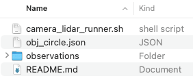
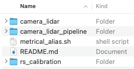

**Sensor calibration** is the process of determining the exact mathematical settings that describe how a sensor perceives or measures the physical world. By comparing sensor data to known reference values, we can fix measurement errors and make sure data from different sensors lines up properly.

There are two main types of parameters that can be calibrated:

- **Intrinsic parameters (Intrinsics):** These describe how a sensor works internally, such as lens distortion in cameras or bias and scaling errors in IMUs. Correcting intrinsics helps eliminate built-in measurement errors.

- **Extrinsic parameters (Extrinsics):** These define the position and orientation of one sensor relative to another or to the environment. Understanding extrinsics lets us combine data from different sensors into the same coordinate system.

Accurate calibration is key to getting reliable, consistent data, which is critical for mapping, perception, and decision-making in robotics and autonomous systems. Recognizing this need, **ReductStore** is developing an extension to integrate with **MetriCal**, a powerful tool that streamlines the process of calibrating multimodal sensor data.

{/* truncate */}

## [What is MetriCal?](https://www.tangramvision.com/products/calibration/metrical) 

MetriCal is a calibration tool developed by [**Tangram Vision**](https://www.tangramvision.com/) for working with systems that include different types of sensors. It’s designed to handle practical calibration scenarios and supports simultaneous processing of data from cameras, LiDARs, and IMUs. MetriCal can be used in both small-scale setups and larger, production-level environments, offering tools for precise and consistent multi-sensor calibration.

### Key Features

- **ROS data input:** Supports `.bag` and `.mcap` files (recommended)

- **Automatic extrinsics estimation:** Computes sensor and target poses without CAD models or manual setup

- **Unlimited sensor streams:** No restrictions on the number of input streams

- **Broad target support:** Supports both 2D and 3D targets, has a library of premade ones, and allows using multiple targets at once

- **Modular calibration workflow:** Supports splitting calibration into multiple datasets and stages

- **Detailed diagnostics:** Visual and numerical feedback on data quality and calibration performance

- **ROS integration:** Outputs can be exported as URDF files

- **Pixel-level corrections:** Generate lookup tables for single-camera undistortion and stereo rectification

- **Lightweight deployment:** CPU-only operation; runs on compact devices like Intel NUCs or in the cloud

## How MetriCal Works?

MetriCal is structured as a CLI-based, fully scriptable pipeline designed to support reproducible workflows and automation. The core calibration process can be divided into stages:

**1. Preparation**

The quality of calibration strongly depends on the choice of [**targets**](https://docs.tangramvision.com/metrical/first_steps/choosing_targets) and the data captured. It's important to carefully select and build suitable calibration targets specifically for your use case, and to follow the detailed [**guidelines**](https://docs.tangramvision.com/metrical/first_steps/data_capture) to collect high-quality data.

MetriCal also requires an [**object space**](https://docs.tangramvision.com/metrical/core_concepts/object_space/overview) file (which describes all targets and their properties) that should be prepared at this stage.

**2. Initialization**

Once the dataset and configuration files are prepared, MetriCal’s [**init mode**](https://docs.tangramvision.com/metrical/modes/init) analyzes the observations and interactions in the data to infer a raw input [**plex**](https://docs.tangramvision.com/metrical/core_concepts/plex/overview) — a representation of the physical system that you are calibrating. This plex serves as the structured starting point for all further calibration operations.

> If you already have a plex with existing calibration results that you want to keep, you can use it as a seed for an init plex.

**3. Calibration**

In [**calibrate mode**](https://docs.tangramvision.com/metrical/modes/calibrate) MetriCal uses a full [**bundle adjustment**](https://www.cs.jhu.edu/~misha/ReadingSeminar/Papers/Triggs00.pdf) to refine the initial plex and the object space.
It applies a motion filter to images and point clouds in the input dataset to eliminate features affected by motion blur, rolling shutter, false detections, and other artifacts.

At this step, will be created a cache `.json` file in the directory with the input data. This file stores the detected objects, so future runs can skip the detection process and run faster.

> In calibrate mode we can also visualize the calibration data capture and detection process.

**4. Diagnostics**

MetriCal generates a detailed diagnostic [**report**](https://docs.tangramvision.com/metrical/results/report) with color-coded charts that summarize calibration quality:

- **Cyan:** spectacular
- **Green:** good
- **Orange:** okay, but generally poor
- **Red:** bad

**5. Visualization**

In [**display mode**](https://docs.tangramvision.com/metrical/modes/display) we visualize the applied results of a calibration in [**Rerun**](https://docs.tangramvision.com/metrical/configuration/visualization). It allows us quickly check the calibration quality visually before exporting.

> We usually use the same dataset, but we can also use a different one if it has the same topic names.

**6. Export**

In [**shape mode**](https://docs.tangramvision.com/metrical/modes/shape/shape_overview), we can modify the optimized plex into different configurations for using calibration data in a deployed system, such as ROS URDFs or pixel-wise lookup tables.

> MetriCal has several additional modes to expand your experience: [**completion mode**](https://docs.tangramvision.com/metrical/modes/completion), [**consolidate object spaces mode**](https://docs.tangramvision.com/metrical/modes/consolidate_object_spaces), [**pipeline mode**](https://docs.tangramvision.com/metrical/modes/pipeline), [**pretty print mode**](https://docs.tangramvision.com/metrical/modes/pretty_print).

## MetriCal Example

To test MetriCal’s multi-sensor capabilities, we use the official [**example**](https://gitlab.com/tangram-vision/platform/metrical/-/tree/main/examples/camera_lidar) with two cameras and a LiDAR. The dataset has synchronized observations from all three sensors, capturing a [**LiDAR circle target**](https://docs.tangramvision.com/metrical/configuration/targets?target-type=circle) from different angles. This allows MetriCal to calculate:

- Intrinsics and poses for both cameras

- Extrinsics between each camera and the LiDAR

- Target geometry and consistency across different views

**Installation**

We [**installed**](https://docs.tangramvision.com/metrical/configuration/installation?install-method=docker) MetriCal via Docker. Make sure you have set up an alias during the installation:

```bash #zsh, using bash for highlighting only
~/.zshrc

metrical() {
    docker run --rm --tty --init --user="$(id -u):$(id -g)" \
    --volume="$PATH/metrical/":"/datasets" \
    --volume=metrical-license-cache:/.cache/tangram-vision \
    --workdir="/datasets" \
    --add-host=host.docker.internal:host-gateway \
    tangramvision/cli:latest \
    --license="LICENSE KEY" \
    "$@";
}
```

You can also install MetriCal on Ubuntu or Pop!\_OS.

> Attention! MetriCal requires a [**license key**](https://docs.tangramvision.com/metrical/configuration/licensing).

**Running Calibration**

After cloning the [**repository**](https://gitlab.com/tangram-vision/platform/metrical), we downloaded and unpacked the `.zip` [**file**](https://drive.google.com/file/d/1UFKpVXNI1IZPRiupODyhU0tMedXabKEn/view?usp=drive_link), then placed the `observations` folder into `$PATH/metrical/examples/camera_lidar`.



We configured a `LICENSE` variable in the `metrical_alias.sh` file located in `$PATH/metrical/examples`.



Once everything is ready, we can run the full pipeline by executing the provided shell script:

```bash
$PATH/metrical/examples/camera_lidar/camera_lidar_runner.sh
```

**[**Visualization**](https://docs.tangramvision.com/metrical/modes/display) of Results**

We installed [**Rerun**](https://docs.tangramvision.com/metrical/configuration/visualization#installing-rerun) using `pip` and started the Rerun server on a separate terminal tab.

Running the following command in the terminal visualizes the calibration results in [**display mode**](https://docs.tangramvision.com/metrical/modes/display) and shows the data in real-time:

```zsh
metrical display /datasets/examples/camera_lidar/observations /datasets/examples/camera_lidar/results.json
```


### [Understanding Results](https://docs.tangramvision.com/metrical/results/report)

During calibration, MetriCal produces charts and diagnostics that show the quality of the process and highlight what may need improvement.

#### Data Inputs (DI Section)

The Data Inputs section gives an overview of the input data. It ensures that the dataset was appropriate for a successful calibration.

**Key Metrics:**

- **Calibration Inputs (DI-1):** Shows the basic configuration parameters.

```text█ DI-1 █ Calibration Inputs
+--------------------------------------+----------+
| Calibration Parameter                | Value    |
+--------------------------------------+----------+
| MetriCal Version                     | 13.2.1   |
+--------------------------------------+----------+
| Optimization Profile                 | Standard |
+--------------------------------------+----------+
| Camera Motion Threshold              | Disabled |
+--------------------------------------+----------+
| Lidar Motion Threshold               | Disabled |
+--------------------------------------+----------+
| Preserve Input Constraints           | Disabled |
+--------------------------------------+----------+
| Object Relative Extrinsics Inference | Enabled  |
+--------------------------------------+----------+
```

- **Object Space Descriptions(DI-2):** Describes the calibration targets (object spaces).

```text█ DI-2 █ Object Space Descriptions
+-------------+-------------------------+---------------------------------------+------------------------+
| Type        | UUID                    | Detector                              | Variance               |
+-------------+-------------------------+---------------------------------------+------------------------+
| Circle      | 34e6df7b...45d796bf     | - 0.6m radius                         | 1e-8, 1e-8, 1e-8       |
|             |                         | - 0.375m x offset                     |                        |
|             | Mutual Group A          | - 0.375m y offset                     |                        |
|             | |-- 24e6df7b...45d796bf | - 0m z offset                         |                        |
|             |                         | - 0.05m reflective tape width         |                        |
|             |                         | - Detect interior points: true        |                        |
+-------------+-------------------------+---------------------------------------+------------------------+
| Markerboard | 24e6df7b...45d796bf     | - 7x7 grid                            | 0.0002, 0.0002, 0.0002 |
|             |                         | - 0.097m markers                      |                        |
|             | Mutual Group A          | - 0.125m checkers (aka solid squares) |                        |
|             | |-- 34e6df7b...45d796bf | - Dictionary: Aruco4x4_1000           |                        |
|             |                         | - Marker IDs start at 0               |                        |
|             |                         | - Top-left corner is a Marker         |                        |
+-------------+-------------------------+---------------------------------------+------------------------+
```

- **Processed Observation Count (DI-3):** Indicates how many observations were processed from the dataset.

  If we observe that many detections were filtered out, we need to verify the quality of the input data or settings (e.g., sensor noise).

```text
█ DI-3 █ Processed Observation Count
+----------------------------------+--------+-------------------+------------------------+-----------------------+
| Component                        | # read | # with detections | # after quality filter | # after motion filter |
+----------------------------------+--------+-------------------+------------------------+-----------------------+
| infra1_image_rect_raw (f7df04cc) |    283 |               276 |                    273 |                   273 |
+----------------------------------+--------+-------------------+------------------------+-----------------------+
| infra2_image_rect_raw (34ed8934) |    284 |               282 |                    278 |                   278 |
+----------------------------------+--------+-------------------+------------------------+-----------------------+
|      velodyne_points1 (38140838) |   2750 |              2026 |                   2026 |                  2026 |
+----------------------------------+--------+-------------------+------------------------+-----------------------+
```

- **Camera FOV Coverage (DI-4):** Displays how well the calibration data covers the field of view (FOV) of each camera. Ideal coverage is characterized by minimal red cells, which represent areas with no detected features.

  For FOV coverage, we need to ensure that the cameras are capturing data from all parts of the scene. Gaps in coverage can lead to poor calibration, especially for intrinsic parameters.


- **Detection Timeline(DI-5):** Shows when detections happened across the dataset timeline. Each row is a different sensor, helping to see if the data is synchronized.

```text█ DI-5 █ Detection Timeline
+----------------------------------+-------------------------------------------------------------------------------------------------+
|            Components            |          Detection Timeline (x axis is seconds elapsed since first observation)                 |
|                                  |          Every point on the timeline represents an observation with detected features.          |
+----------------------------------+-------------------------------------------------------------------------------------------------+
|                                  | ⡁⠀⠀⠀⠀⠀⠀⠀⠀⠀⠀⠀⠀⠀⠀⠀⠀⠀⠀⠀⠀⠀⠀⠀⠀⠀⠀⠀⠀⠀⠀⠀⠀⠀⠀⠀⠀⠀⠀⠀⠀⠀⠀⠀⠀⠀⠀⠀⠀⠀⠀⠀⠀⠀⠀⠀⠀⠀⠀⠀⠀⠀⠀⠀⠀⠀⠀⠀⠀⠀⠀⠀⠀⠀⠀⠀⠀⠀⠀⠀⠀⠀⠀⠀⠀⠀⠀⠀⠀⠀⠀ 4.0 |
| infra1_image_rect_raw (f7df04cc) | ⠄⠀⠀⠀⠀⠀⠀⠀⠀⠀⠀⠀⠀⠀⠀⠀⠀⠀⠀⠀⠀⠀⠀⠀⠀⠀⠀⠀⠀⠀⠀⠀⠀⠀⠀⠀⠀⠀⠀⠀⠀⠀⠀⠀⠀⠀⠀⠀⠀⠀⠀⠀⠀⠀⠀⠀⠀⠀⠀⠀⠀⠀⠀⠀⠀⠀⠀⠀⠀⠀⠀⠀⠀⠀⠀⠀⠀⠀⠀⠀⠀⠀⠀⠀⠀⠀⠀⠀⠀⠀⠀     |
| infra2_image_rect_raw (34ed8934) | ⠂⠀⠀⠀⠀⠀⠀⠀⠀⠀⠀⠀⠀⠈⠉⠁⠉⠉⠉⠁⠉⠀⠉⠉⠉⠉⠁⠁⠉⠀⠈⠉⠉⠉⠉⠉⠈⠉⠁⠀⠀⠈⠁⠈⠈⠉⠉⠉⠁⠁⠀⠉⠀⠈⠁⠉⠉⠉⠉⠉⠉⠉⠉⠉⠉⠈⠈⠀⠉⠉⠉⠁⠉⠉⠈⠉⠉⠈⠉⠉⠈⠉⠁⠉⠉⠈⠉⠉⠀⠉⠁     |
| velodyne_points1 (38140838)      | ⡁⠀⠀⠀⠀⠀⠀⠀⠀⠀⠀⠀⠀⠀⠀⠀⠀⠀⠀⠀⠀⠀⠀⠀⠀⠀⠀⠀⠀⠀⠀⠀⠀⠀⠀⠀⠀⠀⠀⠀⠀⠀⠀⠀⠀⠀⠀⠀⠀⠀⠀⠀⠀⠀⠀⠀⠀⠀⠀⠀⠀⠀⠀⠀⠀⠀⠀⠀⠀⠀⠀⠀⠀⠀⠀⠀⠀⠀⠀⠀⠀⠀⠀⠀⠀⠀⠀⠀⠀⠀⠀     |
|                                  | ⠄⠀⠀⠀⠀⠀⠀⠀⠀⠀⠀⠀⠀⠈⠉⠁⠉⠉⠉⠁⠉⠀⠉⠉⠉⠉⠉⠀⠉⠁⠈⠉⠉⠉⠉⠉⠈⠉⠀⠀⠀⠀⠀⠉⠉⠉⠉⠉⠁⠉⠉⠉⠁⠀⠉⠉⠉⠁⠉⠈⠁⠉⠉⠉⠉⠉⠈⠁⠉⠉⠉⠉⠉⠉⠉⠉⠈⠁⠉⠉⠈⠉⠁⠉⠉⠈⠉⠉⠀⠉⠁     |
|                                  | ⠂⠀⠀⠀⠀⠀⠀⠀⠀⠀⠀⠀⠀⠀⠀⠀⠀⠀⠀⠀⠀⠀⠀⠀⠀⠀⠀⠀⠀⠀⠀⠀⠀⠀⠀⠀⠀⠀⠀⠀⠀⠀⠀⠀⠀⠀⠀⠀⠀⠀⠀⠀⠀⠀⠀⠀⠀⠀⠀⠀⠀⠀⠀⠀⠀⠀⠀⠀⠀⠀⠀⠀⠀⠀⠀⠀⠀⠀⠀⠀⠀⠀⠀⠀⠀⠀⠀⠀⠀⠀⠀     |
|                                  | ⡉⠀⠀⠈⠀⠉⠈⠈⠀⠀⠈⠁⠉⠉⠉⠉⠉⠉⠉⠉⠉⠉⠉⠉⠉⠉⠉⠉⠉⠉⠉⠉⠉⠉⠉⠉⠉⠉⠉⠈⠉⠉⠉⠉⠉⠉⠉⠉⠉⠉⠉⠉⠉⠉⠉⠉⠉⠉⠉⠉⠉⠉⠉⠉⠉⠉⠉⠉⠉⠉⠉⠉⠉⠉⠉⠉⠉⠉⠉⠉⠉⠉⠉⠉⠉⠉⠉⠉⠁⠉⠁     |
|                                  | ⠄⠀⠀⠀⠀⠀⠀⠀⠀⠀⠀⠀⠀⠀⠀⠀⠀⠀⠀⠀⠀⠀⠀⠀⠀⠀⠀⠀⠀⠀⠀⠀⠀⠀⠀⠀⠀⠀⠀⠀⠀⠀⠀⠀⠀⠀⠀⠀⠀⠀⠀⠀⠀⠀⠀⠀⠀⠀⠀⠀⠀⠀⠀⠀⠀⠀⠀⠀⠀⠀⠀⠀⠀⠀⠀⠀⠀⠀⠀⠀⠀⠀⠀⠀⠀⠀⠀⠀⠀⠀⠀     |
|                                  | ⠁⠈⠀⠁⠈⠀⠁⠈⠀⠁⠈⠀⠁⠈⠀⠁⠈⠀⠁⠈⠀⠁⠈⠀⠁⠈⠀⠁⠈⠀⠁⠈⠀⠁⠈⠀⠁⠈⠀⠁⠈⠀⠁⠈⠀⠁⠈⠀⠁⠈⠀⠁⠈⠀⠁⠈⠀⠁⠈⠀⠁⠈⠀⠁⠈⠀⠁⠈⠀⠁⠈⠀⠁⠈⠀⠁⠈⠀⠁⠈⠀⠁⠈⠀⠁⠈⠀⠁⠈⠀⠁ 0.0 |
|                                  | 0.0                                                                                  269.1      |
+----------------------------------+-------------------------------------------------------------------------------------------------+
```

#### Camera Modeling (CM Section)

This section shows how well the camera models fit the actual calibration data — in other words, how accurately the system understood the camera’s behavior based on the collected data.

**Key Metrics:**

- **Binned Reprojection Errors (CM-1):** This heatmap shows the reprojection errors across the camera’s FOV. If certain areas show high error (orange or red), it may indicate problems with the camera model or lens distortion that isn't being captured correctly.


- **Stereo Pair Rectification Error (CM-2):** For multi-camera setups, this shows the stereo rectification error between camera pairs, indicating how well the cameras are aligned for stereo vision.

```text
█ CM-2 █ Stereo Pair Rectification Error
+---------------------------------------+--------------+-------+-------------------------------------------------------------------------------------+
| Stereo Pair                           | # Mutual Obs | RMSE  | Binned rectified error (px)                                                         |
+---------------------------------------+--------------+-------+-------------------------------------------------------------------------------------+
| Dominant eye:  infra1_image_rect_raw  | 155          | 0.742 | ⡇⠀⠀⠀⠀⠀⠀⠀⠀⠀⠀⠀⠀⠀⠀⠀⠀⠀⠀⠀⠀⠀⠀⠀⠀⠀⠀⠀⠀⠀⠀⠀⠀⠀⠀⠀⠀⠀⠀⠀⠀⠀⠀⠀⠀⠀⠀⠀⠀⠀⠀⠀⠀⠀⠀⠀⠀⠀⠀⠀⠀⠀⠀⠀⠀⠀⠀⠀⠀⠀⠀⠀⠀⠀⠀⠀ 3202.0 |
| Secondary eye: infra2_image_rect_raw  |              |       | ⡇⠀⠀⠀⠀⠀⠀⠀⠀⠀⠀⠀⠀⠀⠀⠀⠀⠀⠀⠀⠀⠀⠀⠀⠀⠀⠀⠀⠀⠀⠀⠀⠀⠀⠀⠀⠀⠀⠀⠀⠀⠀⠀⠀⠀⠀⠀⠀⠀⠀⠀⠀⠀⠀⠀⠀⠀⠀⠀⠀⠀⠀⠀⠀⠀⠀⠀⠀⠀⠀⠀⠀⠀⠀⠀⠀        |
|                                       |              |       | ⡇⠀⠀⠀⠀⠀⠀⠀⠀⠀⠀⠀⠀⠀⠀⠀⠀⠀⠀⠀⠀⠀⠀⠀⠀⠀⠀⠀⠀⠀⠀⠀⠀⠀⠀⠀⠀⠀⠀⠀⠀⠀⠀⠀⠀⠀⠀⠀⠀⠀⠀⠀⠀⠀⠀⠀⠀⠀⠀⠀⠀⠀⠀⠀⠀⠀⠀⠀⠀⠀⠀⠀⠀⠀⠀⠀        |
|                                       |              |       | ⣇⣀⠀⠀⠀⠀⠀⠀⠀⠀⠀⠀⠀⠀⠀⠀⠀⠀⠀⠀⠀⠀⠀⠀⠀⠀⠀⠀⠀⠀⠀⠀⠀⠀⠀⠀⠀⠀⠀⠀⠀⠀⠀⠀⠀⠀⠀⠀⠀⠀⠀⠀⠀⠀⠀⠀⠀⠀⠀⠀⠀⠀⠀⠀⠀⠀⠀⠀⠀⠀⠀⠀⠀⠀⠀⠀        |
|                                       |              |       | ⡇⢸⠀⠀⠀⠀⠀⠀⠀⠀⠀⠀⠀⠀⠀⠀⠀⠀⠀⠀⠀⠀⠀⠀⠀⠀⠀⠀⠀⠀⠀⠀⠀⠀⠀⠀⠀⠀⠀⠀⠀⠀⠀⠀⠀⠀⠀⠀⠀⠀⠀⠀⠀⠀⠀⠀⠀⠀⠀⠀⠀⠀⠀⠀⠀⠀⠀⠀⠀⠀⠀⠀⠀⠀⠀⠀        |
|                                       |              |       | ⡇⢸⠀⠀⠀⠀⠀⠀⠀⠀⠀⠀⠀⠀⠀⠀⠀⠀⠀⠀⠀⠀⠀⠀⠀⠀⠀⠀⠀⠀⠀⠀⠀⠀⠀⠀⠀⠀⠀⠀⠀⠀⠀⠀⠀⠀⠀⠀⠀⠀⠀⠀⠀⠀⠀⠀⠀⠀⠀⠀⠀⠀⠀⠀⠀⠀⠀⠀⠀⠀⠀⠀⠀⠀⠀⠀        |
|                                       |              |       | ⡇⢸⣀⡀⠀⠀⠀⠀⠀⠀⠀⠀⠀⠀⠀⠀⠀⠀⠀⠀⠀⠀⠀⠀⠀⠀⠀⠀⠀⠀⠀⠀⠀⠀⠀⠀⠀⠀⠀⠀⠀⠀⠀⠀⠀⠀⠀⠀⠀⠀⠀⠀⠀⠀⠀⠀⠀⠀⠀⠀⠀⠀⠀⠀⠀⠀⠀⠀⠀⠀⠀⠀⠀⠀⠀⠀        |
|                                       |              |       | ⠇⠸⠀⠏⠹⠒⠖⠲⠒⠖⠲⠒⠦⠤⠤⠤⠤⠤⠤⠤⠤⠤⠤⠤⠤⠤⠤⠤⠤⠤⠤⠤⠤⠤⠤⠤⠤⠤⠤⠤⠤⠤⠤⠤⠤⠤⠤⠤⠤⠤⠤⠤⠤⠤⠤⠤⠤⠤⠤⠤⠤⠤⠤⠤⠤⠤⠤⠤⠤⠤⠤⠤⠤⠤⠀⠀ 0.0    |
|                                       |              |       | 0.0                                                                     7.0         |
+---------------------------------------+--------------+-------+-------------------------------------------------------------------------------------+
```

#### Extrinsics Info (EI Section)

This section focuses on the spatial relationships between components in the calibration setup. Accurate extrinsic calibration ensures that the relative positions and orientations of the sensors are well understood.

**Key Metrics:**

- **Component Extrinsics Errors (EI-1):** Displays the [**extrinsics errors**](https://docs.tangramvision.com/metrical/results/residual_metrics/composed_relative_extrinsics) between each pair of components. If extrinsics errors are large, we need to investigate whether all components are positioned and oriented correctly.

```text
█ EI-1 █ Component Extrinsics Errors
+--------------------------------------------+----------+----------+----------+----------+-----------+---------+
| Weighted Component Relative Extrinsic RMSE | X (m)    | Y (m)    | Z (m)    | Roll (°) | Pitch (°) | Yaw (°) |
| Rotation is Euler XYZ ext                  |          |          |          |          |           |         |
+--------------------------------------------+----------+----------+----------+----------+-----------+---------+
| To: infra1_image_rect_raw (f7df04cc),      | 2.254e-3 | 1.802e-3 | 3.780e-3 |    0.077 |     0.100 |   0.148 |
|    From: infra2_image_rect_raw (34ed8934)  |          |          |          |          |           |         |
+--------------------------------------------+----------+----------+----------+----------+-----------+---------+
```

- **IMU Preintegration Errors (EI-2):** Shows the summary of all [**IMU Preintegration errors**](https://docs.tangramvision.com/metrical/results/residual_metrics/imu_preintegration_error) from the system.

  In the example we don't calibrated IMUs.

- **Observed Camera Range of Motion (EI-3):** Shows how much motion was observed for each camera during the data collection. Sufficient motion is needed to avoid projective compensation errors.

```text
█ EI-3 █ Observed Camera Range of Motion
+----------------------------------+--------+----------------------+--------------------+
| Camera                           | Z (m)  | Horizontal angle (°) | Vertical angle (°) |
+----------------------------------+--------+----------------------+--------------------+
| infra1_image_rect_raw (f7df04cc) | 6.308  | 127.081              | 63.801             |
+----------------------------------+--------+----------------------+--------------------+
| infra2_image_rect_raw (34ed8934) | 6.434  | 144.606              | 126.280            |
+----------------------------------+--------+----------------------+--------------------+
```

#### Calibrated Plex (CP Section)

This section displays the final results of the calibration, including the intrinsic and extrinsic parameters that can be used for updating the system configuration.

**Key Metrics:**

- **Camera Metrics (CP-1):** Contains the intrinsic parameters of each camera, including focal length, principal point, and distortion parameters. The standard deviations indicate the uncertainty of each parameter.

```text
█ CP-1 █ Camera Metrics
+----------------------------------+-------------------------+-----------------------------------------+--------------------------------------+
| Camera                           | Specs                   | Projection Model                        | Distortion Model                     |
+----------------------------------+-------------------------+-----------------------------------------+--------------------------------------+
| infra1_image_rect_raw (f7df04cc) |  width (px)        848  |  Pinhole                                |      OpenCV Distortion               |
|                                  |  height (px)       480  |  f (px)      431.914 ±      0.224 (1σ)  |  k1   -1.574e-3 ±   8.715e-4 (1σ)    |
|                                  |  pixel pitch (um)  1    |  cx (px)     421.938 ±      0.395 (1σ)  |  k2       0.011 ±   1.876e-3 (1σ)    |
|                                  |                         |  cy (px)     230.592 ±      0.465 (1σ)  |  k3   -6.171e-3 ±   1.241e-3 (1σ)    |
|                                  |                         |                                         |  p1   -2.037e-3 ±   2.680e-4 (1σ)    |
|                                  |                         |                                         |  p2   -1.479e-3 ±   2.443e-4 (1σ)    |
|                                  |                         |                                         |                                      |
+----------------------------------+-------------------------+-----------------------------------------+--------------------------------------+
| infra2_image_rect_raw (34ed8934) |  width (px)        848  |  Pinhole                                |      OpenCV Distortion               |
|                                  |  height (px)       480  |  f (px)      429.085 ±      0.215 (1σ)  |  k1   -3.050e-4 ±   8.638e-4 (1σ)    |
|                                  |  pixel pitch (um)  1    |  cx (px)     421.203 ±      0.387 (1σ)  |  k2    1.517e-3 ±   1.809e-3 (1σ)    |
|                                  |                         |  cy (px)     230.821 ±      0.436 (1σ)  |  k3   -6.881e-4 ±   1.170e-3 (1σ)    |
|                                  |                         |                                         |  p1   -1.887e-3 ±   2.510e-4 (1σ)    |
|                                  |                         |                                         |  p2   -1.630e-3 ±   2.358e-4 (1σ)    |
|                                  |                         |                                         |                                      |
+----------------------------------+-------------------------+-----------------------------------------+--------------------------------------+
```

- **Optimized IMU Metrics (CP-2)**

  In the example we don't calibrated IMUs.

- **Calibrated Extrinsics (CP-3):** Shows the [**Minimum Spanning Tree**](https://docs.tangramvision.com/metrical/modes/shape/shape_mst) of spatial constraints in the Plex, highlighting only the best ones needed to keep the structure intact.

  Large differences between initial and final values may mean that our starting guesses for positions or orientations were incorrect, and calibration had to make major corrections.

```text
█ CP-3 █  Calibrated Extrinsics
+---------------------------+------------+-----------------+----------------------+---------------+---------------------+
| Final Extrinsics          | Subplex ID | Translation (m) | Diff from input (mm) | Rotation (°)  | Diff from input (°) |
| 'To' component is Origin  |            |                 |                      |               |                     |
| Rotation is Euler XYZ ext |            |                 |                      |               |                     |
+---------------------------+------------+-----------------+----------------------+---------------+---------------------+
| To: infra1_image_rect_raw | A          | X: 0.360        | ΔX: 359.862          | Roll: -85.208 | ΔRoll: -85.208      |
|     f7df04cc, RDF         |            | Y: 0.083        | ΔY: 82.722           | Pitch: -2.812 | ΔPitch: -2.812      |
| From: velodyne_points1    |            | Z: 0.048        | ΔZ: 48.451           | Yaw: 171.579  | ΔYaw: 171.579       |
|     38140838, Unknown     |            |                 |                      |               |                     |
+---------------------------+------------+-----------------+----------------------+---------------+---------------------+
| To: infra2_image_rect_raw | A          | X: 0.319        | ΔX: 318.513          | Roll: -85.317 | ΔRoll: -85.317      |
|     34ed8934, RDF         |            | Y: 0.086        | ΔY: 85.533           | Pitch: -2.717 | ΔPitch: -2.717      |
| From: velodyne_points1    |            | Z: 0.033        | ΔZ: 33.454           | Yaw: 171.470  | ΔYaw: 171.470       |
|     38140838, Unknown     |            |                 |                      |               |                     |
+---------------------------+------------+-----------------+----------------------+---------------+---------------------+
```

#### Summary Statistics (SS Section)

This section provides a high-level overview of the optimization process and the overall calibration quality.

- **Optimization Summary Statistics (SS-1):** Includes the overall reprojection error and the posterior variance, which indicates the calibration’s uncertainty.

```text
█ SS-1 █ Optimization Summary Statistics
+------------------------+----------+
| Optimized Object RMSE, | 0.206 px |
| based on all cameras   |          |
+------------------------+----------+
| Posterior Variance     | 0.731    |
+------------------------+----------+
```

- **Camera Summary Statistics (SS-2):** Summarizes the reprojection errors for each camera. An RMSE under 0.5 pixels is typically acceptable and under 0.2 pixels is excellent.

  > Use `pixel_pitch` in the [**Plex API**](https://docs.tangramvision.com/metrical/core_concepts/plex/components#camera) to fairly compare RMSEs if your cameras have different pixel sizes.

```text
█ SS-2 █ Camera Summary Statistics
+----------------------------------+------------------------------------------+
| Camera                           | Reproj. RMSE, outliers downweighted (px) |
+----------------------------------+------------------------------------------+
| infra1_image_rect_raw (f7df04cc) | 0.209 px                                 |
+----------------------------------+------------------------------------------+
| infra2_image_rect_raw (34ed8934) | 0.204 px                                 |
+----------------------------------+------------------------------------------+
```

- **LiDAR Summary Statistics (SS-3):** Show the RMSE of various residual metrics: [**Circle Misalignment**](https://docs.tangramvision.com/metrical/results/residual_metrics/circle_misalignment), [**Interior Points to Plane Error**](https://docs.tangramvision.com/metrical/results/residual_metrics/interior_points_to_plane_error), [**Paired 3D Point Error**](https://docs.tangramvision.com/metrical/results/residual_metrics/paired_3d_point_error), [**Paired Plane Normal Error**](https://docs.tangramvision.com/metrical/results/residual_metrics/paired_plane_normal_error).

```text
█ SS-3 █ LiDAR Summary Statistics
+-----------------------------+-------------------------------+------------------------------------+--------------------------+--------------------------+
| LiDAR                       | Circle misalignment RMSE with | Circle edge misalignment RMSE with | Interior point RMSE with | Plane normal difference, |
|                             | all cameras, outliers         | all cameras, outliers              | all cameras, outliers    | lidar-lidar, outliers    |
|                             | downweighted (m)              | downweighted (m)                   | downweighted (m)         | downweighted (deg)       |
+-----------------------------+-------------------------------+------------------------------------+--------------------------+--------------------------+
| velodyne_points1 (38140838) | 0.020 m                       | 0.028 m                            | 0.018 m                  | (n/a)                    |
+-----------------------------+-------------------------------+------------------------------------+--------------------------+--------------------------+
```

#### [Data Diagnostics](https://docs.tangramvision.com/metrical/results/report#data-diagnostics)

This section highlights potential issues with the calibration setup, data, or process.


**High-Risk Diagnostics:** Critical issues such as insufficient camera motion or missing required components, that must be fixed for successful calibration.

**Medium and Low-Risk Diagnostics:** Less critical issues such as poor feature coverage, should still be monitored and corrected when possible to improve the overall quality of the calibration.

#### [Output Summary](https://docs.tangramvision.com/metrical/results/output_file)

```text
+------------------------+------------------------------------------------------------+
| Results JSON           | /datasets/camera_lidar/results.json                        |
+------------------------+------------------------------------------------------------+
| Calibrated Plex        | Run `jq .plex [results.json] > optimized_plex.json`        |
+------------------------+------------------------------------------------------------+
| Optimized Object Space | Run `jq .object_space [results.json] > optimized_obj.json` |
+------------------------+------------------------------------------------------------+
| Cached Detections JSON | /datasets/camera_lidar/observations.detections.json        |
+------------------------+------------------------------------------------------------+
| Report Path            | /datasets/camera_lidar/report.html                         |
+------------------------+------------------------------------------------------------+
```

A calibration generated a set of output files located in the `$PATH/metrical/examples/camera_lidar` directory.

- **init_plex.json:** A raw input plex in the Init Mode.

- **observations.detections.json:** A cache of the detected objects in the Calibrate Mode.

- **results.json:** The main output file that contains key calibration data. Use jq to extract the optimized plex and the optimized object space as a separate files:

  - **Optimized Plex**

    ```text
    jq .plex $PATH/metrical/examples/camera_lidar/results.json > $PATH/metrical/examples/camera_lidar/optimized_plex.json
    ```

  - **Optimized object space**

    ```text
    jq .object_space $PATH/metrical/examples/camera_lidar/results.json > $PATH/metrical/examples/camera_lidar/optimized_obj.json
    ```

- **report.html:** A calibration report with visual overview of results.

- **results_urdf.xml:** This [**URDF**](https://docs.tangramvision.com/metrical/modes/shape/shape_urdf) is compatible with common ROS operations and defines the fixed spatial relationships between the two calibrated cameras and the LiDAR. It allows ROS to interpret these relationships accurately and publish real-time TF transforms, enabling precise sensor fusion in a shared coordinate frame. This is essential for projecting LiDAR points onto rectified camera images, performing depth-aware perception, and supporting tasks like object localization and 3D scene understanding. Tools like [**Rviz**](https://wiki.ros.org/rviz) and [**robot_state_publisher**](https://wiki.ros.org/robot_state_publisher) can then visualize and manage these transforms for real-time multi-sensor integration.

---

## Conclusion

---

We hope this tutorial provided a ... If you have any questions or comments, feel free to use the [**ReductStore Community Forum**](https://community.reduct.store/signup).
