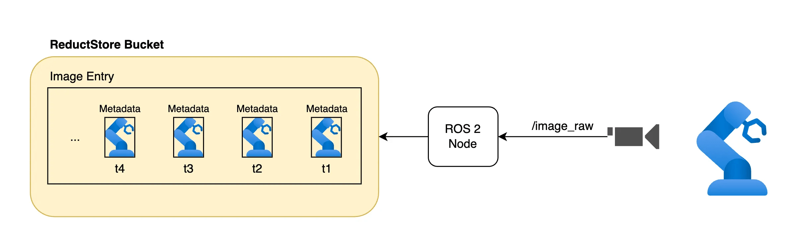

import YouTube from "@site/src/components/shared/VideoPlayer/YouTube";

<YouTube id="R61cp0mzmrk" />

&nbsp;

ROS2 is widely used for building robotic systems with sensors like cameras, LiDAR, and IMUs. While it's great for communication (e.g., publishing and subscribing to topics), it lacks a built-in solution for storing large amounts of unstructured data, such as images.

Bag files are commonly used to store data in ROS2, but they aren't a good fit for long-term storage or real-time streaming. They're mainly meant for recording and replaying mission data or episodes, not for managing large volumes of unstructured data.

Addressing this challenge, this blog post will guide you through setting up ROS2 with ReductStore a high-performance storage and streaming solution optimized for unstructured, time-series data.

We will focus specifically on image data, but if you are interested in a more general overview you can read [**How to Store and Manage Robotic Data**](/blog/store-robotic-data) which covers the challenges and strategies for storing and managing robotic data in general.

For the full code example, we will be using the [**reduct-ros-example repository**](https://github.com/reductstore/reduct-ros-example), which provides a complete implementation of the concepts discussed in this article.

{/* truncate */}

## ROS2 distributions

To install ROS2, you'll need to select a distribution that aligns with your project requirements and system compatibility. As of May 2025, two distributions are currently supported:

- **Jazzy Jalisco** (`jazzy`) (Release date: May 23rd, 2024; End of life: May 2029)
- **Humble Hawksbill** (`humble`) (Release date: May 23rd, 2022; End of life: May 2027)

If you are starting today, the `jazzy` distribution is recommended for its long-term support until May 2029. This is the thenth release of ROS2 and supports the following platforms:

- Tier 1: Ubuntu 24.04, Windows 10
- Tier 2: RHEL 9 (Red Hat Enterprise Linux)
- Tier 3: macOS and Debian Bookworm

To install the Jazzy Jalisco distribution, you can follow the instructions provided in [**Jazzy's installation guide**](https://docs.ros.org/en/jazzy/Installation.html).

## Understanding the advantages of using ReductStore with ROS2

Integrating ReductStore with ROS provides many benefits for robotic applications:

- **Best performance**: ReductStore's time-series design is tailored to the sequential nature of robotic applications and optimized for unstructured data (such as images).
- **Real-time data management**: You can set a real-time [**FIFO quota**](/docs/glossary#fifo-quota) policy based on storage volume, which is critical for managing large amounts of data in real time. This ensures that the system doesn't run out of space and can handle continuous data streams.
- **Metadata association**: It supports the association of labels (key-value pairs) directly with each record, allowing you to add context to your data. This is particularly useful for filtering and searching through large datasets.
- **Replication**: With a replication task, you can stream data to another ReductStore instance, either on the same machine or a different one. This is useful for backup or to automatically filter and save data to a cloud instance.

## Example to capture and store raw camera images



To capture and store raw camera images with ROS2, you need to create a node that subscribes to an image topic, serialize the image, and stores it in ReductStore.

### Create a custom ROS2 Node

To set it up, you will need to create a custom ROS2 Node that listens to image messages and uses ReductStore client for data storage.

Below is an example demonstrating this integration within a Python class (`ImageListener`):

```python
import asyncio
from rclpy.node import Node
from reduct import Client, Bucket
from sensor_msgs.msg import CompressedImage

class ImageListener(Node):
    """Node for listening to image messages and storing them in ReductStore."""
    def __init__(self, reduct_client: Client, loop: asyncio.AbstractEventLoop) -> None:
        """
        Initialize the image listener node.

        :param reduct_client: Client instance for interacting with ReductStore.
        :param loop: The asyncio event loop.
        """
        super().__init__("image_listener")
        self.reduct_client: Client = reduct_client
        self.loop: asyncio.AbstractEventLoop = loop
        self.bucket: Bucket = None
        self.subscription = self.create_subscription(
            CompressedImage, "/image_raw/compressed", self.image_callback, 10
        )
```

In this example `ImageListener` is a subclass of `Node`, which is part of ROS2's client library (`rclpy`). It sets up a subscription to listen for incoming images from the `/image_raw/compressed` topic. When an image message is received by the node via `self.subscription`, it triggers `image_callback`.

In this callback function, each received frame is stored in the designated bucket in ReductStore using Python's built-in `asyncio` module, more on this later.

### Initialize a new ReductStore bucket

This process involves setting up configuration parameters such as the bucket name and its storage quota settings. In our example, we create a bucket named `ros-bucket` with a FIFO quota type to ensure that the disk does not run out of space. The `exist_ok` parameter reuses the existing bucket if it already exists instead of raising an exception.

Here's how we can define this initialization within our Python class:

```python
from reduct_py import BucketSettings, QuotaType

class ImageListener(Node):
    # ... [other parts of ImageListener class] ...

    async def init_bucket(self) -> None:
        """Asynchronously initialize the Reduct bucket for storing images."""
        self.get_logger().info("Initializing Reduct bucket")
        self.bucket = await self.reduct_client.create_bucket(
            "ros-bucket",
            BucketSettings(quota_type=QuotaType.FIFO, quota_size=1_000_000_000),
            exist_ok=True,
        )
```

This code snippet should be called within our existing `ImageListener` class during the node's initialization or before storing the first image. This guarantees that the storage bucket is ready.

### Handling images in callbacks

When an image message from a ROS topic is received, it triggers the `image_callback` method. This method's role is to serialize the image data and organize its storage without blocking the main thread.

Serialization converts the ROS message data into a binary format that can be stored in ReductStore. This step is necessary because ReductStore is designed to handle binary data, i.e Blobs or byte streams. Here's an example code snippet demonstrating how to handle images in callbacks for storing them in ReductStore:

```python
class ImageListener(Node):
    # ... [previous parts of ImageListener class] ...

    @staticmethod
    def get_timestamp(msg: Image) -> int:
        """
        Extract the timestamp from a ROS message.

        :param msg: The ROS message.
        :return: The timestamp in microseconds.
        """
        return int(msg.header.stamp.sec * 1e6 + msg.header.stamp.nanosec / 1e3)

    @staticmethod
    def serialize_message(msg: CompressedImage) -> bytes:
        """
        Serialize a ROS message to bytes.

        :param msg: The ROS message.
        :return: The serialized message.
        """
        return bytes(msg.data)

    def image_callback(self, msg: CompressedImage) -> None:
        """
        Handle incoming image messages by scheduling storage.

        This callback is triggered by ROS message processing. It schedules
        the image storage coroutine to be executed in the asyncio event loop.
        """
        self.get_logger().info(f'Received image, storing to database')
        timestamp = self.get_timestamp(msg)
        binary_data = self.serialize_message(msg)
        asyncio.run_coroutine_threadsafe(self.store_data(timestamp, binary_data, "image/jpeg"), self.loop)
```

In this context, `serialize_message` is used to convert the `CompressedImage` message data (in our case JPEG) to bytes that can then be passed along for storage.

:::info
The serialization format determines how data is stored and retrieved, so it should be cross-platform to be usable on different operating systems. In this example, we use the JPEG format, which is widely supported and efficient for image data.
:::

Following serialization, an asynchronous coroutine (`store_data`) is scheduled on the event loop (`self.loop`) using `asyncio.run_coroutine_threadsafe`.

This function is useful for integrating asynchronous operations into primarily synchronous ROS2 callback handlers. This way, processing doesn't block the executor.

### Store images in a ReductStore bucket entry

The `store_data` method is responsible for storing the serialized images to ReductStore with the following parameters:

- The `timestamp` in microseconds that will be used as an index for the image.
- The `data`, which is the serialized image data (in bytes).
- The `content_type`, which specifies the format of the data being stored (e.g., "image/jpeg").

Moreover, it allows you to associate metadata with the stored data, such as labels (key-value pairs) that can be used for filtering and searching. In this example, we generate a random value to demonstrate how it works:

```python
class ImageListener(Node):
    # ... [previous parts of ImageListener class] ...

    async def store_data(self, timestamp: int, data: bytes, content_type: str) -> None:
        """
        Store unstructured data in the Reduct bucket.

        :param timestamp: The timestamp for the data.
        :param data: The serialized data.
        """
        if not self.bucket:
            await self.init_bucket()

        # Example of a label (key-value pair) to associate with the data record
        labels = {"random_value": random.uniform(0, 1)}

        self.get_logger().info(f"Storing data at {self.display_timestamp(timestamp)}")
        await self.bucket.write("images", data, timestamp, labels=labels, content_type=content_type)

```

When the `store_data` method is called, it first checks if the bucket has been initialized. If not, it calls the `init_bucket` method to create the bucket. Then, it writes the serialized data to the bucket entry `images` with the provided timestamp and labels. The `content_type` parameter is also passed to specify the format of the data being stored.

:::info
The `store_data` method is designed to be non-blocking, which allows the main thread to continue processing other tasks while the data is stored.
:::

## Testing the image storage system

To test the image storage system, you can run the ROS2 node and publish image messages to the `/image_raw/compressed` topic.

For example, we can use the `usb_cam` package to capture images from a USB camera (such as a web camera) and publish them to the `/image_raw/compressed` topic.

To install the `usb_cam` package, you can use the following command:

```bash
sudo apt-get install ros-<ros2-distro>-usb-cam
```

Replace `<ros2-distro>` with the ROS2 distribution you are using, such as `jazzy` or `humble`.

To configure the `usb_cam` node, you can create a YAML configuration file (e.g., `usb_cam_params.yaml`). If your camera supports MJPEG, you can set the `pixel_format` parameter to `raw_mjpeg` to publish JPEG images:

```yaml
usb_cam:
  ros__parameters:
    video_device: "/dev/video0"
    image_width: 640
    image_height: 480
    pixel_format: "raw_mjpeg"
```

MotionJPEG (MJPEG) is a common format for video compression and is often used for video streaming. This format compresses each frame of video as a separate JPEG image, which is the format we want to use in our example.

We can then run the `usb_cam` node to start capturing images and publishing them to the `/image_raw/compressed` topic using the following command:

```bash
ros2 run usb_cam usb_cam_node_exe --ros-args --params-file ./usb_cam_params.yaml
```

After the `usb_cam` node is running, we can start our custom ROS2 node:

```bash
ros2 run reduct_camera capture_and_store
```

The `capture_and_store` node will start listening to the `/image_raw/compressed` topic and store the images in ReductStore as they are received.

### Inspect stored images

Once the images are stored in ReductStore, you can access them using any supported SDK (Python, C++, etc.), the Web Console, or the CLI client.

For a quick visual check, open `http://localhost:8383` in your browser to access the ReductStore Web Console. There, you can browse your buckets, view stored images, and check timestamps and labels.

If you want to copy the images to your local machine, you can also use the [**CLI Client**](https://github.com/reductstore/reduct-cli). After installing it, add an alias for your instance:

```bash
reduct-cli alias add -L http://localhost:8383 local
```

Then export all images from the ros-bucket bucket to a local folder:

```bash
reduct-cli cp local/ros-bucket ./exported-data
```

This command copies all images from the `ros-bucket` bucket to the `./exported-data` folder.

## Best practices

There are several best practices to consider when integrating ReductStore. Here are a few to keep in mind:

- Use non-blocking operations to prevent the main thread of the ROS2 node from being blocked. This allows the node to continue processing other tasks while waiting for data to be stored.
- Serialize data before storing it in ReductStore in a cross-platform binary format to ensure compatibility with different systems and programming languages.
- Create a ReductStore bucket with a FIFO quota policy to prevent disk space issues.
- Use token authentication to the bucket to ensure secure access to the data.
- Use labels (key-value pairs) to associate metadata with stored data. This allows you to filter and search through large datasets easily.
- Set up data replication tasks to stream data to another ReductStore instance for backup or filtering purposes (e.g., to a cloud instance).

## Conclusion

Storing images from ROS2 in ReductStore is an effective and straightforward method for managing large volumes of unstructured data. This tutorial demonstrates how to create a ROS2 node that captures camera images, serializes them, and stores them in a bucket. Using such a system provides better performance than traditional bag files and offers the ability to filter and search through images, manage quotas, and stream data to a central storage or cloud infrastructure.

---

I hope this tutorial has been helpful. If you have any questions or feedback, don't hesitate to use the [**ReductStore Community**](https://community.reduct.store/signup) forum.
