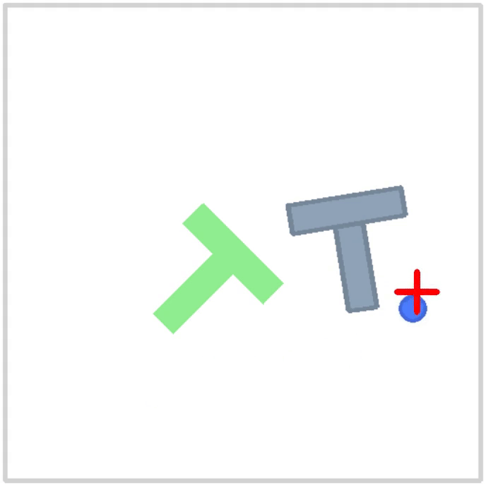
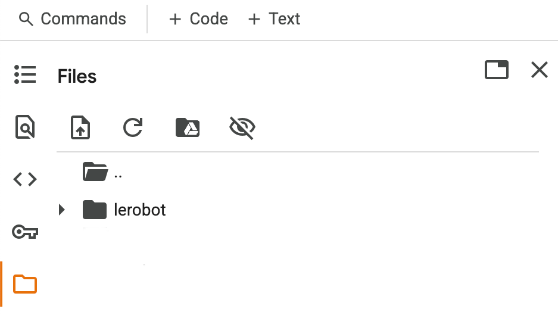
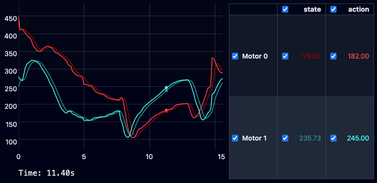

[**LeRobot is an open-source project by Hugging Face**](https://huggingface.co/lerobot) that makes it easy to explore the world of robotics with machine learning, even if you’ve never done anything like this before. It gives you pre-trained models, real-world data, and simple tools built with PyTorch, a popular machine learning framework. Whether you're just curious or ready to try your first robotics project, LeRobot is a great place to start.

{/* truncate */}

## What You Need to Get Started

You can run everything in a simulation right from your browser — no robot, no installations, and no powerful computer needed. We’ll be using Google Colab, a free cloud-based coding environment.

Here’s what you’ll need:

- **Google Account:** To use Colab, you need a Google account. If you use Gmail, you already have one. If not, you can [**create a Google account**](https://colab.research.google.com/).

- **Hugging Face Account:** LeRobot uses models and datasets hosted on Hugging Face. To access all features, you'll need to [**create a Hugging Face account**](https://huggingface.co/).

### Preparation

To get started with LeRobot in Google Colab, first open Google Colab and sign in with your Google account. Once you're signed in, click the `New Notebook` button to create a blank notebook — this is where you’ll run all your code.

> **Note:** All the commands below are already written out in a [**ready-made Google Colab notebook**](https://colab.research.google.com/gist/AnthonyCvn/f02f12ce113f0e2fcd773fd39d0e1dfa/getting-started-with-lerobot.ipynb) you can use to follow along.

#### Step 1: Switch to GPU

LeRobot can use a GPU (Graphics Processing Unit), which makes things run faster, especially for simulation and machine learning tasks:

- In the Colab menu, click `Runtime` > `Change runtime type`.

- Under the `Hardware accelerator`, select `GPU`.

- Click `Save`.

Now your notebook is using a free GPU provided by Google. Note that GPU access in Colab is limited in time and resources, depending on whether you’re using the free or PRO version.

#### Step 2: Clone the LeRobot Repository

Run this command in a Colab code cell to download LeRobot from GitHub. This repository is public, so you don’t need a GitHub account to clone it.

```python
!git clone https://github.com/huggingface/lerobot.git
```

A new folder named `lerobot` will appear in the file browser on the left (click the folder icon to open it).

For now, you can simply start with the `lerobot/examples` folder. It contains ready-to-use scripts that let you try out real robot tasks using pre-trained models — no setup or deep knowledge needed.

> **Note:** Colab’s environment is temporary. If you restart the runtime, the files will be deleted and you’ll need to run the setup steps again. It’s best to keep these commands handy at the top of your notebook.

#### Step 3: Move into the LeRobot folder

Now that the LeRobot files are downloaded, we need to tell Python to work inside that folder. Run this command in a new cell:

```python
%cd lerobot
```

This changes the current working directory to the `lerobot` folder, where all the code and scripts are located.

#### Step 4: Install LeRobot and Its Dependencies

After cloning the repository and switching to the `lerobot` folder, the next step is to install everything LeRobot needs to work. Run this command in a new cell:

```python
!pip install ".[pusht]"
```

After running it, LeRobot will be ready to use in your notebook. All necessary tools and libraries will be installed automatically.

> **Note:** If you see any errors during installation, you may just need to install a missing libraries.

We recommend installing the `hf_xet` library for faster and more reliable downloads from Hugging Face:

```python
!pip install hf_xet
```

This tool helps speed up access to models and datasets, especially when loading large files in Colab.

## Running a Pre-Trained Model

LeRobot includes several pre-trained models, so you can try robot tasks without needing to train anything yourself. These models are already trained on specific tasks and ready to go.

- **π<sub>0</sub>:** A powerful model that combines vision, language, and action. It’s designed for general robot tasks, for example, following instructions or reacting to what it sees.

- **π<sub>0</sub> FAST:** A faster, optimized version of the π<sub>0</sub> model.

- **Diffusion Policy:** A model trained on the Push-T dataset, where a robot learns to push a T-shaped object toward a target.

- **VQ-BeT:** Another model trained on the same Push-T task, but it uses a different architecture. You can run both and compare how they perform.

- **ACT:** A model trained for fine manipulation tasks that require high precision, like inserting objects or handling small parts.

By default, the example script runs the Diffusion Policy model on the Push-T task. To try it out, run this command in a code cell:

```python
!python examples/2_evaluate_pretrained_policy.py
```

When you run the command, LeRobot will automatically download the pre-trained model, set up a simulation environment, and run the robot as it tries to complete the task. Throughout the process, you’ll see messages showing what’s happening step-by-step. A short video will also be saved so you can see how the robot performed.

> **Note:** When running dataset downloads or model loading multiple times in a row, you might occasionally encounter temporary access restrictions from Hugging Face. This is normal and part of their rate limiting to prevent abuse.

**What You’ll See in the Output**

As the model runs, Colab will print some logs in the output below the code:

```text
{'observation.image': PolicyFeature(type=<FeatureType.VISUAL: 'VISUAL'>, shape=(3, 96, 96)), 'observation.state': PolicyFeature(type=<FeatureType.STATE: 'STATE'>, shape=(2,))}
Dict('agent_pos': Box(0.0, 512.0, (2,), float64), 'pixels': Box(0, 255, (96, 96, 3), uint8))
{'action': PolicyFeature(type=<FeatureType.ACTION: 'ACTION'>, shape=(2,))}
Box(0.0, 512.0, (2,), float32)
step=0 reward=np.float64(0.0) terminated=False
step=1 reward=np.float64(0.0) terminated=False
...
step=108 reward=np.float64(0.9727550736734778) terminated=False
step=109 reward=np.float64(0.9969248691240408) terminated=False
step=110 reward=np.float64(1.0) terminated=True
Success!
IMAGEIO FFMPEG_WRITER WARNING: input image is not divisible by macro_block_size=16, resizing from (680, 680) to (688, 688) to ensure video compatibility with most codecs and players. To prevent resizing, make your input image divisible by the macro_block_size or set the macro_block_size to 1 (risking incompatibility).
Video of the evaluation is available in 'outputs/eval/example_pusht_diffusion/rollout.mp4'.
```

Here’s what they mean:

- **Observations:** What kind of data the robot receives, like the shape and type of images or sensor readings it expects.

- **Actions:** The format of the commands the robot will output to control its movements.

- **Reward:** A number that shows how well the robot is doing (higher = better).

- **Step-by-step info:** Shows progress, like step 108, reward 0.97, etc.

- **Success or Failure:** Whether the robot completed the task. In our experiments, the same pre-trained model produced different results. It didn’t always complete the task successfully.

You may also see a **warning** about video resizing. It’s normal and doesn’t affect how the robot runs.

**Where’s the Video?**

The video is saved in `lerobot/outputs/eval/example_pusht_diffusion/rollout.mp4`.

It shows the robot pushing the T-shaped object in simulation using the actions generated by the model. To download it, find the file in the file browser, click the three dots to the right of the filename, and select `Download`. Then you can watch it with any video player.



### Want to Try a Different Model?

You can switch from Diffusion Policy to VQ-BeT, which is trained on the same task. It’s a good way to explore how different models perform.

Here’s how you can do it:

1. In the file browser, open the file `lerobot/examples/2_evaluate_pretrained_policy.py`.

2. Double-click the file to open it in the editor pane on the right.

3. Update the following lines in the script:

```python
33 from lerobot.common.policies.vqbet.modeling_vqbet import VQBeTPolicy
# Optional: change output path to avoid overwriting results
36 output_directory = Path("outputs/eval/example_vqbet_pusht")
43 pretrained_policy_path = "lerobot/vqbet_pusht"
47 policy = VQBeTPolicy.from_pretrained(pretrained_policy_path)
```

4. Save the file by pressing `Ctrl+S` (or `Cmd+S` on Mac).

5. After saving, re-run the code cell that runs the script:

```python
!python examples/2_evaluate_pretrained_policy.py
```

This will now evaluate the VQ-BeT model instead of the Diffusion Policy.

## Training a Model

LeRobot isn’t just for running pre-trained models, it also lets you try training one yourself. You can train the same type of model used by the official LeRobot team: the Diffusion Policy on the Push-T task.

Since we’re using Google Colab, you have access to a free GPU, which is important because training on other systems without a CUDA-enabled GPU can be very slow. For example, in our tests on a Mac with Apple Silicon (using the MPS backend), training took significantly longer — in one case, up to two hours just to complete just 20 steps.

By default, the training script runs for 5000 steps, which takes some time. In our case, the run took about an hour on Colab’s GPU. If you want to try it faster, you can reduce the steps to, say, 100. This will still give you a good idea of how training works.

In the file `lerobot/examples/3_train_policy.py`, find and change these line:

```python
42 training_steps = 5000
```

Now run the training script:

```python
!python examples/3_train_policy.py
```

This will start training the Diffusion Policy model on the Push-T task using the `lerobot/pusht` dataset.

As the script runs, you’ll see lines like this in the terminal:

```text
step: 0 loss: 1.161
step: 1 loss: 5.978
...
step: 4998 loss: 0.048
step: 4999 loss: 0.037
```

Each line shows the current training step and the corresponding loss value. A decreasing loss generally means the model is learning.

**Where the Trained Model is Saved**

LeRobot will save your trained model in `lerobot/outputs/train/example_pusht_diffusion`. Inside the folder, you’ll find two files represent your trained Diffusion Policy: one with the model’s weights and one with its settings. They will be used automatically when you run the model.

### Evaluating Your Trained Model

Now let’s see your model in action.

Open the file `lerobot/examples/2_evaluate_pretrained_policy.py` and change the code so it loads your trained model instead of the pre-trained one:

```python
33 from lerobot.common.policies.diffusion.modeling_diffusion import DiffusionPolicy
36 output_directory = Path("outputs/eval/example_pusht_diffusion")
# Comment out the old pretrained model path
43 # pretrained_policy_path = "lerobot/diffusion_pusht"
# Use your newly trained model path instead
45 pretrained_policy_path = Path("outputs/train/example_pusht_diffusion")
47 policy = DiffusionPolicy.from_pretrained(pretrained_policy_path)
```

To avoid overwriting the previous video, give your video a new name:

```python
136 video_path = output_directory / "rollout_our_model.mp4"
```

Now run the evaluation script:

```text
!python examples/2_evaluate_pretrained_policy.py
```

**What You’ll See**

The script will run your model in simulation and save a video you can later open to see how your model behaved `lerobot/outputs/eval/example_pusht_diffusion/rollout_our_model.mp4`.

You’ll also see logs like:

```text
...
step=297 reward=np.float64(0.0) terminated=False
step=298 reward=np.float64(0.0) terminated=False
step=299 reward=np.float64(0.0) terminated=False
Failure!
```

This means the robot didn’t complete the task successfully. Even if you trained for 5000 steps, your model may still perform noticeably worse than the official pre-trained model. That’s normal, the LeRobot team trained their models with much more compute and fine-tuning. In comparison, your version might show less precise or more random movements. It’s a good first step, though, and shows the entire training and evaluation pipeline working end-to-end.

## Downloading a Dataset

To train a model we need one key ingredient: data. These include video from the robot’s cameras, joint positions, and the actions it took over time.

LeRobot makes this part easy. It comes with a growing collection of high-quality robot learning datasets you can download and explore with just a few lines of code.

[**Browse all available datasets here**](https://huggingface.co/datasets?other=LeRobot).

To download and inspect a dataset, run this example script:

```text
!python examples/1_load_lerobot_dataset.py
```

By default, this will download a dataset `lerobot/aloha_mobile_cabinet`.

But you’re not limited to just one. If you’d like to try the dataset used by the models in the previous section (DiffusionPolicy and VQ-BeT), open the script and change the `repo_id` variable like this:

```python
50 repo_id = "lerobot/pusht"
```

Then re-run the script. This will download the [**Push-T dataset**](https://huggingface.co/datasets/lerobot/pusht), the same one used to train both models you just ran earlier. You’ll now have access to the raw data they were trained on.

**Tip: Clean Up the Output**

The dataset script prints a lot of information, overwhelming for beginners. To make things easier, you can comment out some of the verbose print lines.

> To comment out multiple lines quickly:
>
> - **Windows/Linux:** Press `Ctrl + /`.
> - **macOS:** Press `Cmd + /`.

Suggested lines to comment out include:

```python
38  # print("List of available datasets:")
39  # pprint(lerobot.available_datasets)
42  # hub_api = HfApi()
43  # repo_ids = [info.id for info in hub_api.list_datasets(task_categories="robotics", tags=["LeRobot"])]
44  # pprint(repo_ids)
65  # print("Features:")
66  # pprint(ds_meta.features)
69  # print(ds_meta)
73  # dataset = LeRobotDataset(repo_id, episodes=[0, 10, 11, 23])
76  # print(f"Selected episodes: {dataset.episodes}")
77  # print(f"Number of episodes selected: {dataset.num_episodes}")
78  # print(f"Number of frames selected: {dataset.num_frames}")
82  # print(f"Number of episodes selected: {dataset.num_episodes}")
83  # print(f"Number of frames selected: {dataset.num_frames}")
86  # print(dataset.meta)
90  # print(dataset.hf_dataset)
111 # pprint(dataset.features[camera_key])
113 # pprint(dataset.features[camera_key])
119 # delta_timestamps = {
#... all lines
148 # break
```

You can always uncomment them later if you want a deeper look into the dataset structure.

**What’s Inside the Push-T Dataset?**

Once downloaded, you’ll see a summary like this:

- **Number of episodes:** 206. An episode is like one full attempt by the robot to complete a task, one round of practice.

- **Frames per episode (avg.):** ~124. Each episode is made up of about 124 images (or frames), showing what the robot saw over time as it moved and acted.

- **Recording speed:** 10 FPS. These images were recorded at 10 frames per second, like a slow-motion video. It lets you see how the robot moved step by step.

- **Camera views:** `observation.image`. Each frame is taken from the robot’s camera, and labeled as `observation.image` in the data. It’s what the robot sees.

- **Task description:** Push the T-shaped block onto the T-shaped target.

- **Image format:** Each image is stored as a PyTorch tensor (a data structure used in machine learning):
  - 3: color channels (red, green, blue)
  - 96 x 96: image height and width in pixels

LeRobot downloads the dataset into a special hidden cache folder inside the Colab environment `/root/.cache/huggingface/lerobot/lerobot/pusht/`.

This folder contains all the data files: observations, actions, metadata, and even video recordings. Since it’s hidden by default, follow these steps to access it:

1. Click the eye icon at the top of the file browser to show hidden folders like `.cache.`

2. Click the folder icon with two dots just above the `lerobot` folder.



3. Now navigate through the folders like this: `root` > `.cache` > `huggingface` > `lerobot` > `lerobot` > `pusht`.

4. To go back to the `lerobot` folder, look for the `content` folder, it's at the same level as the `root`, and go inside.

**Dataset Folder Structure**

Here's what the folder structure typically looks like:

```text
lerobot/pusht
├── README.md
├── .cache/
├── data/
│   └── chunk-000/
│       ├── episode_000000.parquet
│       └── ...  # More episodes
├── meta/
├── videos/
│   └── chunk-000/
│       └── observation.image/
│           ├── episode_000000.mp4
│           └── ...  # More videos
```

- `README.md`: A short file that explains what’s inside the dataset and what it’s for.

- `data/`: This folder contains one file per episode `.parquet`, where the robot logs everything it experienced.

- `meta/`: This folder contains helpful background info, like the episode’s descriptions, task goals, and performance stats, that LeRobot uses to organize and analyze the data.

- `videos/`: Short `.mp4` videos showing the robot’s camera view during each episode. These are great if you want to see what the robot was doing.

- `.cache/`: A hidden folder used by LeRobot internally.

## Visualize a Dataset

Once your dataset is loaded, it’s super helpful to see what the robot actually experienced. LeRobot comes with an easy-to-use, interactive visualization tool that runs right in your browser.

**Try the Built-in Viewer**

You can open it here: [**Visualize Dataset (v2.0+ latest dataset format)**](https://huggingface.co/spaces/lerobot/visualize_dataset) or use the older version: [**Visualize Dataset (v1.6 old dataset format)**](https://huggingface.co/spaces/lerobot/visualize_dataset_v1.6).

In the viewer, just enter the name of a dataset, like `lerobot/pusht`.

**What Can You See?**

- Watch each episode like a video from the robot’s point of view.

- Explore graphs showing how the robot moved and what actions it took. For example, in the `lerobot/pusht` dataset, the viewer displays Motor 0 and Motor 1 — both state and action — as four curves plotted over time. This allows you to see how the robot's decisions changed from frame to frame during each episode.



## Next Steps

You’ve just taken your first steps into robotics and machine learning with LeRobot, so what can you do next?

- **Try different models and tasks:** LeRobot supports several models and scenarios. For more challenging examples, check out the `lerobot/examples/advanced` folder.

- **Run your own experiment:** Once you’re familiar with the basic workflow, you can try a simple experiment: change the dataset slightly or load a new one. Even a small change, such as selecting a different set of episodes, will help you see how data affects the model’s behavior.

- **Grow your projects further:** As you work more with LeRobot and collect larger amounts of data, organizing and managing that data becomes important. This can feel overwhelming at first, but understanding the basics of data management will save you time and frustration later. We recommend checking out this beginner-friendly guide, [**How to Store and Manage Robotics Data**](/blog/store-robotic-data). It explains simple strategies for handling robot data efficiently. You don’t need to master this now, but keeping these ideas in mind will help you scale your experiments smoothly when you’re ready.

## Conclusion

In this tutorial, we saw how LeRobot lets you explore robotics and machine learning without needing a physical robot. You ran pre-trained models in simulation, worked with real robot data, and even trained a simple model — all within Colab.

What many find surprising is how accessible this has become. Tasks that once required expensive hardware and deep skills can now be done with just a browser and a few lines of code. Seeing a robot act based on what it sees is exciting, and you can go further by modifying, training, and evaluating models yourself. LeRobot is a great way to start new projects and dive into robotics.

---

We hope this tutorial inspires you to keep exploring. If you have any questions or ideas to share, feel free to use the [**ReductStore Community Forum**](https://community.reduct.store/signup).
