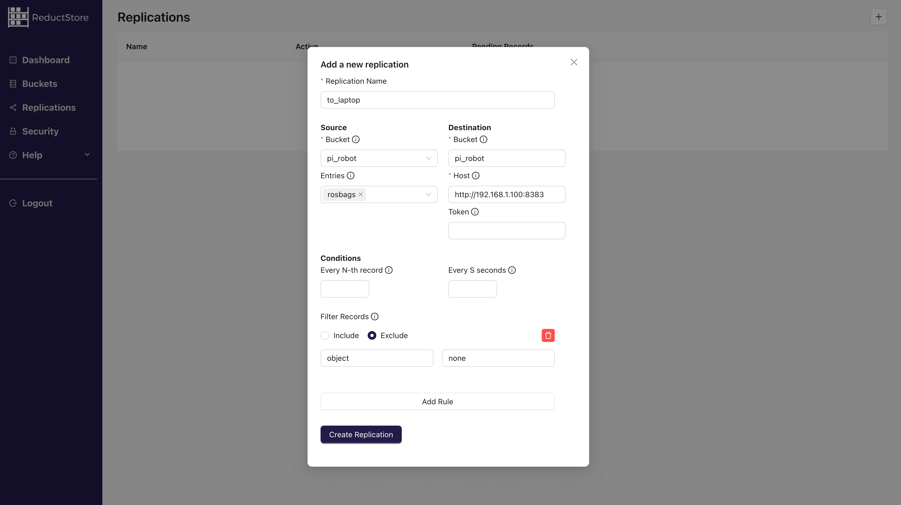

import YouTube from "@site/src/components/shared/VideoPlayer/YouTube";

<YouTube id="hb4prVXAuU0" />

&nbsp;

At ReductStore, we specialize in the high-performance storage and streaming of robotics data from edge devices to the cloud. In this tutorial, we will demonstrate how to develop a robust ROS 2 data logging pipeline for practical robotics applications.

First, we will set up a Raspberry Pi with a USB camera running a lightweight YOLOv5n object detection model via ONNX Runtime. Then, a recorder node will capture selected ROS 2 topics, including images, detection results, and logs. Next, these topics will be saved as segmented MCAP files locally with ReductStore. Finally, we will configure automatic replication to stream data to another ReductStore instance.

This minimal setup shows how to efficiently capture, store, and replicate ROS 2 data from a robot to a central server or cloud instance. These techniques can be applied to any ROS 2 system, whether it's a single robot or a fleet of autonomous systems.

Let's get started!

{/* truncate */}

## 1. Prerequisites and Architecture

Before beginning, ensure you have the following:

- **Hardware:** Raspberry Pi, a USB camera, a laptop, and an internet connection.
- **OS:** Ubuntu or Desktop Server (22.04 LTS or later) on the Raspberry Pi.
- **Laptop/PC:** A separate machine on the same network, to serve as a central data store.

In this tutorial, we will set up the following architecture:


<small style={{ display: "block", marginTop: "-20px" }}>
  Architecture: Raspberry Pi with ROS 2, USB camera, YOLOv5n, and ReductStore;
  Laptop with another ReductStore instance and Web Console.
</small>

- **Raspberry Pi:** Running ROS 2, interfacing with a USB camera, and running a YOLOv5n object detection node with ONNX Runtime.
- **Laptop/PC:** Running a ReductStore instance (acting as a central data store) to receive data from the Raspberry Pi.
- **Network:** For simplicity, both the Raspberry Pi and the laptop are assumed to be on the same local network.

### 1.1. Install Ubuntu on Raspberry Pi

If not already done, flash Ubuntu for Raspberry Pi on a microSD card and boot your Pi. You can [**download Ubuntu images for Raspberry Pi from the official site**](https://ubuntu.com/download/raspberry-pi). Ensure you have internet access and update the system:

```bash
# On Raspberry Pi
sudo apt update && sudo apt upgrade -y
```

### 1.2. Install ROS 2 on Raspberry Pi

Follow the steps below to set up **ROS 2** on your Raspberry Pi. This guide assumes you are using a supported 64-bit Ubuntu OS (e.g., 22.04, 24.04). ROS 2 is available in multiple distributions such as **Jazzy**, **Humble**, and **Noetic**. If you're unsure, we recommend using the latest **LTS version**, which we can install via the commands below.

1. **Setup Locale:**

   ```bash
   sudo locale-gen en_US en_US.UTF-8
   sudo update-locale LC_ALL=en_US.UTF-8 LANG=en_US.UTF-8
   export LANG=en_US.UTF-8
   ```

2. **Add ROS 2 apt Repository:**

   ```bash
   sudo apt install software-properties-common
   sudo add-apt-repository universe
   sudo apt update && sudo apt install curl -y
   sudo curl -sSL https://raw.githubusercontent.com/ros/rosdistro/master/ros.key -o /usr/share/keyrings/ros-archive-keyring.gpg
   echo "deb [arch=$(dpkg --print-architecture) signed-by=/usr/share/keyrings/ros-archive-keyring.gpg] http://packages.ros.org/ros2/ubuntu $(. /etc/os-release && echo $UBUNTU_CODENAME) main" | sudo tee /etc/apt/sources.list.d/ros2.list > /dev/null
   sudo apt update
   ```

3. **Install ROS 2 Packages:** For a baseline, install ROS 2 base packages (or `ros-<distro>-desktop` if you need GUI tools):

   ```bash
   sudo apt install ros-${ROS_DISTRO}-ros-base -y
   ```

   This will install core ROS 2 packages including `rosbag2`. You may verify the installation by sourcing the setup script:

   ```bash
   source /opt/ros/${ROS_DISTRO}/setup.bash
   ros2 -h    # Should show ROS 2 commands
   ```

4. **Install Build Tools:** We will create custom packages, so install development tools:
   ```bash
   sudo apt install python3-colcon-common-extensions python3-rosdep -y
   sudo rosdep init
   rosdep update
   ```

### 1.3. Create a ROS 2 Workspace

Set up a workspace for our project (if you don't have one):

```bash
# On Raspberry Pi
mkdir -p ~/ros2_ws/src
cd ~/ros2_ws
colcon build  # just to initialize, will be empty initially
```

Add `source ~/ros2_ws/install/setup.bash` to your `~/.bashrc` so that the workspace is sourced on each new shell, or remember to source it in each terminal when using the workspace. We will add packages to this workspace in subsequent steps.

## 2. Setting up the USB Camera with `v4l2_camera`

We'll use the `v4l2_camera` ROS 2 package to interface with the USB camera via Video4Linux2. This package publishes images from any V4L2-compatible camera (most USB webcams) as ROS 2 image topics.

### 2.1. Install the `v4l2_camera` Package

On the Raspberry Pi, install the driver node via apt:

```bash
sudo apt install ros-${ROS_DISTRO}-v4l2-camera -y
```

This installs the `v4l2_camera` node and its dependencies. Alternatively, you could build it from source, but the binary is available for many ROS 2 distributions.

### 2.2. Connect and Verify the Camera

Plug in the USB camera to the Pi. Verify that it's recognized by listing video devices:

```bash
ls /dev/video*
# You should see /dev/video0 (and possibly /dev/video1, etc. if multiple video capture interfaces are connected)
```

If `/dev/video0` is present, the system sees the camera (at list one). You might also install `v4l2-utils` and run `v4l2-ctl --list-devices` to see the camera name and capabilities. You can also run `v4l2-ctl --list-formats-ext` to see supported resolutions and formats.

### 2.3. Run the Camera Node

Launch the camera driver to start publishing images:

```bash
# In a sourced ROS 2 environment on the Pi
ros2 run v4l2_camera v4l2_camera_node
```

By default, this node will open `/dev/video0` and start publishing images to the `~/image_raw` topic (type `sensor_msgs/Image`) at a default resolution of 640x480 and pixel format YUYV converted to `rgb8` (see [**ROS 2 camera driver for Video4Linux2 Documentation**](https://docs.ros.org/en/jazzy/p/v4l2_camera/)). You should see console output from the node indicating it opened the device and is streaming.

Open a new terminal (with ROS sourced) on the Pi (or from a laptop connected to the ROS 2 network) and verify images are coming through, e.g., by running `rqt_image_view`:

```bash
sudo apt install ros-${ROS_DISTRO}-rqt-image-view -y  # if not installed
ros2 run rqt_image_view rqt_image_view
```

In `rqt_image_view`, select `/image_raw` to view the camera feed. This confirms the camera setup is working.

**Note:** You can adjust parameters by remapping or via ROS 2 parameters, e.g., to change resolution or device:

```bash
ros2 run v4l2_camera v4l2_camera_node --ros-args -p image_size:="[1280,720]" -p video_device:="/dev/video0"
```

This would set the camera to 1280x720 resolution (if supported).

## 3. Deploying a Lightweight YOLOv5 Object Detection Node

Next, we set up an object detection node to analyze the camera images and output metadata (`object_detected` and `confidence_score`). We'll use **YOLOv5n (Nano)** - the smallest YOLOv5 model ("only" 1.9 million parameters) which is ideal for resource-constrained devices ([**see releases at ultralytics/yolov5**](https://github.com/ultralytics/yolov5/releases)). We will run inference using the ONNX Runtime, which allows running the model without needing the full PyTorch framework on the Pi.

### 3.1. Install ONNX Runtime and Dependencies

On the Raspberry Pi, install the ONNX Runtime Python package and OpenCV (for image processing):

```bash
pip install onnxruntime opencv-python
```

_(If `pip` isn't available, use `sudo apt install python3-pip` to install it. You may also install `numpy` if not already present, as ONNX Runtime will likely need it.)_

### 3.2. YOLOv5n ONNX Model

We need the YOLOv5n model in ONNX format. To do that, we can clone the YOLOv5 repository on a more powerful machine than the Pi and export the model:

```bash
# On a PC or via Colab:
git clone https://github.com/ultralytics/yolov5.git
cd yolov5
pip install -r requirements.txt  # includes PyTorch
python export.py --weights yolov5n.pt --include onnx
```

This will create `yolov5n.onnx`. Transfer that file to your Raspberry Pi (e.g., via SCP).

For this tutorial, assume `yolov5n.onnx` is now on the Raspberry Pi (e.g., placed in `~/ros2_ws/src`).

### 3.3. Create a ROS 2 Package for the YOLO Node (optional)

You can integrate the YOLO inference in the same package as your data recorder, but for modularity, let's create a separate ROS 2 Python package called `yolo_detector`.

In the workspace src directory, run:

```bash
cd ~/ros2_ws/src
ros2 pkg create --build-type ament_python yolo_detector --dependencies rclpy sensor_msgs std_msgs
```

This will create a `yolo_detector` folder with a Python package structure.

### 3.4. Implement the YOLO Detection Node

Create a file `yolo_detector/yolo_detector/yolo_node.py` with the following content:

<details>

<summary>**YoloDetectorNode (Python code)**</summary>

```python
import rclpy
from rclpy.node import Node
from sensor_msgs.msg import Image
from std_msgs.msg import String, Float32
import cv2
import numpy as np
import onnxruntime as ort

class YoloDetectorNode(Node):
    def __init__(self):
        super().__init__('yolo_detector')
        # Load the YOLOv5n ONNX model
        model_path = '/path/to/yolov5n.onnx'  # TODO: update to actual path
        self.session = ort.InferenceSession(model_path, providers=['CPUExecutionProvider'])
        self.get_logger().info(f"Loaded model {model_path}")

        # Get model input details for preprocessing
        model_inputs = self.session.get_inputs()
        self.input_name = model_inputs[0].name
        self.input_shape = model_inputs[0].shape  # e.g., [1, 3, 640, 640]
        self.img_height = self.input_shape[2]
        self.img_width = self.input_shape[3]

        # Subscribers and publishers
        self.subscription = self.create_subscription(Image, '/image_raw', self.image_callback, 10)
        self.pub_object = self.create_publisher(String, 'object_detected', 10)
        self.pub_conf = self.create_publisher(Float32, 'confidence_score', 10)

        # If the model requires normalization factors or specific transformations, define them:
        self.mean = np.array([0.0, 0.0, 0.0])  # YOLOv5 models assume 0-255 input, no mean subtraction
        self.std = np.array([255.0, 255.0, 255.0])  # we'll scale 0-1 later by dividing by 255

    def image_callback(self, msg: Image):
        # Convert ROS Image message to OpenCV format (BGR array)
        # Assuming msg.encoding is 'rgb8' as provided by v4l2_camera default output
        img = np.frombuffer(msg.data, dtype=np.uint8).reshape(msg.height, msg.width, -1)
        # Convert RGB to BGR as YOLO model might expect BGR input (depending on training)
        img_bgr = cv2.cvtColor(img, cv2.COLOR_RGB2BGR)

        # Resize and pad image to model input shape (letterboxing if needed)
        input_img = cv2.resize(img_bgr, (self.img_width, self.img_height))
        # Convert to float32 and normalize 0-1
        input_img = input_img.astype('float32') / 255.0
        # transpose to [channels, height, width]
        input_blob = np.transpose(input_img, (2, 0, 1))
        input_blob = np.expand_dims(input_blob, axis=0)  # shape [1,3,H,W]

        # Run inference
        outputs = self.session.run(None, {self.input_name: input_blob})

        # Parse outputs to find the highest confidence detection (for simplicity)
        # YOLOv5 ONNX output typically includes [1, num_boxes, 85] array (for COCO: 4 box coords, 1 objness, 80 class scores)
        detections = outputs[0]
        # Filter by confidence threshold (e.g., 0.5)
        conf_threshold = 0.5
        best_label = "none"
        best_conf = 0.0
        if detections is not None:
            for det in detections[0]:
                obj_conf = det[4]
                class_conf = det[5:]  # class confidences
                score = obj_conf * np.max(class_conf)
                class_id = np.argmax(class_conf)
                if score > conf_threshold and score > best_conf:
                    best_conf = float(score)
                    best_label = str(class_id)  # or use a class id->name mapping

        # Publish results
        self.pub_object.publish(String(data=best_label))
        self.pub_conf.publish(Float32(data=best_conf))
        self.get_logger().info(f"Detected: {best_label} ({best_conf:.2f})")

def main(args=None):
    rclpy.init(args=args)
    node = YoloDetectorNode()
    rclpy.spin(node)
    node.destroy_node()
    rclpy.shutdown()
```

</details>

**Explanation:** This node subscribes to the camera images (`/image_raw`), processes each frame through the YOLOv5n model, and publishes two topics:

- `object_detected` (std_msgs/String): the class label (or ID) of the primary detected object (or `"none"` if none above threshold).
- `confidence_score` (std_msgs/Float32): the confidence score of that detection.

For simplicity, we took the detection with highest confidence above a threshold. In a real scenario, you probably output multiple detections or more info (bounding boxes, etc.), but we only need metadata for this tutorial.

Make sure to adjust the `model_path` to the actual location of your `yolov5n.onnx`. Also note that without class name mapping, `best_label` is currently the class index (as string). You can map this index to an actual label (e.g., using the COCO class list below).

<details>

<summary>**COCO Class List**</summary>

```yaml
names:
  0: person
  1: bicycle
  2: car
  3: motorcycle
  4: airplane
  5: bus
  6: train
  7: truck
  8: boat
  9: traffic light
  10: fire hydrant
  11: stop sign
  12: parking meter
  13: bench
  14: bird
  15: cat
  16: dog
  17: horse
  18: sheep
  19: cow
  20: elephant
  21: bear
  22: zebra
  23: giraffe
  24: backpack
  25: umbrella
  26: handbag
  27: tie
  28: suitcase
  29: frisbee
  30: skis
  31: snowboard
  32: sports ball
  33: kite
  34: baseball bat
  35: baseball glove
  36: skateboard
  37: surfboard
  38: tennis racket
  39: bottle
  40: wine glass
  41: cup
  42: fork
  43: knife
  44: spoon
  45: bowl
  46: banana
  47: apple
  48: sandwich
  49: orange
  50: broccoli
  51: carrot
  52: hot dog
  53: pizza
  54: donut
  55: cake
  56: chair
  57: couch
  58: potted plant
  59: bed
  60: dining table
  61: toilet
  62: tv
  63: laptop
  64: mouse
  65: remote
  66: keyboard
  67: cell phone
  68: microwave
  69: oven
  70: toaster
  71: sink
  72: refrigerator
  73: book
  74: clock
  75: vase
  76: scissors
  77: teddy bear
  78: hair drier
  79: toothbrush
```

</details>

Also, update `setup.py` entry points to include our node script:

```python
setup(
    ...
    entry_points={
        'console_scripts': [
            'yolo_node = yolo_detector.yolo_node:main',
        ],
    },
)
```

### 3.5. Build and Run the YOLO Node

Add `onnxruntime` and `opencv-python` to your workspace's requirements (you might include them in a `requirements.txt` for the package and use `pip` to install, since they are pip packages). For now, ensure they are installed via pip as done earlier.

Build the workspace:

```bash
cd ~/ros2_ws
colcon build --packages-select yolo_detector
source install/setup.bash
```

Run the YOLO detection node in a new terminal on the Pi:

```bash
ros2 run yolo_detector yolo_node.py
```

You should see log output from the node whenever it processes an image (every frame or at least when something is detected, depending on your logging). The node will publish messages on `object_detected` and `confidence_score` topics.

You can echo these topics in another terminal to verify:

```bash
ros2 topic echo /object_detected
ros2 topic echo /confidence_score
```

For example, if a person is detected with 85% confidence. You should see messages like:

```yaml
object: "0"
confidence: 0.85
```

Now we have a camera streaming images and a detector publishing YOLOv5 detections as ROS 2 topics. The next step is to record this data and upload it to ReductStore.

## 4. Installing and Configuring ReductStore on the Raspberry Pi

Before running the recorder node, we need a ReductStore server running on the Pi to accept uploads. ReductStore is a lightweight time-series object storage, perfect for edge devices. We will install it on the Pi and create a bucket for our MCAP files.

### 4.1. Install ReductStore on Raspberry Pi

The easiest way on Ubuntu is to use **snap** or **Docker**. For example with snap:

```bash
# On Raspberry Pi
sudo apt update
sudo apt install snapd -y   # if snapd is not already installed
sudo snap install reductstore
```

This will install ReductStore from the Snap Store. The snap should set up ReductStore as a service listening on port 8383 by default. If using a different OS or if snap isn't desired, you can use Docker (e.g., `docker run -d -p 8383:8383 -v ~/reduct_data:/data reduct/store:latest`) to run ReductStore in a container.

> **Note:** The database will listen on `http://0.0.0.0:8383` (accessible to the LAN). Ensure this port is allowed through any firewall if you want external access.

Check that ReductStore is running:

```bash
sudo snap services reductstore  # should show active
curl http://127.0.0.1:8383/api/v1/info
```

The `curl` command should return JSON info about the instance (like version, uptime, etc.).

### 4.2. Configure ReductStore

By default, ReductStore doesn't require authentication for local use (anonymous access is allowed). This is fine for our edge scenario on a local network. If you want to set up access tokens or adjust storage quotas, you can do so by following the [**Access Control guide**](/docs/guides/access-control). For now, we'll use defaults.

We will use the **Web Console** to verify data and to set up replication later. The web console is accessible from a browser at the server's address (it's the same as the API endpoint). For example, on the Pi, open `http://<raspberrypi_ip>:8383` in a browser - you should see the ReductStore Web Console interface (a simple GUI).

### 4.3. Create a Bucket for ROS bag data

The `reductstore_agent` will upload to a bucket named `pi_robot` (we will specify that in a config file). If the bucket does not exist, you can create it manually via the web console:

- Navigate to **Buckets** and create a new bucket named `pi_robot`. (You can set a quota, e.g., a FIFO quota to avoid filling up the disk on the Pi.)


<small style={{ display: "block", marginTop: "-20px" }}>
  ReductStore Web Console: Creating a bucket named "pi_robot" for storing MCAP
  files.
</small>

Now, ReductStore is set up on the Pi and ready to accept data. We can run the complete system to record ROS data, detect objects, and upload to ReductStore.

## 4. Recording and Uploading Data with `reductstore_agent`

`reductstore_agent` is a ROS 2 node that records selected topics, splits them into MCAP segments and uploads each segment to ReductStore. It is configured through a YAML file and can be run on the Raspberry Pi to capture data from the camera and YOLO detection nodes.

### 4.1. Clone, install dependencies, and build

To install `reductstore_agent`, we will clone the repository and build it in our ROS 2 workspace.

```bash
mkdir -p ~/ros2_ws/src
cd ~/ros2_ws/src
git clone https://github.com/reductstore/reductstore_agent.git
cd ..

rosdep install --from-paths src --ignore-src -r -y
colcon build --packages-select reductstore_agent
source install/setup.bash
```

You also need to install additional dependencies like `mcap`, `mcap-ros2-support`, and `reduct-py` for MCAP support and ReductStore integration. You can do this with pip:

```bash
pip install mcap mcap-ros2-support reduct-py
```

### 4.2. Create `config.yaml`

This configuration defines how `reductstore_agent` records topics and uploads them to ReductStore.

- `url`: ReductStore endpoint.
- `api_token`: Access token (can be empty if anonymous access is allowed).
- `bucket`: Target bucket in ReductStore.
- `include_topics`: List of ROS 2 topics to record.
- `split.max_duration_s`: Maximum duration of each MCAP file in seconds.
- `max_size_bytes`: Maximum size of each MCAP file (e.g., "1MB" or "10MB").
- `compression`: Compression algorithm (`none`, `lz4`, or `zstd`).
- `filename_mode`: Naming mode for output files. `timestamp` will name the MCAP files with the timestamp of the first message in the segment, and `incremental` will use a counter (0, 1, 2, ...).

```yaml
/**/*:
  ros__parameters:
    storage:
      url: "http://127.0.0.1:8383"
      api_token: "" # Leave empty for anonymous access
      bucket: "pi_robot"
    pipelines:
      camera_stream:
        include_topics:
          - /image_raw
          - /object_detected
          - /confidence_score
          - /rosout
        split:
          max_duration_s: 60
          max_size_bytes: "1MB"
        compression: "zstd"
        filename_mode: "timestamp"
```

As a best practice for production, you might want to:

- Include `/rosout` to capture logs for debugging.
- Separate lightweight telemetry from raw sensor data into different pipelines for better organization and performance.
- Limit the size of each segment to avoid large files that are hard to manage.

## 6. Running the Complete System

We have three ROS 2 nodes to run on the Raspberry Pi:

- The camera driver (`v4l2_camera_node`)
- The YOLO detection node (`YoloDetectorNode`)
- The `reductstore_agent` recorder/uploader node

It's best to run each in its own terminal (or use a launch file to launch them together). For clarity, we'll do it step-by-step:

**Terminal 1:** Camera node

```bash
# Terminal 1 on Pi (source ROS 2 and workspace)
ros2 run v4l2_camera v4l2_camera_node
```

**Terminal 2:** YOLO detection node

```bash
# Terminal 2 on Pi (source ROS 2 and workspace)
ros2 run yolo_detector yolo_node.py
```

(If you set up the entry point, you could do `ros2 run yolo_detector yolo_detector` or similar, but here we assume running the script directly.)

**Terminal 3:** reductstore_agent recorder node

```bash
# Terminal 3 on Pi (source ROS 2 and workspace)
ros2 run reductstore_agent recorder \
  --ros-args --params-file ~/ros2_ws/config.yaml
```

Now monitor the outputs:

- The camera node should just stream (no text output unless error or warning).
- The YOLO node will log detections (as we coded with `get_logger().info` on each detection).
- The `reductstore_agent` node will save MCAPs into the specified bucket in ReductStore.

Let this run for a while. By default, every 60 seconds it will finalize a bag and upload it. If you want to trigger a rotation sooner (for testing), you could reduce `max_duration_s` in the config.

### 6.1. Verify Data in ReductStore

On the Pi (or from any machine that can access the Pi's port 8383), open the ReductStore Web Console in a browser: **`http://<raspberrypi_ip>:8383`**. You should see the bucket `pi_robot`. Naviguate to it, and you should see the uploaded MCAP files listed under the `camera_stream` entry.

You have successfully set up the edge device to capture ROS data and push it to ReductStore!

## 7. Setting up Replication Tasks

With data being collected on the Pi, we likely want to aggregate it on a central server (e.g., a cloud instance or your laptop for this tutorial) for analysis or long-term storage.

ReductStore's replication feature allows the Pi (source) to **push** new records to another ReductStore instance (destination) in real-time.

:::info
Replication lets you stream only the data you need from the edge to the cloud or between edge devices. You can filter by label and push data without constant polling. If the device is offline or the destination is down, the data waits and replicates later.
:::

In this section, we'll:

- Run ReductStore on the laptop.
- Use the ReductStore Web Console to create a replication task on the Pi's instance that filters and forwards data to the laptop's instance.
- Verify that replication works.

### 7.1. Install/Run ReductStore on Laptop

On your laptop (assuming Ubuntu 22.04+ or any system with Docker or Snap):

- **Option A: Docker** - run ReductStore in a container:

  ```bash
  docker run -d -p 8383:8383 -v ~/reduct_data:/data reduct/store:latest
  ```

  This runs ReductStore locally on port 8383 and stores data in `~/reduct_data` on your laptop.

- **Option B: Native** - you could similarly install via Snap (`sudo snap install reductstore`) or use a binary.

After starting it, ensure you can access it:

```bash
curl http://127.0.0.1:8383/api/v1/info
```

should return info as before (but for the laptop's instance).

Open the web console on the laptop: `http://localhost:8383` and keep it open for monitoring.

> Create a bucket named `pi_robot` on the laptop as well, otherwise the replication task will fail (it needs the destination bucket to exist).

:::tip
Use provisioning to automate bucket creation and other setup steps in a real deployment. See [**Configuration/Provisioning Documentation**](/docs/configuration#provisioning) for more.
:::

**Networking:** Make sure your laptop is accessible from the Pi. If both are on the same LAN, you might use the laptop's IP (e.g., 192.168.x.x). If the laptop's ReductStore is in Docker, ensure the port 8383 is open (it is published in the run command above). For testing, you might temporarily disable firewall or ensure port 8383 is allowed.

Find your laptop's IP address (e.g., `hostname -I` on Linux), let's say it's `192.168.1.100` for example.

### 7.2. Configure Replication on the Pi via Web Console

On the Pi's web console (**`http://<raspberrypi_ip>:8383`**), look for “Replications” and the “+” to add replication). We want to create a replication task that sends data to the laptop.

Fill in the replication settings as:

- **Source Bucket:** pi_robot (on Pi)
- **Destination URL:** `http://<laptop_ip>:8383` (e.g., `http://192.168.1.100:8383`)
- **Destination Bucket:** pi_robot (on laptop)
- **Replication Name:** (give it a name like “to_laptop”)
- **Entries:** `camera_stream` (name of the pipeline we set up in `reductstore_agent` config)

Start the replication task. The Pi's ReductStore will now start forwarding new records that meet the criteria to the laptop, in real-time. It's a push model from Pi to laptop, so the laptop doesn't need to know about the Pi or poll it - the Pi will push new records as they arrive.



<small style={{ display: "block", marginTop: "-20px" }}>
  ReductStore Web Console: Setting up a replication task to forward data to a
  central storage.
</small>

### 7.3. Test Replication

Back on the Pi, ensure the `reductstore_agent` node is still running and creating new records. When the next bag file is uploaded on the Pi, the replication task will immediately send it to the laptop.

On the **laptop's web console**, open the `pi_robot` bucket. You should start seeing records appear that correspond to those on the Pi (with a slight delay for transfer).

You can also check the replication status on the Pi's web console; it may show last replicated record timestamp etc., indicating it's working.

At this point, we have a full end-to-end pipeline:

- Raspberry Pi captures images and detects objects with YOLOv5.
- `reductstore_agent` continuously records this data into MCAP files.
- ReductStore on Pi replicates the files to another ReductStore instance.
- The laptop accumulates the replicated files in its own ReductStore bucket.

## 8. Production Best Practices and Considerations

This tutorial only scratches the surface of building a robust data acquisition and storage pipeline for robotics. Here are some best practices to consider:

### 8.1 Separate Storage Topics by Types

Separate storage streams for different topic categories (e.g., lightweight telemetry, downsampled sensor data, full-resolution data). This allows you to apply different retention policies, access controls, or replication rules to each category.

- See [**3 Ways to Store ROS Topics**](/blog/store-ros-topics)
- Example: [**How to Store Images in ROS 2**](/blog/tutorials/ros/optimal-image-storage-solutions-for-ros-based-computer-vision)

Here are some common data categories and their characteristics to consider:

| Category                    | Examples                                        | Characteristics                                                        |
| --------------------------- | ----------------------------------------------- | ---------------------------------------------------------------------- |
| **Lightweight telemetry**   | GPS, IMU, joint states, system status           | Low bandwidth, near real-time, useful for business analytics           |
| **Downsampled sensor data** | Lower framerate/resolution camera or lidar data | Mid-size, great for monitoring and incident triage                     |
| **Full-resolution data**    | Raw camera frames, high-fps lidar, depth maps   | High volume (up to 1TB/hour), needed for debugging or model retraining |

### 8.2 Combine Downsampling with Replication

This is typical in ELT (Extract-Load-Transform) pipelines. The idea is to save everything locally (on the robot) at high resolution and framerate, then stream part of the data to the cloud or a central server at a lower resolution or lower frequency.

- Example: Store 1 FPS video in cloud, keep 30 FPS original on robot SSD
- See example in: [**Building a Data Acquisition System for Manufacturing**](/blog/daq-manufacture-system)

### 8.3 Offload Data to Cold Storage

For long-term archiving, consider offloading data to cold storage to reduce costs while keeping data accessible.

- Example: Keep 30 days of data locally, archive older data to Cloud Storage (e.g., AWS S3, Google Cloud Storage)
- Connect us if you need a trial instance of [**ReductStore Cloud**](/solutions/cloud) for this purpose.

## 9. Conclusion

This tutorial showed how to build a complete ROS 2 data logging pipeline on a Raspberry Pi. We captured camera data and YOLOv5 detections, recorded selected topics into segmented MCAP files using `reductstore_agent`, and stored them in ReductStore. We then configured a replication task to automatically stream data to another ReductStore instance.

This setup is highly adaptable: you can group topics by type, filter out unnecessary data, and enrich records with metadata labels for easier filtering. It provides a solid foundation for scalable and efficient data acquisition—whether you're working with a single robot or managing a distributed fleet.

We hope this tutorial helps you build your own ROS 2 data acquisition system! Happy hacking!

---

Thanks for reading, I hope this article will help you choose the right storage strategy for your vibration data.
If you have any questions or comments, feel free to use the [**ReductStore Community Forum**](https://community.reduct.store/signup).
