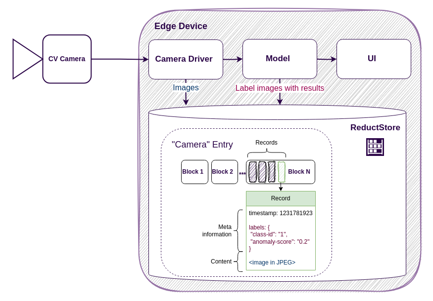

When building computer vision systems, efficient data storage is a fundamental requirement. Whether you're capturing images for training, storing inference results for validation, or archiving sensor data for future analysis, your storage solution must be both reliable and high-performance.

Ingestion speed is especially critical. If your system can’t write data fast enough — whether it’s high-frequency frames or accompanying metadata — you risk losing valuable information or creating bottlenecks in the pipeline.

In this post, we’ll look at three common approaches to storing data in computer vision applications: a traditional file system, S3-compatible object storage, and **[ReductStore](/)**, a time-series-optimized blob storage. We’ll explore the strengths and limitations of each approach to help you choose the best fit for your application.

## A Simple Computer Vision Application

For demonstration purposes, we’ll use a simple computer vision (CV) application which is connected to a CV camera and runs on an edge device:

The camera driver captures images from the CV camera every second and forwards them to the model, which then detects objects and displays the results in the user interface.

Your images and results need to be stored for training and validation purposes. The customer may also wish to view images featuring anomalous objects. These requirements present the challenge of maintaining a history of blob or unstructured data.

{/* truncate */}

## File System

One of the most straightforward ways to store images from a (CV) camera is to write them directly to a local file system. Each image can be saved using a timestamp as a unique identifier, and the directory structure can be organized by time intervals for easier access.

The main advantage of this approach is its simplicity — no external dependencies, no infrastructure setup, and it works out of the box. However, it comes with significant limitations:

- **Data retention**
  Disk space is finite. Eventually, you'll need to delete older data — either manually, using tools like `cron`, or by building this logic into your application.

- **Data lookup**
  While naming conventions and folder hierarchies can help, accessing data by time or context becomes inefficient as the dataset grows. In practice, this often requires a companion database to index and query files — adding complexity and undermining the simplicity of the original setup.
y fronting ReductStore with NGINX and separating **ingress** and **egress** layers, you get a simple but powerful foundation for **fault-tolerant IIoT and robotics workloads**.

- **Labeling and search**
  If you want to tag images with labels (e.g., object type, camera location, quality), or filter by those labels later, the file system alone doesn’t support it. You’ll need to implement a separate mechanism.

- **Replication**
  Copying data to other machines (e.g., for redundancy or aggregation) is possible using tools like `rsync` or `scp`, but it requires manual setup, SSH access, and custom scripts.

- **Security**
  Providing access to stored data often requires giving users access to the entire file system or to network shares, which increases the risk of unauthorized access or accidental modification.
  Additionally, if you need to share data externally — for example, with a remote team or a cloud service — you may end up copying large volumes of files. This not only consumes time and bandwidth but also raises concerns about secure transfer, data leaks, and access control once the data is outside your network.

In summary, while the file system is an easy starting point, it rarely scales well. As your needs grow — especially around querying, labeling, replication, and security — you’ll often end up building database-like functionality on top of it. At that point, it may be worth reconsidering your storage architecture altogether.

## S3-like Object Storage

A more advanced approach to storing images is to use an object storage system, such as an S3-compatible service. This allows data to be organized similarly to folders and files, but accessed and managed through an HTTP-based API.

This method offers more flexibility than a local file system and comes with several advantages:

- **Remote storage**
  Data can be stored on remote servers or in the cloud, where capacity is virtually unlimited. If your organization or customer already uses an object storage–based data lake, it's possible to write data there directly.

- **Security**
  Access to the data can be controlled using fine-grained permissions. For example, the application might have write-only access, while users are granted read-only rights.

- **Data replication**
  Many object storage systems support built-in replication, allowing data to be mirrored automatically or manually to other locations.

However, this approach is not without its drawbacks:

- **Data retention**
  Although object storage typically offers more capacity, most systems don't provide real-time data expiration or fine-grained retention policies out of the box. Some platforms support time-based retention (e.g., lifecycle rules in S3), but these are often batch processes that run periodically, not in real time.
  This can be problematic if your data ingestion rate is unpredictable or bursty — you might exceed storage limits before the cleanup is triggered. In such cases, you’ll need to implement custom logic or external tooling to ensure timely data reduction.

- **Data accessibility**
  Despite its API, the data model still mimics a file system hierarchy, which may cause similar performance issues as the dataset grows. Moreover, access via HTTP introduces latency — each read or write requires a separate HTTP request, which can be inefficient for small objects.
  [**See our benchmark on performance limitations**](/blog/comparisons/computer-vision/iot/performance-comparison-reductstore-vs-minio).

An S3-like object storage may seem like a natural upgrade from a file system, especially in terms of scalability and remote access. However, its hierarchical structure and limited native querying make it less suitable for time-series or high-ingestion workloads. Over time, you might find yourself building additional infrastructure — such as a time-series database or metadata index — to overcome these limitations.
We’ve explored this **[alternative in detail](/blog/comparison/iot/reductstore-benchmark)** and found that it introduces its own trade-offs.

## ReductStore

**[ReductStore](https://www.reduct.store/)** is a high-performance storage and streaming solution for robotics, computer vision, and industrial IoT applications.
It is purpose-built to ingest and store unstructured time-series data — such as images, sensor payloads, or inference results — directly at the edge.
Once stored locally, the data can be selectively replicated to central storage or the cloud, enabling efficient data consolidation without sacrificing real-time performance at the edge.

As you can see, instead of a tree-like structure, it has a flat structure of entries where data is batched and partitioned into blocks.
This approach is more efficient for writing, since blocks can be pre-allocated for incoming records.
It also improves time-based querying: because data typically arrives in time order, records for a given time interval are physically located close to each other — making scans faster and more predictable.

Another very important feature of ReductStore is its support for data labeling. This allows you to store the image and the corresponding model output together in a single entry.
Labels not only help organize and filter data during queries — they can also be used for conditional replication, so only relevant data is streamed to central storage or other nodes,
or selectively retained on the edge for long-term storage.

Let’s summarize the benefits of using ReductStore:

- **Data Accessibility**
  ReductStore uses record timestamps as unique identifiers and provides an HTTP API for efficient access by exact time or time range.
  It also [**batches small objects**](/docs/guides/data-querying#concepts) into larger HTTP requests, which significantly improves performance on high-latency networks.

- **Data Reduction**
  Each bucket can be assigned a storage quota. When the quota is reached, the engine automatically removes the oldest data — enabling built-in, real-time retention management.

- **Labeling**
  Data can be tagged with labels and used as [**annotations**](/docs/guides/data-ingestion#annotating-data) or [**search criteria**](/docs/guides/data-querying#using-labels-to-filter-data).
  Labels also enable advanced workflows such as conditional replication or selective long-term retention on the edge.

- **Security**
  ReductStore supports role-based access with token authentication, allowing you to define fine-grained read and write permissions per bucket.
  This makes it possible to isolate access between devices, applications, or users — ensuring that each has access only to the data it needs.

- **Data Replication**
  ReductStore supports append-only [**data replication**](/docs/guides/data-replication), enabling automatic streaming of data from one instance to another.
  You can replicate all data or filter it using labels to replicate only what’s relevant.

## Why Not a Relational Database?

Relational databases are great for structured data, but they’re not designed for the demands of computer vision applications — especially when it comes to storing and managing image data at scale.

In most CV pipelines, you deal with large volumes of **unstructured binary data**: raw images, video frames, model outputs, and metadata. Trying to store this data in a relational database quickly becomes inefficient for several reasons:

- **Inefficient for Large Binary Data**
  Relational databases can store images as blobs, but they aren’t optimized for high-throughput write operations. Ingesting large numbers of images per second puts significant strain on the database engine.

- **Poor Time-Series Access**
  CV systems often need to query image data by time intervals — e.g., “give me all frames from the past 10 minutes.”
  Relational databases can support this, but performance degrades with large datasets unless you implement table partitioning and maintain complex indexes.
  This adds operational overhead and still may not scale well for high-ingestion workloads like real-time image capture.

## Conclusion

Choosing the right storage solution is critical for building efficient and reliable computer vision systems. While traditional file systems and object stores can serve as starting points, they quickly fall short when it comes to performance, searchability, and data lifecycle management — especially at the edge.

ReductStore offers a purpose-built alternative: a high-performance storage and streaming solution optimized for unstructured time-series data. With features like efficient time-based access, built-in data reduction, flexible labeling, and conditional replication, it bridges the gap between raw image capture and scalable, intelligent data pipelines.

If you're building applications in robotics, industrial vision, or edge-based AI, ReductStore can help you focus on what matters most — your models and insights — without getting bogged down in the complexity of data infrastructure.

---

I hope you find this article interesting and useful. If you have any questions or feedback, don’t hesitate to use the [**ReductStore Community**](https://community.reduct.store/signup) forum.
