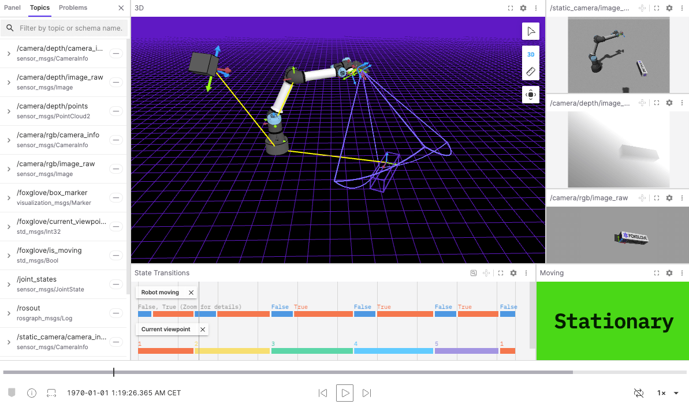

In robotics development, effective visualization and analysis tools are essential for monitoring, debugging, and interpreting complex sensor data. Platforms like RViz, Foxglove, and Rerun play a key role at the visualization layer of the observability stack. They help developers interact with both live and recorded data. These tools rely on timely, well-structured access to the underlying data streams. That’s where [**ReductStore**](/) comes in. It handles the data logging, storage, and processing, with a focus on capturing high-volume time-series data efficiently. ReductStore aims to integrate with tools like RViz, Foxglove, and Rerun, supporting a complete observability pipeline: from raw data ingestion to actionable insights.

Each visualization platform has its unique role in the development workflow. [RViz (ROS Visualization) is the classic 3D visualization tool built for the ROS ecosystem](https://wiki.ros.org/rviz), widely used for real-time robot monitoring and debugging. [Foxglove is a modern data visualization and inspection platform for robotics and physical AI systems](https://foxglove.dev/about), aiming to simplify how teams collect, visualize, analyze, and manage large volumes of diverse sensor data. [Rerun is a lightweight, native desktop application focused on fast and efficient visualization of robotics data](https://rerun.io), enabling developers to quickly explore and debug both live and recorded sensor streams with minimal setup.

This article compares RViz, Foxglove, and Rerun across key criteria: pricing, cross-platform support, remote collaboration, user interface, extensibility, ROS integration, performance with large datasets, and visualization and analysis features. The goal is to help robotics developers choose the right tool for their specific needs.

{/* truncate */}

## **Pricing**

**RViz** and **RViz 2** are part of the ROS ecosystem and released under the BSD 3-Clause License. This permissive open-source license allows free use, modification, and redistribution (including for commercial purposes), as long as the original copyright and license notices are preserved.

**Foxglove** offers a free tier that includes core features for up to 3 users, 10 devices, and 10 GB of cloud storage. For larger teams or needs (e.g., extra users, storage, private extensions, enterprise integrations), paid subscriptions are available. Pricing depends on usage and support level. There is also a free academic plan for qualified institutions, which includes more users and storage. Foxglove itself is proprietary software, though it is built on open protocols like MCAP and integrates with open-source ROS tools.

**Rerun** is fully open-source under both the MIT and Apache 2.0 licenses. There are no current paid plans for the open-source core. The project follows an open-core model: the core visualizer and SDK are free, while a commercial platform is in early access for teams needing cloud-based storage, collaboration tools, advanced analytics, and scalable CI/CD workflows. This commercial layer is designed to build on top of the open-source foundation.

## **Platform & Collaboration**

**RViz** and **RViz 2** are primarily developed for Linux, where they offer the most stable and reliable performance. RViz 2 also supports Windows and macOS as part of ROS 2, but these versions are less mature and less commonly used. They often require manual setup or compilation, though support continues to improve with newer ROS 2 releases.

Both RViz versions are local desktop applications and are not designed for remote or multi-user use out of the box. Workarounds like SSH with X11 forwarding, VNC, or running RViz locally while connecting remotely to a ROS system are possible, but they are often fragile, require manual configuration, and may suffer from performance or latency issues depending on the network and hardware.

To address these limitations, early tools like `ROS3D.js` offered browser-based ROS 1 visualization, but they are now mostly unmaintained and incompatible with ROS 2. Modern web visualization is typically done with tools like Foxglove, Webviz, or custom WebSocket-based interfaces. Some cloud robotics platforms also offer remote ROS visualization, though they typically require extra integration work.

**Foxglove** runs on Windows, macOS, and Linux, available both as a native desktop app and in a web browser. This gives users the flexibility to work locally or remotely without installing software. The browser version supports multi-user collaboration, allowing teams to share layouts and stream live data securely in real time from any internet-connected device.

**Rerun** is a lightweight native desktop application for Windows, macOS, and Linux. It requires minimal setup and enables developers to quickly visualize and debug live or recorded sensor data without needing a browser or complex configuration. Although Rerun does not support multi-user or collaborative features, teams often share `.rrd` log files for offline review. This method is usually more practical than using remote desktop tools.

Rerun integrates into development workflows, such as Python environments, which typically require installing Rerun’s SDKs and dependencies.

## **User Interface**

**RViz** and **RViz 2** have a powerful but somewhat dated interface that focuses more on functionality than modern design. The learning curve can be steep, especially for beginners, due to the complex layout and the need to manually configure displays, topics, coordinate frames, and tools. The interface is built around multiple panels and dialogs that require careful configuration. It lacks the visual polish and streamlined workflows of newer visualization tools.

**Foxglove** features a modern, user-friendly interface with flexible dashboards and responsive controls. It is designed to be accessible to users at all experience levels, making it easier to explore, analyze, and share robotics data. The interface relies heavily on graphical elements instead of commands or configuration files, which lowers the entry barrier for users unfamiliar with ROS or robotics tools.

**Rerun** offers a clean and straightforward interface focused on efficient data visualization. It balances ease of use with core functionality, providing easy-to-navigate views without overwhelming users. The interface requires minimal setup and supports intuitive exploration of data streams and logs. However, it currently has fewer customization options than RViz or Foxglove.

## **Extensibility**

**RViz** (both ROS 1 and ROS 2) supports extensibility through C++ plugins, allowing users to develop and integrate custom visualizations, tools, and panels. This plugin architecture makes RViz highly adaptable across robotics domains such as perception, navigation, and manipulation. Many ROS packages include their own RViz plugins by default. However, developing and using plugins requires tight integration with the specific ROS environment. Plugins made for RViz in ROS 1 are not directly compatible with RViz 2; they often require modification or a complete rewrite.

**Foxglove** offers extensibility through an Extensions SDK, which allows developers to build React-based visualizations using TypeScript. Extensions can be shared via an online registry and do not require recompilation. Foxglove also provides APIs and libraries in C++, Python, and Rust, primarily for working with the MCAP file format, enabling integration with ROS (both versions), WebSocket streams, and recorded sensor data. Foxglove’s ecosystem also supports integration with popular robotics and simulation tools such as NVIDIA Isaac Sim, Velodyne LiDAR, and Jupyter Notebooks, either directly or via external bridges.

**Rerun** focuses on extensibility through SDKs and APIs, especially for Python and other programming environments. It does not support plugin-based customization or drag-and-drop extensions like RViz or Foxglove. Instead, it prioritizes programmatic data embedding and visualization, making it well-suited for users who prefer scripting and code-driven workflows.

Rerun offers strong Python support, but its core is built with Rust and the egui GUI framework — technologies less familiar to many robotics developers. This can introduce a learning curve and limit low-level customization unless users are comfortable with Rust.

Rerun does not offer a simple or dynamic plugin system or scripting layer similar to RViz’s C++ plugins or Foxglove’s TypeScript extensions. This limits rapid prototyping or quick third-party integration.

Still, its APIs offer robust integration with diverse data sources, including ROS topics, sensor streams, and machine learning frameworks like TensorFlow and PyTorch. This makes Rerun a flexible tool for logging, visualizing, and debugging complex data pipelines.

Rerun is best suited for developers who prefer programming-driven customization over GUI-based tools. It provides direct control over data ingestion and visualization, enabling highly tailored, dynamic workflows that can grow with project needs.

## **ROS Integration**

**RViz** is tightly integrated with ROS and supports direct interaction with live ROS topics. Originally developed for ROS 1, it was succeeded by **RViz 2** for ROS 2, and it remains a core visualization tool in many robotics workflows. However, this deep integration limits RViz’s usability outside the ROS ecosystem. Both versions depend on a fully functioning ROS environment and are not designed to run independently or handle non-ROS data without conversion.

**Foxglove** connects to live ROS systems using `foxglove_bridge`, a WebSocket-based bridge designed for this purpose. It runs on the same network as the ROS system and streams real-time ROS messages to Foxglove over WebSocket. This architecture allows remote monitoring and interaction with installing ROS locally. Unlike RViz, Foxglove can be used without a full ROS setup.

In addition to live data, Foxglove also supports opening and analyzing ROS bag files locally. This makes it easy to review recorded data, visualize topics, and troubleshoot issues offline, without needing an active ROS system.

**Rerun** supports integration with both ROS 1 and ROS 2, enabling live topic visualization and recorded data inspection. For ROS 2, Rerun officially maintaines basic example scripts, hosted on GitHub, that use Python (`rclpy`) or C++ to subscribe to ROS 2 topics and forward selected data to the Rerun viewer. This is a user-defined bridge rather than a native-plugin integration. ROS 1 integration is possible using custom nodes written in either C++ or Python (`rospy`), but usually requires more manual setup. Unlike Foxglove, which uses standardized communication protocols like `foxglove_websocket` via `foxglove_bridge` (and optionally `rosbridge`), Rerun ingests data directly through user-defined code and does not rely on ROS-specific bridge protocols. While Rerun avoids protocol-based bridging, it still requires users to write custom nodes that translate ROS messages into its API.

Rerun is especially useful for visualizing time-synchronized multimodal data, such as sensor readings, 3D geometry, camera images, transforms, and trajectories. However, it currently lacks built-in support for certain ROS-specific features like interactive TF tree exploration, occupancy/grid map overlays, and full URDF-based robot model visualization. Community-maintained examples (e.g., the `urdf_loader`) offer partial support for URDF rendering, but do not yet match RViz’s depth or interactivity.

Rerun also cannot currently open ROS bag files directly (`.bag` for ROS 1 or `.db3` for ROS 2). Instead, users replay them with `rosbag play` or `ros2 bag play` and forward selected topics to Rerun using custom Python or C++ bridge nodes. This workflow offers flexibility and performance but requires additional configuration. Rerun uses its own `.rrd` log format, which is optimized for high-throughput, time-seekable storage and streaming.

## **Performance with Large Data**

**RViz** is not fully optimized for very large datasets, such as dense point clouds, high-frequency topics, or long message histories. When visualizing large volumes of data, users may encounter performance issues like low frame rates, rendering lag, and high CPU or GPU usage. This happens because RViz continuously renders incoming ROS messages and stores message history in memory, which can quickly overwhelm system resources.

**RViz 2** improves on this with better multithreading and more efficient message transport via DDS. These changes help boost performance and scalability in ROS 2 environments. However, RViz 2 still struggles with very dense or high-rate data streams, especially when rendering complex 3D data in real time, and these improvements do not fully solve the challenges of high-density visualization. To improve performance, users often reduce message history length, filter or downsample data, and disable non-essential displays.

**Foxglove**, particularly its web version, can underperform RViz in high-data scenarios. Because it runs in a web browser, it’s constrained by browser memory limits, single-threaded JavaScript execution, and limited access to hardware acceleration. As a result, visualizing large point clouds or streaming high-frequency topics may lead to lag, dropped frames, or browser instability. These limitations are especially evident when handling continuous 3D data or large bag files.

Performance can vary depending on the use case and browser environment. The desktop application bypasses some browser limitations and can perform better. However, since it is built on Electron, it still has overhead related to memory usage and resource management common to Electron-based apps. Though these issues are generally less severe than in the web version. For lighter workloads, such as 2D plots or moderate-frequency telemetry, Foxglove often performs well and benefits from its accessible UI and cross-platform support.

**Rerun** is designed with high performance in mind for large-scale, multimodal data workflows. It is a native desktop application written in Rust and uses the modern WGPU rendering backend. This gives it direct access to system resources, helping it efficiently handle dense point clouds, long message histories, and high-frequency data streams. Behind the scenes, Rerun uses techniques such as memory-mapped I/O, zero-copy data handling, and intelligent batching to reduce latency and resource use.

Although there are only few formal benchmarks comparing Rerun with RViz or Foxglove, early community feedback and its architecture suggest that Rerun scales effectively with complex datasets. Performance can be further improved by filtering or downsampling data streams according to specific needs. Rerun is currently under active development to expand its capabilities for robotics visualization and analysis.

## **Analysis & Visualization**

### **RViz & RViz 2**

**Key Capabilities:**

- **Real-Time Visualization & Bag File Support**: RViz and RViz 2 support real-time visualization by subscribing to live ROS topics. They also display data from recorded bag files (`.bag` for ROS 1, `.db3` and `.mcap` for ROS 2), when those files are replayed using tools like `rosbag play` or `ros2 bag play`.

- **Data Format Support**: RViz visualizes a wide range of robot state information, including URDF robot models, coordinate transforms (TF), and various sensor data such as LIDAR, IMU, depth, and RGB cameras. It also supports odometry, localization, occupancy grid maps (used in SLAM), navigation data (paths, goals, trajectories), and interactive markers for user interaction. RViz 2 supports the same data types with ROS 2 message compatibility.

- **Interactive Markers**: These 3D UI elements enable users to manipulate objects within the visualization: setting navigation goals, adjusting robot end-effector positions, or dragging points for motion planning. Using them requires writing supporting ROS nodes and configuring interaction logic.

- **Configurable Interface**: Users can add, remove, and arrange panels, and customize display properties such as colors, shapes, and update rates for each data type. These configurations can be saved and reloaded using `.rviz` files, streamlining repetitive workflows like navigation, debugging, or SLAM visualization. Multiple camera control modes (Orbit, FPS, Top-down) allow flexible 3D scene navigation.

- **Plugin-Based Architecture**: Developers can extend RViz by creating custom visualizations and tools through C++ plugins. RViz 2 supports plugins too, built on a more modern and modular architecture.

<small style={{ display: "block", marginTop: "-20px" }}>
  [Data from Mobile Robot
  Example](https://app.foxglove.dev/187d8797/view?ds=foxglove-sample-stream&ds.recordingId=rec_0dLj2kpbuAv0ri0m&ds.overrideLayoutId=bd38e764-ac21-49a2-b854-abfaa20af6bc&layoutId=bd38e764-ac21-49a2-b854-abfaa20af6bc&time=2024-03-22T03%3A59%3A50.316857842Z)
</small>

**Limitations**:

- **Limited Analysis**: RViz and RViz 2 primarily serve visualization purposes and lack built-in tools for detailed message inspection, conditional logging, or advanced playback controls like pause, step, or speed adjustment. These features typically require external tools such as `rqt_bag`, ROS CLI utilities, or third-party RViz plugins (e.g., `rosbag_panel`). RViz also does not consistently warn about invalid data (e.g., NaNs or infinities), which can result in missing or misleading visuals. These tools are not designed for deep offline data analysis and are best used alongside more specialized logging or analysis solutions.

- **No Time-Series Analysis**: RViz and RViz 2 do not support time-series plotting or statistical analysis. For these tasks, dedicated tools like `rqt_plot`, PlotJuggler (with ROS 2 support), or external environments like Jupyter with Python are more appropriate.

- **No Conditional Filtering**: RViz and RViz 2 display all incoming data without the ability to filter messages based on content or fields. Filtering must be performed upstream, often by custom ROS nodes. Some plugins or panels offer limited filtering but are not general solutions.

- **No Topic Synchronization**: RViz and RViz 2 subscribe to each topic independently and display messages as they arrive. They do not synchronize data streams from different topics based on timestamps, which can cause misalignment or inconsistencies in time-sensitive visualizations (e.g., camera images, LIDAR scans, TF frames). Synchronization requires external tools like `message_filters` or custom nodes.

- **No Built-In Logging or Export**: RViz and RViz 2 cannot automatically export visualized data or record screencasts. Users are limited to manual screenshots unless using custom plugins or external tools to record sessions or extract data.

- **Limited Multi-Robot Support**: While RViz can display data from multiple robots using namespaces, the interface is not designed for straightforward multi-robot workflows. RViz 2 includes minor improvements, but still lacks dedicated features for managing multiple robots simultaneously.

### **Foxglove**

**Key Capabilities:**

- **Multi-Modal 3D Visualization**: Foxglove provides comprehensive 3D visualization for a variety of robotics data, including URDF robot models, TF trees, sensor streams (LIDAR, point clouds, camera feeds), occupancy grids, and navigation elements such as paths, goals, and costmaps. Users can interact with the scene in real time: rotating the view, toggling layers, and focusing on specific frames or topics. Multi-camera views, tooltips, and overlays enhance spatial understanding. Synchronized multi-viewports and flexible camera modes (free, fixed, follow-frame, sensor-aligned) make it possible to examine several spatial data streams side by side. All streams are synchronized through a shared timeline for consistent context across modalities.

- **Topic Synchronization & Playback Timeline**: Foxglove offers a unified, timestamp-based timeline that synchronizes data from multiple topics. This ensures time-aligned playback of sensor streams like RGB images, depth, point clouds, IMU, and TFs, useful both in real time and with recorded data. The timeline includes playback controls such as pause, frame-by-frame stepping, variable speed, and bookmarks for quickly navigating to key events. This tight time synchronization is a major advantage over RViz, enabling clearer insights into system behavior.

- **Advanced Analysis & Time-Series Tools**: Foxglove offers a capable set of tools for offline analysis of recorded data. Users can inspect messages in detail, filter them by topic or namespace, and control playback through an integrated timeline with pause, step-by-step navigation, and adjustable speed. To view custom ROS 2 message types with full support, messages are best recorded in or converted to the MCAP format, although Foxglove can open other formats with some limitations.

  For analyzing numeric data over time, Foxglove provides flexible plotting tools broadly comparable to `rqt_plot` or PlotJuggler. Users can visualize numeric fields from any message type, overlay multiple signals, zoom in on specific time ranges, and interactively adjust what’s displayed.

  These tools make it easy to explore sensor outputs, control signals, and algorithm behavior. Interactive graphs support dynamic switching between message series.

- **Modular & Configurable Interface**: The Foxglove UI is fully modular, allowing users to add, remove, duplicate, and rearrange panels such as 3D views, image feeds, message viewers, plots, diagnostics, and consoles. Each panel is highly configurable, with settings for color, scale, transparency, update rate, and filtering. Users can save layouts as JSON files, enabling reproducible setups, role-based dashboards, and fast task switching (e.g., from SLAM debugging to perception analysis). Layouts can be shared across teams or versioned over time.

- **Custom Panels & Extensions**: Foxglove allows users to build custom panels using plugins, enabling specialized interfaces tailored to specific workflows. These panels are embedded directly into the Foxglove interface, keeping everything streamlined and centralized. This is particularly valuable for teams developing internal tools or dashboards for robotics development and testing.

  Extensions are packaged as `.foxe` files and can be shared via the Foxglove Extensions Registry, either privately within an organization or publicly. While layouts can be shared via URLs or layout IDs to replicate interface setups, this sharing does not include the actual panel code. Users must have the required extensions installed for full functionality.

- **Cloud & Collaboration**: Foxglove can be run locally or in the cloud. Its cloud features include shared dashboards, timeline comments, and real-time collaboration, enabling teams to jointly review logs or live data remotely. This makes it particularly useful for distributed development, remote testing, or asynchronous data reviews.

<small style={{ display: "block", marginTop: "-20px" }}>
  [Autonomous Robotic Manipulation
  Example](https://app.foxglove.dev/187d8797/view?ds=foxglove-sample-stream&ds.recordingId=rec_0dHYxsgeF50Cu5Ln&ds.overrideLayoutId=f1366b1a-0e21-4c96-95f8-570a7325cb1f&layoutId=f1366b1a-0e21-4c96-95f8-570a7325cb1f&time=2023-05-31T04%3A16%3A55.239000104Z)
</small>

**Limitations**:

- **Limited Real-Time 3D Interactivity**: Foxglove does not natively support interactive 3D markers like RViz. Users cannot directly manipulate objects in the 3D scene (e.g., setting goals, editing poses, or dragging elements) without building custom extensions. This limits Foxglove’s out-of-the-box usability for real-time tasks such as motion planning, teleoperation, or interactive environment setup.

- **Limited Advanced Features**: Foxglove currently lacks certain advanced features found in tools like PlotJuggler. For example, Foxglove does not yet support strict axis ratio locking — a critical feature for accurately visualizing spatial data where maintaining proportional relationships between axes is important. Additionally, Foxglove’s built-in data transformation capabilities are limited compared to PlotJuggler’s comprehensive suite of statistical and signal-processing tools, such as moving averages, derivatives, filtering, and custom mathematical expressions. These advanced features make PlotJuggler especially useful for detailed signal analysis and fine-grained data manipulation, often essential when debugging sensor data or control signals.

- **No Automated Anomaly Detection**: Foxglove does not include built-in automated validation or anomaly detection. It does not use ML models or rule-based systems to automatically flag issues. Instead, it offers detailed message introspection and customizable visualizations that enable users to manually identify irregularities such as NaNs, infinities, or out-of-range values. This hands-on approach requires user expertise but provides flexible, in-depth analysis without automated alerts.

### **Rerun**

**Key Capabilities**:

- **Real-time & Recorded Data Visualization**: Rerun supports both live-streamed and recorded sensor data visualization with minimal latency. It ingests data via Rust- or Python-based logging SDKs, handling a wide range of robotics sensor modalities including 3D spatial data, camera imagery, numeric time-series, semantic segmentation maps, depth maps, annotations (bounding boxes, keypoints), and textual or categorical event data. Recorded datasets can be replayed with full timeline control for stepwise inspection or smooth playback, aiding in bug reproduction and model validation.

- **Collaboration & Sharing Features**: Rerun streamlines collaborative workflows through data export and session sharing via `.rrd` files. Teams can share recorded `.rrd` files for offline inspection, annotate data using Annotation Context (which supports labeling via class IDs and color mapping), and use shared Recording IDs to log streams from multiple processes or machines into a unified session, as long as the Recording ID is set consistently at the time of logging. Note: merging previously recorded `.rrd` files with different Recording IDs offline is currently not supported. Users can also export screenshots (for reports or dashboards) via the CLI or viewer options, depending on the version and available commands.

- **Customizable & Extensible UI**: The Rerun Viewer offers a modular, layout-aware interface tailored for tasks such as SLAM debugging, multi-sensor calibration, and performance profiling. Users can save and reload Blueprints — serialized UI configurations that preserve panel layouts, timelines, selected entities, and styling (e.g., color, transparency, size). A full styling hierarchy (override → store → default → fallback) makes it easy to customize visuals without modifying source data. Multiple synchronized views (3D scenes, timelines, 2D plots, raw data inspectors) support comprehensive analysis.

  Developers can extend functionality by adding custom egui-based panels, entity-aware views, or by embedding the Viewer into Rust applications via the `re_viewer` crate. Custom data loaders and visualization types can be created for proprietary or specialized formats. Interactive tools such as selection, pinning, and hover highlighting assist detailed exploration. The Viewer also supports interactive callbacks for events like hover, selection, and context menu actions, enabling highly tailored, real-time data interactions.

- **Rich 3D Visualization with Spatial Context**: Built on egui and WGPU, Rerun’s 3D viewer efficiently renders large-scale scenes on consumer hardware. It uses an entity-path-based scene graph that reflects the hierarchical kinematic tree, allowing intuitive navigation and inspection of components, sensor frames, trajectories, bounding boxes, segmentation masks, dense point clouds, annotated images, 3D meshes, and time-series plots. Users can customize visual parameters (e.g., color maps, visibility, annotations, rendering modes) and navigate using orbit, zoom, and pan controls.

- **Flexible Time-Series & Event Logging**: Rerun supports synchronized timeline playback of multiple data streams, using both explicit (user-defined) and implicit (auto-derived) timestamps. It manages multiple time domains (logical/log time and timeline time) to accurately align heterogeneous data sources. Timeline controls include zooming, scrubbing, filtering by entity path or timeline, and detailed event inspection with metadata. Conditional filtering and selective visibility help isolate anomalies or relevant events in complex multi-agent or multi-sensor deployments.

- **Programmable Data Access & Web Integration**: The Rerun SDK provides semantic logging primitives (e.g., `log_scalar`, `log_image`, `log_point_cloud`, `log_text_entry`, `log_tensor`) that render automatically in the Viewer. Rerun uses Apache Arrow for efficient data handling, supporting advanced analysis with tools like Pandas and Jupyter. Direct export to formats like Parquet is supported via the API, making it suitable for both streaming visualization and offline batch analysis. The Viewer is also available as a React component, enabling seamless embedding within React applications and custom web dashboards, though integration with other JavaScript frameworks may require additional adaptation.

  Underneath these features, Rerun’s flexible and scalable logging is powered by an Entity-Component-System (ECS) data model, which organizes time-stamped components attached to hierarchical entities to maintain performance and extensibility.

- **Emerging Features**: Experimental capabilities include graph-based views for visualizing system architectures, connectivity, and agent interactions, extending Rerun’s utility beyond traditional sensor data visualization into system design and research workflows.

<small style={{ display: "block", marginTop: "-20px" }}>
  [nuScenes
  Example](https://rerun.io/viewer?url=https%3A%2F%2Fapp.rerun.io%2Fversion%2F0.23.4%2Fexamples%2Fnuscenes_dataset.rrd)
</small>

**Limitations**:

- **No Built-In Advanced Analytics**: Rerun focuses primarily on visualization and lacks integrated statistical analysis, anomaly detection, or expression-based plotting features. In contrast, Foxglove provides richer analytics, including expression plots and integration with monitoring systems like Prometheus.

- **Not Optimized for Live Robot Control**: Although it supports real-time data streaming, Rerun is not designed for robot teleoperation or control input interaction. RViz and Foxglove offer more mature tools for monitoring and interacting with live robots.

- **No Native Support for Navigation and SLAM Maps**: Unlike RViz, Rerun does not natively visualize occupancy grids, costmaps, or SLAM results, limiting its utility for path planning or localization workflows.

- **Limited Real-Time Collaboration**: While Rerun supports offline session sharing, it lacks live multi-user collaboration features such as synchronized remote views or cloud-hosted live sessions, which are available in Foxglove.

- **Limited Visualization of Large-Scale System Architectures**: Rerun’s entity-based model focuses on spatial and temporal data but does not yet offer comprehensive tools for exploring complex system communication graphs or architecture diagrams interactively.

## **Conclusion**

This article provided a detailed comparison of RViz, Foxglove, and Rerun, evaluating them across practical dimensions: pricing, platform, and collaboration support, user interface, extensibility, ROS integration, performance with large datasets, and analysis and visualization capabilities. By outlining their strengths and limitations, we offer a clear perspective to help robotics engineers and developers choose the right tool for their specific needs.

Choosing the right tool depends on your context: use RViz for real-time ROS development and interactive debugging, Foxglove for collaborative data analysis, time-synchronized playback, and remote team workflows, and Rerun for fast, developer-centric visualization of structured data in programmatic pipelines. In practice, many robotics teams find that combining these tools enables more effective development and validation across different stages of their workflows.

---

We hope this comparison helps you make informed decisions and inspires you to keep exploring better tools and workflows. If you have questions, feedback, or insights to share, join the conversation on the [**ReductStore Community Forum**](https://community.reduct.store/signup).
