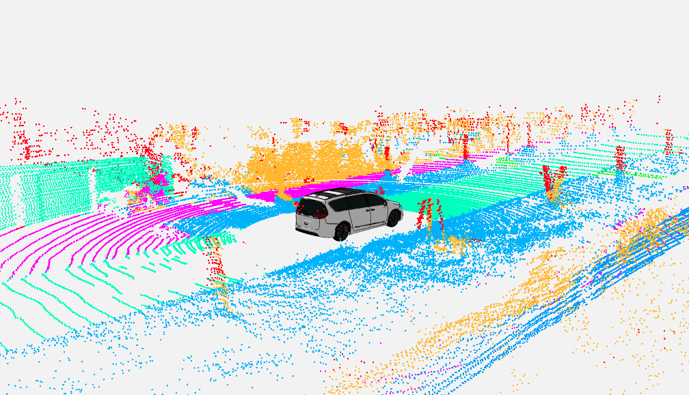
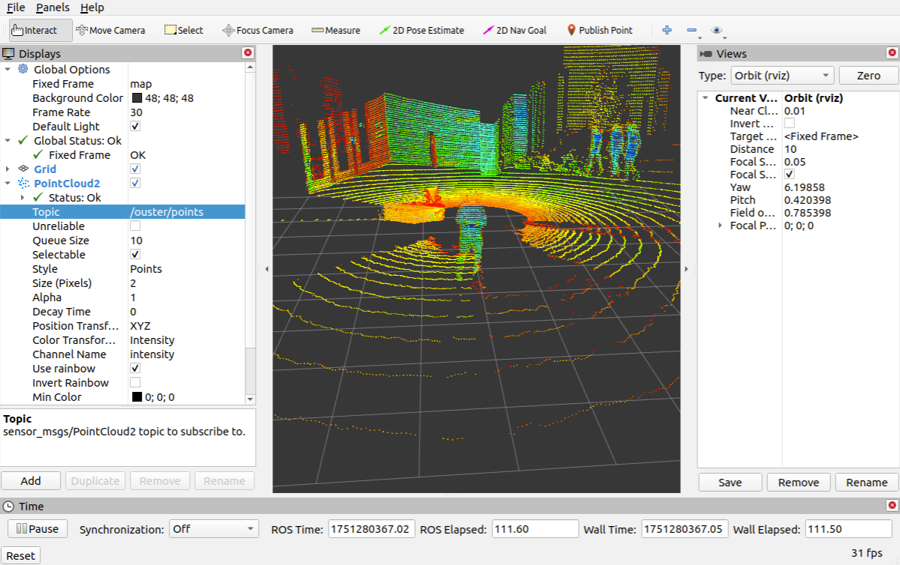

Visualizing data is a key part of working with robots. Without a clear picture of what the robot sees, thinks, and does, development becomes extremely difficult. Interpreting raw numbers, especially in 3D, is not intuitive at all, and a visualization environment allows engineers and researchers to view the world from the robot’s perspective. This makes it much easier to understand what the robot believes is happening in its environment and to debug its behavior effectively.

To explore how visualization supports robot development, we will take a closer look at three widely used tools in robotics: **RViz**, **Foxglove**, and **Rerun**. While each of these tools can display various types of data, in this article we will focus specifically on how they are used to visualize point clouds, which play a significant role in perception, mapping, and navigation.

{/* truncate */}

## What is a point cloud?

A point cloud is a set of individual data points plotted in 3D space, where each point is defined by X, Y, and Z coordinates. These points are usually generated using 3D scanning technologies such as laser scanning or photogrammetry. Laser scanners emit pulses of light that are reflected off surfaces and returned to the scanner, allowing it to calculate the exact location of each point in space. Photogrammetry, on the other hand, uses photographs taken from different angles. The result is a point cloud that serves as a raw but very accurate digital representation of the scanned object. In addition to spatial data, point clouds can contain extra information such as color, represented by RGB values, and intensity, reflecting the brightness of each point.

Point clouds help robots understand the world around them. This data improve obstacle detection, object recognition, and mapping, which are essential for tasks like navigation and manipulation. Visualizing point cloud data also helps engineers debug sensors, test perception algorithms, and ensure accurate SLAM and path planning.

## Comparison of tools

RViz, Foxglove and Rerun all support point cloud visualization, but they were created with different goals and workflows in mind. Understanding their strengths and limitations is important for choosing the right tool based on your robotics stack, development process and team requirements. The table below gives a brief overview of each tool's focus, followed by a more detailed comparison.

### **RViz**

Point cloud visualization is an essential feature in RViz, especially when working with 3D perception systems such as LiDAR, RGB-D cameras, or stereo vision. RViz works with both `sensor_msgs/PointCloud` and `sensor_msgs/PointCloud2` message types. The last one is recommended, modern standard due to its greater flexibility and efficiency. RViz does not support direct loading of common point cloud file formats such as `.pcd`, `.ply`, `.las` and others. All such files must first be converted into ROS-compatible messages and published within a ROS environment.

