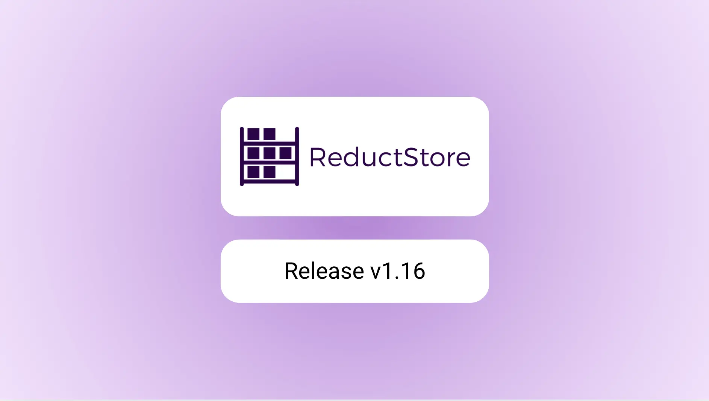

We are pleased to announce the release of the latest minor version of [**ReductStore**](/), [**1.16.0**](https://github.com/reductstore/reductstore/releases/tag/v1.16.0). ReductStore is a high-performance storage and streaming solution designed for storing and managing large volumes of historical data.

To download the latest released version, please visit our [**Download Page**](/download).

## What's new in 1.16.0?

The v1.16.0 release introduces two new extensions designed to enhance data workflows for robotics and columnar data, along with support for replicating context records during queries.

{/* truncate */}

### Querying and Replicating Data with Context

We’ve extended the conditional query syntax with **[directives](/docs/conditional-query/directives)** that allow users to modify global query behavior.
The first directives introduced are `#ctx_before` and `#ctx_after`, which enable the inclusion of context records that occur before or after each matching record in a query.

This feature is particularly useful when analyzing specific events or conditions in your data, as it helps provide a clearer picture of the surrounding context. For instance, you can use these directives to include records from a few seconds before or after an anomaly or incident, aiding in root cause analysis or pattern recognition.

Here’s an example of how to use the `#ctx_before` directive in a query:

```json
{
  "#ctx_before": "5s",
  "&anomaly_score": { "$gt": 0.8 }
}
```

This query returns all records with an anomaly score greater than 0.8, along with the context records that occurred within 5 seconds before each matching entry.

### New ReductSelect Extension

ReductStore is fundamentally a blob storage system and does not allow direct manipulation of stored data. However, with its extension mechanism, we can introduce new capabilities while keeping the core system simple.

The new [**ReductSelect**](/docs/extensions/official/select-ext) extension enables users to query and transform data stored in CSV or JSON formats, making it easier to build flexible and efficient data processing workflows.

For example, the following query uses ReductSelect to extract specific columns from CSV data and filter rows using the same conditional syntax available in ReductStore's native query language:

```json
{
  "ext": {
    "select": {
      "csv": {
        "has_headers": true
      },
      "columns": [
        { "name": "temperature", "as_labels": "temp" },
        { "name": "humidity" }
      ]
    }
  },
  "when": {
    "&temperature": { "$gt": 30 }
  }
}
```

This query selects the `temperature` and `humidity` columns from a CSV file, renames `temperature` to `temp`, and filters rows where the temperature is greater than 30°C.

These simple transformations enable you to ingest structured data very quickly and retrieve only subsets of it for further processing and analysis.

### New ReductROS Extension

Another exciting addition is the [**ReductROS**](/docs/extensions/official/ros-ext) extension, which provides tools for extracting and transforming data stored in ReductStore into formats compatible with the Robot Operating System (ROS).

With this extension, you can extract data from MCAP files containing ROS 2 messages and convert it into JSON format, making it easier to analyze and visualize.
It also supports transforming raw binary data—such as images—into more accessible formats like JPEG or base64 strings.

For example, the following query extracts data from a ROS 2 topic and encodes the image payload as a JPEG:

```json
{
  "ext": {
    "ros": {
      "extract": {
        "topic": "/camera/image",
        "encode": { "data": "jpeg" }
      }
    }
  }
}
```

ReductROS is still in active development, and we plan to expand its capabilities with support for additional ROS message types and more flexible extraction options in future releases.
Stay tuned for updates!

## What next?

We are constantly working on improving ReductStore and adding new features to provide the best experience for our users.
In the next release we plan to add new features and improvements, including:

### Shareable Query Links

We are developing a feature that allows users to generate and share links to specific queries in ReductStore.

This will simplify collaboration by enabling team members to access query results without needing direct access to the ReductStore instance. It will also allow users to download results directly via a link and support integration with external tools and platforms such as **[Foxglove](https://foxglove.dev)**.

### Integration with Grafana

We are also working on a **[Grafana plugin](https://github.com/reductstore/reduct-grafana)** that enables users to visualize and analyze data stored in ReductStore directly within Grafana dashboards.

This integration will provide a seamless experience with Grafana’s powerful visualization tools, allowing you to:

- Build custom dashboards using data from ReductStore.
- Monitor your data streams and historical records in real time.
- Visualize labels and data output in JSON or CSV formats.

Stay tuned for the first release—coming soon!

---

I hope you find those new features useful. If you have any questions or feedback, don’t hesitate to use the [**ReductStore Community**](https://community.reduct.store/signup) forum.

Thanks for using [**ReductStore**](/)!
