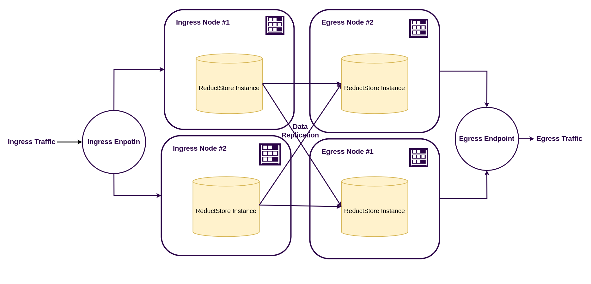

# Building a Resilient ReductStore Deployment with NGINX

If you’re collecting high-rate sensor or video data at the edge and need zero-downtime ingestion and fault-tolerant querying, an **[active–active ReductStore setup](/docs/guides/disaster-recovery#active-active-setup)** fronted by NGINX is a clean, practical pattern.

This tutorial walks you through the **[reference implementation](https://github.com/reductstore/nginx-resilient-setup)**, explains the architecture, and shows production-grade NGINX snippets you can adapt.

{/* truncate */}

## What We’ll Build

We’ll set up a **ReductStore cluster** with NGINX as a reverse proxy, separating the **ingress** and **egress** layers.
This architecture allows for independent scaling of write and read workloads, ensuring high availability and performance.



### Ingress layer

The **ingress layer** handles all writes and replicates data to the egress layer. Its nodes may have limited storage capacity, while they need only to handle writes and replicate data to the **egress** nodes.
It can use high-rate storage like NVMe SSDs or even RAM disks, depending on your data volume.

### Egress layer

The **egress layer** handles all reads and serves data to clients. Its nodes are optimized for read performance and can use larger, slower storage like HDDs or cloud object storage.
Each egress node holds a complete copy of the dataset, allowing for high availability and load balancing.

### NGINX Load Balancer

The **NGINX** load balancer sits in front of both layers, exposing two stable endpoints:

- `http://<host>/ingress` → load balances writes across ingress nodes
- `http://<host>/egress` → load balances reads across egress nodes

This separation allows you to scale each layer independently and ensures that writes and reads are handled optimally.

It is also important to note that NGINX must maintain **session affinity** (stickiness) for both ingress and egress requests to ensure that queries remain consistent and throughput is maximized.

## Quick Start

Clone the example and bring it up:

```bash
git clone https://github.com/reductstore/nginx-resilient-setup
cd nginx-resilient-setup
docker compose up -d
```

This will start two ingress nodes and two egress nodes with NGINX in front, all configured to replicate data between them.
Check the docker compose file for details on how the nodes are set up.

Now we need to write some data and verify that we can read it back.
[**Install**](/download) the `reduct-cli` tool if you haven't already, then run the following commands to set up aliases for the ingress and egress endpoints:

```bash
reduct-cli alias add ingress -L http://localhost:80/ingress --token secret
reduct-cli alias add egress -L http://localhost:80/egress --token secret
```

Then copy some data from our [**Demo Server**](https://play.reduct.store) to the ingress layer and read it back from the egress layer:

```bash
# Add demo server alias to the CLI
reduct-cli alias add play -L https://play.reduct.store --token reductstore

# Copy data from the demo server to ingress
reduct-cli cp play/datasets ingress/bucket-1 --limit 1000

# Read/export via egress
reduct-cli cp egress/bucket-1 ./export_folder --limit 1000
```

## NGINX Configuration

Below is a distilled config you can adapt for open-source NGINX:

```nginx
# Upstreams
# Separate pools for ingress (writes) and egress (reads)
upstream reduct_ingress {
    ip_hash;   # stickiness for writes
    server ingress-1:8383 max_fails=3 fail_timeout=10s;
    server ingress-2:8383 max_fails=3 fail_timeout=10s;
    keepalive 64;
}

upstream reduct_egress {
    ip_hash;   # stickiness for queries
    server egress-1:8383 max_fails=3 fail_timeout=10s;
    server egress-2:8383 max_fails=3 fail_timeout=10s;
    keepalive 64;
}

server {
    listen 80;
    server_name _;

    client_max_body_size 512m;
    proxy_read_timeout 600s;
    proxy_send_timeout 600s;

    proxy_set_header Host $host;
    proxy_set_header X-Forwarded-For $remote_addr;

    location /ingress/ {
        proxy_http_version 1.1;
        proxy_set_header Connection "";
        proxy_pass http://reduct_ingress/;
    }

    location /egress/ {
        proxy_http_version 1.1;
        proxy_set_header Connection "";
        proxy_pass http://reduct_egress/;
    }
}
```

In the config above, we define two upstream blocks: `reduct_ingress` for handling write requests and `reduct_egress` for handling read requests.
Each block uses `ip_hash` to ensure session affinity, which is crucial for maintaining consistent writes and reads.

## ReductStore Configuration Notes

The configuration between nodes of each layer is identical. To reach the desired architecture, you need to provision buckets and replication tasks for
ingress nodes and buckets only for egress nodes. See the configuration files in the example repo for details.

## Failure Drills

When the setup is running, you can simulate failures to see how it behaves:

1. **Kill an ingress node** → writes continue via other ingress nodes.
2. **Kill an egress node** → reads continue via other egress nodes; replication resyncs when it’s back.
3. **Simulate total ingress outage** → analysis continues on egress; for true ingestion continuity, pair with a pilot-light instance in another location.

## Runbook

1. Provision ingress + egress ReductStore nodes
2. Create buckets and replication tasks
3. Expose `/ingress` and `/egress` via NGINX with `ip_hash`
4. Test with demo dataset
5. Validate reads from egress
6. Run failure drills
7. Implement backups and pilot-light procedures

## References

- [NGINX Resilient Setup Example](https://github.com/reductstore/nginx-resilient-setup)
- [Disaster Recovery Guide](/docs/guides/disaster-recovery)

---

I hope you find this article interesting and useful. If you have any questions or feedback, don’t hesitate to use the [**ReductStore Community**](https://community.reduct.store/signup) forum.
