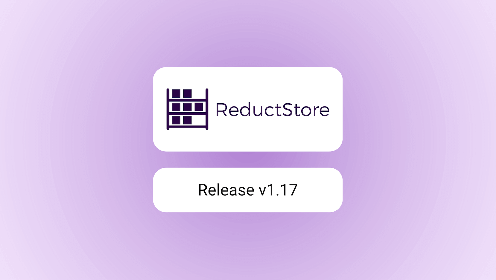

We are pleased to announce the release of the latest minor version of [**ReductStore**](/), [**1.17.0**](https://github.com/reductstore/reductstore/releases/tag/v1.17.0). ReductStore is a high-performance storage and streaming solution designed for storing and managing large volumes of historical data.

To download the latest released version, please visit our [**Download Page**](/download).

## What's new in 1.17.0?

This release includes several new features and enhancements. First, there are query links for simplified data access. Second, there is support for S3-compatible storage backends.

These new features enhance the usability and flexibility of ReductStore for various use cases in the cloud and on-premises environments and make it easier to share and access data stored in the database.

{/* truncate */}

### 🔗 Query Links for Data Access

ReductStore now supports **[query links](/docs/glossary#query-link)**, enabling users to generate temporary, public URLs for specific data records — without requiring authentication.
This makes it easier to share datasets with **external collaborators**, embed links into dashboards, or integrate with **third-party systems** that need read-only access to specific data.


You can create query links directly from the **Web Console** (or any SDKs):

1. Open the **Data Browser** page and select a record you want to share.
2. Click the **“Share record”** icon in the action panel.
3. Configure an **expiration time** to automatically revoke access after a defined period.

Once generated, anyone with the link can access the selected record via a simple HTTP(S) request — no access token required.
The link only has access to the specific query for which it was created, along with the creator's permissions.
This provides a secure and convenient way to expose selected data for collaboration and analysis.

### ☁️ S3-Compatible Storage Backend

ReductStore now supports **S3-compatible storage backends**, allowing you to use **object storage** instead of a local file system for your underlying data.
This update brings greater flexibility and scalability for managing large datasets in the cloud.

Previously, ReductStore supported only local disk storage, and users had to mount S3 buckets as local disks via FUSE drivers.
With this release, ReductStore can now natively integrate with S3-compatible backends — no additional software or mounting is required.

This feature is designed with performance and **cost optimization** in mind.
ReductStore uses a local disk cache layer to speed up read and write operations, while batching multiple records into a single data block to reduce storage and retrieval costs.
This approach works especially well with cost-efficient AWS S3 storage classes such as **S3 Standard-IA** or **S3 Glacier**.

To run ReductStore with an S3-compatible backend, use the following environment variables:

```bash
docker run -p 8383:8383 \
    -e RS_REMOTE_BACKEND_TYPE=s3 \
    -e RS_REMOTE_BUCKET=<YOUR_S3_BUCKET_NAME> \
    -e RS_REMOTE_REGION=<YOUR_S3_REGION> \
    -e RS_REMOTE_ACCESS_KEY=<YOUR_S3_ACCESS_KEY_ID> \
    -e RS_REMOTE_SECRET_KEY=<YOUR_S3_SECRET_ACCESS_KEY> \
    -e RS_REMOTE_CACHE_PATH=/data/cache \
    -e RS_LICENSE_PATH=<PATH_TO_YOUR_LICENSE_FILE> \
    -v ${PWD}/data:/data/cache \
    reduct/store:latest
```

Read more about configuring S3-compatible storage backend in the [**documentation**](/docs/configuration#remote-backend-settings)

:::info
This feature requires a commercial license. Please see the **[Pricing page](/pricing)** for more details.
:::

## What’s Next

We’re continuing to develop new features to make ReductStore even more powerful and user-friendly.
Here’s a preview of what’s coming in the next releases:

### 📦 Multiple Entries in a Single Request

Currently, each write or query request must target a **single entry**.
This can be limiting when dealing with **multiple entries** or dynamic lists of entries in your applications.

In upcoming versions, ReductStore will support **batch operations** across multiple entries within a single API request.
This improvement will simplify integrations and reduce overhead for large-scale data ingestion and querying workflows.

### 🔒 Read-Only Mode for ReductStore

Like most databases, ReductStore currently requires **exclusive access** to its data directory while running.
As a result, running multiple instances on the same dataset—for load balancing or high availability—is not yet possible.

To address this, we’re introducing a **read-only mode** that will allow one writer instance\* and multiple reader instances to access the same dataset concurrently.
This approach will enable **scalable read operations** and **improved availability** without adding the complexity of clustering or replication mechanisms.

---

I hope you find those new features useful. If you have any questions or feedback, don’t hesitate to use the [**ReductStore Community**](https://community.reduct.store/signup) forum.

Thanks for using [**ReductStore**](/)!
